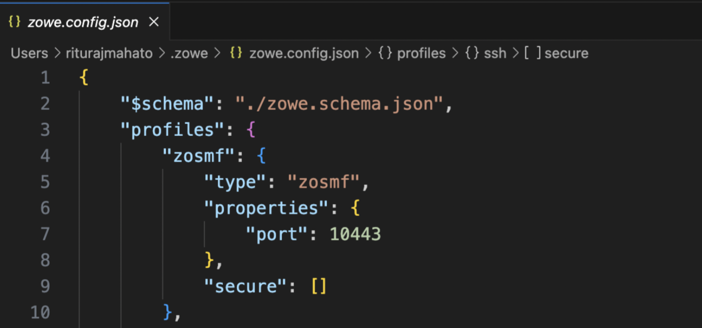
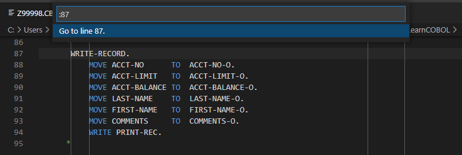
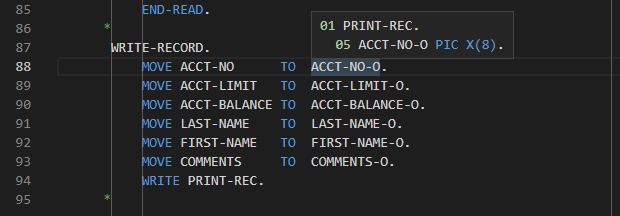
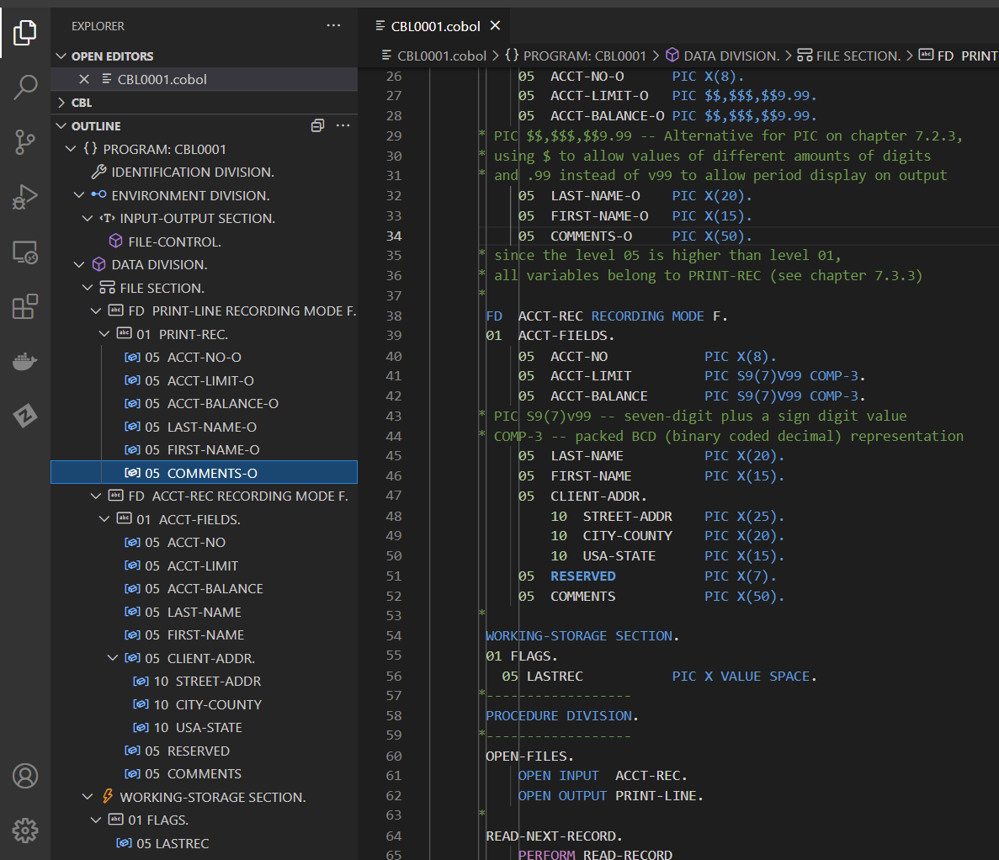
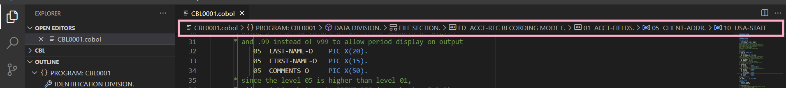
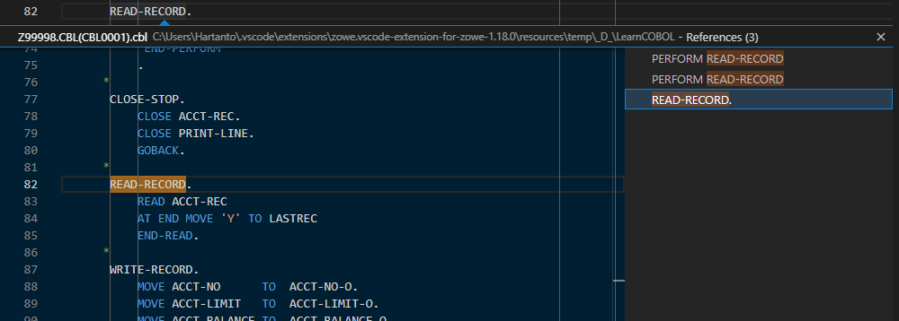
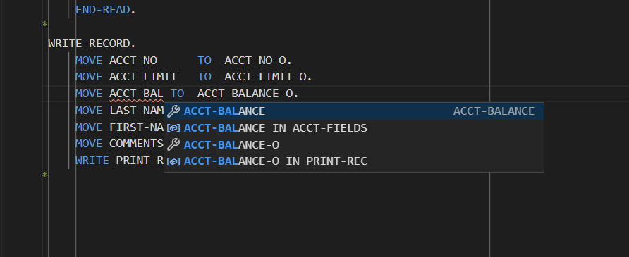
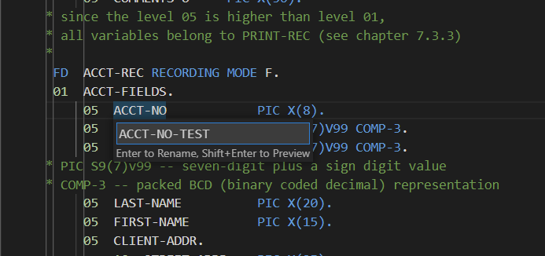
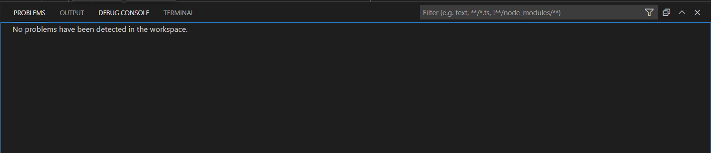
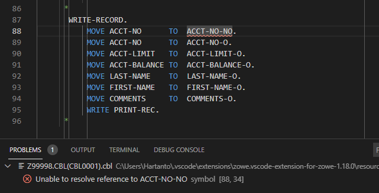

---
geometry:
- margin=1in
header-includes:
- \lstset{basicstyle=\ttfamily,
    stepnumber=2,
    numbersep=5pt,
    backgroundcolor=\color{black!10},
    showspaces=false,
    showstringspaces=false,
    showtabs=false,
    tabsize=2,
    captionpos=b,
    breaklines=true,
    breakatwhitespace=true,
    breakautoindent=true,
    linewidth=\textwidth}
colorlinks: true
toccolor: Blue
---
\newpage


# VSCode with Zowe Explorer

Zowe Explorer is an open-source extension for VS Code that lets developers and system administrators interact with z/OS mainframes.

- **Introduction to Zowe Explorer**
- **Using Zowe Explorer**
- **Profiles in Zowe Explorer**
     - **Secure Credentials**
     - **Creating a Team Configuration File**
     - **Editing Profiles**
- **Summary**

## Introduction to Zowe Explorer

The Zowe Explorer extension modernizes the way developers and system administrators interact with z/OS mainframes. Working with data sets and USS files from VS Code can be more convenient than using 3270 emulators. The extension provides the following benefits:

* Create, modify, rename, copy and upload data sets directly to a z/OS mainframe.
* Create, modify, rename and upload USS files directly to a z/OS mainframe.
* Streamlined process to access data sets, USS files, and jobs.
* Easy interaction with multiple z/OS systems

The Zowe Explorer can be installed into VS Code by searching the Extensions Marketplace inside VS Code for "Zowe Explorer" and selecting install. To see more detailed instructions on installing this extension, refer to "Installation of VSCode and Extensions".

## Using Zowe Explorer

Zowe Explorer allows you to work with data sets, Unix System Service (USS) files, and jobs. 

Zowe Explorer offers the following functions: 

Data sets

* Search for data sets matching desired filters and view their contents

* Download, edit, and upload existing PDS members

* Create and delete both data sets and data set members

* Interact with data sets from multiple systems simultaneously

* Rename data sets

* Copy data sets

* Submit JCL from a chosen data set member

USS Files

* View multiple Unix System Services (USS) files simultaneously

* Download, edit, and upload existing USS files

* Create and delete USS files and directories

* Interact with USS files from multiple systems simultaneously

* Rename USS files

Jobs

* View multiple jobs simultaneously

* Download spool content

* Interact with jobs from multiple systems simultaneously

For more information about Zowe Explorer and the different use cases, visit the [marketplace](https://marketplace.visualstudio.com/items?itemName=Zowe.vscode-extension-for-zowe)

## Profiles in Zowe Explorer

Profiles serve as a point-of-contact for Zowe Explorer and the Mainframe. Profiles contain the URL for the API services that you want to connect to and your credentials. The main profile information that you need for Zowe Explorer is the z/OSMF Connection. If you have the Zowe Explorer installed, you can follow the steps in this section to connect to the mainframe.

### Secure Credentials

Zowe Explorer has a built-in Secure Credential Store. This enables you to encrypt the credentials that are stored in your machine, and as a result, secure your connection to the Mainframe.

To enable this feature, follow these steps:

1. Click the **Gear Icon** at the bottom left and select **Settings**
2. Click **User Settings** > **Extensions** > **Zowe Explorer**
3. Look for the **Zowe Security: Check For Custom Credential Managers and Secure Credentials Enabled** field


### Creating a Team Configuration File

Follow these steps:

1. Navigate to the Zowe Explorer tree and check if you already have a zosmf team configuration file.


2. If you don't have one, click on the + sign. A dialog box will appear and ask if you want to “Create a New Team Configuration File”.

3. Press enter or click on that selection.


4. You can initialize the config file either in the Zowe home directory or in the current working directory.


### Editing Profiles

The Zowe Explorer v3.0 enables users to edit their profiles, allowing them to update their existing profile information and continue using Zowe Explorer.

Follow these steps:

1. Right-click on the Team Configuration File you want to edit.
2. from the dropdown choose **Manage Profile**


3. A dialog box opens, displaying a list of available profile modifications.


4. Click on Edit Profile. Now you will be getting the zowe.config.json file.



5. Ensure you are connected to the correct host: 204.90.115.200, and set 'rejectUnauthorized' to false for a successful connection.


6. Click on Update Credentials. Enter your username and password.


## Summary

In this section, you have learned the basic features of the Zowe Explorer extension and how to create and work with Zowe compatible `zosmf` profile.

\newpage

# VSCode with Z Open Editor

In this chapter we will explain how to use the IBM Z Open Editor extension for VSCode and how using it can help you develop COBOL source code in a feature-rich environment.


- **Introduction to the IBM Z Open Editor**

     - **What is the IBM Z Open Editor?** 
     - **The role of the Language Server Protocol**
     - **Installing the IBM Z Open Editor for VS Code**

- **Basic editing**
     - **Known file extensions**
     - **Margins**
     - **Variable expansion**
     - **Syntax highlighting**

- **Navigation of code**
     - **Outline view**
     - **Breadcrumb view**
     - **Jump to declaration / reference**

- **Code-completion**
     - **COBOL reserved word completion**
     - **Variable completion**
     - **CICS, MQ, DB2 API completion**

- **Refactoring code**
     - **Renaming variables**
     - **Handling errors**

- **Summary**

## Introduction to the IBM Z Open Editor

This section introduces the IBM Z Open Editor.

### What is the IBM Z Open Editor?

The IBM Z Open Editor is a free extension for Visual Studio Code (VSCode) that provides language support for COBOL, PL/I, and JCL languages.  Along with this language support it also provides content assistance for applications that call CICS, MQ, and DB2 APIs.  The source code doesn't even need to reside on z/OS, it could be in a source code repository, locally in a file, or on z/OS.  Although this course focuses on COBOL as a source language, a lot of the functions we will discuss will also apply to PL/I and JCL.

### The role of the Language Server Protocol

Integrated development environments always want to provide a rich platform for all supported programming languages, however, the proliferation of programming languages and the speed at which new editors reach the market makes keeping pace difficult.  Each editor would need to provide an editor-specific plugin for each language they wished to support, thus support for a certain language would differ between different editors. 

Microsoft designed the Language Server Protocol (LSP) to act as a common description of how features like auto-complete should be implemented for a specific language.  Languages which have an implemented LSP server can therefore be used within any editor that supports LSP.  Many companies and the open-source community have collaborated to provide LSP servers for an array of different languages. 

The language server protocol defines six broad capabilities that should be implemented for a language server to be LSP compliant. These capabilities include code completion, hover, jump to definition, workspace symbols, find references, and diagnostics.  The IBM Z Open Editor provides compliant language servers for both the Enterprise COBOL and Enterprise PL/I for z/OS languages.  In addition to being compliant, they also provide additional capabilities that we will discuss further on. 

**Note:** More information on Language Server Protocol implementations can be found at: `https://langserver.org`

### Installing the IBM Z Open Editor for VS Code

The IBM Z Open Editor can be installed into VS code by searching the Extensions Marketplace inside VSCode for "IBM Z Open Editor" and selecting install.  Once installed, the default editor will be enabled to provide a rich editing experience for COBOL, PL/I, and JCL.  There is no need to use a specific editor for these languages. To see a more detailed instruction on installing this extension, refer to "Installation of VSCode and extensions". 

## Basic editing

For the rest of this chapter, we will use the CBL0001 sample program to demonstrate how rich of an experience editing COBOL in VSCode can be.  So, let's fire up VSCode, install IBM Z Open Editor (if it's not already), open up CBL0001, and get started.

### Known file extensions

For VSCode to use the capabilities of the IBM Z Open Editor, it needs to know that the file we are editing is a COBOL file.  VSCode accomplishes this by comparing the location and name of the file being opened against a list of known extensions to map the file to a known language.  For COBOL the following associations are used:

- \*.COBOL\*

- \*.CBL\*

- \*.COB\*

- \*.COBCOPY\*

- \*.COPYBOOK\*

- \*.COPY\*

These are applied to both local files and files held in a Partitioned Data Set or PDS on the mainframe, which for simplicity you can think of as a folder.  Thus, a PDS called:

```

Z99994.COBOL

```

Or a file on the local file system called:

```

PROGA1.COBOL

```

Will be assumed to be COBOL code.  This information is stored in the global VSCode settings.json file that can be accessed through VSCode preferences.  This allows for a user to tailor VSCode’s known extensions to a particular site naming convention.

### Margins

The first thing you will notice when editing COBOL source code is that VSCode will have inserted five vertical lines down the file.  These lines segment each line of code into the areas reserved for sequence numbers, comment/continuation characters, area A, and area B.  When coding without this basic aid I cannot recount the number of times I have made a compilation error because I started coding in the wrong column.  This alone is a very useful aid to a new COBOL programmer.  More information about COBOL syntax, and in particular, the columns, will be discussed later

### Variable expansion

As you browse through CBL0001 type `CTRL + G` to jump to a specific line of code.  A small dialog will open asking you for the line you wish to jump to, type `87`, and press the enter key.  VSCode will highlight that line of code and navigate you directly to it, as shown in Figure  1.



*Figure  1.  Navigating to a specific line of code*

If you hover your mouse over the 'ACCT-NO-O' field a pop-up will appear displaying the declaration of that variable, shown in Figure  2.



*Figure  2.  View declaration of variable*

Since this field is a 05-level variable nested within a 01-level variable, the pop-up shows the declaration of the field as an eight-byte picture variable, the name of the parent structure, and the file definition that it is within.  If you hold the CMD/Ctrl key while hovering over the field, then the pop-up will additionally contain the line of code where the variable is defined as well as the following three lines of code.  These features can be extremely helpful when analyzing existing code.

### Syntax highlighting

The COBOL code that you are editing will also be highlighted to help you understand the different elements of the COBOL language.  Depending on the color theme that you have selected in VSCode, comments, COBOL reserved words, literal values, and variables will be colored differently allowing you to spot obvious syntax issues early on before even submitting the code to a build.

## Navigation of code

Although the code examples we are using in this section are fairly small, the code that you could be writing could have hundreds or thousands of lines.  Being able to understand the general structure of the source code and being able to find your way around it without getting lost is a big advantage when editing COBOL. Fortunately, there are some great features to help you out, which we will discuss next.

### Outline view

Within the explorer sidebar of VSCode, there is an outline view that will be populated whenever you are editing a COBOL file.  This view contains a collapsible look at each division, data structure, and paragraph within your code.  This allows you to easily view the structure of the source code.  Clicking on a particular paragraph, division or data element will simultaneously move the editor to show that section of the code and highlight it, depicted in Figure  3.  This makes jumping to a specific part of the code very easy.



*Figure  3.  Outline view in VSCode*

### Breadcrumb view

Similarly, the breadcrumb view across the top of the editor can show where the current line of code exists within the structure of the COBOL source code.  As you navigate the source code in the editor, the breadcrumb trail will automatically update to reflect where you are in the structure of the program and provides you a mechanism to move to a different element of the code.  Again, if you open CBL0001 in VSCode and jump to line 50, this line is a declaration of the field USA-STATE within the structure ACCT-FIELDS, in the FILE-SECTION of the DATA-DIVISION.  Across the top of the editor, the breadcrumb trail will show the information displayed in Figure  4.



*Figure  4.  Breadcrumb trail in VSCode*

Clicking on any of the items in the breadcrumb trail will highlight that element of the code in the editor, quickly showing you the location of that element within the code.  It will also show a view of the code in a pop-up window, shown in Figure  5. , similar to the outline view previously discussed.


*Figure  5.  Pop-up view of code via breadcrumb selection*

### Jump to declaration / reference

As you browse through code you will come across COBOL PERFORM statements or variable references.  Often you will need to navigate to the definition of that paragraph or variable to follow the execution of the code.  At line 64 of CBL0001, we see a set of PERFORM statements.  Place the cursor within the name, READ-RECORD, on line 65, right-click and select **Go to Definition**.  The editor then navigates to the READ-RECORD paragraph on line 82.  Instead of right-clicking, the same function can be reached by using the F12 key.

"Go to References" does the reverse of this operation and allows you to navigate from the definition of a paragraph or variable to all the places within the application that reference that paragraph or variable.  To demonstrate this, navigate to line 82 of CBL0001, which again is the declaration of the READ-RECORD paragraph.  To see all of the places where this paragraph is called, right-click and select **Go to References**, or hit the key combination **SHIFT+F12**.  This will summon a new pop-up dialog that shows all the references to this paragraph in the code, shown in Figure  6.

 

**Note:** If **SHIFT+F12** does not work for your machine, you may need to use the key combination, **Fn+F12** **instead.**



*Figure  6.  Finding paragraph/variable references in VSCode*

## Code-completion

Code completion isn't exactly a new concept in most IDEs.  For example, the Eclipse editor has provided auto-completion for Java APIs for a long time.  The same key combination, **CTRL+SPACE**, triggers this auto-completion function while you are coding and can be used to help guide you through COBOL syntax and CICS API calls.

### COBOL reserved word completion

As you are typing a COBOL reserved word, you can type `CTRL+SPACE` and the IBM Z Open Editor will present, in a pop-up, a list of possible COBOL reserved words that you might be trying to use.  Using the cursor keys or the mouse allows you to select the correct recommended keyword and press enter to select it and the rest of the reserved word will be entered for you, aka auto-completed!

### Variable completion

The same technique can be applied to variable completion.  This can be particularly useful when you are referencing a variable that exists multiple times within different structures.  In these cases, auto-completion can help you identify the variable you want to use.  As an example, create a new line within the WRITE-RECORD paragraph.  On the new line, enter the code `MOVE ACCT-BA` and then press **CTRL+SPACE** to invoke code auto-completion.  You should see a pop-up similar to the one shown in Figure  7. below.



*Figure  7.  Auto-completion in VSCode*

You can see that not only is the variable ACCT-BALANCE prompted as a potential candidate, but it also presents ACCT_BALANCE IN ACCT-FIELDS. 

### CICS, MQ, DB2 API completion

The auto-completion of variables also extends to the CICS and DB2 APIs, known as EXEC CICS and EXEC SQL statements.  Although COBOL programming for DB2 and CICS is not a primary focus here, note that if you find yourself programming for either of these APIs that the capability is available.

## Refactoring code

Working with source code is seldom just about the initial creation, during a program's life cycle it will be changed and re-worked we often call this work refactoring.  This section explores renaming variables and handling errors.

### Renaming variables

During maintenance of existing code, you might need to refactor variable names or paragraph names.  Doing this manually can be a painful process, as you probably need to update both the original declaration and all the references within the source code.  Fortunately, there is a function for that, let's work through an example.  Back in CBL0001 hit **CTRL+G** to bring up the go-to line function and go to line 40.  This is the declaration of the variable ACCT-NO.  Right-click on the variable and select "**Find All References** ".  From this, we can see that apart from the declaration, the variable is also referenced on line 88. So, if we rename the variable, we probably need to update this reference as well.  To perform the rename, ensure that the cursor is on the variable and then press **SHIFT/Fn+F2**.  This will bring up a small pop-up asking you to provide a new variable name, as shown in Figure  8.  Enter `ACCT-NO-TEST` and press **enter**.



*Figure  8.  Renaming variables*

You will note that both the declaration of the variable and the reference on line 88 have been updated to the new value. As stated previously, the same process also works for paragraph names. For example, go ahead and refactor the name of the paragraph READ-RECORD to be READ-NEW-RECORD.

### Handling errors

The IBM Z Open Editor plugin also provides a level of syntax checking for local source code.  Although not as thorough as the compiler, it is a method of quickly identifying basic errors in your code before submitting it for compilation.  To demonstrate, let's create an error and then see how the editor shows it to us.  First, open the problems view by selecting **View** and then **Problems** from the editor menu.  The problems view should open at the bottom of the window, as depicted in Figure  9.



*Figure  9.  Problems view*

Now we need to introduce an error into the code. After line 87, add the line:

`MOVE ACCT-NO TO ACCT-NO-NO.`

Note that this line incorrectly identifies the second variable, which doesn't exist.  Once entering that line, you will notice that the invalid variable has been underlined in red to highlight it as an error.  Also, the problems view has a new error.  Clicking on the error will highlight the line of code at fault in the editor, shown in Figure  10. , allowing you to view the error directly.



*Figure  10.  Highlighting error in source code*

Now that you see where the error is located, it can now be corrected.  As soon as the error has been rectified, the problem disappears from the problem view.

## Summary

In this chapter, you have been able to go through some of the editing features of the Z Open Editor for VSCode. These capabilities make editing COBOL, PL/I, and JCL a lot friendlier and easier than some of the other editors in the market.

\newpage

# VS Code with Code4z Open-Source Extension Package

This section introduces the Code4z extension package, in particular, the COBOL Language Support extension.

- **What is Code4z?**
- **Known File Extensions**
- **Syntax Highlighting and Coloring**
- **Syntax and Semantic Check**
- **Navigation of Code**
     - **Go To Definition**
     - **Find All References**
- **Copybook Support**
- **Autocomplete**
- **Summary**

## What is Code4z?

Code4z is an all-in-one, open-source mainframe extension package for Visual Studio Code. The Code4z package contains extensions that provide language support for COBOL and High-Level Assembler language, a debugger for COBOL programs, as well as tools that enable developers to access mainframe data sets and CA Endevor code repositories using the Visual Studio Code interface. This guide focuses on the COBOL Language Support extension. The Zowe Explorer extension is also included in the Code4z package.

The COBOL Language Support extension leverages the Language Server Protocol to provide autocomplete, highlighting and diagnostic features for COBOL code. Together with Zowe Explorer, you can load COBOL code from a mainframe data set, and edit it leveraging the LSP features of the extension. Once you finish editing, you can save the file back on the mainframe, and store a copy locally.

The Code4z Extension Pack can be installed into VS Code by searching the Extensions Marketplace inside VS Code for "Code4z" and selecting install. The extension pack contains a number of extensions that can be leveraged when working with the mainframe, including the COBOL Language Support extension which provides similar functionality to the Z Open Editor extension discussed earlier. Therefore, ensure only one of these two extensions is enabled. Other extensions included in the pack will work with either COBOL Language Support or Z Open Editor. To see more detailed instructions on installing this extension, refer to "Installation of VSCode and Extensions".

## Known File Extensions

Code4z recognizes files with the extensions .COB and .CBL as COBOL files. This applies to both local files and files held in a PDS on the mainframe. COBOL Language Support features are automatically enabled when you open any file with an extension identifying it as a COBOL file.

## Syntax Highlighting and Coloring

The COBOL Language Support extension enables the coloring of keywords, paragraphs, and variables in different colors to make the code easier to navigate. 

## Syntax and Semantic Check

The COBOL Language Support extension checks for mistakes and errors in the COBOL code. The syntax check feature reviews the whole content of the code, highlights errors, and suggests fixes.


*Figure 1. The syntax and semantic check feature highlight an error.*

## Navigation of Code

The COBOL Language Support extension enables several features for ease of navigation through code.

### Go To Definition

While your cursor is placed on a variable or paragraph name, you can press **F12** or **CTRL+click** to use the **Go To Definition** functionality to display the point in the code where the variable or paragraph is defined.


*Figure 2. Go To Definition shows the point at which the USA-STATE variable is first defined.*

### Find All References

The **Find All References** functionality (**SHIFT+ALT+F12**) highlights all references to a variable or paragraph and displays them in a list in the sidebar so that you can easily navigate between them.


*Figure 3. Find All References lists all references to the STREET-ADDR variable in the code.*

## Copybook Support

Copybooks are pieces of source code stored in separate data sets which are referenced in a program. The COBOL Language Support extension enables you to download all copybooks referenced in your program from the mainframe to a folder in your workspace. In order for this feature to work, you need to set up and configure a Zowe CLI `zosmf` profile. You can also enable support for copybooks stored locally in folders in your workspace. This is useful when working with a COBOL project stored in a Github repository.

The COBOL Language Support extension helps to ensure that copybooks called in the code remain compatible through semantic analysis of keywords, variables, and paragraphs within copybooks, and ensures the consistency of code by defining variables and paragraphs across copybooks. The extension also helps to protect against unwanted errors caused by recursive or missing copybooks.

The **Go To Definition** and **Find All References** functionalities are extended to work for occurrences of variables and paragraphs from copybooks called in the program as well as from the program itself. You can also use the **Go To Definition** feature on a copybook name in order to open it. 

## Autocomplete

The COBOL Language Support extension provides live suggestions while you type for COBOL keywords, as well as variables and paragraphs which are already referenced in the code or copybooks used by the program.


*Figure 4. Autocomplete lists possible variables and keywords beginning with the typed string in a list.*

## Summary

In this chapter, you have been introduced to all the COBOL language support features of the Code4z package of open-source extensions for VS Code.

\newpage

# Zowe CLI and Zowe CLI Plug-ins

In this chapter, we will explain what a CLI is and why you would use it, how to use Zowe CLI interactively, how to abstract CLI commands into useful scripts, and how Zowe CLI enables the use of familiar open-source tooling while developing COBOL applications on the mainframe. 

- **What is a CLI and why would you use it?**

- **What is Zowe CLI?**

- **Zowe CLI interactive use**
     - **Installing Zowe CLI**
     - **Interactive Help**
     - **Zowe Profiles**
     - **Interacting with z/OS Data Sets**
     - **Interacting with z/OS Jobs**

- **Automating tasks using Zowe CLI**
     - **Automated Job Submission**
     - **Using Other Programming Languages and Continuous Integration**
     - **Additional Examples**

- **The world of modern open source tooling**

- **Summary**

## What is a CLI and why would you use it?

CLI stands for Command Line Interface. It is a program that allows for user interaction through text-based input. In the early days of computing, command-line interfaces were the only means to interact with operating systems. The invention of the mouse and the development of graphical user interfaces led to the experience we are familiar with today. Well-designed GUIs certainly yield an improved interactive experience. However, CLIs are still heavily used today and are very powerful. Windows shell and bash are common examples of terminals where command-line tools are run interactively.

If well-designed GUIs yield an improved interactive experience, why would you use a CLI? Simply put, automation. Command-line interfaces can be used interactively allowing for quick exploration of available commands. They are also usually self-guided and some even offer modern help displays by launching content in a browser. But, they are also programmatic interfaces where command sequences and tasks can be easily abstracted into scripts.

## What is Zowe CLI?

Zowe CLI is an open-source CLI for the mainframe. It is a tool that can be run on Windows, Linux, and Mac offering a means to interact with the mainframe from an environment where modern open-source tooling is available. Cloud platforms like Amazon Web Services, Azure, and Google Cloud Platform all provide heavily used CLIs. The Zowe CLI helps make interacting with the mainframe like interacting with other cloud services. 

At its core, Zowe CLI provides remote interaction with z/OS data sets & jobs, Unix System Services files, TSO and Console commands, and provisioning services. Zowe CLI is also an extensible technology and numerous plug-ins exist that extend its reach to z/OS subsystems and vendor software.

Zowe CLI is a bridge tool between distributed systems and the mainframe. Pick your favorite language or open-source tool and leverage it for mainframe development with the assistance of the Zowe CLI. Want to develop automation in Python? Want to write tests in Node? Want to run Jenkins pipelines for continuous integration? Want to use open-source testing frameworks like Mocha or Facebook’s Jest? Want to leverage code quality tools like SonarQube? Go for it! 

CLIs are useful for automating repeated tasks. For mainframe COBOL apps, Zowe CLI can help you automate your build, deployment, and testing processes. Check out this [blog](https://medium.com/zowe/continuous-integration-for-a-mainframe-app-800657e84e96) for more info and the sample code that made it possible! Zowe CLI can also help you to automate administrative tasks. 

Most IDEs have integrated terminals as well so the CLI can be leveraged from your favorite distributed development environment, including VS Code! 

## Zowe CLI interactive use

The Zowe CLI can be leveraged for quick exploration of z/OS services as well as issuing commands that are not yet available in your IDE of choice. Before developing automation, it is common to first accomplish a commonly repeated task from the CLI interactively.

### Installing Zowe CLI

The Zowe CLI is a node package and is one of over 1.2 million node packages available on the public npm registry. After Node.js and npm are installed on the client machine, the core CLI can be installed by simply issuing `npm install -g @zowe/cli@zowe-v3-lts`. There is an alternative installation method if your workstation does not have access to the public registry. More details on installing Zowe CLI and Zowe CLI plug-ins are provided in a future section titled "Installation of Zowe CLI and plug-ins". 

### Interactive Help

To get started, you can simply open a terminal and issue zowe. This will yield the top-level help. 


*Figure 1. Zowe CLI Help*

In the example above, multiple extensions are installed. The structure of commands is `zowe <group> <action> <object>` followed by various parameters and options specific to the command. For example, a valid command is `zowe files list data-set "HLQ.*"`. This command will list data sets matching a pattern of "HLQ.*". You can append `-h` to any command to find out more information. Frequently referring to the help can be difficult and time-consuming so if your environment has access to a web browser, simply append `--help-web` or `--hw` to any command to launch interactive web help.


*Figure 2. Zowe CLI Web Help*

Don’t have the CLI installed yet? You can also check out a copy of the web help for the core Zowe CLI and Zowe plug-ins [here](https://docs.zowe.org/stable/web_help/index.html).

### Zowe Profiles

Zowe client technologies like Zowe CLI and the Zowe Explorer VS Code Extension store connection information in files commonly known as profiles. This provides convenience as after profiles for services are created, users do not have to constantly provide this information.

### Interacting with z/OS Data Sets

Zowe CLI provides a significant suite of z/OS data set interaction functionality. See the following figures for details on available actions and a sample list command.


*Figure 3. Zowe CLI zos-files actions*


*Figure 4. Sample Zowe CLI zos-files list ds command*

### Interacting with z/OS Jobs
Zowe CLI provides a significant suite of z/OS jobs interaction functionality. See the following figures for details on available actions and a sample job submission command. 


*Figure 5. Zowe CLI zos-jobs actions*


*Figure 6. Sample Zowe CLI zos-jobs submit ds command*

## Automating tasks using Zowe CLI
Running commands interactively is a great way to learn the capabilities of the Zowe CLI. However, creating custom automation for your commonly repeated tasks and making use of valuable development tooling is where significant value lies. For COBOL development, significant time can be spent reviewing compiler output and testing programs. These repetitive tasks are excellent candidates for automation. 

### Automated Job Submission
Let’s investigate automating submitting a job and verifying the return code is 0. Of course, we could also parse the spool output for specific messages of interest but we will keep it simple for now. For this sample, we will leverage Node.js to develop a new automation suite. To start, I will create a package.json file to make it easy for others to manage and install the project. It will contain the list of dependencies for my project as well as the automation tasks I will develop. A quick way to create a package.json is to issue `npm init` and answer the prompts. Once created I will add a submitJob task. You can add whatever automation you want here. My final package.json is shown in the next figure. You can learn more about package.json files [here](https://docs.npmjs.com/creating-a-package-json-file).


*Figure 7. Sample package.json*

Then I will create a config.json file to store all the variables I may wish to change for my project. In this case, we will set the job to submit and the maximum allowable return code for that job.


*Figure 8. Sample config.json*

Next, we will write our automation. The Zowe CLI was built with scripting in mind and can output responses in JSON format which can be easily parsed.


*Figure 9. Sample Zowe CLI response format JSON output*

Now, instead of issuing this command and reviewing it to see if the retcode is less than or equal to 4, we want to automate it. See the implementation in a node script below.


*Figure 10. Sample code to submit job and verify the output is less than or equal to a maximum allowable RC*

I had to make the investment to write this automation but for future job submissions I can simply issue `npm run submitJob`. IDEs like VS Code can visualize these tasks making my commonly repeated tasks as easy as clicking a button :). This job could compile, link, and/or run a COBOL program.


*Figure 11. Visualization of npm script and sample run*

More advanced code automating the compilation, deployment to test environment, and testing of a COBOL CICS application are described in this [blog](https://medium.com/zowe/continuous-integration-for-a-mainframe-app-800657e84e96). 

### Using Other Programming Languages and Continuous Integration
Another good example of automating tasks using Zowe CLI is when you want to integrate other programming languages into your COBOL development. Similar to 3.4.1, you can use other languages such as Typescript to write a COBOL program generator and use Zowe CLI to create a "one-click" process for creating your program. The figure below is a representation of that "one-click" automated process where several tasks are executed such as creating your COBOL program, uploading it in the mainframe, compiling it, and running your JCL to test it.


*Figure 12. "One Click" COBOL build process*

You can then level up this process by leveraging a CI/CD pipeline. What is a CI/CD pipeline? It is an automated way of building, testing, and deploying your application and you can do the same with your COBOL development. The figure below shows the pipeline for the same automated tasks that we did earlier.


*Figure 13. CI/CD pipeline of the "one-click" COBOL build process*

To know more about this topic, check [this](https://medium.com/@jessielaine.punongbayan/how-i-used-typescript-to-generate-my-cobol-programs-a2a180209148) out.

### Additional Examples
If you are looking for an example on how to use Zowe Explorer and Zowe CLI with Db2 Stored Procedures, check out this [blog](https://www.idug.org/browse/blogs/blogviewer?BlogKey=22f9b8b4-4645-4c50-ba31-2d1140025544).

If you are interested in using open source tools in your development, you can review this [blog](https://medium.com/zowe/how-to-write-cleaner-and-safer-z-os-code-with-zowe-cli-and-sonarqube-6afb283348f9) where it talks about using Zowe CLI to leverage static code analysis tools when developing COBOL applications.

For additional blogs and articles on leveraging Zowe technologies, check out [https://medium.com/zowe](https://medium.com/zowe).

## The world of modern open-source tooling
We have only scratched the surface of using modern tools and languages for mainframe development and incorporating mainframe applications into enterprise DevOps pipelines. As a bridge tool, the Zowe CLI enables the use of a plethora of tools being developed by an enormous community for mainframe development. If you are new to mainframe, hopefully this offers some familiarity as you transition into this space. If you are an experienced mainframer, hopefully you find time to give some of these available technologies a try to see if they can help you.

## Summary
As both a user and programmatic interface, command-line interfaces offer significant value in simplifying complex repeatable processes into single tasks. CLIs are commonly used when developing on popular cloud platforms like Amazon Web Services. The Zowe CLI is the CLI for the mainframe that has been extended via numerous plug-ins. Zowe CLI acts as a bridge tool enabling the use of distributed development tooling while working with mainframe applications. Numerous resources and articles are available for using Zowe CLI to create custom automation, build CI pipelines, and incorporate static analysis into your COBOL development processes. Development tooling created by the distributed open-source community can now be effectively leveraged for mainframe development.

\newpage

# Installation of VSCode and extensions

This chapter covers all aspects of download and installation of Visual Studio (VS) Code and any extensions that are needed.  It includes:

- **Install VSCode**

- **Install VSCode extensions**
     - **Zowe Explorer**
     - **IBM Z Open Editor**
     - **Code4z**

- **Summary**

## Install VSCode

If you do not already have VSCode installed on your workstation, please do so now by following the download and installation instructions at the link below:

[`https://code.visualstudio.com/download` ](https://code.visualstudio.com/download)


*Figure  1.  VSCode download site*

**Note**: Be sure to select the correct installation file for your workstation's respective OS, shown in Figure  1.

## Install VSCode extensions

This section introduces Zowe Explorer, IBM Z Open Editor, and the Code4z extension pack listed in Figure 2., and instructions on how to install them. Note that you may choose to use either IBM Z Open Editor or the Code4z extension pack.


*Figure  2.  VSCode extensions*

### Zowe Explorer

Zowe is a new, and the first open-source framework for z/OS and provides solutions for development and operations teams to securely manage, control, script, and develop on the mainframe like any other cloud platform.  Out of the box, the Zowe Explorer provides a lot of functionality allowing z/OS developers access to jobs, datasets, and (USS) files on a z/OS server.  Backed by the Zowe CLI and z/OSMF, developers now have powerful features that make it easy to work with z/OS within the familiar VSCode environment.  This extension can be used to edit COBOL and PL/I files opened on z/OS MVS™ and USS using the Zowe extension's Data Sets and USS views.  It can even run JCL and lets you browse job spool files.  For more information on Zowe Explorer and its interaction with z/OS please visit:

[https://ibm.github.io/zopeneditor-about/Docs/interact_zos_zowe_explorer.html](https://ibm.github.io/zopeneditor-about/Docs/interact_zos_zowe_explorer.html)

#### Install Zowe Explorer

Open VSCode and in the left side tool menu select **Extensions**.  From there, in the "Search Extensions in Marketplace" search field, type `Zowe Explorer`.  Search results will begin populating, select **"Zowe Explorer"** and click **install**, depicted in Figure  3.


*Figure  3.  Install Zowe Explorer in VSCode*

The Zowe community has a number of online videos that walk through the steps required to install, configure and operate the Zowe Explorer, see [Zowe Explorer VSC Extension (part 1)](https://www.youtube.com/watch?v=G_WCsFZIWt4&t=0m38s).

### IBM Z Open Editor

IBM Z Open Editor brings COBOL and PL/I language support to Microsoft VSCode.  It is one of the several next-generation capabilities for an open development experience for z/OS®.  It also works in association with the Zowe Explorer plugin. For more information on IBM Z Open Editor, please visit:

[https://ibm.github.io/zopeneditor-about/Docs/introduction.html#key-capabilities](https://ibm.github.io/zopeneditor-about/Docs/introduction.html#key-capabilities)

#### Install IBM Z Open Editor

Prior to installing the extension, please review the prerequisites at https://marketplace.visualstudio.com/items?itemName=IBM.zopeneditor#prerequisites

Open VSCode and in the left side tool menu select **Extensions**.  From there, in the "Search Extensions in Marketplace" search field, type `IBM Z Open Editor`.  Search results will begin populating, select **" IBM Z Open Editor "** and click **install**, depicted in Figure  4.


*Figure  4.  Install IBM Z Open Editor in VSCode*

### Code4z

Code4z is an all-in-one, open-source mainframe extension package for developers working with z/OS applications, suitable for all levels of mainframe experience, even beginners. Mainframe application developers can use the Code4z package for a modern, familiar, and seamless experience, which helps to overcome some developers' reservations or concerns about the traditional mainframe user experience. To find out more about Code4z, please visit [https://github.com/BroadcomMFD/code4z](https://github.com/BroadcomMFD/code4z).

#### Install Code4z

Open VSCode and in the left side tool menu select **Extensions**.  From there, in the "Search Extensions in Marketplace" search field, type `Code4z`.  Search results will begin populating, select **"Code4z"** and click **install**.

The extension pack contains a number of extensions that can be leveraged when working with the mainframe, including the COBOL Language Support extension which provides similar functionality to the Z Open Editor extension. Therefore, ensure only one of these extensions is enabled. Extensions can be disabled within VS Code by locating the extension in the Extensions menu, clicking the settings gear, and selecting `Disable`. Other extensions included in the Code4z pack will work with either COBOL Language Support or Z Open Editor.

## Summary

In this chapter, you have been introduced to VSCode and some of the extension tools available to it.  We have walked through the process of installing VSCode, Zowe Explorer, IBM Z Open Editor, and Code4z.  You have also been briefly introduced to the utility of these extensions in VSCode.  In the subsequent chapters, we will delve deeper into how and when to use them and get some practice through lab assignments. 

\newpage

# Installation of Zowe CLI and Plug-ins

This chapter covers all aspects of the download and installation of Zowe CLI and Zowe CLI plug-ins. 

- **Install prerequisites - Node.js**

- **Install Zowe CLI**
     - **Public npm Registry**
     - **Package from Zowe.org**

- **Install Zowe CLI Plug-ins**
     - **Public npm Registry**
     - **Package from Zowe.org**

- **Summary**

## Install prerequisites - Node.js

Before installing Zowe CLI, please ensure a supported LTS (Long Term Support) version of Node.js is installed and that you have a version of npm (Node Package Manager) that is compatible with your version of Node.js. You can view the list of supported versions of Node and their associated npm version at [`https://nodejs.org/en/about/previous-releases`](https://nodejs.org/en/about/previous-releases)

You can follow these steps to confirm the prerequisites are met:

Open your workstation's version of the command prompt (called Terminal on Mac OS X). Once the command prompt is open, use the command in Example 1.  to check if your workstation currently has a version of node.js installed.

```
C:\Users\User> node -v

V22.12.0    
```
*Example 1.  Node.js version*

If you do not see a version number after you submit the command, you do not have node.js installed, or if it shows an unsupported version, then you need to install a recent LTS version. 

Updating node.js to the appropriate version is a relatively simple process because the installer takes care of most of the "heavy lifting".  All you will need to do is visit the Node.js download site, provided below, and follow the download and installation instructions for your specific workstation platform.

[`https://nodejs.org/en/download/`](https://nodejs.org/en/download/)

This process will install the latest versions of Node.js and the node package manager (npm) and overwrite any older version files in your system.  This removes the step of needing to manually uninstall the previous versions beforehand.

Once completed, verify the installation and proper version number, as shown previously in Example 1.

**Note**: The version numbers in our examples are provided purely for reference and may not reflect the latest versions of the software.

To confirm you have the correct version of npm installed, you can similarly issue `npm --version` and see if it matches the correct Node.js version at [`https://nodejs.org/en/about/previous-releases`](https://nodejs.org/en/about/previous-releases). 

## Install Zowe CLI
There are two recommended methods for installing the Zowe CLI. If you have access to the public npm registry from your workstation, we recommend using that installation method as pulling updates is seamless. If you do not have access to this registry, we recommend downloading the package from zowe.org and installing it from the bundled package.

### Install from Public npm Registry
Issue the following command in your terminal (e.g. Command Prompt or if you are using VS Code, Terminal -> New Terminal):

```
npm install -g @zowe/cli@zowe-v3-lts
```

If the command returns an EACCESS error, refer to [Resolving EACCESS permissions errors when installing packages globally](https://docs.npmjs.com/resolving-eacces-permissions-errors-when-installing-packages-globally) in the npm documentation.
If other issues are encountered in your environment, please review [known Zowe CLI issues](https://docs.zowe.org/stable/troubleshoot/cli/known-cli.html#known-zowe-cli-issues) for solutions.

We also highly recommend installing the Secure Credential Store plug-in before using the CLI. The Secure Credential Store Plug-in for Zowe CLI lets you store your credentials securely in the default credential manager in your computer's operating system. On Linux, libsecret will need to be installed.

If running Linux, please run the following command for your Linux distribution:

- Debian/Ubuntu: `sudo apt-get install libsecret-1-dev`
- Red Hat-based: `sudo yum install libsecret-devel`
- Arch Linux: `sudo pacman -S libsecret`

User profiles, which contain connection information for interacting with various z/OS services, created after installing the plug-in will automatically store your credentials securely.

To securely store credentials in existing user profiles (profiles that you created prior to installing the SCS plug-in), issue the following command:

```
zowe scs update
```

### Install from Bundled Package 
Navigate to [Zowe.org Downloads](https://www.zowe.org/#download) and click the CLI Core button to download the core package which includes Zowe CLI and the Secure Credential Store plug-in. After accepting the EULA for Zowe, a package named `zowe-cli-package-v.r.m.zip` will be downloaded to your machine. Unzip the contents of `zowe-cli-package-v.r.m.zip` to a preferred location on your machine.

Open your terminal (e.g. Command Prompt or if you are using VS Code, Terminal -> New Terminal), change your working directory to wherever you unzipped the contents, and issue the following command:

```
npm install -g zowe-cli.tgz
```

If the command returns an EACCESS error, refer to [Resolving EACCESS permissions errors when installing packages globally](https://docs.npmjs.com/resolving-eacces-permissions-errors-when-installing-packages-globally) in the npm documentation.
If other issues are encountered in your environment, please review [known Zowe CLI issues](https://docs.zowe.org/stable/troubleshoot/cli/known-cli.html#known-zowe-cli-issues) for solutions.

The highly recommended Secure Credential Store Plug-in for Zowe CLI lets you store your credentials securely in the default credential manager in your computer's operating system. On Linux, libsecret will need to be installed.

If running Linux, please run the following command for your Linux distribution:

- Debian/Ubuntu: `sudo apt-get install libsecret-1-dev`
- Red Hat-based: `sudo yum install libsecret-devel`
- Arch Linux: `sudo pacman -S libsecret`

User profiles, which contain connection information for interacting with various z/OS services, created after installing the plug-in will automatically store your credentials securely.

To securely store credentials in existing user profiles (profiles that you created prior to installing the SCS plug-in), issue the following command:

```
zowe scs update
```

## Install Zowe CLI Plug-ins
Zowe CLI is an extendable technology that can be enhanced by installing plug-ins. Zowe offers a number of [plug-ins](https://docs.zowe.org/stable/user-guide/cli-extending.html). At the time of this writing, these include plug-ins for [CICS](https://www.npmjs.com/package/@zowe/cics-for-zowe-cli), [Db2](https://www.npmjs.com/package/@zowe/db2-for-zowe-cli), [FTP](https://www.npmjs.com/package/@zowe/zos-ftp-for-zowe-cli), and [MQ](https://www.npmjs.com/package/@zowe/mq-for-zowe-cli). There are also many vendor plug-ins, many of which are available on the [public registry](https://www.npmjs.com/search?q=zowe-cli). At the time of this writing, these include plug-ins for [CA Endevor](https://www.npmjs.com/package/@broadcom/endevor-for-zowe-cli), [CA Endevor Bridge for Git](https://www.npmjs.com/package/@broadcom/endevor-bridge-for-git-for-zowe-cli), [CA File Master Plus](https://www.npmjs.com/package/@broadcom/file-master-plus-for-zowe-cli), [CA OPS/MVS](https://www.npmjs.com/package/@broadcom/ops-for-zowe-cli), [CA View](https://www.npmjs.com/package/@broadcom/caview-for-zowe-cli), [IBM CICS Bundle Generation and Deployment](https://www.npmjs.com/package/zowe-cli-cics-deploy-plugin), and [IBM z/OS Connect EE](https://www.npmjs.com/package/@zosconnect/zosconnect-zowe-cli).

### Install from Public npm Registry 
To install a Zowe CLI plug-in from the registry, simply locate the plug-in you wish to install, e.g. `@zowe/cics-for-zowe-cli`, find the distribution tag for the distribution you want to install, e.g. `zowe-v3-lts`, and issue the following command: 

```
zowe plugins install <name>@<distTag>
```

For example,

```
zowe plugins install @zowe/cics-for-zowe-cli@zowe-v3-lts
```

Multiple plug-ins can be installed in a single command. For example, to install all Zowe CLI plug-ins available from the Zowe organization, you could issue:

```{.bash}
zowe plugins install @zowe/cics-for-zowe-cli@zowe-v3-lts @zowe/mq-for-zowe-cli@zowe-v3-lts @zowe/zos-ftp-for-zowe-cli@zowe-v3-lts @zowe/db2-for-zowe-cli@zowe-v3-lts
```

Vendor plug-ins on the registry are installed in the same way. For example, to install the CA Endevor plug-in, you would issue

```
zowe plugins install @broadcom/endevor-for-zowe-cli@zowe-v3-lts
```

### Install from Bundled Package
Navigate to [Zowe.org Downloads](https://www.zowe.org/#download) and click the CLI Plugins button to download the package which includes all Zowe CLI plug-ins for the Zowe organization. After accepting the EULA for Zowe, a package named `zowe-cli-plugins-v.r.m.zip` will be downloaded to your machine. Unzip the contents of `zowe-cli-plugins-v.r.m.zip` to a preferred location on your machine. You can select which plug-ins you want to install. The IBM Db2 plug-in requires [additional configuration](https://docs.zowe.org/stable/user-guide/cli-db2plugin.html#installing-from-a-local-package) when installing from a local package. To install all plug-ins you can issue:

```
zowe plugins install cics-for-zowe-cli.tgz zos-ftp-for-zowe-cli.tgz mq-for-zowe-cli.tgz db2-for-zowe-cli.tgz
```

For offline installation of vendor plug-ins, please reach out to the specific vendor for details.

## Summary
In this chapter, we walked through the process of installing the prerequisite software, Node.js, and npm, as well as Zowe CLI and various plug-ins.