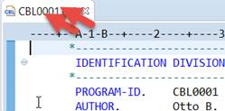
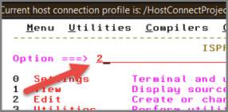
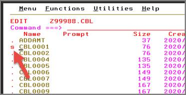
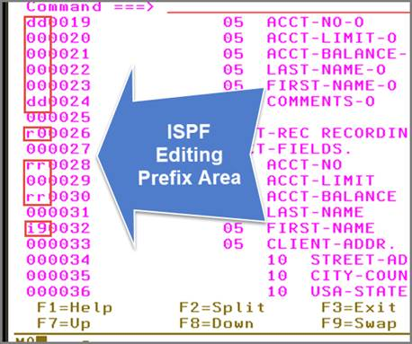

---
geometry:
- margin=1in
header-includes:
- \lstset{basicstyle=\ttfamily,
    stepnumber=2,
    numbersep=5pt,
    backgroundcolor=\color{black!10},
    showspaces=false,
    showstringspaces=false,
    showtabs=false,
    tabsize=2,
    captionpos=b,
    breaklines=true,
    breakatwhitespace=true,
    breakautoindent=true,
    linewidth=\textwidth}
- \hypersetup{colorlinks=true,
              linkcolor=blue}
---
\newpage
# Installing IBM Developer for Z

This chapter covers all aspects of download and installation of IBM Developer for z/OS and any prerequisites that are needed.  It includes: 

- **Install prerequisites**

     - **Hardware prerequisites**

     - **Software prerequisites**

     - **Download and install IBM's Installation Manager**

- **Install product offerings through IM**

- **Summary**

## Install prerequisites

This section will cover the necessary steps and information to download and install the prerequisites needed for the installation of IBM Developer for z/OS.  This includes both hardware and software pre-requisites.  It is important to verify your workstation hardware and software meets the prerequisites below before attempting to install IBM Developer for z/OS (IDz).

### Hardware prerequisites

From the link below, you will find the requirements for installing and running IDz on the different supported OS platforms: Windows, Linux, Mac and z/OS.  Select your proper platform and verify that your system meets the operating systems and hardware minimum requirements.

- [https://www.ibm.com/support/pages/node/713257](https://www.ibm.com/support/pages/node/713257)

### Software prerequisites

Also found in the link above, are the software requirements for each supported OS platform.  After selecting your platform from the link, the software prerequisites are listed under the "Prerequisites" tab. 

- You will use the Installation Manager to automate the process of installing IBM Developer for z/OS (IDz) by selecting it in the Install Packages window.

 
### Download and install IBM's Installation Manager

Use the following steps to download and install IBM's Installation Manager.

1. Click the following link: [https://developer.ibm.com/mainframe/products/downloads/eclipse-tools/](https://developer.ibm.com/mainframe/products/downloads/eclipse-tools/)

    - This will open a page where you can scroll down to locate IBM Developer for z/OS

 

**2.** **Check the box** , then scroll to the bottom of the page and click **Select**

 

3. Click the **Aqua 3.1 Select** button

 

4. Click either the **Installation Manager install** option or the**Eclipse p2 install** option

    - Note that Installation Manager is preferred as it automates much of the install process.

 

5. Select "**Starting from fresh** "

 

6. Download, unzip and install IBM Installation Manager (IM) and IDz using one of the following options:

    - User install: imLauncherWindowsUser.bat

    - Admin install: imLauncherWindows.bat

The process of installing Installation Manager runs unattended.  After it's finished, click **Restart Installation Manager** to install the product.

 

## Install product offerings through IM

Use the following steps to install IM packages:

 

1. Select the product by **checking the box** next to IBM Developer for z/OS in Install Packages, shown in Figure  1.

*Figure  1.  Install packages*

2. Click **Next**

    - Installation Manager will download the software components after resolving references to your operating system and to the Trial Software Repository.

 

3. Read the License Agreement terms - and if you're willing to continue

 
4. **Accept** and click **Next**

 

5. From Install Packages - click **Next** to accept the installation defaults

 

6. From Select Language - English is the default, but you can change the language from the displayed product options.

 

7.  From Install Packages - click **Next**    

8. From Configuration:

    - Check **Configure my z/OS connection now**

    - Enter the following values from Figure  2. :

*Figure  2.  Configuration options*

9. Click **Next** and then **Finish**

**Note:** The version numbers in our examples are provided purely for reference and may not reflect the latest versions of the software.

## Summary

In this chapter we have walked through the process of downloading and installing IBM's Installation Manage.  Which was subsequently used to walk through a series of dialogs to install IDz. 

\newpage
 
# Enabling IBM Developer for Z to work with COBOL

In this chapter we will explain how to use IDz and its COBOL-specific language-sensitive-editor as an alternative to other editors mentioned in this book.  We will also cover how using the editor can help you develop COBOL source code in a feature rich environment.
 

- **Introduction to IDz**

     - **What is IDz?**

     - **IDz architecture**

     - **Installing the IDz client**

- **Basic editing in** IDz

     - **Launch IDz**

     - **Overview of the IDz/Eclipse workspace and tools**

     - **Accessing code on the mainframe - open a COBOL program**

     - **COBOL program syntax highlighting**

     - **Navigating within a COBOL file**

     - **Working with COBOL source**

     - **Saving your work**

     - **Working in Full Screen Mode**

     - **Code-completion (Content Assist)**

     - **Handling syntax errors - the IDz COBOL Parser**

- **Access to batch jobs - launch and view results in JES**

- **Summary**

## Introduction to IDz

This section introduces IDz - IBM's flagship Integrated Development Environment for both today's production z/OS application work - tomorrow's DevOps application work - and future work with modern architectures and component-based systems.

### What is IDz?

IBM Developer for z/OS Enterprise Edition is a comprehensive solution for creating and maintaining z/OS applications efficiently.  The rich set of COBOL, PL/I, C/C++, High Level Assembler (HLASM), JCL, DB/SQL - including Stored Procedures and Java development tools and optimized tooling for Batch, CICS, IMS and DB2 runtimes, provide z/OS application developers a modern development environment for enhanced productivity.

Typical uses for IDz include but are not limited to:

- Access to Multiple Virtual Storage (MVS), z/OS Unix, Job Entry Subsystem (JES) artifacts from an Eclipse based environment

    - Eclipse is a modern GUI framework - widely used throughout the software development world on new and existing enterprise applications.

- Issue z/OS commands directly - from within the Eclipse development environment.

- Create new z/OS Datasets, members, Unix files and folders.

- Drag and drop files from one z/OS logical partition (LPAR) to another or from workstation to z/OS and vice versa.

- Intelligent and advanced remote edit / save and compile.

### IDz architecture

IDz has two basic components:

a. An IDz Client

b. A server-based "listener" that responds to development requests from the client

The IDz Client is installed on your machine, by you, while your company's systems administration staff installs and configures the Server Listener on z/OS.  The relationship between these two components is shown in Figure  1.

*`Figure  1.` `IDz client/server architecture`*

 
### Installing the IDz client

IBM provides a 60-day free, client trial license for this course. You can start the installation process from here:

[https://developer.ibm.com/mainframe/products/downloads/eclipse-tools/](https://developer.ibm.com/mainframe/products/downloads/eclipse-tools/)

 

## Basic editing in IDz

For the rest of this chapter, we will use the CBL0001 sample program to demonstrate how rich of an experience editing COBOL in IDz can be.  The steps covered are simply informative, to help the reader better understand through examples and visuals and are not required for the reader to complete.

### Launch IDz

- Upon launching IDz from your desktop, IDz will prompt you for a "workspace" directory, shown in Figure  2.

    - For this example, we accept the default workspace and click **OK.**

*Figure  2.  IDz workspace directory selection*

**Note:** a "Workspace" is a collection of folders on your PC that contain and manage your IDz client development environment, tools, preferences, etc.

### Overview of the IDz/Eclipse workspace and tools

When the product loads it will look something like Figure  3. 

*Figure  3.  IDz workbench - after launch*

Here are few terms and vocabulary that will be helpful at this point, illustrated in Figure  4.

- The entire product (IDz client) you're looking at in Figure 4 is called the Workspace.

    - You can think of this Workspace as analogous to a development workbench - that has several preferences pre-configured.

- The Workspace contains several Perspectives and a perspective is a defined layout for your tools - which are called Views.

- A View is a singular tool for working on some aspect of a z/OS application. There are hundreds of IDz Views, each has a purpose, and in this book, we will use a subset of these views:

    - Editor - a view used to create or modify code

    - Remote Systems - a view for accessing code that resides on a mainframe

    - Properties - a view that shows you the attributes of something (often a file characteristics)

    - z/OS Projects - a view used to organize specific files for faster access

 

*Figure  4.  The Workspace annotated*

### Accessing code on the mainframe - open a COBOL program

If you're using the IBM mainframe you will have a TSO ID assigned (and password) along with a group of files called "Libraries" named:  `<TSOID>.CBL`  `<TSOID>.JCL`  `<TSOID>.LOAD` etc.  To access code on the mainframe you would:

- **Expand** `<TSOID>.CBL`

- **Double-click: CBL0001.cbl** to load the program into the editor

When the warning message in Figure  5. appears:

- **Check "Do not show this message window again"**

- **Close the Warning**

*Figure  5.  Warning message*

### COBOL program syntax highlighting

The first thing you'll notice is that the COBOL source is highlighted in Figure  6, designating:

- COBOL Keywords are indicated with blue font.

- Variable (field) definitions:

    - Variables are defined elements in your COBOL program that hold data your program will process.

     - The variable names appear black in the editor.

     - Definitions of your variables are displayed in red/maroon font.

- Remarks:

    - COBOL Remarks are used to document your program's behavior, design, purpose, etc.  In CBL0001, Remarks (which start with an asterisk \* in column 7) are used to separate source lines making the program more legible.

 

*Figure  6.  CBL0001 sample program*

### Navigating within a COBOL file

The first thing you will want to do with an open COBOL program file is to navigate within the file. There are several options you can use for this:

- The scroll bars on the right-hand side of the view behave just like MS-Word.

- Click the up/down arrows in the right-hand side to move down one line at a time.

- PgUp and PgDn navigate through the code, one physical "page" of lines at a time.

- You can click your mouse (set focus) inside the COBOL source and use the mouse scrolling wheel to move up and down within the file.

- Ctrl+home jumps to the top of the source file.

- Ctrl+End jumps to the bottom of the file.

- The Outline View in Figure  7.  is basically a program table-of-contents - displaying all the elements in your program organized within the COBOL language structure.  Each element in the Outline View hyper-links the variables file definition and/or Paragraph in the program source to where the element is defined.

 

*Figure  7.  Outline view hyper-links*

 

### Working with COBOL source

The Editor contains several dozen tools for doing efficient/effective development work with COBOL programs. None of the tools are difficult to use, but in this book, we concentrate on the tools & techniques needed for introductory COBOL programming.

 

Before doing any development, you could press (simultaneously) **Ctrl+Shift+M.** This hot-key combination turns on COBOL line-number management - and will keep the sequence numbers in columns 7380 from shifting to the left and causing syntax errors.

#### Basic source editing functionality:

- How to change an existing line:

    - Select a line with your mouse cursor and type-over the existing statement.

     - Note that the standard MS-Windows Shift+Home, Shift+End keys work.

- How to delete a line:

    - To Delete a line, select the line and delete it with the **Delete** key on your PC.

     - Or select the line and press: **Ctrl+X** , this will cut the line copying it to your clipboard.

- How to add a line:

     - To add a line, click your mouse-cursor at the right-most end of the line (but to the left of the green COBOL sequence numbers in columns 73 80) and press **Enter.**

 
### Saving your work

There are various ways that you can save your work during your session. From simply closing the file (Figure  8. ) and selecting **Yes** , to using a "hot-key" combination such as:

- **Ctrl+S** - Saves your work (back to the mainframe)

- **Ctrl+Z** - "Undoes" (backs out) previous edits - one at a time

- **Ctrl+F4** - Displays the same save dialog shown in Figure 8

*Figure  8.  Close and save a file*

 

**Note:** From Figure 8 - Select **Yes** to close and save your work, **No** to close the file without saving and **Cancel** to return to Edit without having saved.

### Working in Full Screen Mode

While the COBOL programs you have learned from and worked with in this course are not colossal in size, there are times you may have noticed the benefit from working in Full Screen Mode.  Full Screen Mode allows you to see far more code at-a-glance, making it easier to both understand what a program does and make changes to the appropriate elements.

- To enter Full-Screen Mode you would **double-click the tab with the program name on it** - on the top of the Editor View, shown in Figure  9.

- To restore the View out of Full-Screen, double-click the tab a second time.

*Figure  9.  Double-Click the Editor View tab to enter Full-Screen mode*

 

*Figure  10.  Source code in Full Screen mode*

### Code-completion (Content Assist)

Code-completion (or in Eclipse terms; "Content Assist") allows you to type partial text, press **Ctrl+Spacebar** and choose the completed COBOL keyword, variable name or COBOL paragraph label from a popup window, see Figure  11.  All variables with names that begin with "ACC" are displayed. 

*Figure  11.  Content Assist*

You can also reference COBOL keywords by entering the beginning of the keyword and pressing Ctrl+Spacebar, displayed in Figure  12.

 

*Figure  12.  Pressing Ctrl+Spacebar to view & select COBOL keywords*

### Handling syntax errors - the IDz COBOL Parser

IDz also provides a level of syntax checking for its supported languages, including COBOL, JCL, SQL, PL/I, etc.  Although not as complete and authoritative as the mainframe COBOL compiler (which produces executable machine instructions), it is a method of quickly identifying syntax errors in your code and is helpful to see before submitting the source file for compilation. 

To demonstrate, let's create an error and then see how the editor shows it to us.  From Figure  13. you can see that we've misspelled "LASTREC" (it's been changed to LASTREC1).

- Immediately after typing the letter "1" at the end of LASTREC the IDz COBOL parser:

    - Recognized the error and flagged it

    - Added a statement tip (recommendation) to change the spelling to LASTREC

 

*Figure  13.  Highlighting errors in source code*

 

We can either choose to select the recommended change or do some more research on why that statement is considered invalid COBOL syntax.

## Access to batch jobs - launch and view results in JES

After you have edited a program in the labs throughout this book, cleared up any syntax errors, saved and closed your file, you likely launched a JCL job to "compile and link" the code.  This is often termed a "build operation", as it creates an executable version of your COBOL program ready to test and/or run and produce business results.

 

The action of launching a batch job has been described in greater detail previously in this book. Below is a simple series of steps to illustrate an example of doing such in IDz:

1. Obtain a "JCL file" that does the compile/link procedure, in our case this is HELLO.jcl, displayed in Figure  14.

 

2. We then modified portions of the file in order to build the program/code, shown in Figure  14.

 

3. Submit the JCL to a z/OS subsystem called JES (Job Entry Subsystem) by right clicking and selecting **Submit** from the menu that appears, as shown in Figure  14.

*Figure  14. Submitting a JCL file*

 

4. After submitting the JCL, there will be a prompt to locate the job from a job submission confirmation pop-up, see Figure  15. Here, you would select **Locate Job** .

 

*Figure  15.  Locate the Job after submission*

5. Then navigate down to the JES elements in the Remote Systems view, open the job like Figure 16 shows and inspect the job results.

 

*Figure  16.  Access to JES and Jobs through Remote Systems*

 

**JCL = Job Control Language -** A mainframe computing language that controls the running of "batch" jobs. A JCL File consists of JCL statements.

**JES = Job Entry Subsystem -** An area in a mainframe that handles the running of "batch jobs"

**Batch Job -** Work done on a mainframe in a non-interactive mode - overnight financial processing, updates to online databases and systems, etc.

 
## Summary

In this chapter, you have been able to go through some of the key editing features of the IDz.  These capabilities make editing COBOL, PL/I, JCL, Assembler, SQL and several other z/OS software languages (Java, JavaScript, HTLM, JSON, etc.) a little easier.

 

We've covered, in this chapter, less than 5% of what IDz has to offer for the z/OS professional.  To learn more:

- IBM instructional videos on IDz:

   [https://developer.ibm.com/mainframe/videos/](https://developer.ibm.com/mainframe/videos/)

- Ongoing IBM (free) Remote Instructor-led training on IDz:

   [https://developer.ibm.com/mainframe/idzrdz-remote-training/](https://developer.ibm.com/mainframe/idzrdz-remote-training/)

\newpage

# Using ISPF to work with COBOL

In this chapter we will explain how to use the tools of ISPF to develop COBOL source code, submit and manage jobs.

- **Introduction to TSO/ISPF**

     - **What is TSO/ISPF?**

     - **TSO vs. ISPF**

     - **TSO/ISPF in the real world**

     - **ISPF emulation architecture**

     - **Accessing the 3270-Emulator**

- **Basic editing**

     - **Launch IDz**

     - **Access TSO/ISPF from IDz**

     - **Log in to ISPF**

- **Overview of the ISPF primary option menu**

     - **What if my cursor becomes stuck in the user interface?**

     - **Edit entry panel**

     - **ISPF edit**

     - **Navigating within a COBOL file**

     - **Working with COBOL source - Prefix Area**

     - **Saving your work**

- **Access to batch jobs - launch and view results in JES**

     - **Steps - using the same basic workflow as edit**

- **Summary**

 
## Introduction to TSO/ISPF

This section introduces TSO/ISPF, IBM's central z/OS tooling, used in nearly 100% of the world's mainframe facilities to do application development and systems administration.

### What is TSO/ISPF?

Introduced in 1974, TSO/ISPF is a set of mainframe software components that built out almost all the mainframe systems and applications present in the business world yesterday and today.  TSO/ISPF tooling is accessed via 3270-data stream technology ("Emulation") products that are PF-Key (program function key) tools, living in a character-based (not GUI) user interface.

### TSO vs. ISPF

Technically, TSO (Time Sharing Option) is an application that runs directly on z/OS machines - and ISPF (Interactive Systems Programming Facility) is the user-interface to TSO tools and functionality.  Sometimes you will hear the term TSO, sometimes ISPF and sometimes TSO/ISPF.  From the standpoint of COBOL programming, you can consider these to be synonymous.  In this chapter, we will use the term ISPF (no one actually ever says "interactive systems programming facility" anyway).

### TSO/ISPF in the real world

Every company's ISPF uses a base set of tools and features, but then customizes the interface; adding, changing or uninstalling features they feel are necessary for optimal use in their business/technical environment.

Standard ISPF functionality includes:

- Access to MVS files, z/OS Unix and JES artifacts using 3270-data stream (character-based) emulator.

    - Note that there are several ISPF emulation packages available. In this chapter, we'll be demonstrating and discussing ISPF using IDz's "Host Connection Emulation", which is a free component of IDz.

    - Ultimately, all the host ISPF software functionality is the same, so it won't matter much which product you use.

- Issue z/OS commands directly.

- Submit and manage z/OS "batch jobs" - executables that run unattended on the mainframe.

- Create new z/OS Datasets, members, Unix files and folders.

- Edit MVS files and Datasets.

    - Primary focus of this chapter.

### ISPF emulation architecture

There are two basic components:

a.       A server-based "listener" that responds to development requests from the emulation client.

b.      Your ISPF Emulation Client, usually termed: 3270-Emulator - or just "emulator".

You would be responsible for installing the emulator on your machine.  Your company's systems administration staff would be responsible for installing and configuring the server listener on z/OS.  In this book you spent nearly 100% of your time performing COBOL development activities, primarily; program edit and compile/link/run coding and testing programs.

 

The ISPF Emulation architecture is depicted in Figure  1.  Note that definitions of terms like RACF/ACF-2 and Top Secret (along with JES, CICS, REXX, etc.) can be found on the web.

 

*Figure  1.  `ISPF Emulation-z/OS architecture`*

 
### Accessing the 3270-Emulator

Depending on what 3270-emulation product you're using, launching the product and setting it up will be different, and we can't cover all the alternatives in this book.  However, because we will be documenting the use of TSO/ISPF using IDz, that is what our examples will be based on utilizing.  To see a more detailed instruction on installing the client visit "Installing IBM Developer for Z". 

 
## Basic editing

For the rest of this chapter we will use the CBL0001 sample program to demonstrate editing COBOL using ISPF.  The steps covered are simply informative, to help the reader better understand through examples and visuals and are not required for the reader to complete.

### Launch IDz

- First, launch IDz from your desktop.

- IDz will prompt for a "workspace" directory.

    - For the purposes of this book we accept the default workspace and click OK.

- You will also be prompted for your TSO USERID and PASSWORD.

### Access TSO/ISPF from IDz

- After IDz has launched - from Remote Systems:

    - Right-click on MVS Files and select: Host Connection Emulator.

*Figure  2.  Accessing IDz's built-in emulator*

### Log in to ISPF

After selecting Host Connection Emulator, you should see something like a mainframe 3270-Emulator screen that lists mainframe applications available on your system, shown in Figure  3. This screen is site-specific, so what you see may not look exactly like Figure 3, but you should see something like "TSO" or "LOGON".

 

*Figure  3.  TN3270 z/OS access screen*

 

If you've typed your TSO ID correctly, you will then be prompted for your TSO password, which you must obtain from your company or from you class instructor.  See Figure  4.

 

*Figure  4.  Password login screen*

Following a successfully entered password, you will see several system broadcast message screens.  Each of them followed by three asterisks, shown in Figure  5.   The asterisks are informing you that the system wants you to press **Enter** .

 

 

*Figure  5.  TSO "waiting for Enter messages or "prompts"*

 

**Note:** The TSO system messages may contain important information, such as the disposition of a submitted job.

 

## Overview of the ISPF primary option menu

After you’ve pressed **Enter** , you should see something like Figure  6. , the ISPF Primary Option Menu, or simply the "primary menu".

 

*Figure  6.  ISPF primary option dialog*

 

Note that the primary menu in Figure 6 shows 14 options - numbered 0 11, SD and U.  There are also some PF Key assignments at the bottom of the screen.  These PF Key assignments are consistent throughout the product and are defined as:

- **F1** **Help** on the current screen (many ISPF professionals refer to these screens as "dialogs")

- **F2** **Split** the screen horizontally. This allows you to work in two different areas simultaneously.

- **F3** **Exit** or return from the prior tool menu.

- **F7** **Page backward**

- **F8** **Page forward**

- **F9** **Swap** your cursor focus between split screens.

- **F10** **Actions** bounces your cursor up to the Options at the top of the screen.

- **F12** **Cancel** returns you to the previous z/OS application.  In this case, F12 logs you out of ISPF and puts you in "Native TSO mode", which is similar to command line Unix and where you can enter commands to z/OS (the mainframe OS), but you cannot use ISPF to do development work.

- **SD** **SDSF** (Systems Display and Search Facility) to view the status of batch "jobs".

- **U** **Unix** access to the Unix subsystem running on z/OS.

Every shop will have some small variation on the ISPF primary menu, but for now let's type the number two on the Option line and press **Enter,** as shown in Figure  7.

 

*Figure  7.  Accessing edit - option 2 from the ISPF primary menu*

### What if my cursor becomes stuck in the user interface?

There are specific areas of 3270 screens designated for input, prefixed with:

**Option = = = >**

 

If your cursor focus is not on the option line and you type, you will "freeze" the screen. To get out of this situation:

- Click the tiny square at the bottom left corner of your 3270 screen.

- And press the **Attn** key, this will reset the screen for input allowing you to continue, shown in Figure  8.

- 

*Figure  8.  IDz 3270 control keys*

 

### Edit entry panel

Figure  9.  is an example of the edit entry panel.  This screen allows you to specify the location of what you wish to edit.  Note that you can create new programs and source files in TSO libraries (often referred to as Partitioned Data Sets (PDS).  That is outside the scope of this chapter.

 

There are numerous ways to specify a file to edit, but for now we're going to:

1. List all the program files in a library.

2. Select the program to edit from a list.

- From Figure  9. :

- Type `CBL` on the Name . . . entry area

- Press **Enter**

This will bring up the PDS member selection screen (Figure  10. ).  Note that you did not have to enter: <TSOID>.CBL.  This is because ISPF knows your TSO logon and automatically prefixes it before file names on the dialog input lines, if the file name isn't surrounded by apostrophes.

 

On the selection screen, hit the **tab** key three times and type an `S` next to CBL0001**,** then press **Enter** .  This will open CBL0001 with the ISPF screen where we can edit the source, shown in Figure  12.

*Figure  9.  Edit (option 2) dialog (entry panel) - where you select a file to edit*

 

*Figure  10.  The PDS member selection screen - where you select (S) the file you want to edit*

 

When the file initially opens you will probably get some warning text, which can be removed by typing `res` on the command line and pressing **Enter** , shown in Figure  11.

 

*Figure  11.  Resetting the warnings on the command line*

 

*Figure  12.  ISPF editor*

### ISPF edit

The layout of the ISPF Editor is shown in Figure  12. The prominent areas include:

- Command line - Where you issue change, find and navigation commands.

- Prefix Area - Where you issue line-level source modification commands (copy/paste/etc.).

- Your source file (COBOL Program Source).

- PF-Key definitions for editing, for example, PF3 == "save and close my edit session".

Note that there are dozens of ISPF productivity techniques, but in this chapter, we explore only a subset of them.

 

### Navigating within a COBOL file

The first thing you will want to do with an open COBOL program file is to navigate within the file. There are several options you can use for this:

- PF-Key command navigation:

    - PF8 - Scrolls down in the source one physical page at a time.

    - PF7 - Scrolls up in the source one physical page at a time.

- Command line command navigation: (see Figure  13. ) - note that the commands are not case-sensitive:

    - Bottom - Scrolls to the bottom of the file

    - Top - Scrolls to the top of file

    - Locate nn - Scrolls to the exact line number entered

     - Locate can be abbreviated to L

*Figure  13.  Issuing command line commands*

### Working with COBOL source - Prefix Area

The ISPF editor contains several dozen tools for doing efficient/effective development work with COBOL programs.  All are easy to learn, but in this section will concentrate on the tools & editing techniques needed for introductory COBOL programming.

#### Basic source editing functionality (see Figure  14. )

- Change an existing line:

    - Type-over the existing statement(s).

- Delete a line:

    - Type a `D` on the line in the Prefix Area.

    - Type `DD` on a line and `DD` on some line below it to "Block Delete" lines.

- Repeat a line:

    - Type an `R` on the line in the Prefix Area.

    - Type `RR` on a line and `RR` on some line below it - to "Block Repeat" lines.

- Insert a line:

    - Type an `I` on one line above where you want the line inserted.

    - Type `In` to insert multiple lines.

- Copy a line:

    - Type a `C` on the line in the Prefix Area - and `A` (above) or `B` (below) a line where you want copied line to go.

    - Type `CC` on a line and `CC` on some line below it "Block Copy" lines.

- Move a line:

    - Type an `M` on the line in the Prefix Area - and `A` (above) or `B` (below) a line where you want copied line to go.

**o** Type `MM` on a line and `MM` on some line below it "Block Move" lines.

*Figure  14.  Series of Prefix Area commands "stacked" or issued simultaneously*

### Saving your work

There are various ways that you can save your work:

- Typing `save` on the command line saves your work and leaves you in ISPF edit.

- Pressing **PF3** saves your work and exits ISPF edit.

- Typing `cancel` on the command line cancels all changes since the previous save or the beginning of your ISPF edit session.

- Typing `=X` on the command line exits ISPF edit back to the Primary Option Menu.

    - Note that you will be prompted to save or cancel changes to the file.

 >
## Access to batch jobs - launch and view results in JES

After you have edited a program, cleared up any syntax errors, saved and closed your file, you will launch a JCL job to "compile and link" the code.  This is often termed a "build operation", as it creates an executable version of your COBOL program ready to test and/or run and produce business results.

This section demonstrates:

- How to obtain a "JCL file" that does the compile/link procedure.

- How to modify portions of the file in order to build your program/code.

- How to "Submit the JCL" to a z/OS subsystem called "JES" (Job Entry Subsystem), see Figure  15.

- After submitting the JCL, how to access the Outlist, see Figure  16.

- How to navigate down to the JES elements in the Remote Systems view, open the job and inspect the job results shown in Figure  16.

 

**JCL = Job Control Language -** A mainframe computing language that controls the running of "batch" jobs.  A JCL file consists of JCL statements.

**JES = Job Entry Subsystem -** An area in a mainframe that handles the running of "batch jobs".

**Batch Job -** Work done on a mainframe in a non-interactive mode - overnight financial processing, updates to online databases and systems, etc.

 
### Steps - using the same basic workflow as edit

- From Option 2:

    - Type `JCL` on the Other Partitioned files line and press **Enter** to create a list of files in this library

    - From the list, hit **tab** three times and select CBL0001J by typing an `S` next to the file name and pressing **Enter.**

    - Type `sub (or submit)` on the ISPF editor command line and press **Enter.**

    - Jot down - or remember - the JES number assigned to the job, shown in Figure  15.

    - Use the job Outlist tool assigned to you by your shop or instructor to validate results.

     - There are several different tools by IBM and third-party vendors that support the viewing, saving, printing, etc. of job output.

     - Consult with your instructor or manager to learn the steps in order to use them.

 

*Figure  15.` `Submitting a JCL file*

*Figure  16.  Job number assigned by JES*

 

## Summary

In this chapter we have walked through some of the editing features using TSO/ISPF and the ISPF editor.  These capabilities ease editing COBOL, PL/I, JCL, Assembler, SQL and several other z/OS software languages (REXX, CLIST, etc.).

 

We've covered in this chapter less than 5% of what ISPF offers for the z/OS professional.  To learn more, there are several quality books on the subject and videos available on YouTube.

- A link to an excellent instructional video on ISPF:

   [https://www.youtube.com/watch?v=vOiHiI7b9iY](https://www.youtube.com/watch?v=vOiHiI7b9iY)
