---
geometry:
- margin=1in
header-includes:
- \lstset{basicstyle=\ttfamily,
    stepnumber=2,
    numbersep=5pt,
    backgroundcolor=\color{black!10},
    showspaces=false,
    showstringspaces=false,
    showtabs=false,
    tabsize=2,
    captionpos=b,
    breaklines=true,
    breakatwhitespace=true,
    breakautoindent=true,
    linewidth=\textwidth}
- \hypersetup{colorlinks=true,
              linkcolor=blue}
---
\newpage
# Numerical Data Representation

In the first COBOL Programming Course, various types of data representation were discussed. This chapter seeks to expand upon the binary and hexadecimal numbering systems as well as the various numeric representations in COBOL. 

- **Numbering Systems**
     - **Binary System**
     - **Hexadecimal System**
     - **EBCDIC Encoding**
     - **COBOL Picture Clause**
- **Numeric Representations in COBOL**
     - **Zoned Decimal Format**
     - **Packed Decimal Format**
     - **Binary Format**
     - **Single Precision Floating Point**
     - **Double Precision Floating Point**


## Numbering systems

A numbering system provides a means to represent numbers. We are most familiar with using the base-10 number system known as decimal. Data such as numerical values and text are internally represented by zeros and ones in most computers, including mainframe computers used by enterprises. This base-2 number system known as binary. Although data is encoded in binary on computers, it is much easier to work with base-16 known as hexadecimal. Each sequence of four binary digits is represented by a hexadecimal value.

### Binary System

Just as in our decimal system, a binary integer is a sequence of binary digits 0 and 1 arranged in such an order that the position of each bit implies its value in the integer.  The binary representation of the number 21 is:

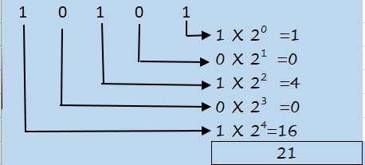

On the IBM Mainframe system, the two’s complement form is used for the representation of binary integers. In this form, the leftmost bit is used to represent the sign of the number: 0 for positive and 1 for negative. For a positive number, the two’s complement form is simply the binary form of the number with leading zero(s). For a negative number, the two’s complement is obtained by writing out the positive value of the number in binary, then complementing each bit and finally adding 1 to the result. Assuming one byte of storage and b<sub>0</sub>b<sub>1</sub>b<sub>2</sub>b<sub>3</sub>b<sub>4</sub>b<sub>5</sub>b<sub>6</sub>b<sub>7</sub> are the bits, let us look at some examples.

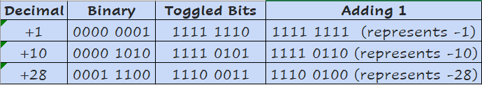

As we can see, the sign bit b<sub>0</sub> is 0 for a positive integer and 1 for a negative integer. This bit will participate in all arithmetic operations as though it represented the value (-b<sub>0</sub> * 2<sup>k-1</sup>) for a k bit number. In the above binary representation of -28:

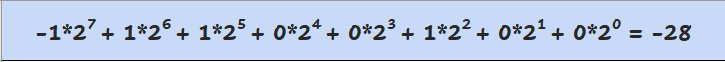

The number of bits will clearly dictate the range of values that can be stored. With k bits, the maximum positive value that can be stored correctly is 2<sup>k-1</sup> - 1 and the minimum (negative) value will be -2<sup>k-1</sup>. The number Zero is always represented with sign bit zero. With k=4:

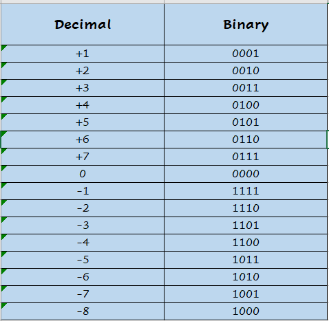

For K=32 bits, the range is -2<sup>31</sup> to +2<sup>31</sup> - 1

### Hexadecimal System

There are sixteen digits, represented by 0,1,2,3,4,5,6,7,8,9,A,B,C,D,E and F. The first 10 symbols have their usual meaning; the remaining six, A through F, represent the values 10 through 15 when used as hexadecimal digits. 

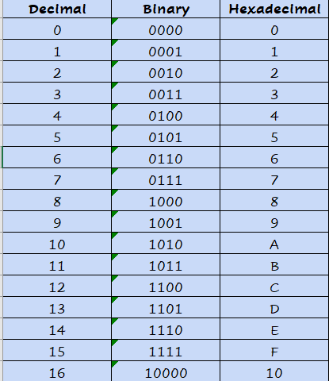

A423 is the hexadecimal equivalent of the decimal value 42019:

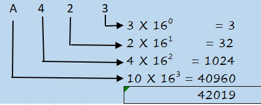

Although data is encoded in binary on computers, it is rather cumbersome to work with binary.  The hexadecimal numerals provide a human friendly representation of the binary coded values. An understanding of this system is invaluable to the COBOL programmer as he designs, develops and tests code.  Often, hex dumps of the data in memory are used to debug a program and understand what is going on. The conversion between binary and hexadecimal system is easy as 2<sup>4</sup> = 16. Each hexadecimal digit represents 4 binary digits, also known as a nibble, which is half a byte.

   - To convert from hexadecimal to binary, replace each hexadecimal digit with its equivalent 4-bit binary representation
   - To convert from binary to hexadecimal, replace every four consecutive binary digits by their equivalent hexadecimal digits, starting from the rightmost digit and adding zeros, on the left if necessary


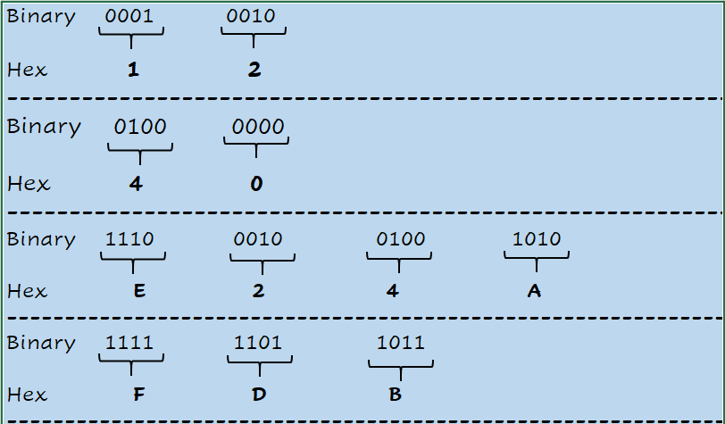

The usual convention is to use X’  ‘  to denote a hexadecimal value, B’  ‘  to denote a binary value. 

### EBCDIC Encoding 
 
C' ' is used to represent a character value. It is helpful to familiarize yourself with the 8-bit EBCDIC encoding scheme that is used on the zOS and most IBM mainframes. 

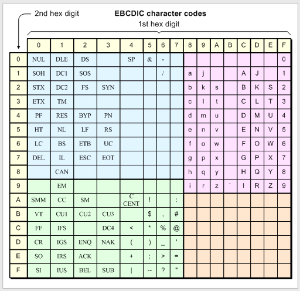

8-bit EBCDIC Encoding

For numerical representations, the last column is of particular interest here; the character representations of numerical digits 0-9 in the EBCDIC encoding. C’5’ is encoded, for example, as X’F5’ and C’9’ as encoded as X’F9’. 

### COBOL Picture Clause

As a quick reminder, COBOL leverages numeric data with a PIC clause that can contain a 9, V and/or S. These symbols keep the number purely mathematical that can participate in arithmetic.                    
    
   - 9 is used to indicate numeric data consisting of the digits from 0 to 9
   - V indicates where the assumed decimal place is located
   - S will remember the sign which is necessary if the data is negative


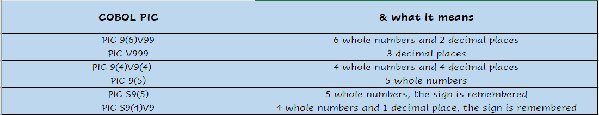

Since the number of decimal places is determined and fixed in place by the V, this representation is called fixed point . Let us illustrate with an example to show how the V determines the value stored.

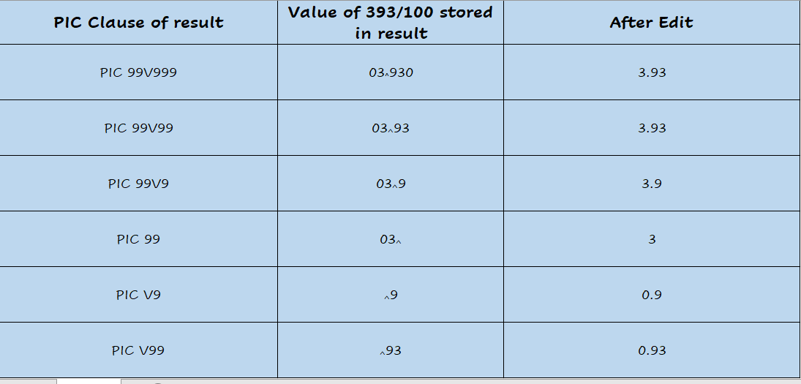

## Numeric Representations in COBOL

In this section, we will investigate the numeric representations in COBOL:
   - Zoned Decimal (Fixed Point)
   - Packed Decimal (Fixed Point)
   - Binary (Fixed Point)
   - Single Precision Floating Point
   - Double Precision Floating Point

### Zoned Decimal Format

In this format, each byte of storage contains one digit. The high order 4-bits (or nibble) are called the Zone bits. The low order 4-bits are called the Decimal or Numeric bits and will contain the binary value for the digit. Considering a simple case, the number 25 is represented as X’F2F5’. 

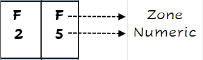

The zone portion is the ‘upper half byte’ and numeric portion is the ‘lower half byte’. This format is the default numeric encoding in COBOL. The coding syntax of USAGE IS DISPLAY can also be used. Let us look at a few valid zoned decimal declarations.

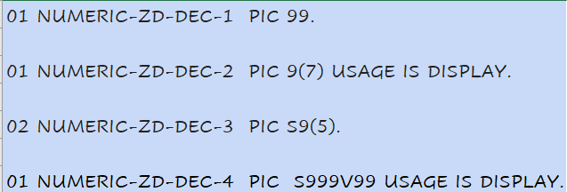

As discussed earlier, the first two declarations above are unsigned, indicated by the absence of a S. Such numbers are ‘implied positive’. The next two declarations are explicitly signed by the symbol S and are capable of representing positive and negative numbers. The sign is represented by the rightmost zone bits (in the above example the F above the 5) and is determined as follows:

  - F indicates the number is unsigned
  - C indicates the number is positive
  - D indicates the number is negative

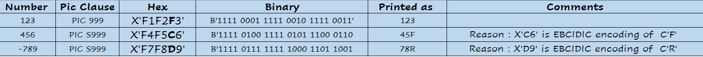

It is clear some adjusting (or editing) needs to be done before printing a signed number. The V in the declarations above has no storage allocated for it and will also need to be edited for printing purposes. To illustrate the way it works, consider an input file with a number 12345 and the input PIC clause is 999V99. This means that there is a decimal point assumed between 3 and 4. When the number is later aligned with an edited field, say ‘999.99’, the result is printed as 123.45.

When we code arithmetic statements involving zoned decimal fields, under the covers, COBOL converts the data to packed decimal and/or binary representations in order to do the math and the result is converted back to zoned decimal, all seamlessly. This extra step and hence a loss in efficiency is the price to pay for the easy readability that this format provides.

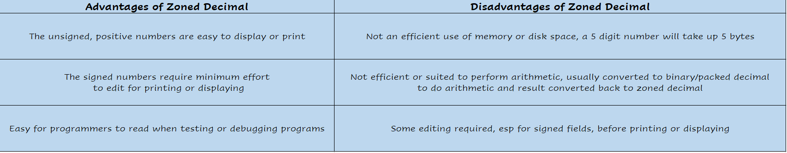

### Packed Decimal Format

In the zoned decimal format, the rightmost zone bits determine the sign; the other F’s are redundant. When a number is ‘packed’, those extra zone bits are removed, and only the rightmost zone bits are retained. Hence, the move from an unpacked field changes every byte in the field (except the last) from X’Fn’ to X’n’. The nibbles in the last byte get flipped (X’C2’ becomes X’2C’). 

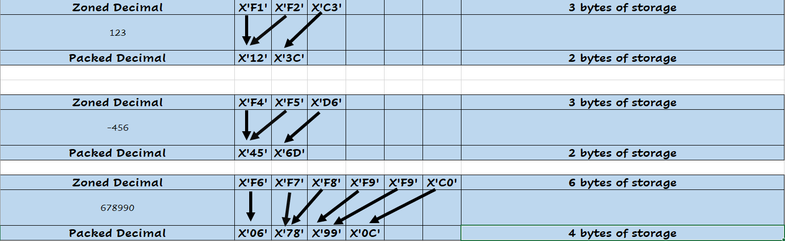

As we can observe, when the number is packed into a field that is larger than necessary to hold that number, it is padded with zeroes on the left.

   - Number 1                        will be stored as X’1F’              in 1 byte
   - Number +12                      will be stored as X’012C’            in 2 bytes
   - Number -123                     will be stored as X’123D’            in 2 bytes
   - Number 1234 (unsigned)          will be stored as X’01234F’          in 3 bytes
   - Number +12345                   will be stored as X’12345C’          in 3 bytes

The COBOL syntax for this format is USAGE IS COMP-3 or just COMP-3.

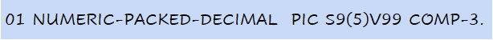

As the packed decimal representation stores two digits in one byte, it is a variable length format. Also, as we can see, the digits are stored in decimal notation, and each digit is binary coded. So, COMP-3 exactly represents values with decimal places.  A COMP-3 value can have up to 31 decimal digits. This format is somewhat unique and native to mainframe computers such as the IBM z architecture. The zOS has specialized hardware for packed decimal arithmetic and so the system can perform mathematical calculations without having to convert the format. This is, by far, the most utilized numerical value representation in COBOL programs. Storing information in this format may save a significant amount of storage space.

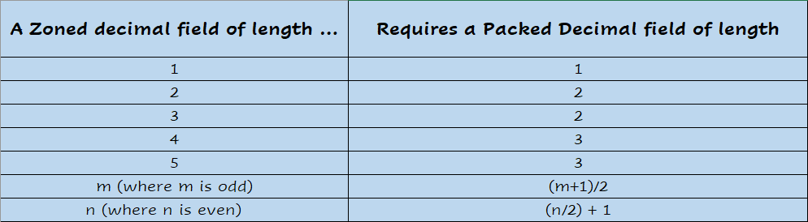


It is usually the best choice for arithmetic involving decimal points/fractions.  After numerical processing, a packed decimal field is (moved) unpacked into a zoned decimal format which can then be edited for printing purposes.

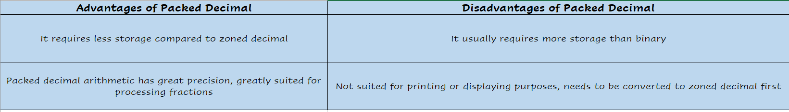

### Binary Format

On the IBM Mainframe systems, the other main arithmetic type besides the packed decimal is the binary format which is built for efficiency in integer arithmetic operations. This encoding finds many uses in Legacy applications. Many datasets are created with binary fields. Variable length records and table processing in COBOL use this representation.  The binary format is largely implementation dependent and has many variations. On the zOS and IBM Mainframes, the twos complement encoding is used. 

The COBOL clauses for this format are COMP, COMP-4, COMPUTATIONAL or BINARY which can be used interchangeably. COMP-5 clause also falls in this category. Let us look at some valid declarations.

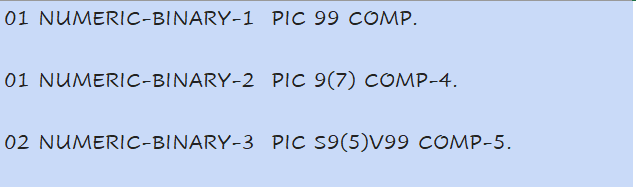

The PIC Clause determines the storage space:

  - PIC 9(1)   through PIC 9(4)     will reserve 2 bytes (Binary halfword)
  - PIC 9(5)   through PIC 9(9)     will reserve 4 bytes (Binary fullword)
  - PIC 9(10)  through PIC 9(18)    will reserve 8 bytes (Binary doubleword)

  Next, let’s look at what numbers can be stored. For the COMP and COMP-4 fields, although the data is stored as binary numbers, the range is limited by the full value of the PIC Clause used in the field definition. The binary format, COMP-5 (also known as ‘Native Binary’) in which the PIC clause still defines the size of the field but the range of values that can be represented is much higher as every possible bit-value combination is valid. 

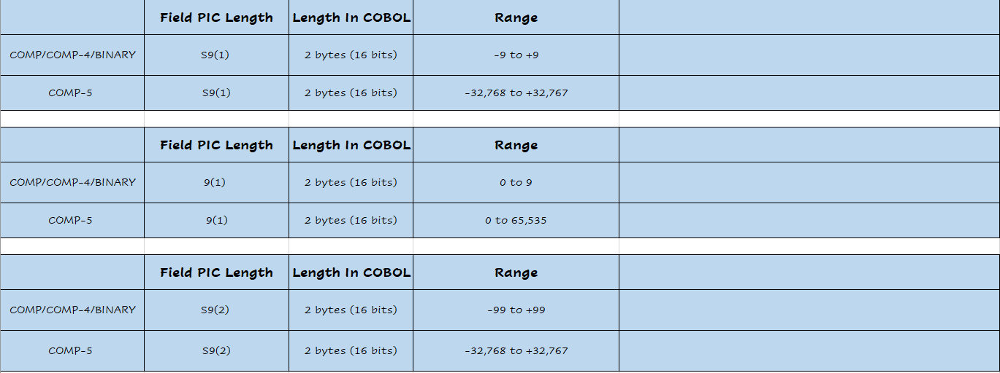
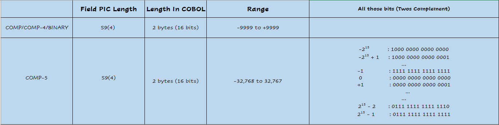
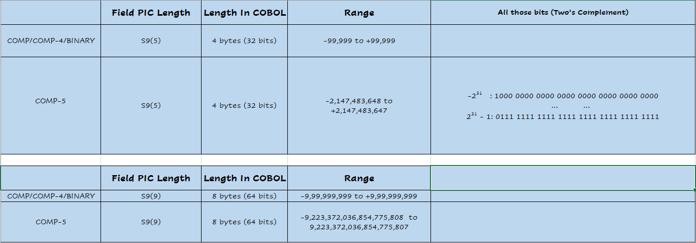

Those numbers are more than sufficient for most business applications! To give a quick comparison, a two byte packed decimal field can range in value from -999 to +999 only. When faced with larger than capacity values, COMP truncates to the decimal value of the PIC clause and COMP-5 truncates to the size of the field.

Although very much suited for integer processing, the binary format is not a good choice for non-integer arithmetic. Many banking and insurance applications rely on accuracy for their business processing logic and packed decimal format is preferred in such cases. Let’s see why. 
In decimal systems, fractions are represented in terms of negative powers of 10:

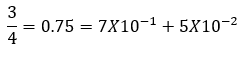 

In binary system fractions are represented in terms of negative powers of 2:

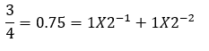 

There is a possible loss of accuracy when converting a decimal fraction to a binary fraction as there is not a one-to-one correspondence between the set of numbers expressible in a finite number of binary digits and the set of numbers expressible in a finite number of decimal digits. Let’s take the example of the fraction 1/10. In the decimal system:

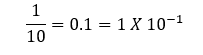 

However, in the binary system, this is a never ending sequence of bits…!!   

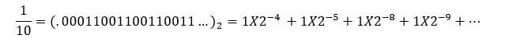 

So, we get different values when, for example, we multiply 1/10 by 10 in the decimal and in the binary systems. In the decimal system, 10 X 0.1 = 1.0.  In the binary system, we get

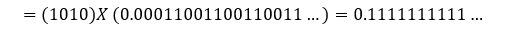 

i.e. not quite 1.0 !! In scenarios involving a large number of calculations, this type of discrepancy may lead to cumulative rounding errors that may not be acceptable in many business applications. The use of packed decimal works very well in such cases. 

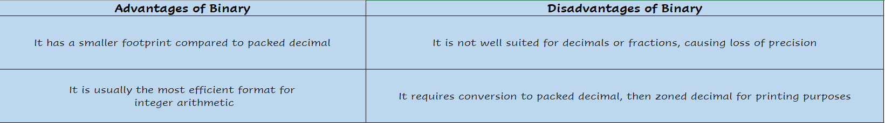


### COMP-1: Single Precision Floating Point

 Due to the floating-point nature, a COMP-1 value can be very small and close to zero, or it can be very large (about 10 to the power of 38).  However, a COMP-1 value has limited precision.  This means that even though a COMP-1 value can be up to 10 to the power of 38, it can only maintain about seven significant decimal digits.  Any value that has more than seven significant digits are rounded.  This means that a COMP-1 value cannot exactly represent a bank balance like $1,234,567.89 because this value has nine significant digits.  Instead, the amount is rounded.  The main application of COMP-1 is for scientific numerical value storage as well as computation.

### COMP-2: Double Precision Floating Point

COMP-2 extends the range of value that can be represented compared to COMP-1.  COMP-2 can represent values up to about 10 to the power of 307.  Like COMP-1, COMP-2 values also have a limited precision.  Due to the expanded format, COMP-2 has more significant digits, approximately 15 decimal digits.  This means that once a value reaches certain quadrillions (with no decimal places), it can no longer be exactly represented in COMP-2.

COMP-2 supersedes COMP-1 for more precise scientific data storage as well as computation.  Note that COMP-1 and COMP-2 have limited applications in financial data representation or computation.

**Note** : [This](https://www.ibm.com/support/pages/how-display-hexadecimal-using-cobol) COBOL program can display the hexadecimal contents (and hence the exact internal representation) of a field. You can declare binary, packed decimal or zoned variable (or anything else, for that matter), do arithmetic with them and use the program to see how they are internally stored. 

\newpage
# COBOL Application Programming Interface (API)
API is the acronym for Application Programming Interface.  An API allows two applications to communicate. We use API's everyday from our phones, personal computers, using a credit card to make a payment at a point of sale, etc.  

Today's digital infrastructure is instrumented and interconnected.  It is the API's that enable the "instrumented" network to be "interconnected".  As a result, API has become a highly used acronym in the technology arena.  The phrase "API Economy" became strategic term since Forbes declared 2017 "The Year of the API Economy".

Business application solutions were architected decades ago using programming language API's.  Long before API became a strategic technology category, mainframe application developers understood the acronym as a way to enable a programming language to communicate with other software.  The value of being a programmer in any specific programming language increased by understanding and using API's.

- **Enterprise COBOL APIs**
     - **z/OS Middleware**
     - **COBOL API Communication with Middleware**
     - **COBOL EXEC SQL**
     - **COBOL Data Items**

- **SQL Capability within Enterprise COBOL**
     - **Enterprise COBOL Application Programming and SQL Guide**
     - **Db2 Data Base Administration (DBA) vs Application Programming**

- **Lab**
    - **Using VSCode and Zowe Explorer**

## Enterprise COBOL APIs
IBM mainframe flagship operating system, z/OS, includes software that has enabled large scale business applications for decades.  The software is frequently referred to as 'middleware'. Examples of z/OS 'middleware' is Db2, a relational database, CICS, transactional processor, IMS, both transactional and hierarchical database, and MQSeries, a mechanism to store and forward data between systems asynchonously.

### z/OS Middleware
A fundamental capability of z/OS middleware software is communication enablement of programming languages.  The z/OS middleware software includes documentation and examples of how any specific programming language can communicate with the specific z/OS middleware software.  A programming language, such as Enterprise COBOL, would use documented interfaces and techniques to initiate services and pass data between the COBOL application program and the middleware. 

### COBOL API Communication with Middleware
Each middleware has unique reserved words available to Enterprise COBOL.  

Enterprise COBOL unique API reserved words are in Example 1.

```
EXEC SQL
EXEC CICS
CALL 'MQ...'
CALL 'CBLTDLI'
```
*Example 1. COBOL API Reserved Words*

Each of the above COBOL API's enable the program to communcate with Db2, CICS, MQSeries, and IMS respectively.  When the COBOL source program is compiled, the API reserved words expand the number of lines in the COBOL source code.  The expanded lines of code does not need to be fully understood by the COBOL programmer.  The COBOL programmer uses an API to accomplish a task within the logic and the middleware expanded code follows through with accomplishing the task.

### COBOL EXEC SQL
SQL, Structured Query Language, is the documented standard for communicating will all relational databases.  Enterprise COBOL is capable of including Db2 for z/OS SQL.  A few simple COBOL EXEC SQL reserved words are shown in Example 2.

```
 WORKING-STORAGE SECTION. 
*****************************************************
* SQL INCLUDE FOR SQLCA                             *
*****************************************************
          EXEC SQL INCLUDE SQLCA  END-EXEC. 
*****************************************************
* SQL DECLARATION FOR VIEW ACCOUNTS                 *
*****************************************************
          EXEC SQL DECLARE my-acct-tbl TABLE 
                  (ACCTNO     CHAR(8)  NOT NULL, 
                   LIMIT      DECIMAL(9,2)     , 
                   BALANCE    DECIMAL(9,2)     , 
                   SURNAME    CHAR(20) NOT NULL, 
                   FIRSTN     CHAR(15) NOT NULL, 
                   ADDRESS1   CHAR(25) NOT NULL, 
                   ADDRESS2   CHAR(20) NOT NULL, 
                   ADDRESS3   CHAR(15) NOT NULL, 
                   RESERVED   CHAR(7)  NOT NULL, 
                   COMMENTS   CHAR(50) NOT NULL) 
                   END-EXEC. 
*****************************************************
* SQL CURSORS                                       *
*****************************************************
          EXEC SQL DECLARE CUR1  CURSOR FOR 
                   SELECT * FROM my-acct-tbl 
               END-EXEC. 

 PROCEDURE DIVISION.
*------------------ 
 LIST-ALL. 
          EXEC SQL OPEN CUR1 END-EXEC. 
          EXEC SQL FETCH CUR1 INTO :CUSTOMER-RECORD END-EXEC.
          PERFORM PRINT-AND-GET1 
               UNTIL SQLCODE IS NOT EQUAL TO ZERO. 
          EXEC SQL CLOSE CUR1   END-EXEC.
```
*Example 2. COBOL SQL Statements*

### COBOL Data Items
While the EXEC SQL is expanded into additional lines of code at compile time,
COBOL needs data items to manage the data passed between the COBOL program and Db2 table. 

The fields in the Db2 table record were defined using CREATE TABLE SQL.  The EXEC SQL DECLARE in Table xx describes the Db2 table format within the COBOL program.  The COBOL programmer with knowledge of the Db2 table format can code the table format or let Db2 for z/OS generate the code using a DCLGEN utility.  

Observe ":CUSTOMER-RECORD" in the EXEC SQL FETCH statement.  A colon (:) precedes COBOL program defined variables that are used in SQL statements so that Db2 can distinguish a variable name from a column name.  Example 3. shows the COBOL program data items describing the COBOL program variable names.

```
*****************************************************
* STRUCTURE FOR CUSTOMER RECORD                     *
*****************************************************
 01 CUSTOMER-RECORD. 
    02 ACCT-NO            PIC X(8). 
    02 ACCT-LIMIT         PIC S9(7)V99 COMP-3. 
    02 ACCT-BALANCE       PIC S9(7)V99 COMP-3. 
    02 ACCT-LASTN         PIC X(20). 
    02 ACCT-FIRSTN        PIC X(15). 
    02 ACCT-ADDR1         PIC X(25). 
    02 ACCT-ADDR2         PIC X(20). 
    02 ACCT-ADDR3         PIC X(15). 
    02 ACCT-RSRVD         PIC X(7). 
    02 ACCT-COMMENT       PIC X(50).
```
*Example 3. COBOL Data Item for storing variables where Db2 is the data source*

## SQL Capability within Enterprise COBOL
Learning SQL is a separate technical skill.  The objective of this brief chapter is familiarization with Enterprise COBOL use of SQL API.  A COBOL program is capable of any SQL communication with Db2 for z/OS assuming necessary authority is granted.  SQL has four catagories as outlined in Example 4.  Learning SQL is necessary for a COBOL programmer to become proficient with using the Db2 API for a variety of possible applications where COBOL provides the what, how, and when logic of executing specific SQL.  

```
DDL - Data Definition Language
CREATE
ALTER 
DROP

DML - Data Manipulation Language
SELECT
INSERT
UPDATE
DELETE 

DCL - Data Control Langauge
GRANT
REVOKE

TCL - Transaction Control Language
COMMIT
ROLLBACK
```
*Example 4. SQL Categories*

### Enterprise COBOL Application Programming and SQL Guide
Db2 for z/OS V12 is the most current release of Db2 at the moment.  The Db2 V12 for z/OS Application Programming and SQL Guide is available using internet search SC27-8845, the Db2 for z/OS professional manual number.  Db2 V12 for z/OS SQL Reference is also necessary to advance programming API capability (SC27-8859).

### Db2 Data Base Administration (DBA) vs Application Programming
In large enterprise, the roles and responsibilities are divided for a number of reasons.  The responsibility of the DBA would include the DDL and DCL outlined in Example 4.  The DBA is responsibile for managing the entire relational data base environment to insure availability, security, performance, etc.  The system programmers and DBAs frequently setup the application development procedures for COBOL programmer development, testing, and maintenance of the COBOL business applications.  A COBOL application programmer is typically provided documented procedures to follow to apply their COBOL programming and SQL API expertise.

Enterprise COBOL is a learning journey.  Each Enterprise COBOL API is a separate learning journey.  As is the case with most professional endeavors, learning, repetition, and applying what is learned is re-iterative process leading to advanced skill levels.

## Lab
The lab contains data used in previous labs from "COBOL Programming Course #1 - Getting Started" where the data source was sequential data set, then a VSAM data set.  The lab provides JCL to create a personal Db2 table in a DBA-created database name using a DBA-created storage group.  The DBA-created storage group directs the create tablespace and table to specific disk storage volumes.

The lab contains Enterprise COBOL source code with Db2 APIs along with the JCL to compile and execute the COBOL programs.

### Using VSCode and Zowe Explorer
Zowe Explorer is currently without the ability to execute Db2 SQL interactively. It is inevitable Zowe Explorer will eventually have the capability of connectiong to relational databases and executing SQL.

Therefore, JCL members were created to create and load user tables following examples provided.

1. Submit `zos.public.db2.jcl(db2setup)`
The result is new JCL and CBL members copied into personal JCL and CBL libraries

2. SUBMIT JCL(CRETBL)
The result is a personal Db2 tablespace, table, indexspace, and index
 
3. SUBMIT JCL(LOADTBL)
The result is data loaded into the personal Db2 tablespace, table, indexspace, and index
 
4. Edit each COBOL source code member in your CBL partition data set changing all occurrences of Z# to your personal ID. Example - If your ID was Z80001, then change all occurrences of Z#  to Z80001.
 
5. SUBMIT JCL(CBLDB21C)
The result is compile of CBL program CBLDB21 and a Db2 Plan needed for program execution
 
6. SUBMIT JCL(CBLDB21R)
The result is execution of COBOL program CBLDB21 to read the Db2 table and write each record from the Db2 table .

7. Two additional COBOL programs with Db2 API exist, CBLDB22 and CBLDB23 using the same Db2 table as the data source.


\newpage
# COBOL Challenges
As you have now handled some basic exercises, we have prepared a new section containing more advanced exercises that test your ability to resolve bugs and other issues in COBOL programs. Each exercise will have a short description and a goal to be accomplished.

Happy Coding!

- **COBOL Challenge - Debugging**
- **COBOL Challenge - The COVID-19 Reports**
- **COBOL Challenge - The Unemployment Claims**
- **Hacker News Rankings for Mainframe/COBOL Posts**

\newpage
## COBOL Challenge - Debugging

It is 2020 in Washington, D.C. John Doe runs a program which provides financial reports on US Presidents and tallies the number of reports from the state of Virginia. Everything seems OK. (see below)


John is satisfied, as he can see that everything is working as it should be. He calls it a day and goes home.

The next day, when he comes back to the office, his colleague Mari tells him “I’ve made some changes to one of your programs so that it also tallies the number of presidents who spent more than their allowed limit. Check it out.”

He runs his usual reports and sees the following:


Clearly, Mari’s changes to the program that generates the reports have broken something.

Can you fix the code to get the correct result? The new source code is named **CBL0106** and the JCL is **CBL0106J**. In case you get stuck, the solution is in the file **CBL0106C**. 

You can find them in the github repository for the COBOL course, in the subfolder **/COBOL Programming Course #2 - Advanced Topics/Challenges/Debugging**.

\newpage
## COBOL Challenge - The COVID-19 Reports

Today, you are tasked to create a COVID-19 Summary Report of all the countries around the world, using information from the COVID19API website.

### Instructions

1. Extract the response from this API: https://api.covid19api.com/summary. You will receive a JSON file that is similar to the image below:

    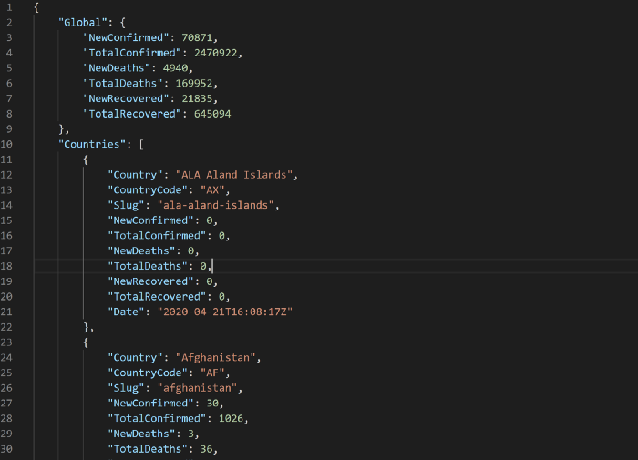

2. Convert that file to CSV format. It should look like this. In my example, I only chose the “Countries” part.

    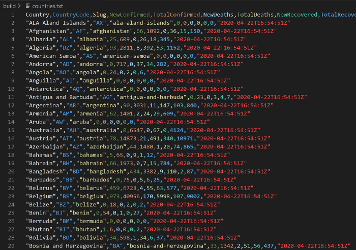

3. Using Zowe, upload the CSV file to the mainframe.

**Hint:** You can use the command `zowe files ul ftds "file location" "dataset name"` to upload the CSV file to the mainframe.

4. Create a new member in your *.CBL data set to write your COBOL program.

**Hint:** You can create a member using Zowe Explorer or Zowe CLI.

5. Write a COBOL program that reads the uploaded CSV file and reformats it to display the contents like this:

    ```
    ********************************************************************
    DATE: 2020-04-22
    TIME: T16:54:5
    COUNTRY: "Antigua and Barbuda"
    COUNTRY CODE: "AG"
    SLUG: "antigua-and-barbuda"
    NEW CONFIRMED CASES: 00000
    TOTAL CONFIRMED CASES: 00023
    NEW DEATHS: 00000
    TOTAL DEATHS: 00003
    NEW RECOVERIES: 00004
    TOTAL RECOVERIES: 00007
    ********************************************************************
    ```

6. Compile and test your work.

### Advanced Tasks

If you want a more challenging approach, try the optional tasks below:

- Reformat the data into a Report Form like this:

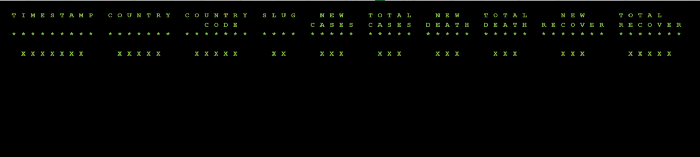

- Automate. Using NPM and Zowe CLI, run all these steps and create a “one click” COBOL build similar to this:

    

### Solution

To check the solution, refer to the blog post [here](https://medium.com/@jessielaine.punongbayan/solution-covid-19-reports-cobol-challenge-6c509579e3fe?source=friends_link&sk=5a662034a03c91d639b77267ed6abfc9).

Happy Coding!

_Disclaimer: This challenge is also posted in [Medium.com](https://medium.com/@jessielaine.punongbayan/cobol-challenge-covid-19-reports-ee03a946bd23)._

\newpage
## COBOL Challenge - The Unemployment Claims

Now let's try a more advanced challenge! Your task is to create an end-to-end solution. Our end goal is to build an application that will fire Zowe APIs to the mainframe and display the result in the application. This is how the flow would look:

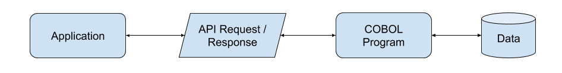

_Of course, you do not have to complete the whole challenge if you do not want to. But it would be great if you do_

### Our Data

The data that we are going to use will come from https://www.data.gov/. According to their website, this is a repository of data that is available for public use. For more information, please visit their website.

To be more specific, we are going to get the monthly unemployment claims of the state of Missouri.
I chose this because it is separated according to different categories:

- **By Age:** https://catalog.data.gov/dataset/missouri-monthly-unemployment-claims-by-age-d20a7
- **By Ethnicity:** https://catalog.data.gov/dataset/missouri-monthly-unemployment-claims-by-ethnicity-2a03b
- **By Industry:** https://catalog.data.gov/dataset/missouri-monthly-unemployment-claims-by-industry-80e86
- **By Race:** https://catalog.data.gov/dataset/missouri-monthly-unemployment-claims-by-race-32ab3
- **By Gender:** https://catalog.data.gov/dataset/missouri-monthly-unemployment-claims-by-sex-f5cb6

You can consume the data in different formats such as CSV, RDF, JSON or XML. You can choose whatever format you like.

### Use Case

You are given a new set of data for The Unemployment Claims. Your tasks are as follows:

- To create a new database for the new set of data and combine the data based on the Record ID field.
- To provide a way for other COBOL programs and other applications to access this newly created database.
- To create a report specifying all the information available in the newly created database. The report will contain, but not be limited to, the following information: Record ID, Age, Ethnicity, Industry, Race and Gender.

### Instructions

1. Create a database. This can be done in various ways but the easiest one the I could think of is a VSAM file. First, create a COBOL program that will consume your data. Then, using the RECORD-ID as the key (which is more visible when reading the CSV file), create a KSDS VSAM file and store all the information there.

    _What this means is that one record will have the RECORD-ID as the key and all the information from The Monthly Unemployment Claims (Fields from Age, Ethnicity, Industry, Race and Gender) will be added or connected to the RECORD-ID._

    The flow would look like this:

    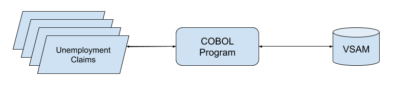

2. Create a COBOL sub-routine. This program will allow other programs to read the data from the VSAM file. This sub-routine should be able to perform the following tasks:  
    - accept requests to get information about a specific record ID.
    - _(Optional)_ accept requests to get information about all the records inside the database. What does this mean? It means that instead of providing a record ID, I could provide an indicator that I want to create a report of all the records inside the database.

    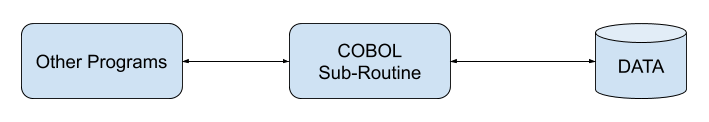

    _The purpose of the COBOL sub-routine is to allow other COBOL programs or other application to access the information inside the VSAM file._

3. Create a Main COBOL Program. This program will create a report based on the records inside the newly created database. The process is as follows:  
    - The program calls the COBOL sub-routine passing the Record ID or, optionally, an indicator that you want to print all records in the database.
    - It receives the response from the sub-routine.
    - It processes the response and generates a report. This report can be a formal report or just a display in the SYSOUT. It’s up to you.

    The flow should look like this:

    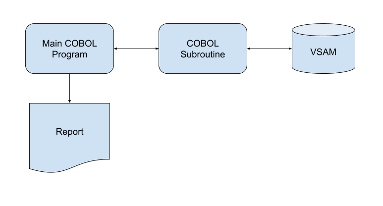

4. Create your JCLs.

    _By this point, if you choose to do the exercise using COBOL programs only, you should be able to read the data from your VSAM file, process it and generate a report. The generated report could be an information of a specific record or multiple records._

5. _(Optional)_ Create an application. It can be any type of application; a Mobile App, a Web App or an Electron App. It is up to you. In this application you should be able to view a record by providing a RECORD-ID. The flow would be similar to Step #3.

    This is an example of a possible application design:

    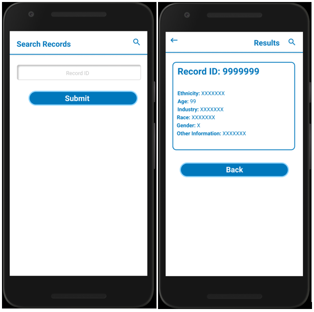


    **Hint:** How can I accomplish this? By using the Zowe CLI NPM package, you can fire Zowe APIs that submit your JCLs and get the results. From there, you can view the output and display it in your application. This article can provide a good example.

    **Hint:** What APIs am I going to use? You will use the Jobs Submit API and View Jobs Spool or View Dataset API. For more information, please visit [this site](https://docs.zowe.org/stable/web_help/index.html).

6. _(Optional)_ Create a CI/CD process that will create a nightly build of your application. [This article](https://medium.com/modern-mainframe/beginners-guide-cobol-made-easy-leveraging-open-source-tools-eb4f8dcd7a98?source=friends_link&sk=443517b1feaba8e392f5807246c25ca4) can help explain that process.

    Sample CI/CD Build using CircleCI:

    

### Craving more programming challenges?

Add more functionality to your COBOL Sub-routine like:

- Insert a new record
- Update an existing record
- Delete an existing record

I hope that by taking this challenge, you will be able to learn something new! 

Happy Coding!

_Disclaimer: This challenge is also posted in [Medium.com](https://medium.com/@jessielaine.punongbayan/zowe-cobol-challenge-the-unemployment-claims-2e35a42eabaa)._

\newpage
## Hacker News Rankings for Mainframe/COBOL Posts


We will explore the popular Hacker News website for this challenge. Hacker News is an online community started by Paul Graham for sharing "Anything that good hackers would find interesting. That includes more than hacking and startups".


### A Little Background 
The site offers a dynamic list of posts/stories, submitted by users, each of which could be expanded into its own unique comment thread. Readers can upvote or downvote links and comments, and the top thirty links are featured on the front page. Today, more than five million people read Hacker News each month, and landing a blog post on the front page is a badge of honor for many technologists.

### Our Goal
We will be working on a Hacker News 2015-2016 dataset from Kaggle with a full year’s worth of stories:  Our goal is to extract only the Mainframe/COBOL related stories and assign ranking scores to them based on (a simplified version) the published Hacker News ranking algorithm. We will create a front page report that reflects this ranking order. The algorithm works in a way that nothing stays on the front page for too long, so a story’s score will eventually drop to zero over time (the gravity effect). Since our posts are spread out over a year and as older posts will always have a lower (or zero) ranking, we will distort the data so all our stories have the same date and and consider only the times in the ranking score calculation. This will give all our posts a fair chance of landing the front page.  Our front page report is published at 11:59pm. [Here's some additional information on the ranking.](http://www.righto.com/2013/11/how-hacker-news-ranking-really-works.html)

### The Plan
 - There are different creative ways of accomplishing this but here’s our plan: We will have a COBOL program that reads the input CSV file and retrieves only the ***Mainframe/COBOL*** stories. It then calculates the ranking score for the stories by factoring in the time they were posted and the number of votes they received. Each of the records is then written to an output dataset along with the ranking score. 

 - We will then use `DFSORT` to sort the output dataset on ranking score, highest to lowest and display the posts as a simple report mimicking the front page. 
 
 Let's get started!
1. Take a look and familiarize yourself with the dataset on z/OS: `ZOS.PUBLIC.HACKER.NEWS`. This is a CSV file that serves as input to your COBOL program. The file was created by downloading [this Kaggle dataset](https://www.kaggle.com/hacker-news/hacker-news-posts), removing the lengthy `URL` column that is of no relevance to us and uploading it to z/OS. You can directly reference this DS in your JCL. Please avoid making a copy as it is fairly large with around 300,000 records.

 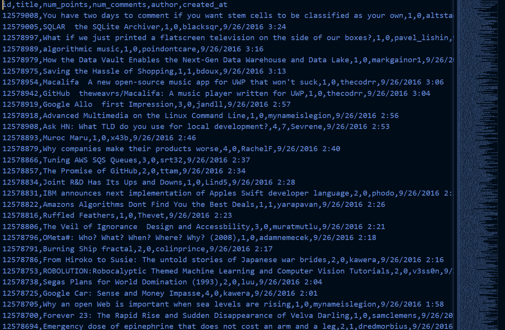
  
2.	Create your COBOL program in `<userid>.CBL` using VS Code with the Code4z extension installed and enabled – This program will :
      1. Read in each record in the input CSV file
      2. Select only the records that have mention of the words ***Mainframe*** or ***COBOL*** (ignore case) in the `Title` field
      3. Calculate the ranking score for each record based on the number of votes it received and the time it was posted (Ignore date as we assume all posts were created on the same date)
          
          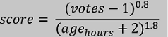
      4. Write the record to an output file along with the ranking score

      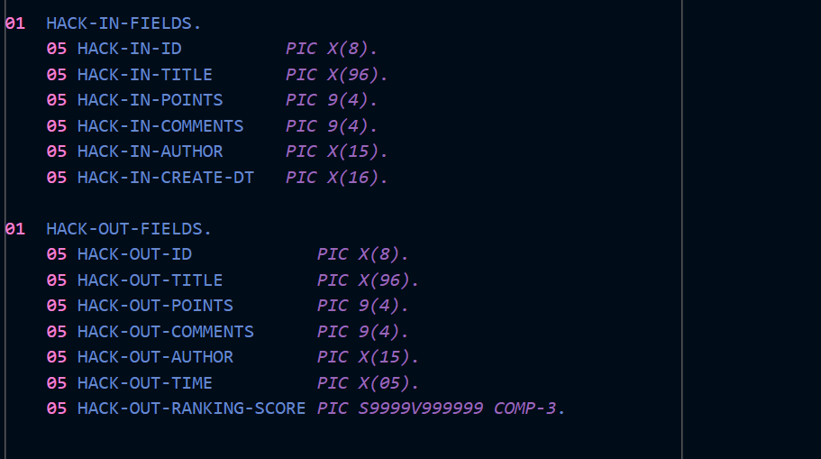
      
3. Copy/Modify/Create a JCL in `<userid>.JCL` for compiling/linking and running the program against input/output datasets.

4. Submit the job (via `Zowe Explorer` or `Zowe CLI`), debug and test to create the output dataset.

5. Next add a new step in the JCL member to run the `DFSORT` utility on the output dataset from the previous step. The sort should be done on the ranking score field, from highest to lowest. Use `DFSORT` to also print headers for our front page. As this is a new utility not covered in the course, please check out these links to explore this very powerful and versatile tool:
 
   [Getting started with DFSORT](https://www.ibm.com/support/knowledgecenter/SSLTBW_2.4.0/com.ibm.zos.v2r4.iceg200/abstract.htm)

   [Example with DFSORT](https://www.ibm.com/support/knowledgecenter/SSLTBW_2.4.0/com.ibm.zos.v2r4.icea100/ice2ca_Example_10._Sort_with_OUTFIL.htm)


6. Run and debug until the front page looks ready! Which posts ranked among the highest? Here's a look at the generated report:

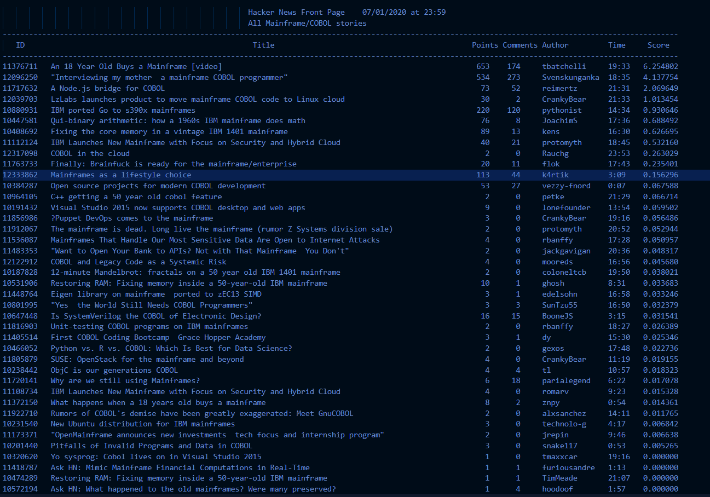


Hope you have fun working on this Challenge. Happy COBOL coding!
