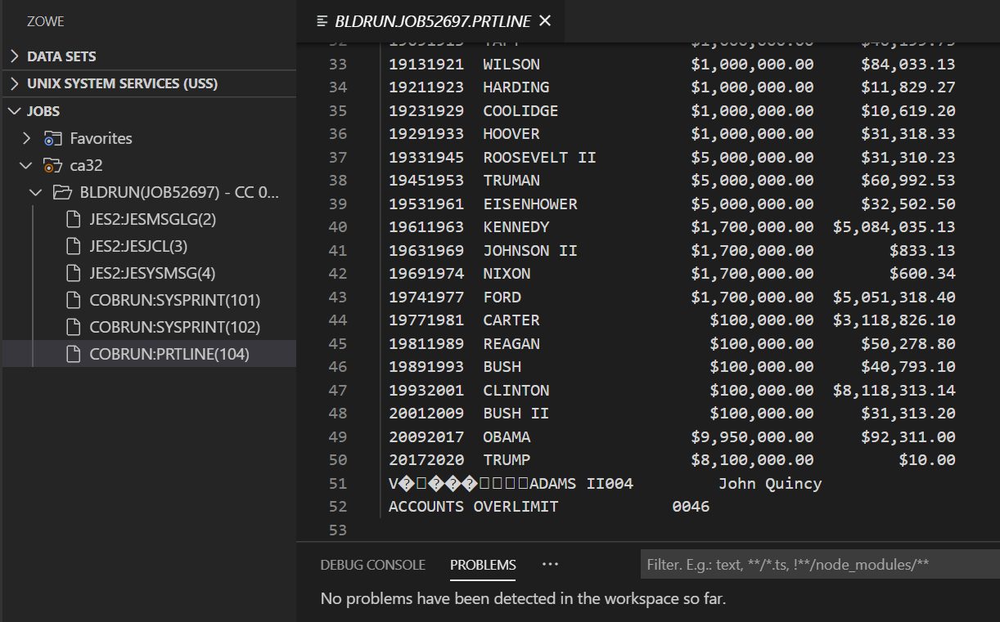
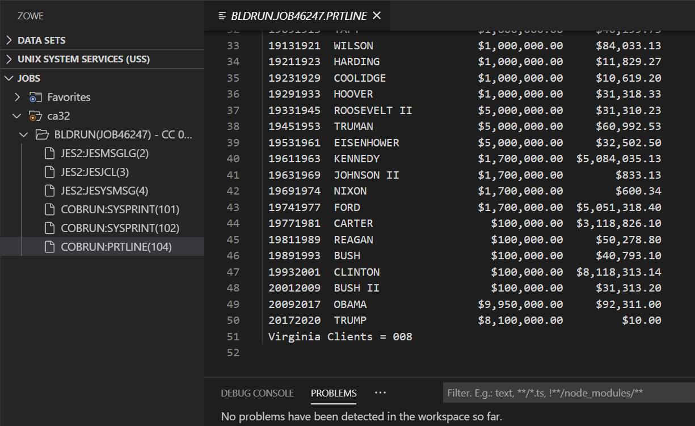

---
geometry:
- margin=1in
header-includes:
- \lstset{basicstyle=\ttfamily,
    stepnumber=2,
    numbersep=5pt,
    backgroundcolor=\color{black!10},
    showspaces=false,
    showstringspaces=false,
    showtabs=false,
    tabsize=2,
    captionpos=b,
    breaklines=true,
    breakatwhitespace=true,
    breakautoindent=true,
    linewidth=\textwidth}
- \hypersetup{colorlinks=true,
              linkcolor=blue}
---
\newpage
# COBOL Challenges

As you have now handled some basic exercises, we have prepared a new section containing more advanced exercises that test your ability to resolve bugs and other issues in COBOL programs. Each exercise will have a short description and a goal to be accomplished.

In case you get stuck, a blog with instructions will be published shortly after each exercise.

Happy Coding!

\newpage

## COBOL Challenge - Debugging

It is 2020 in Washington, D.C. John Doe runs a program which provides financial reports on US Presidents and tallies the number of reports from the state of Virginia. Everything seems OK. (see below)

John is satisfied, as he can see that everything is working as it should be. He calls it a day and goes home.

The next day, when he comes back to the office, his colleague Mari tells him “I’ve made some changes to one of your programs so that it also tallies the number of presidents who spent more than their allowed limit. Check it out.”

He runs his usual reports and sees the following:

Clearly, Mari’s changes to the program that generates the reports have broken something.

Can you fix the code to get the correct result? The new source code is named **CBL0106** and the JCL is **CBL0106J**. In case you get stuck, the solution is in the file **CBL0106C**. 

You can find them in the github repository for the COBOL course, in the subfolder **/COBOL Programming Course #2 - Advanced Topics/Challenges/Debugging**.