---
geometry:
- margin=1in
header-includes:
- \lstset{basicstyle=\ttfamily,
    stepnumber=2,
    numbersep=5pt,
    backgroundcolor=\color{black!10},
    showspaces=false,
    showstringspaces=false,
    showtabs=false,
    tabsize=2,
    captionpos=b,
    breaklines=true,
    breakatwhitespace=true,
    breakautoindent=true,
    linewidth=\textwidth}
colorlinks: true
toccolor: Blue
---
\newpage

# Why COBOL?

This chapter introduces COBOL, specifically regarding its use in enterprise systems.

- **What is COBOL?** 

- **How is COBOL being used today?**

- **What insights does the survey conducted by Open Mainframe Project's COBOL Working Group provide?**

- **Why should I care about COBOL?**

## What is COBOL?

One computer programming language was designed specifically for business, Common Business-Oriented Language, COBOL.  COBOL has been transforming and supporting business globally since its invention in 1959.  COBOL is responsible for the efficient, reliable, secure, and unseen day-to-day operation of the world's economy.  The day-to-day logic used to process our most critical data is frequently done using COBOL.

Many COBOL programs have decades of improvements which include business logic, performance, programming paradigm, and application program interfaces to transaction processors, data sources, and the Internet.

Many hundreds of programming languages were developed during the past 60 years with expectations to transform the information technology landscape.  Some of these languages, such as C, C++, Java, and JavaScript, have indeed transformed the ever-expanding information technology landscape.  However, COBOL continues to distinguish itself from other programming languages due to its inherent ability to handle vast amounts of critical data stored in the largest servers such as the IBM Z mainframe. 

Continuously updated to incorporate modernized and proven programming paradigms and best practices, COBOL will remain a critical programming language into the foreseeable future.  Learning COBOL enables you to read and understand the day-to-day operation of critical systems.  COBOL knowledge and proficiency is a required skill to be a "full-stack developer" in large enterprises.

## How is COBOL being used today?

COBOL is omnipresent, and it's highly likely that you've interacted with a COBOL application today. Let's take a look at some compelling statistics:

- Approximately 95% of ATM transactions rely on COBOL codes.
- COBOL powers 80% of face-to-face transactions.
- Each day, COBOL systems facilitate a staggering $3 trillion in commerce.

To truly grasp the extent of COBOL's prevalence, consider these mind-boggling facts:

- On a daily basis, there are 200 times more COBOL transactions executed than there are Google searches.
- Presently, there are over 250 billion lines of actively running COBOL programs, accounting for roughly 80% of the world's actively utilized code.
- Every year, approximately 1.5 billion lines of new COBOL code are written.

## What insights does the survey conducted by Open Mainframe Project's COBOL Working Group provide?

Highlights from the survey conducted by the Open Mainframe Project's COBOL Working Group in 2021 shed further light on the use of COBOL in today's era:

1. **Over 250 billion lines of COBOL are currently in production worldwide**, marking a notable increase from previous estimates. This figure indicates that COBOL's relevance is not waning; in fact, it continues to play a vital role.

   Industries with the greatest reliance on COBOL include Financial Services, Government, Software, Logistics, Retail, and Manufacturing, among others.

2. **The future of COBOL appears promising**. Despite skeptics, 58% of respondents anticipate that their COBOL applications will persist for at least the next five years. Financial services professionals, in particular, exhibit even greater optimism, with over 55% expecting COBOL to endure indefinitely.


3. **The challenge lies in the availability of COBOL skills**. Interestingly, COBOL was originally designed to be an accessible language that didn't necessitate advanced computing expertise.However, companies are worried about not having enough skilled COBOL programmers. Even though they can train their own employees, this concern shows that COBOL is still important and worth investing in.


## Why should I care about COBOL?

The COBOL programming language, COBOL compiler optimization, and COBOL run time performance have over 50 years of technology advancements that contribute to the foundation of the world's economy.  The core business logic of many large enterprises has decades of business improvement and tuning embedded in COBOL programs.

The point is - whatever you read or hear about COBOL, be very skeptical.  If you have the opportunity to work directly with someone involved in writing or maintaining critical business logic using COBOL, you will learn about the operation of the core business. Business managers, business analysts, and decision-makers come and go.  The sum of all good business decisions can frequently be found in the decades of changes implemented in COBOL programs.  The answer to "How does this business actually work?" can be found in COBOL programs.

Add the following to your awareness of COBOL.  It is an absolute myth that you must be at least 50 years old to be good with COBOL.  COBOL is incredibly easy to learn and understand.  One of the many reasons financial institutions like COBOL is the fact that it is not necessary to be a programmer to read and understand the logic.  This is important because critical business logic code is subject to audit.  Auditors are not programmers. However, auditors are responsible for ensuring the business financial statements are presented fairly.  It is COBOL processing that frequently results in the business ledger updates and subsequent financial statements.

Now for a real-world lesson.  A comment recently made in a well-known business journal by someone with a suspect agenda was quoted as saying, "COBOL is a computing language used in business and finance.  It was first designed in 1959 and is pretty old and slow."  A highly experienced business technology person knows the only true part of that last sentence was that COBOL was first designed in 1959.

It's no secret that lots of banks still run millions of lines of COBOL on mainframes.  They probably want to replace that at some point.  So why haven't they?  Most banks have been around long enough to still feel the pain from the ~1960's software crisis.  After spending enormous amounts of money, and time, on developing their computer systems, they finally ended up with a fully functional, well-tested, stable COBOL core system.

Speaking with people that have worked on such systems, nowadays they have Java front ends and wrappers which add functionality or more modern interfaces, they run the application on virtualized replicated servers, but in the end, everything runs through that single-core logic.  And that core logic is rarely touched or changed, unless necessary.

From a software engineering perspective, that even makes sense.  Rewrites are always more expensive than planned, and always take longer than planned (OK, probably not always. But often.).  Never change a running system etc., unless very good technical and business reasons exist.

\newpage

# Basic COBOL

This chapter introduces the basics of COBOL syntax. It then demonstrates how to view and run a basic COBOL program in VS Code.


- **COBOL characteristics**
     - **Enterprise COBOL**
     - **Chapter objectives**

- **What must a novice COBOL programmer know to be an experienced COBOL programmer?**
     - **What are the coding rules and the reference format?**
     - **What is the structure of COBOL?**
     - **What are COBOL reserved words?**
     - **What is a COBOL statement?**
     - **What is the meaning of a scope terminator?**
     - **What is a COBOL sentence?**
     - **What is a COBOL paragraph?**
     - **What is a COBOL section?**
     - **How to run a COBOL program on z/OS?**

- **COBOL Divisions**
     - **COBOL Divisions structure**
     - **What are the four Divisions of COBOL?**


- **PROCEDURE DIVISION explained**

- **Additional information**
     - **Professional manuals**
     - **Learn more about recent COBOL advancements**

- **Lab**

- **Lab - Zowe CLI & Automation**
    - **Zowe CLI - Interactive Usage**
    - **Zowe CLI - Programmatic Usage**


## COBOL characteristics

COBOL is an English-like computer language enabling COBOL source code to be easier to read, understand, and maintain.  Learning to program in COBOL includes knowledge of COBOL source code rules, COBOL reserved words, COBOL structure, and the ability to locate and interpret professional COBOL documentation.  These COBOL characteristics must be understood to be proficient in reading, writing, and maintaining COBOL programs.

### Enterprise COBOL

COBOL is a standard and not owned by any company or organization.  "Enterprise COBOL" is the name for the COBOL programming language compiled and executed in the IBM Z Operating System, z/OS.  COBOL details and explanations in the following chapters apply to Enterprise COBOL.

Enterprise COBOL has decades of advancements, including new functions, feature extensions, improved performance, application programming interfaces (APIs), etc. It works with modern infrastructure technologies with native support for JSON, XML, and Java®.

### Chapter objectives

The object of the chapter is to expose the reader to COBOL terminology, coding rules, and syntax while the remaining chapters include greater detail with labs for practicing what is introduced in this chapter.

## What must a novice COBOL programmer know to be an experienced COBOL programmer?

This section will provide the reader with the information needed to more thoroughly understand the questions and answers being asked in each subsequent heading.

### What are the coding rules and the reference format?

COBOL source code is column-dependent, meaning column rules are strictly enforced.   Each COBOL source code line has five areas, where each of these areas has a beginning and ending column.

COBOL source text must be written in COBOL reference format.  Reference format consists of the areas depicted in Figure  1. in a 72-character line.

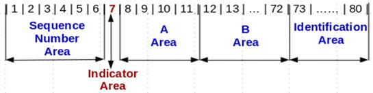

*Figure  1.  COBOL reference format*


The COBOL reference format is formatted as follows:

#### Sequence Number Area (columns 1 - 6)

- Blank or reserved for line sequence numbers.

#### Indicator Area (column 7)

- A multi-purpose area:

    - Comment line (generally an asterisk symbol)

    - Continuation line (generally a hyphen symbol)

    - Debugging line (D or d) 

    - Source listing formatting (a slash symbol)

#### Area A (columns 8 - 11)

- Certain items must begin in Area A, they are:

    - Level indicators

    - Declarative

    - Division, Section, Paragraph headers

    - Paragraph names

- Column 8 is referred to as the A Margin

#### Area B (columns 12 - 72)

- Certain items must begin in Area B, they are:

    - Entries, sentences, statements, and clauses

    - Continuation lines

- Column 12 is referred to as the B Margin

#### Identification Area (columns 73 - 80)

- Ignored by the compiler.

- Can be blank or optionally used by the programmer for any purpose.

### What is the structure of COBOL?

COBOL is a hierarchy structure consisting and in the top-down order of:

- Divisions

- Sections

- Paragraphs

- Sentences

- Statements

### What are COBOL reserved words?

COBOL programming language has many words with specific meaning to the COBOL compiler, referred to as reserved words.  These reserved words cannot be used as programmer chosen variable names or programmer chosen data type names.

A few COBOL reserved words pertinent to this book are: PERFORM, MOVE, COMPUTE, IF, THEN, ELSE, EVALUATE, PICTURE, etc.  You can find a table of all COBOL reserved words is located at:

[https://www.ibm.com/docs/en/cobol-zos/6.4?topic=appendixes-reserved-words](https://www.ibm.com/docs/en/cobol-zos/6.4?topic=appendixes-reserved-words)


### What is a COBOL statement?

Specific COBOL reserved words are used to change the execution flow based upon current conditions.  “Statements” only exist within the Procedure Division, the program processing logic.  Examples of COBOL reserved words used to change the execution flow are:

- IF

- Evaluate

- Perform

### What is the meaning of a scope terminator?

A scope terminator can be explicit or implicit.  An explicit scope terminator marks the end of certain PROCEDURE DIVISION statements with the “END-” COBOL reserved word.  Any COBOL verb that is either, always conditional (IF, EVALUATE), or has a conditional clause (COMPUTE, PERFORM, READ) will have a matching scope terminator.  An implicit scope terminator is a period (.) that ends the scope of all previous statements that have not yet been ended.

### What is a COBOL sentence?

A COBOL “Sentence” is one or more “Statements” followed by a period (.), where the period serves as a scope terminator.

### What is a COBOL paragraph?

A COBOL “Paragraph” is a user-defined or predefined name followed by a period.  A “Paragraph” consists of zero or more sentences and is the subdivision of a “Section” or “Division”, see Example 1. below.

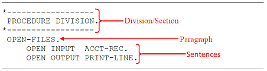

*Example 1.  Division -> paragraph -> sentences*

### What is a COBOL section?

A “Section” is either a user-defined or a predefined name followed by a period and consists of zero or more sentences.  A “Section” is a collection of paragraphs. 

### How to run a COBOL program on z/OS?

When you are dealing with COBOL on z/OS, you will encounter JCL or Job Control Language. JCL is a set of statements that tell the z/OS operating system about the tasks you want it to perform.

For your COBOL program to be executable in z/OS, you will need to tell the operating system to compile and link-edit the code before running it. All of which will be done using JCL. 

The first thing your JCL should do is compile the COBOL program you have written. In this step, your program is passed to the COBOL compiler to be processed into object code. Next, the output from the compiler will go through the link-edit step. Here a binder will take in the object code and all the necessary libraries and options specified in the JCL to create an executable program. In this step, you can also tell the JCL to include additional data sets which your COBOL program will read. Then, you can run the program.

To simplify things, Enterprise COBOL for z/OS provides three JCL procedures to compile your code. When using a JCL procedure, we can supply the variable part to cater to a specific use case. Listed below are the procedures available to you:

1. Compile procedure (IGYWC)
2. Compile and link-edit procedure (IGYWCL)
3. Compile, link-edit, and run procedure (IGYWCLG)

Since this course is a COBOL course, the JCL necessary for you to do the Labs is provided for you. Therefore, you will encounter the procedures listed above on the JCL. If you want to create a new COBOL program, you can copy one of the JCL provided and modify it accordingly.

To read more on JCL, visit the IBM Knowledge Center: 

[https://www.ibm.com/docs/en/zos-basic-skills?topic=collection-basic-jcl-concepts](https://www.ibm.com/docs/en/zos-basic-skills?topic=collection-basic-jcl-concepts)

## COBOL Divisions

This section introduces the four COBOL Divisions and briefly describes their purpose and characteristics.

### COBOL Divisions structure

Divisions are subdivided into Sections.

Sections are subdivided into Paragraphs.

Paragraphs are subdivided into Sentences.

Sentences consist of Statements.

Statements begin with COBOL reserved words and can be subdivided into “Phrases”

### What are the four Divisions of COBOL?

#### IDENTIFICATION DIVISION

The IDENTIFICATION DIVISION identifies the program with a name and, optionally, gives other identifying information, such as the Author name, program compiled date (last modified), etc.

#### ENVIRONMENT DIVISION

The ENVIRONMENT DIVISION describes the aspects of your program that depend on the computing environment, such as the computer configuration and the computer inputs and outputs.

#### DATA DIVISION

The DATA DIVISION is where characteristics of data are defined in one of the following sections:

- FILE SECTION:

   Defines data used in input-output operations.

- LINKAGE SECTION:

   Describes data from another program. When defining data developed for internal processing.

- WORKING-STORAGE SECTION:

   Storage allocated and remaining for the life of the program.

- LOCAL-STORAGE SECTION:

   Storage is allocated each time a program is called and de-allocated when the program ends.

#### PROCEDURE DIVISION

The PROCEDURE DIVISION contains instructions related to the manipulation of data and interfaces with other procedures are specified.

## PROCEDURE DIVISION explained

The PROCEDURE DIVISION is where the work gets done in the program.  Statements are in the PROCEDURE DIVISION where they are actions to be taken by the program.  The PROCEDURE DIVISION is required for data to be processed by the program.  PROCEDURE DIVISION of a program is divided into sections and paragraphs, which contain sentences and statements, as described here:

- **Section** - A logical subdivision of your processing logic. A section has a header and is optionally followed by one or more paragraphs. A section can be the subject of a PERFORM statement. One type of section is for declarative.  Declarative is a set of one or more special-purpose sections. Special purpose sections are exactly what they sound like, sections written for special purposes and may contain things like the description of inputs and outputs.  They are written at the beginning of the PROCEDURE DIVISION, the first of which is preceded by the keyword DECLARATIVES and the last of which is followed by the keyword END DECLARATIVES.

- **Paragraph** - A subdivision of a section, procedure, or program. A paragraph can be the subject of a statement.

- **Sentence** - A series of one or more COBOL statements ending with a period.

- **Statement** - An action to be taken by the program, such as adding two numbers.

- **Phrase** - A small part of a statement (i.e. subdivision), analogous to an English adjective or preposition

## Additional information

This section provides useful resources in the form of manuals and videos to assist in learning more about the basics of COBOL.

### Professional manuals

As Enterprise COBOL experience advances, the need for professional documentation is greater.  An internet search for Enterprise COBOL manuals includes: “Enterprise COBOL for z/OS documentation library - IBM”, link provided below.  The site content has tabs for each COBOL release level.  As of December 2022, the current release of Enterprise COBOL is V6.4.  Highlight the V6.4 tab, then select product documentation.

[https://www.ibm.com/support/pages/enterprise-cobol-zos-documentation-library](https://www.ibm.com/support/pages/enterprise-cobol-zos-documentation-library)


Three ‘Enterprise COBOL for z/OS” manuals are referenced throughout the chapters as sources of additional information, for reference and to advance the level of knowledge. They are:

1. Language Reference - Describes the COBOL language such as program structure, reserved words, etc. 

   [https://publibfp.dhe.ibm.com/epubs/pdf/igy6lr40.pdf](https://publibfp.dhe.ibm.com/epubs/pdf/igy6lr40.pdf)

2. Programming Guide - Describes advanced topics such as COBOL compiler options, program performance optimization, handling errors, etc.

   [https://publibfp.dhe.ibm.com/epubs/pdf/igy6pg40.pdf](https://publibfp.dhe.ibm.com/epubs/pdf/igy6pg40.pdf)

3. Messages and Codes - To better understand certain COBOL compiler messages and return codes to diagnose problems.

   [https://publibfp.dhe.ibm.com/epubs/pdf/c2746482.pdf](https://publibfp.dhe.ibm.com/epubs/pdf/c2746482.pdf)

### Learn more about recent COBOL advancements

- What’s New in Enterprise COBOL for z/OS V6.1:

   [https://www.ibm.com/support/pages/cobol-v61-was-announced-whats-new](https://www.ibm.com/support/pages/cobol-v61-was-announced-whats-new)

- What’s New in Enterprise COBOL for z/OS V6.2:

   [https://www.ibm.com/support/pages/cobol-v62-was-announced-whats-new](https://www.ibm.com/support/pages/cobol-v62-was-announced-whats-new)

- What’s New in Enterprise COBOL for z/OS V6.3:

   [https://www.ibm.com/support/pages/cobol-v63-was-announced-whats-new](https://www.ibm.com/support/pages/cobol-v63-was-announced-whats-new)

- What’s New in Enterprise COBOL for z/OS V6.4:

   [https://www.ibm.com/docs/en/cobol-zos/6.4?topic=wn-what-is-new-in-enterprise-cobol-zos-64-cobol-64-ptfs-installed](https://www.ibm.com/docs/en/cobol-zos/6.4?topic=wn-what-is-new-in-enterprise-cobol-zos-64-cobol-64-ptfs-installed)

## Lab

In this lab exercise, you will connect to an IBM Z system, view a simple COBOL hello world program in VS Code, submit JCL to compile the COBOL program, and view the output.  Refer to "Installation of VS Code and extensions" to configure VS Code if you have not already done so. You can either use IBM Z Open Editor and Zowe Explorer, or Code4z.

1. The lab assumes installation of VS Code with either IBM Z Open Editor and Zowe Explorer extensions, as shown in Figure  2a, or the Code4z extension pack, as shown in Figure  2b.

   Click the **Extensions** icon. If you installed IBM Z Open Editor and Zowe Explorer, the list should include:

   1. IBM Z Open Editor
   2. Zowe Explorer

   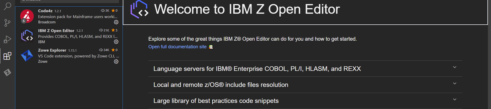

   *Figure  2a.  The IBM Z Open Editor and Zowe Explorer VS Code extensions*

   If you installed Code4z, the list should include:

   1. COBOL Language Support
   2. Zowe Explorer
   3. Explorer for Endevor
   4. HLASM Language Support
   5. Debugger for Mainframe
   6. COBOL Control Flow
   7. Abend Analyzer for Mainframe
   8. Data Editor for Mainframe

   In these exercises, you will only use the COBOL Language Support and Zowe Explorer extensions.

   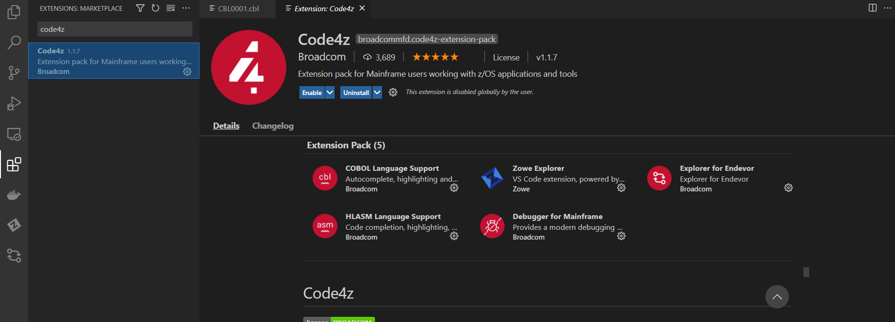

   *Figure  2b.  The Code4z package of VS Code extensions.*

   **Note:** If your list contains both Z Open Editor and COBOL Language Support, disable one of them, by clicking on the **cog** icon next to the extension in the extensions list, and selecting **disable**.

2. Click the Zowe Explorer icon as shown in Figure  3. Zowe Explorer can list Data Sets, Unix System Services (USS) files, and Jobs output. 

   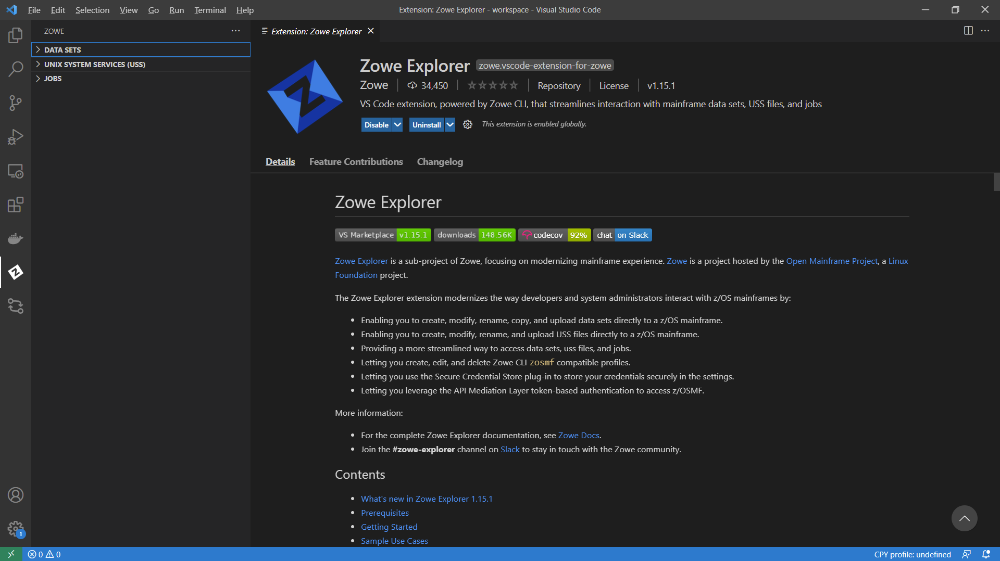

   *Figure  3.   Zowe Explorer icon*

3. In order to connect to the lab system, get your team configuration zip file and extract it. You can obtain the team configuration zip file from the [Releases section of the course's GitHub repository](https://github.com/openmainframeproject/cobol-programming-course/releases/latest).

   

   *Figure  4.  Extract the ZIP file*

4. Open the extracted folder. You will find the two configuration files as shown in Figure  5.

   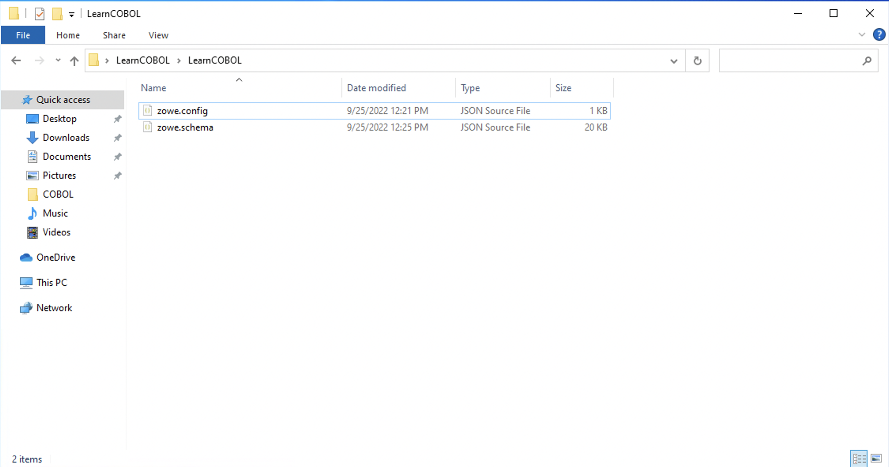

   *Figure  5.  Inside the Team configuration file*

5. Now back on your VS Code window, select the Explorer tab, and press the "Open folder" button in the left bar.

   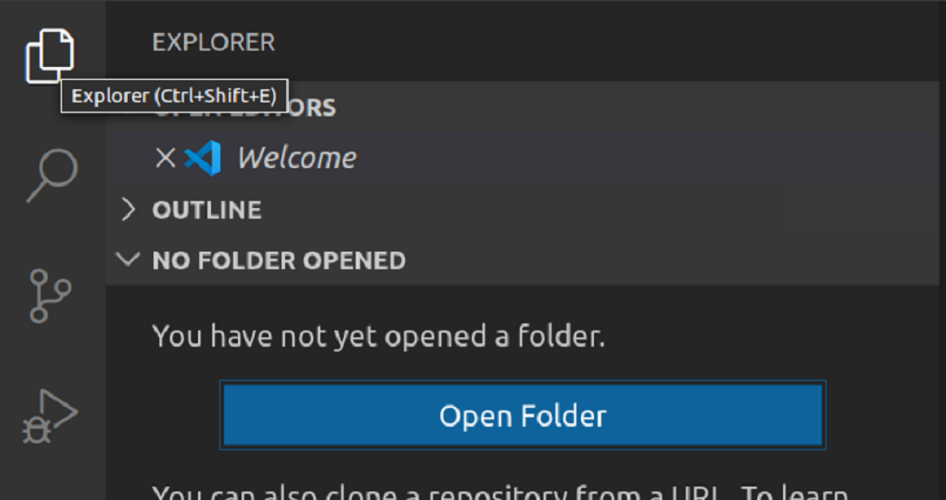

   *Figure  6.  Click the open folder button*

6. A pop-up window would show up, select the folder containing the team configuration files.

   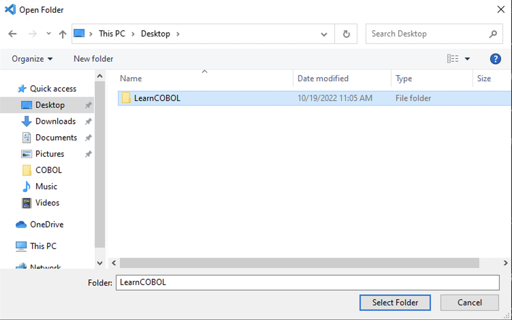

   *Figure  7a.  Select the team Configuration folder*

   If you are prompted to trust the authors of the files in the folder as shown in Figure  7b, select **Yes, I trust the authors**.

   

   *Figure  7b.  Trust the authors of files the folder*

7. Your connection should be added automatically to the Data Sets list as shown in Figure  8a.

   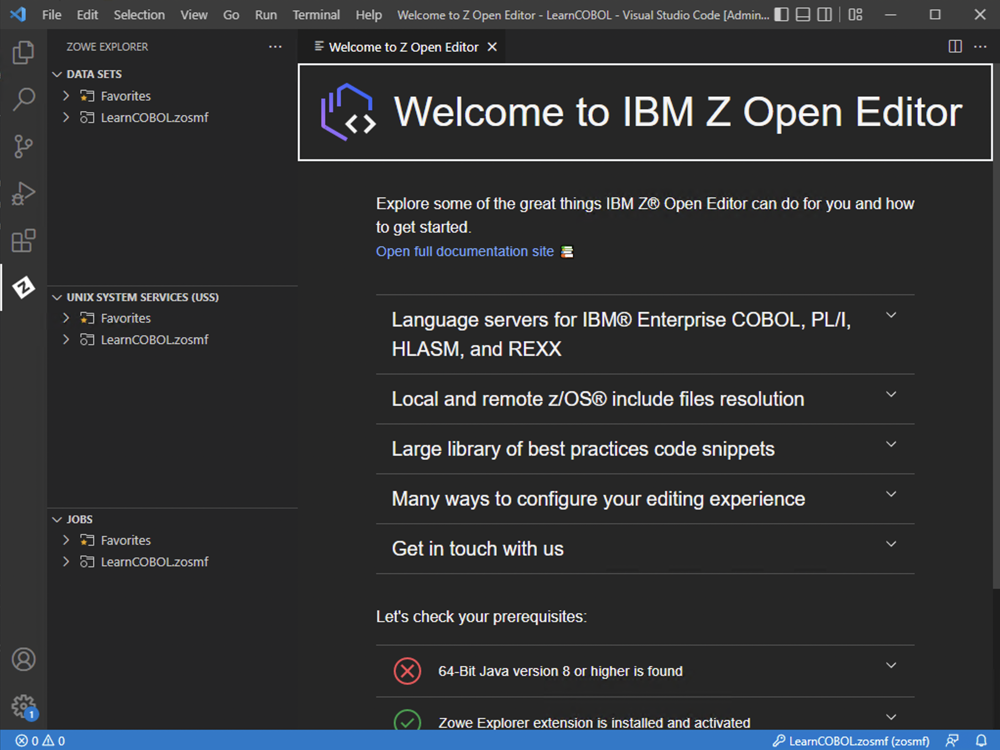

   *Figure  8a.  LearnCOBOL Connection*

   If the connection does not appear, hover to the far right of the Data Sets line and press the + icon. Afterward, select the **LearnCOBOL** connection as shown in Figure  8b.  

   

   *Figure  8b.  Adding LearnCOBOL Connection manually*

8. Press the LearnCOBOL connection.

   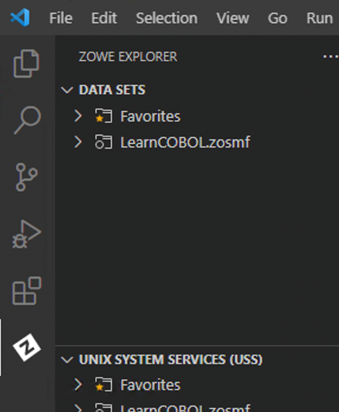

   *Figure  9.  Pressing the LearnCOBOL Connection*

9. The connection prompts for a username as shown in Figure  10.

   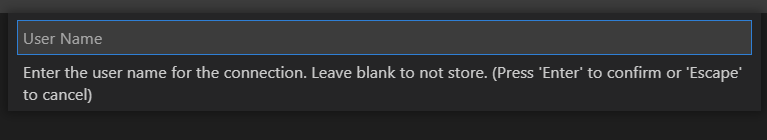

   *Figure  10.  User name prompt*

10. **Please enter the username assigned to you! Do not use the sample username of Z99998.** A sample username, is entered as shown in Figure  11.  The ID is assigned by the System Administrator.

    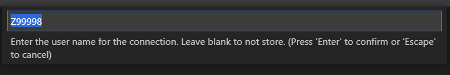

    *Figure  11.  Specified user name*

11. The connection prompts for a password as shown in Figure  12.

    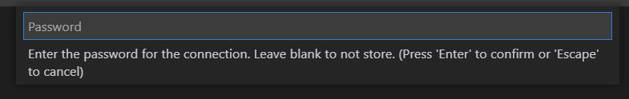

    *Figure  12.  Password prompt*

12. Enter your assigned password as shown in Figure  13.

    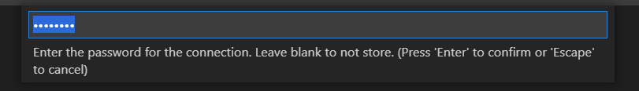

    *Figure  13.  Specified password*

13. Expanding LearnCOBOL shows “Use the search button to display datasets”. Click the magnifying glass icon as shown in Figure  14.

    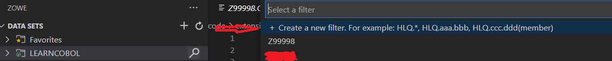

    *Figure  14.  Magnifying glass icon to set a filter*

14. A prompt to "Search Data Sets" will appear as shown in Figure  15.

    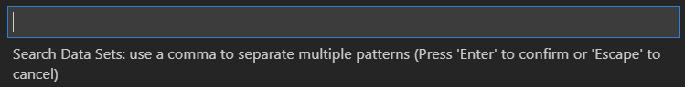

    *Figure  15. Filter name to be searched*

15. Each user has a high-level qualifier that is the same as their username. Therefore, enter your assigned username as the search criteria as shown in Figure 16. **Please enter the username assigned to you! Do not use the sample username of Z99998.**

    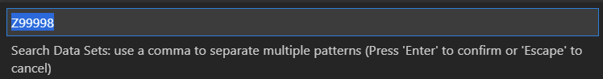

    *Figure  16. Entered filter name*

16. A list of data set names beginning with your username will appear as shown in Figure  17.

    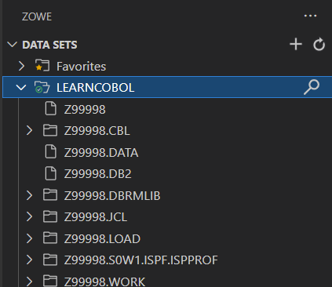

    *Figure  17. Filtered data set names*

17. Expand **`<USERNAME>.CBL`** to view COBOL source members, then select member **HELLO** to see a simple COBOL ‘Hello World!’ program as shown in Figure  18.

    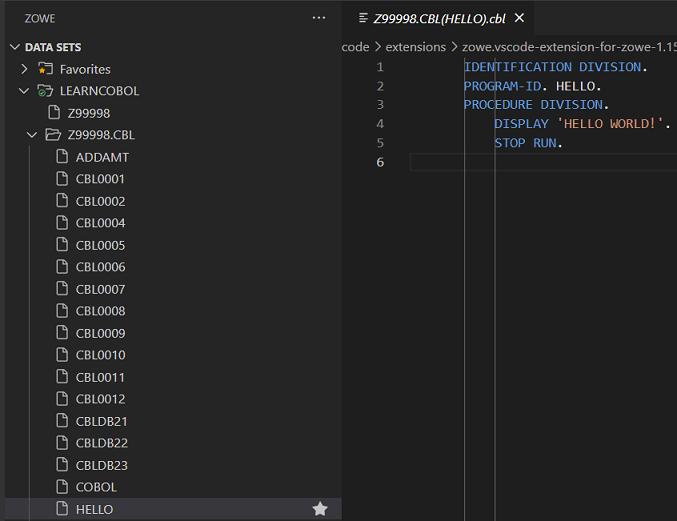

    *Figure  18.  `<USERNAME>.CBL`*

18. Expand **`<USERNAME>.JCL`** to view JCL members and select member HELLO which is the JCL used to compile and execute a simple ‘Hello World!’ COBOL source code as shown in Figure  19.

    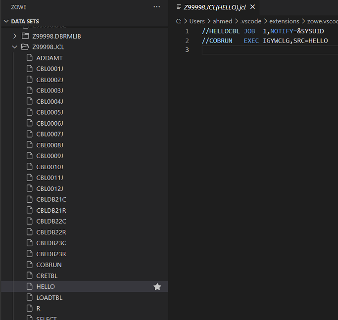

    *Figure  19.  `<USERNAME>.JCL`*

19. Right-click on JCL member **HELLO**.  A section box appears.  Select **Submit Job** for the system to process HELLO JCL as shown in Figure  20.  The submitted JCL job compiles the COBOL HELLO source code, then executes the COBOL HELLO program.

    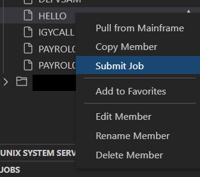

    *Figure  20.  Submit Job*

20. Observe the ‘Jobs’ section in Zowe Explorer as shown in Figure  21.

    

    *Figure  21.  JOBS section*

21. Again, click on the + to the far right on the Jobs selection.  The result is another prompt to ‘Create new’.  Select **LearnCOBOL** from the list as shown in Figure  22.

    

    *Figure  22.   Select LearnCOBOL connection*

22. As a result, the JCL jobs owned by your username appear.  HELLOCBL is the JCL job name previously submitted.  Expand **HELLOCBL** output to view sections of the output as shown in Figure  23.

    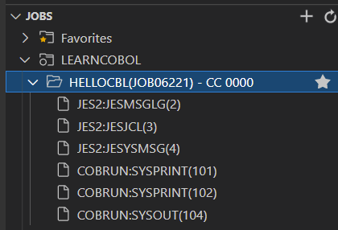

    *Figure  23.  HELLOCBL output*

23. Select **COBRUN:SYSPRINT(101)** to view the COBOL compiler output.  Scroll forward in the COBOL compile to locate the COBOL source code compiled into an executable module as shown in Figure  24.  Observe the Indicator Area in column 7, A Area beginning in column 8, and B Area beginning in column 12.  Also, observe the period (.) scope terminators in the COBOL source.

    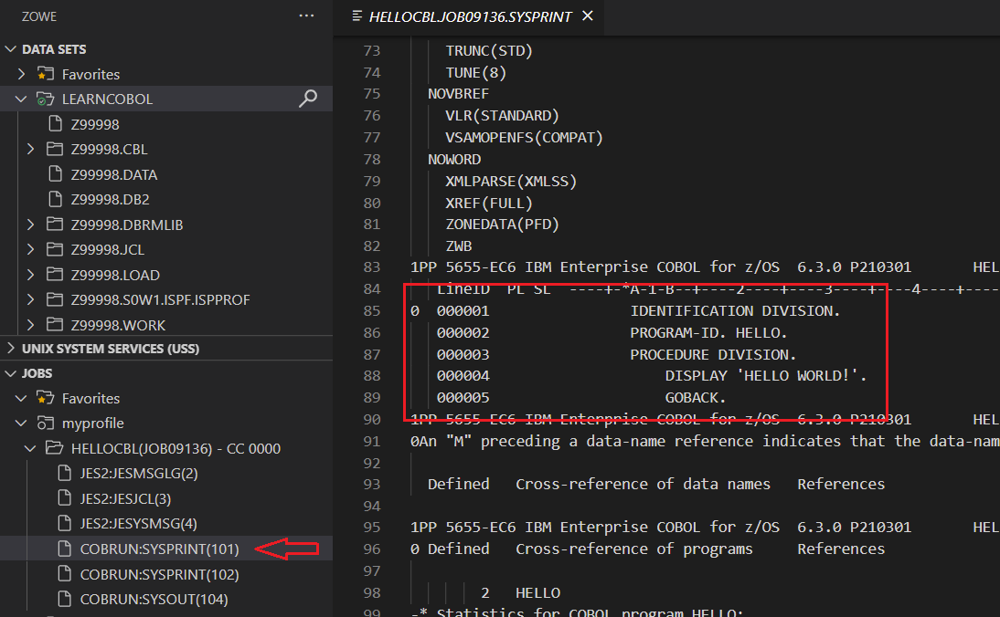

    *Figure  24.  COBOL compiler output*

24. View the COBOL program execution by selecting **COBRUN:SYSOUT(104)** from the LEARNCOBOL in the Jobs section of Zowe Explorer as shown in Figure  25.

    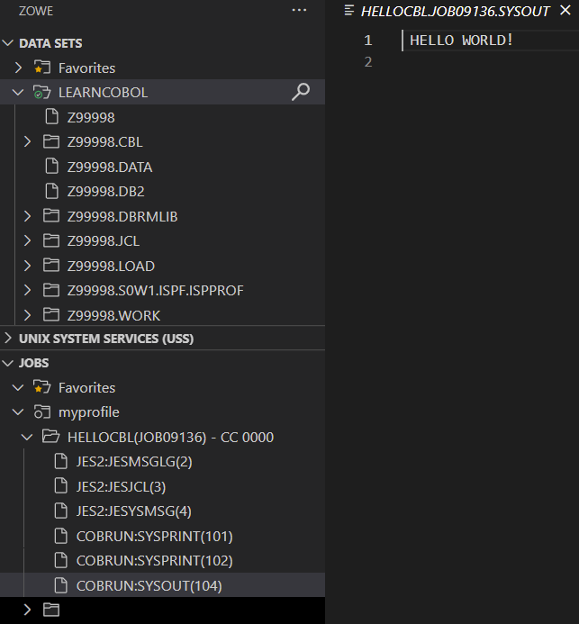

    *Figure  25.  COBOL program execution*

25.   Do note that you will need to open the **LearnCOBOL** folder every time you connect to the system, repeating step 5 to 7. To enable your connection profile to be accessible anywhere on your machine, you will need to move your configuration files (i.e. `zowe.config.json` and `zowe.schema.json`) from the LearnCOBOL folder to the Zowe global location. By default this is `C:\Users\%USERNAME%\.zowe` for Windows or `~/.zowe` for Linux and macOS.

26.   The following URL is another excellent document describing the above VS Code and Zowe Explorer details with examples:
      [https://marketplace.visualstudio.com/items?itemName=Zowe.vscode-extension-for-zowe](https://marketplace.visualstudio.com/items?itemName=Zowe.vscode-extension-for-zowe)

## Lab - Zowe CLI & Automation
In this lab exercise, you will use the Zowe CLI to automate submitting the JCL to compile, link, and run the COBOL program and downloading the spool output. Refer to the section on the "Installation of Zowe CLI and Plug-ins" to install Zowe CLI if you have not already done so. Before developing the automation, we will first leverage the Zowe CLI interactively.

### Zowe CLI - Interactive Usage
In this section, we will use the Zowe CLI interactively to view data set members, submit jobs, and review spool output.

1. Within VS Code, open the integrated terminal (Terminal -> New Terminal). In the terminal, issue `zowe --version` to confirm the Zowe CLI is installed as depicted in the following figure. If it is not installed, please refer to the section on the "Installation of Zowe CLI and Plug-ins." Also, notice that the default shell selected is `cmd`. I would recommend selecting the default shell as either `bash` or `cmd` for this lab.

   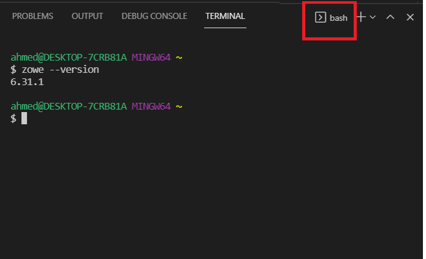

   *Figure  26.  `zowe --version` command in VS Code Integrated Terminal*

2. In order for Zowe CLI to interact with z/OSMF the CLI must know the connection details such as host, port, username, password, etc. While you could enter this information on each command, Zowe provides the ability to store this information in configuration files. 

   If you have done the configuration in the first lab, you will have a folder containing your team configuration files. Make sure that your terminal is at that location and issue the following command.

   ```
   zowe config list --locations
   ```

   The following figure demonstrates the outcome of the command.

   

   *Figure  27.  List available team config connections*

3. Confirm you can connect to z/OSMF by issuing the following command:

   ```
   zowe zosmf check status
   ```

4. List data sets under your ID by issuing a command similar to (see sample output in the following figure):

   ```
   zowe files list ds "Z99998.*"
   ```

   You can also list all members in a partitioned data set by issuing a command similar to (see sample output in the following figure):

   ```
   zowe files list am "Z99998.CBL"
   ```

   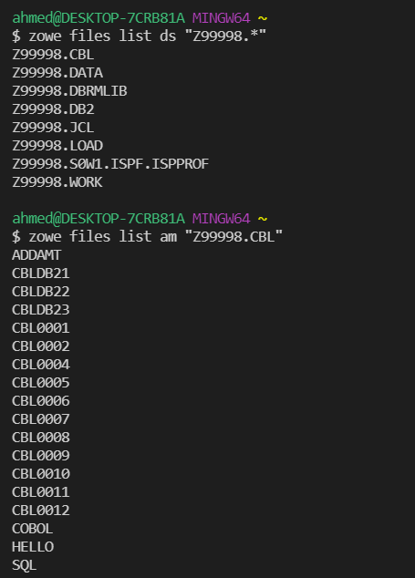

   *Figure  28.  zowe files list ds and am commands*

5. Next, we will download our COBOL and JCL data set members to our local machine. From the terminal, issue commands similar to:

   ```
   zowe files download am "Z99998.CBL" -e ".cbl"
   zowe files download am "Z99998.JCL" -e ".jcl"
   ```

   A completed example is shown in the following figure:

   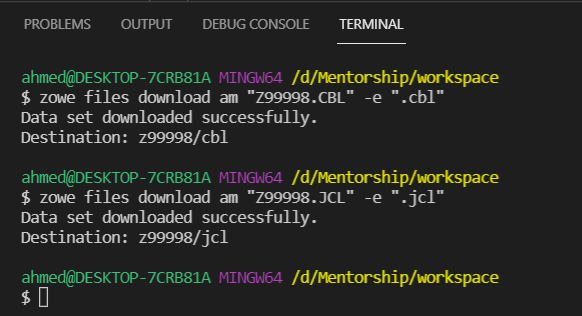

   *Figure  29.  Download and view data set members using the CLI*

6. Next, we will submit the job in member `Z99998.JCL(HELLO)`. To submit the job, wait for it to complete, and view all spool content, issue:

   ```
   zowe jobs submit ds "Z99998.JCL(HELLO)" --vasc
   ```

   We could also perform this step in piecemeal to get the output from a specific spool file. See the next figure for an example of the upcoming commands. To submit the job and wait for it to enter OUTPUT status, issue:

   ```
   zowe jobs submit ds "Z99998.JCL(HELLO)" --wfo
   ```

   To list spool files associated with this job id, issue:

   ```
   zowe jobs list sfbj JOB04064
   ```

   where `JOB04064` was returned from the previous command.
    
   To view a specific spool file (COBRUN:SYSOUT), issue:

   ```
   zowe jobs view sfbi JOB04064 105
   ```

   where `JOB04064` and `105` are obtained from the previous commands.

   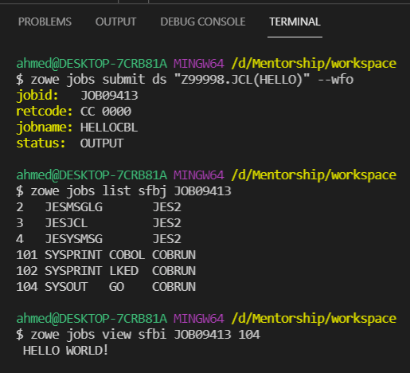

   *Figure  30.  Submit a job, wait for it to complete, then list spool files for the job, and view a specific spool file*

   If desired, you can also easily submit a job, wait for it to complete, and download the spool content using the following command (see the following figure for the completed state):

   ```
   zowe jobs submit ds "Z99998.JCL(HELLO)" -d .
   ```

   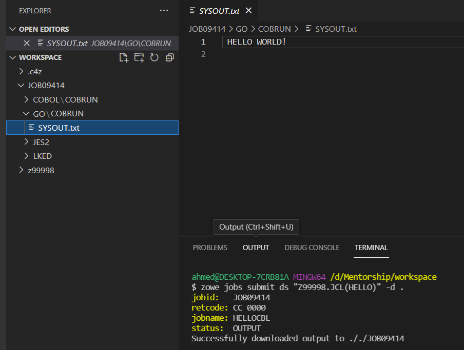

   *Figure  31.  Submit a job, wait for it to complete, download and view spool files*

   The Zowe CLI was built with scripting in mind. For example, you can use the `--rfj` flag to receive output in JSON format for easy parsing. See the next figure for an example.

   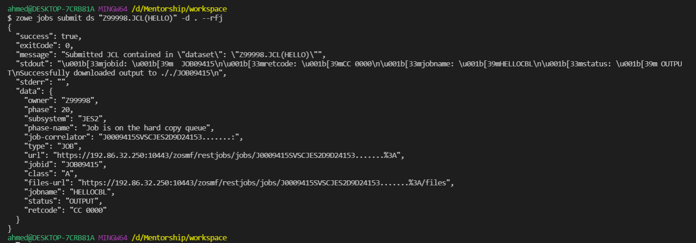

   *Figure  32.  The `--rfj` flag allows for easy programmatic usage*

### Zowe CLI - Programmatic Usage
In this section, we will leverage the Zowe CLI programmatically to automate submitting the JCL to compile, link, and run the COBOL program and downloading the spool output. Once you have the content locally you could use any number of distributed scripting and testing tools to eliminate the need to manually review the spool content itself. Historically, in Mainframe, we use REXX Exec, CLIST, etc. for automation, but today we are going to use CLI and distributed tooling.

1. Since we already have Node and npm installed, let’s just create a node project for our automation. To initialize a project, issue `npm init` in your project’s folder and follow the prompts. You can accept the defaults by just pressing enter. Only the description and author fields should be changed. See the following figure. Do note that to use the team configuration files as mentioned on previous section, this project must be a subdirectory of the **LearnCOBOL** folder.

   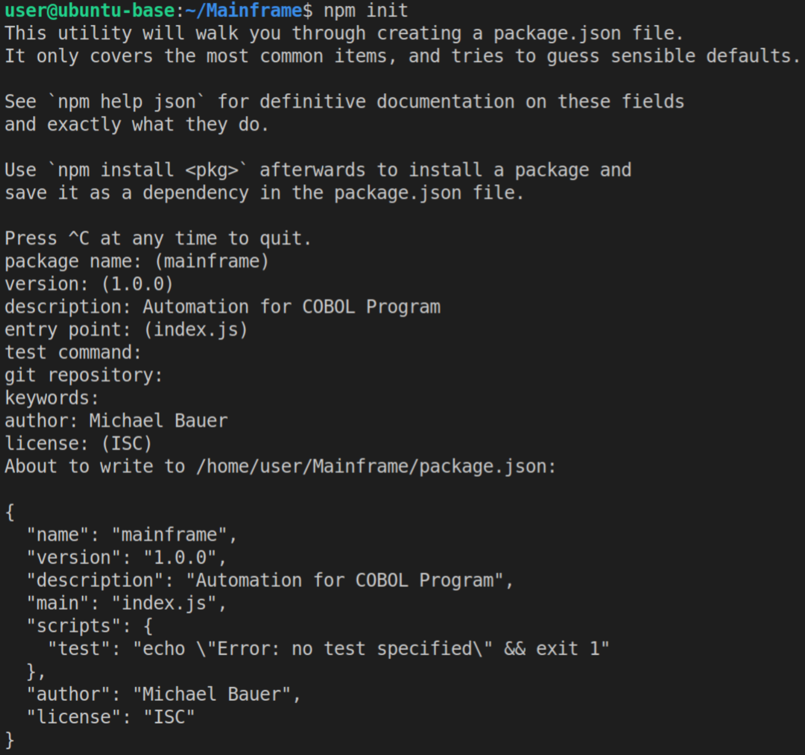

   *Figure  33.  Use of `npm init` to create `package.json` for the project*

2. Now that we have our `package.json` simply replace the `test` script with a `clg` script that runs the following zowe command (replace `Z99998` with your high-level qualifier):

   ```
   zowe jobs submit ds 'Z99998.JCL(HELLO)' -d .
   ```

   You can name the script whatever you want. I only suggested `clg` because the `CLG` in the `IGYWCLG` proc (which is what the JCL leverages) stands for compile, link, go. Now, simply issue `npm run clg` in your terminal to leverage the automation to compile, link, and run the COBOL program and download the output for review. An example of the completed `package.json` and command execution are shown in the following figure. 

   

   *Figure  34.  Final `package.json` and `npm run clg` execution*

3. If you prefer a graphical trigger, you can leverage VS Code as shown in the following figure. Essentially, the CLI enables you to quickly build your own buttons for your custom z/OS tasks. You could also invoke a script rather than a single command to accommodate more complex scenarios.

   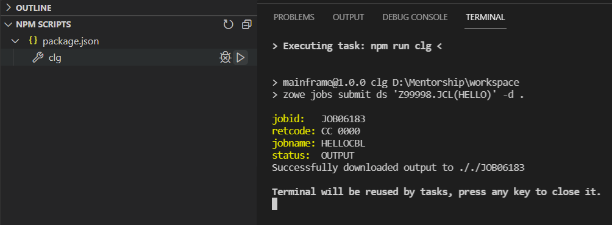

   *Figure  35.  `clg` task triggered via button*

\newpage

# Data division

Understanding COBOL variables and program processing of variables are essential to effectively learning the COBOL language.  An experienced COBOL programmer must master the characteristics of COBOL variables and the program processing using the variables introduced in this chapter.  The objective is to introduce the reader to the basics of COBOL variables while exposing the reader to the many advanced COBOL variable options.

Following this chapter is a lab available to compile and execute the COBOL source code provided later in the chapter.   Following the successful compile and execution of one provided program, a second provided COBOL program with a minor change is available to compile.  The second program has an embedded error and on compile will fail.  The failed compilation is an opportunity to identify the error associated with the significance of PICTURE clause data types associated with the operation of the COMPUTE statement (discussed in this chapter) and how to solve the error.

- **Variables / Data-items**

     - **Variable / Data-item name restrictions and data types**

- **PICTURE clause**

     - **PIC clause symbols and data types**

     - **Coding COBOL variable / data-item names**

     - **PICTURE clause character-string representation**

- **Literals**

     - **Figurative constants**

     - **Data relationships**

     - **Levels of data**

- **MOVE and COMPUTE**

- **Lab**

## Variables / Data-items

A COBOL variable, also known as a data item, is a name and is chosen by the COBOL programmer.  The named variable is coded to hold data where the data value can vary, hence the generic term 'variable'. A COBOL variable name is also known as 'Data Name'.  A COBOL variable name has restrictions. 


### Variable / Data-item name restrictions and data types

A list of COBOL variable name restrictions or rules are:

- Must not be a COBOL reserved word.

- Must not contain a space as a part of the name.

- Name contains letters (A-Z), digits (0-9), underscores (_) and hyphens (-).

- Maximum length of 30 characters.

- A hyphen cannot appear as the first or last character.

- An underscore cannot appear as the first character.

**Note**: A full list of COBOL reserved words can be found in the Enterprise COBOL Language Reference, Appendix E.

When COBOL source code is compiled into an executable program, the COBOL compiler is expecting a named COBOL variable to possess attributes such as length and data type.  During program execution, the variable represents a defined area of processing memory where the memory location has a maximum length and designated data type.

A list of the most common COBOL data types are:

- Numeric (0-9)

- Alphabetic (A-Z), (a-z), or a space

- Alphanumeric Numeric and Alphabetic Combination

## PICTURE clause

The COBOL reserved word, PICTURE (PIC), determines the length and data type of a programmer selected variable name. Data types described by PIC are commonly referred to as a picture clause or pic clause.  Some simple pic clauses are:

- PIC 9 - single numeric value where length is one

- PIC 9(4) - four numeric values where length is four

- PIC X - single alphanumeric (character) value where length is one

- PIC X(4) - four alphanumeric values where length is four

### PIC clause symbols and data types

The maximum length of a picture clause is dependent upon the data type and compiler options.  The PIC reserved word has many more data types beyond numeric (PIC 9) and alphanumeric (PIC X).  As an example, an alphabetic-only data type is defined as PIC A.  Other PIC clause symbols are:

`B E G N P S U V Z 0 / + - , . * CR DB cs`

Where cs is any valid currency symbols such as the dollar sign ($).

All PIC clause symbols are described in the [Enterprise COBOL for z/OS Language Reference manual](https://publibfp.dhe.ibm.com/epubs/pdf/igy6lr40.pdf). 


### Coding COBOL variable / data-item names

A PIC clause describes the data type of a variable/data-item name.  Coding a variable/data-item is done in the DATA DIVISION.  The COBOL code describing a variable/data-item name is accomplished using a level number and a picture clause.

- Level number - A hierarchy of fields in a record.

- Variable name / Data-item name - Assigns a name to each field to be referenced in the program and must be unique within the program.

- Picture clause - For data type checking.

Figure  1. below is an example of COBOL level numbers with respective variable/data-item names and picture clauses.

### PICTURE clause character-string representation

Some PIC clause symbols can appear only once in a PIC clause character-string, while others can appear more than once.  For example:

- PIC clause to hold value 1123.45 is coded as follows, where the V represents the decimal position.

   `PIC 9(4)V99`

- PIC clause for a value such as $1,123.45 is coded as follows:

   `PIC $9,999V99`

## Literals

A COBOL literal is a constant data value, meaning the value will not change like a variable can. The COBOL statement, `DISPLAY "HELLO WORLD!",` is a COBOL reserved word, `DISPLAY`, followed by a literal, `HELLO WORLD!`

### Figurative constants

Figurative constants are reserved words that name and refer to specific constant values. Examples of figurative constants are:

- ZERO, ZEROS, ZEROES

- SPACE, SPACES

- HIGH-VALUE, HIGH-VALUES

- LOW-VALUE, LOW-VALUES

- QUOTE, QUOTES

- NULL, NULLS

### Data relationships

The relationships among all data to be used in a program are defined in the DATA DIVISION, through a system of level indicators and level-numbers.  A level indicator, with its descriptive entry, identifies each file in a program. Level indicators represent the highest level of any data hierarchy with which they are associated.  A level-number, with its descriptive entry, indicates the properties of specific data. Level-numbers can be used to describe a data hierarchy; they can indicate that this data has a special purpose.

#### Level numbers

A structured level number hierarchic relationship is available to all DATA DIVISION sections.  Figure  1. shows the level number hierarchic relationship with programmer chosen level numbers, variable names and PIC clauses in the File Section where “01  PRINT-REC” references the following “05”-level group of variables and the “01  ACCT-FIELDS” references the following “05"-level group of variables.  Observe 05-level CLIENT-ADDR is further subdivided into several 10-level names.  COBOL code referencing the name CLIENT-ADDR includes the 10-level names.

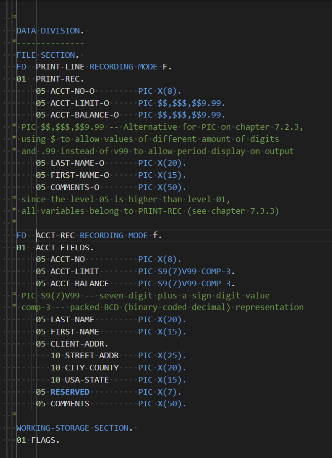

*Figure  1.  Level number hierarchic relationship*

### Levels of data

After a record is defined, it can be subdivided to provide more detailed data references as seen in Figure  1.  A level number is a one-digit or two-digit integer between 01 and 49, or one of three special level numbers: 66, 77, or 88 where the variable names are assigned attributes different from the 01-49-level numbers.  The relationship between level numbers within a group item defines the hierarchy of data within that group.  A group item includes all group and elementary items that follow it until a level number less than or equal to the level number of that group is encountered. An elementary item is an item that cannot be further subdivided. These items have a PIC clause because they reserve storage for the item.

## MOVE and COMPUTE

MOVE and COMPUTE reserved word statements alter the value of variable names.  Each MOVE shown in Figure 2 results in a literal stored in a 77-level variable name.  The COMPUTE statement, also shown in Figure  2. , stores the value of `HOURS * RATE` in `GROSS-PAY.`   All three variable names are assigned a numeric value data type using PIC 9, which is necessary for the operation of the COMPUTE statement.

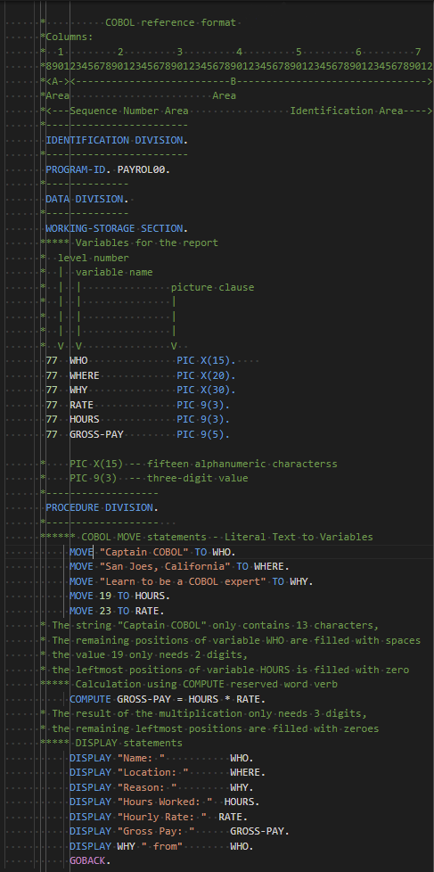

*Figure  2.  MOVE and COMPUTE example*

## Lab

**Note**: It may take a few seconds to load in all segments of this lab.  If files are not loading, hit the refresh button on the list that appears when hovering over the section bar.

1. View the PAYROL00 COBOL source code member in the 'id'.CBL data set.

2. Submit the JCL member, PAYROL00, from the id.JCL, where id is your id, dropdown. This is where id.JCL(PAYROL00) compiles and successfully executes the PAYROL00. program.

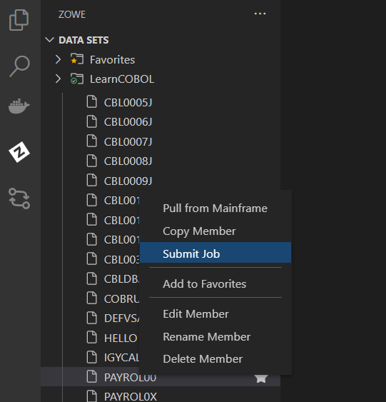

*Figure  3.  Submit PAYROL00 job*

**Note**: If you receive this error message after submitting the job:

That is because you submitted the job from the .CBL data set and not the .JCL data set.

3. View both compile and execution of PAYROL00 job output, referenced in Figure  4.

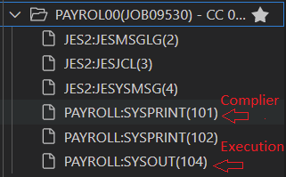

*Figure  4.  PAYROL00 output*

4. Next, view PAYROL0X COBOL source code member in id.CBL data set.

5. View and submit the JCL member, PAYROL0X, from the id.JCL dropdown. This is where id.JCL(PAYROL0X) compiles and executes the PAYROL0X program.

6. View the compile of PAYROLL0X job output, notice there is no execution output.

   Do you notice a difference between this compile and the previous job compile shown in Figure  5. ?

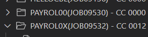

*Figure  5.  Compare job compiles*

The difference is the return/completion code associated with each job output, located both next to the job output name within the JOBS section as shown above, or at the end of the compile output as, 0Return code ##. A return code of 12 means there was an error, but how do we know what that error was? Continue to find out!

7. Find the compilation error, IGYPA3146-S, in the job output, illustrated in Figure  6.

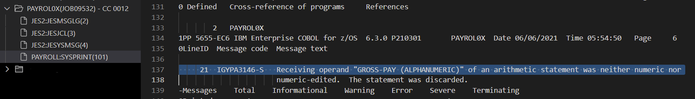

*Figure  6.  IGYPA3146-S message*

Notice that this line tells you to focus on the GROSS-PAY picture clause in order to identify the problem. Use this information, modify the PAYROL0X COBOL source code to fix the error. Be sure you are editing the correct code.

8. After modifying, re-submit the PAYROL0X JCL to verify the problem has been identified and corrected, resulting in a successful compile and execution with a return code of zero, shown in Figure  7.


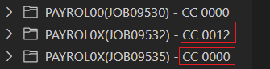

*Figure  7.  Compare return codes*

\newpage

# Table handling

This section introduces the concept of tables, which are a collection of data items that have the same description. The subordinate items are called table elements. A table is the COBOL equivalent of arrays.

The objective of this chapter is to provide information for the reader to be able to handle tables inside COBOL programs.

## Defining a table

To code a table, we need to give the table a group name and define a subordinate item which we are repeating n times.

```COBOL
01  TABLE-NAME.
    05  SUBORDINATE-NAME OCCURS n TIMES.
        10  ELEMENT1  PIC X(2).
        10  ELEMENT2  PIC 9(2).
```

In the example above, TABLE-NAME is the name of the group item. The table also contains a subordinate item called SUBORDINATE-NAME which we are repeating n times. Each SUBORDINATE-ITEM has 2 elementary items, ELEMENT1 and ELEMENT2. In this case, we called SUBORDINATE-NAME as the table element definition (since it includes the OCCURS clause). Note that the OCCURS clause cannot be used in a level-01 description.

Alternatively, we can also make simpler tables:

```COBOL
01  TABLE-NAME.
    05  SUBORDINATE OCCURS n TIMES    PIC X(10).
```

In this case, TABLE-NAME contains n SUBORDINATE items, each can contain up to 10 alphanumeric characters.

We can also nest multiple OCCURS elements to create a table of additional dimensions, up to a limit of seven dimensions. Note the example below:

```COBOL
01  PROGRAM-DETAILS.
    05  PROGRAM-DEGREE                PIC X(32).
    05  COURSE-DETAILS OCCURS 10 TIMES.
        10  COURSE-NAME               PIC X(32).
        10  INSTRUCTOR-ID             PIC 9(10).
        10  ASSIGNMENT-DETAILS OCCURS 8 TIMES.
            15  ASSIGNMENT-NAME       PIC X(32).
            15  ASSIGMMENT-WEIGHTAGE  PIC 9(03).
```

Here, we are defining a degree program that has 10 courses and each course will have 8 assignments. What if we don't know how many times a table element will occur? To solve that, we can use variable-length tables, using the OCCURS DEPENDING ON (ODO) clause which we will be going into more detail in a later section.

## Referring to an item in a table

While a table element has a collective name, the individual items within do not have a unique name. To refer to an item, we can either use subscript, index, or a combination of both.

### Subscripting

Subscripting is using the data name of the table element, along with its occurrence number (which is called a subscript). The lowest possible subscript number is 1, which defines the first occurrence of a table element. We can also use literal or data name as a subscript. Note that if you are using a data name, it must be an elementary numeric integer.

```COBOL
01  TABLE-NAME.
    05  TABLE-ELEMENT OCCURS 3 TIMES    PIC X(03) VALUE "ABC".
...
    MOVE "DEF" TO TABLE-ELEMENT (2)
```

In the above example, the second TABLE-ELEMENT will contain "DEF" instead of "ABC".

### Indexing

Alternatively, we can create an index using the INDEXED BY phrase of the OCCURS clause. This index is added to the address of the table to locate an item (as a displacement from the start of the table). For example,

```COBOL
05  TABLE-ELEMENT OCCURS 10 TIMES INDEXED BY INX-A   PIC X(03).
```

Here, INX-A is an index name. The compiler will calculate the value in the index as the occurrence number minus 1 multiplied by the length of the table element. So, for example, for the second occurrence of TABLE-ELEMENT, the binary value contained in INX-A is (2-1) * 3, or 3.

If you happen to have another table with the same number of table elements of the same length, you can use an index name as a reference for both tables.

We can also define an index data item using the USAGE IS INDEX clause. These index data items can be used with any table. For example,

```COBOL
77  INX-B  USAGE IS INDEX.
...
    SET INX-A TO 10.
    SET INX-B TO INX-A.
    PERFORM VARYING INX-A FROM 1 BY 1 UNTIL INX-A > INX-B
        DISPLAY TABLE-ELEMENT (INX-A)
        ...
    END-PERFORM.
```

The index name INX-A is used to traverse the TABLE-ELEMENT table, while INX-B is used to hold the index of the last element of the table. By doing this, we minimize the calculation of offsets and no conversion will be necessary for the UNTIL condition.

We can also increment or decrement an index name by an elementary integer data item. For example,

```COBOL
SET INX-A DOWN BY 3
```

The integer there represents the number of occurrences. So it will be converted to an index value first before it adds or subtracts the index.

Since we are comparing physical displacements, we cannot use index data items as subscripts or indexes. We can only directly use it in SEARCH and SET statements or in comparisons with indexes.

The following example shows how to calculate displacements to elements that are referenced with indexes.

Consider the following two-dimensional table, TABLE-2D:

```COBOL
01  TABLE-2D.
    05  TABLE-ROW OCCURS 2 TIMES INDEXED BY INX-A.
        10  TABLE-COL OCCURS 5 TIMES INDEXED BY INX-B  PIC X(4).
```

Suppose we code the following index:

```
TABLE-COL (INX-A + 2, INXB - 1)
```

This will cause the computation of the displacement to the TABLE-COL element:

```
(contents of INX-A) + (20 * 2) + (contents of INX-B) - (4 * 1)
```

The calculation is based on the length of the elements. Each occurrence of TABLE-ROW is 20 bytes in length (5 * 4) and each occurrence of TABLE-COL is 4 bytes in length.

## Loading a table with data

There are many ways we can load a table. The first one involves loading the table dynamically, from a screen, file, or database. We can also use the REDEFINES clause on hard-coded field values along with an OCCURS clause. The third way is using the INITIALIZE statement, and lastly, we can also use the VALUE clause when defining the table.

### Loading a table dynamically

To load a table dynamically, we need to use the PERFORM statement with either subscripting or indexing. When doing this, we need to make sure that the data does not exceed the space allocated for the table. We will discuss file handling and the use of PERFORM clause in a later chapter. For example,

```COBOL
PROCEDURE DIVISION.
    ...
    PERFORM READ-FILE.
    PERFORM VARYING SUB FROM 1 BY 1 UNTIL END-OF-FILE
        MOVE DATA TO WS-DATA(SUB)
        PERFORM READ-FILE
    END-PERFORM.
```

In this example above, we execute a paragraph that reads files, and then we will iterate through every line of the file until the end, putting each value into the table.

### REDEFINES a hard-coded values

Consider the following example,

```COBOL
WORKING-STORAGE SECTION.
01  NUMBER-VALUES.
    05  FILLER  PIC X(05) VALUE "One  "
    05  FILLER  PIC X(05) VALUE "Two  "
    05  FILLER  PIC X(05) VALUE "Three"
    05  FILLER  PIC X(05) VALUE "Four "
    05  FILLER  PIC X(05) VALUE "Five "

01  NUMBER-TABLES REDEFINES NUMBER-VALUES.
    05  WS-NUMBER  PIC X(05)  OCCURS 5 TIMES.
```

Here, we are taking hard-coded values of spelled-out numbers from 1 to 5 and loading them to a table through the use of a REDEFINES clause.

### INITIALIZE a table

We can also use the INITIALIZE statement to load data into a table. The table will be processed as a group item and each elementary data item within it will be recognized and processed. For example, assume that we have the following table:

```COBOL
01  TABLE-ONE.
    05  TABLE-ELEMENT OCCURS 10 TIMES.
        10  NUMBER-CODE   PIC 9(02) VALUE 10.
        10  ITEM-ID       PIC X(02) VALUE "R3".
```

Here we have a table that contains 10 elements, each with its own NUMBER-CODE (with a value of 10) and ITEM-ID (with a value of "R3").

We can move the value 3 to each of the elementary numeric data items and the value "X" into each of the elementary alphanumeric data items in the table:

```COBOL
INITIALIZE TABLE-ONE REPLACING NUMERIC DATA BY 3.
INITIALIZE TABLE-ONE REPLACING ALPHANUMERIC DATA BY "X".
```

After running the two INITIALIZE statements, NUMBER-CODE will contain the value of 3, while ITEM-ID will contain the value of "X ".

### Assigning values using VALUE clause

If a table is expected to contain stable values, we can set them when defining the table. Take for example, the WEEK-DAY-TABLES and TABLE-ONE on the previous sections. Both of them have assigned values when defined. Here are some more examples:

```COBOL
01  TABLE-TWO                            VALUE "1234".
    05  TABLE-TWO-DATA OCCURS 4 TIMES    PIC X.
```

In the above example, the alphanumeric group data item TABLE-TWO uses a VALUE clause which initializes each of the four elements of TABLE-TWO-DATA. So after initialization, TABLE-TWO-DATA(1) will contain the alphanumeric '1', TABLE-TWO-DATA(2) will contain the alphanumeric '2', and so on.

## Variable-length tables

If we do not know before runtime how many times a table element will occur, we can define a variable-length table using the OCCURS DEPENDING ON (ODO) clause.

```COBOL
X OCCURS 1 TO 10 TIMES DEPENDING ON Y
```

In the above example, X is the ODO subject and Y is the ODO object.

There are a couple of factors affecting the successful manipulation of variable-length records:

- Correct calculation of record lengths

Here, the length of the variable portion is the product of the object of the DEPENDING ON phrase and the length of the subject of the OCCURS clause.

- Conformance of the data in the object of the OCCURS DEPENDING ON clause to its PICTURE clause

We must ensure that the ODO object correctly specifies the number of occurrences of table elements, or the program could terminate abnormally.

The following example shows how we can use an OCCURS DEPENDING ON clause:

```COBOL
WORKING-STORAGE SECTION.
01  MAIN-AREA.
    03  REC-1.
        05  FIELD-1                       PIC 9.
        05  FIELD-2 OCCURS 1 TO 5 TIMES
            DEPENDING ON FIELD-1          PIC X(05).
01  REC-2.
    03  REC-2-DATA                        PIC X(50).
```

If we are moving REC-1 to REC-2, the length of REC-1 will be determined immediately beforehand using the current value of FIELD-1. If FIELD-1 doesn't conform to its PICTURE clause, the result is unpredictable. So, we need to ensure that the ODO object (FIELD-1) has the correct value before moving REC-1 to REC-2.

On the other hand, if we are moving to REC-1, the length is determined using the maximum number of occurrences. However, if REC-1 is followed by a variably located group, the ODO object will be used in the calculation of the actual length of REC-1. An example of such case is provided below:

```COBOL
01  MAIN-AREA.
    03  REC-1.
        05  FIELD-1                       PIC 9.
        05  FIELD-3                       PIC 9.
        05  FIELD-2 OCCURS 1 TO 5 TIMES
            DEPENDING ON FIELD-1          PIC X(05).
    03  REC-2.
        05  FIELD-4 OCCURS 1 TO 5 TIMES                         
            DEPENDING ON FIELD-3          PIC X(05).
```

So in the case above, the value of the ODO object must be set before using the group item as a receiving field.

## Searching a table

There are two techniques for searching a table: serial and binary.

A binary search can be more efficient than a serial search, however, it requires that the table items already be sorted.

### Serial search

We can do a serial search by using the SEARCH statement. The search will begin at the current index setting and will continue until the condition in the WHEN phrase is fulfilled. To modify the index setting, we can use the SET statement. If there are multiple conditions in the WHEN phrase, the search will end when one of the conditions is satisfied and the index will remain pointing to the element that satisfied the condition.

For example, assume that we have a list of names:

```COBOL
77  PEOPLE-SEARCH-DATA                PIC X(20).
01  PEOPLE-SERIAL.
    05  PEOPLE-NAME  OCCURS 50 TIMES 
        INDEXED BY PL-IDX            PIC X(20).
...
PROCEDURE-DIVISION.
    ...
    SET PL-IDX TO 1.
    SEARCH PEOPLE-NAME VARYING PL-IDX
        AT END DISPLAY "Not found"
        WHEN PEOPLE-SEARCH-DATA = PEOPLE-NAME(PL-IDX)
            DISPLAY "Found".
```

The code above will search the list of names from an index of 1. If it found the content of PEOPLE-SEARCH-DATA, it will DISPLAY "Found", otherwise, it will DISPLAY "Not found".

For a more complex use case, we can also use nested SEARCH statements. We will need to delimit each nested SEARCH statement with END-SEARCH.

### Binary search

To do a binary search, we can use a SEARCH ALL statement. We do not need to set the index, but it will use the one associated with the OCCURS clause. To use the SEARCH ALL statement, the table must specify the ASCENDING or DESCENDING KEY phrases of the OCCURS clause, or both, and it must be ordered on the specified key.

Using the WHEN phrase, you can test any key that is named in the ASCENDING or DESCENDING KEY phrases. The test must be an equal-to condition, and the WHEN phrase must specify either a key or a condition-name associated with the key.

For example, assume that we have a list of names sorted in ascending order:

```COBOL
77  PEOPLE-SEARCH-DATA                PIC X(20).
01  PEOPLE-TABLE-BINARY.
    05  PEOPLE-NAME  OCCURS 50 TIMES
        ASCENDING KEY IS PEOPLE-NAME 
        INDEXED BY PL-IDX            PIC X(20).
...
PROCEDURE-DIVISION.
    ...
    SEARCH ALL PEOPLE-NAME
        AT END DISPLAY "Not found"
        WHEN PEOPLE-SEARCH-DATA = PEOPLE-NAME(PL-IDX)
            DISPLAY "Found".
```

The code above will search the alphabetically sorted list of names. If it found the content of PEOPLE-SEARCH-DATA, it will DISPLAY "Found", otherwise, it will DISPLAY "Not found".

## Lab

**Note**: It may take a few seconds to load in all segments of this lab.  If files are not loading, hit the refresh button on the list that appears when hovering over the section bar.

1. View the SRCHSER COBOL source code member in the 'id'.CBL data set.

2. Submit the JCL member, SRCHSERJ, from the id.JCL, where id is your id, dropdown. This is where id.JCL(SRCHSERJ) compiles and successfully executes the SRCHSER program.

3. View both compile and execution of SRCHSERJ job output.

4. Next, view SRCHBIN COBOL source code member in id.CBL data set.

5. View and submit the JCL member, SRCHBINJ, from the id.JCL dropdown. This is where id.JCL(SRCHBINJ) compiles and executes the SRCHBIN program.

6. View the compile and execution of SRCHBINJ job output.

7. Compare SRCHSER with SRCHBIN. Do you notice the differences? 

   a. Observe how the tables are defined.

   b. Observe how the tables are loaded from the id.DATA data set.
   
   c. Observe the SEARCH and SEARCH ALL statements.

\newpage

# File handling

The previous chapter and lab focused on variables and moving literals into variables, then writing variable content using the COBOL DISPLAY statement.  This section introduces reading records from files into variables, moving the variables to output variables, and writing the output variables to a different file. A simple COBOL program to read each record from a file and write each record to a different file is used to illustrate the COBOL code necessary to read records from an input external data source and write records to an output external data source.

An experienced COBOL programmer can answer the question, "How does an Enterprise COBOL program read data from an input external data source and write data to an output external data source?"  The objective of this chapter is to provide enough comprehensive information for the reader to be able to answer that question.


- **COBOL code used for sequential file handling**

     - **COBOL inputs and outputs**

     - **FILE-CONTROL paragraph**

     - **COBOL external data source**

     - **Data sets, records, and fields**

     - **Blocks**

     - **ASSIGN clause**

- **PROCEDURE DIVISION sequential file handling**

     - **Open input and output for read and write**

     - **Close input and output**

- **COBOL programming techniques to read and write records sequentially**

     - **READ-NEXT-RECORD paragraph execution**

     - **READ-RECORD paragraph**

     - **WRITE-RECORD paragraph**

     - **Iterative processing of READ-NEXT-RECORD paragraph**

- **Lab**


## COBOL code used for sequential file handling

COBOL code used for sequential file handling involves:

- ENVIRONMENT DIVISION.

    - SELECT clauses

    - ASSIGN clauses

- DATA DIVISION.

    - FD statements

- PROCEDURE DIVISION.

    - OPEN statements

    - CLOSE statements

    - READ INTO statement

    - WRITE FROM statement


### COBOL inputs and outputs

The ENVIRONMENT DIVISION and DATA DIVISION describe the inputs and outputs used in the PROCEDURE DIVISION program logic.  Previous chapters introduced variable descriptions in the DATA DIVISION and literals were moved into the defined variables.  The role of the ENVIRONMENT DIVISION and more specifically, the INPUT-OUTPUT SECTION, FILE-CONTROL paragraph introduces accessing external data sources where the data from external sources are moved into defined variables.

### FILE-CONTROL paragraph

The FILE-CONTROL paragraph associates each COBOL internal file name with an external dataset name.   Within the FILE-CONTROL paragraph, the SELECT clause creates an internal file name and the ASSIGN clause creates an external dataset name.  Figure  1. shows the PRINT-LINE internal file name associated with the PRTLINE external dataset name and the ACCT-REC internal file name associated with the ACCTREC external dataset name.  The section titled Assign Clause further explains the SELECT ASSIGN TO relationship.

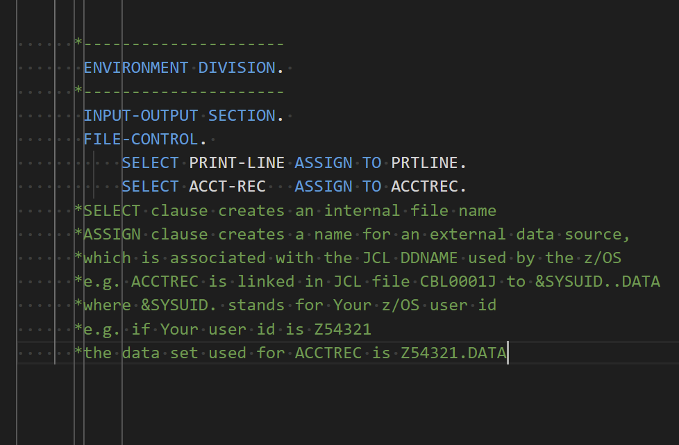

*Figure  1.  FILE-CONTROL*

 

While SELECT gives a name to an internal file and ASSIGN gives a name to the external dataset name, a COBOL program needs more information about both.  The COBOL compiler is given more information about both in the DATA DIVISION, FILE SECTION.

The COBOL reserved word 'FD' is used to give the COBOL compiler more information about internal file names in the FILE-SECTION.  The code below the FD statement is the record layout.  The record layout consists of level numbers, variable names, data types, and lengths as shown in Figure  2.

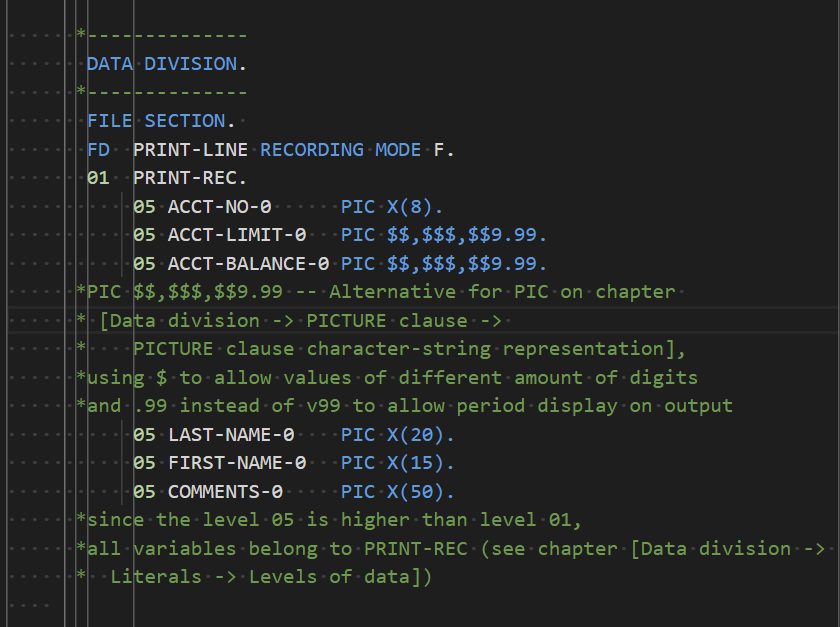

*Figure  2.  FILE-SECTION*


### COBOL external data source

Enterprise COBOL source code compiles and executes on IBM Z Mainframe hardware where z/OS is the operating system software.  z/OS stores data in both data sets and Unix files.  z/OS includes many data storage methods.  This chapter will focus on the z/OS sequential data storage method.  A sequential dataset is a collection of records.

### Data sets, records, and fields

A dataset has many records.  A record is a single line in the dataset and has a defined length.  Each record can be subdivided into fields where each field has a defined length.  Therefore, the sum of all field lengths would equal the length of the record.  Observe Figure  3.


### Blocks

Each record read by the program can result in disk storage access.   A program typically reads 1 record at a time in sequential order until all records are read.  When a record is read, the record retrieved from disk is stored in memory for program access.  When each next record read requires the need to retrieve the record from disk, system performance is impacted negatively.  Records can be blocked where a block is a group of records.  The result is when the first record is read, then an entire block of records is read into memory assuming the program will be reading the second, third, etc. records avoiding unnecessary disk retrievals and negative system performance.  The memory holding a record or block of records to be read by the program is known as a buffer.  COBOL BLOCK CONTAINS clause is available to specify the size of the block in the buffer.  Observe Figure  3.

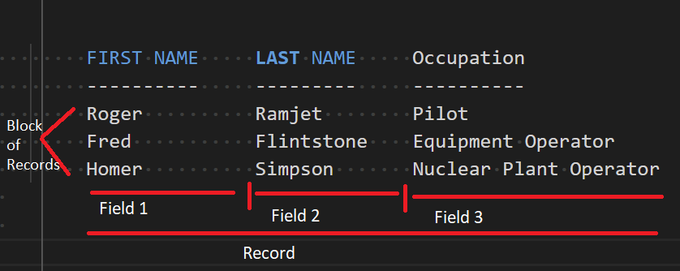

*Figure  3.  Records, fields, and blocks*

### ASSIGN clause

While the SELECT clause name is an internal file name, the ASSIGN clause name is describing a data source external to the program.  z/OS uses Job Control Language, JCL, operations to tell the system what program to load and execute followed by input and output names needed by the program. The JCL input and output names are called DDNAMEs. The JCL DDNAME statement includes a JCL DD operation where DD is an abbreviation for Data Definition. On the same DDNAME statement is the system-controlled data set name.

COBOL code “SELECT ACCT-REC ASSIGN TO ACCTREC” requires a JCL DDNAME ACCTREC with a DD redirecting ACCTREC to a z/OS controlled dataset name, MY.DATA. The COBOL program is shown in Example 1.

The purpose of the redirection of ACCT-REC, via ASSIGN TO, to JCL DDNAME, ACCTREC is flexibility.  ACCT-REC is used in the program itself, ACCTREC is a bridge to JCL, shown in Example 1. , and a DD JCL statement links ACCTREC to an actual dataset, shown in Example 2.  This flexibility allows the same COBOL program to access a different data source with a simple JCL modification avoiding requirement to change the source code to reference the alternate data source. 


```
SELECT ACCT-REC ASSIGN TO **ACCTREC**
```
*Example 1.  COBOL program*

The JCL statement required by the compiled COBOL program during execution to redirect ACCTREC to the MY.DATA z/OS controlled dataset is shown in Example 2.

```
//**ACCTREC**   DD  DSN=MY.DATA,DISP=SHR
```
*Example 2.  JCL statement*

In summary, ACCT-REC is the internal file name.  ACCTREC is the external name where a JCL DDNAME must match the COBOL ASSIGN TO ACCTREC name.  At program execution, the JCL ACCTREC DDNAME statement is redirected to the dataset name identified immediately after the JCL DD operation.

`ACCT-REC >>> ACCTREC >>> //ACCTREC  >>> DD >>> MY.DATA`

As a result, the COBOL internal ACCT-REC file name reads data records from a sequential dataset named MY.DATA.

JCL is a separate z/OS technical skill.  The introduction to COBOL explains just enough about JCL to understand how the COBOL internal file name locates the external sequential dataset name. To read more on JCL, visit the IBM Knowledge Center:

[https://www.ibm.com/docs/en/zos-basic-skills?topic=collection-basic-jcl-concepts](https://www.ibm.com/docs/en/zos-basic-skills?topic=collection-basic-jcl-concepts)


## PROCEDURE DIVISION sequential file handling

During COBOL program runtime, SELECT ASSIGN TO a JCL DDNAME is mandatory.  If the ASSIGN TO name fails to associate with a JCL DDNAME of the same spelling, at runtime, then a program runtime error occurs when the OPEN operation is attempted.  A message appears in the runtime output indicating the DDNAME was not found.  READ and WRITE are dependent upon successful completion of the OPEN operation.  The compiler cannot detect the runtime error because the compiler is unaware of the actual runtime JCL DDNAME dataset name subject to OPEN, READ, or WRITE.  The FD, File Descriptor, mapping of the data record fields requires a successful OPEN to be populated by subsequent READ or WRITE operations.


### Open input and output for read and write

COBOL inputs and outputs must be opened to connect the selected internal name to the assigned external name.  Figure  4. opens the file name ACCT-REC as program input and file name PRINT-LINE as program output.

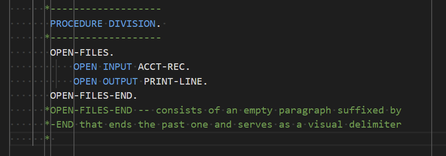

*Figure  4.  OPEN-FILES*

### Close input and output

COBOL inputs and outputs should be closed at program completion or better yet when the program is done reading from or writing to the internal file name.  Figure  5. closes the internal file name ACCT-REC and internal file name PRINT-LINE, then stops processing, STOP RUN.

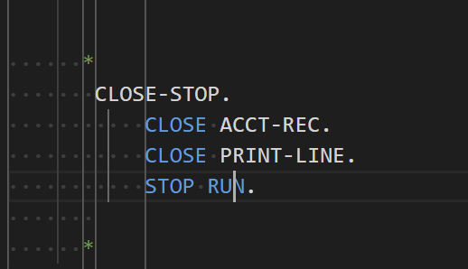

*Figure  5.  CLOSE-STOP*

## COBOL programming techniques to read and write records sequentially

When reading records, the program needs to first check for no records to be read or check for no more records to be read.  If a record exists, then the fields in the read record populate variable names defined by the FD clause.  COBOL uses a PERFORM statement for iteration.  In computer programming, iterative is used to describe a situation in which a sequence of instructions or statements can be executed multiple times. One pass through the sequence is called an iteration.  Iterative execution is also called a loop.  In other programming languages, ‘DO’ or ‘FOR’ statements are used for iterative execution.  COBOL uses a PERFORM statement for iterative execution.  Figure  6. shows four programmer chosen paragraph names in the PROCEDURE DIVISION.

- READ-NEXT-RECORD

- CLOSE-STOP

- READ-RECORD

- WRITE-RECORD

READ-NEXT-RECORD repeatedly executes READ-RECORD and WRITE-RECORD until the last record is encountered.  When the last record is encountered, then CLOSE-STOP is executed stopping the program.


*Figure  6.  Reading and writing records*

**Note:** COBOL is English-like and COBOL reserved words are English-like.  The programmer is free to use English-like variable names to help remember the purpose of the variable names.  The PROCEDURE DIVISION structure is English-like.  A paragraph contains one or more sentences.  A sentence contains one or more statements.  The implicit scope terminator, a period (.), terminates a sentence or terminates several consecutive statements which would be analogous to a compounded sentence where ‘and’ joins potentially independent sentences together. 
###


### READ-NEXT-RECORD paragraph execution

The READ-NEXT-RECORD paragraph is a COBOL programming technique used to read all records from a sequential file UNTIL the last record is read.  The paragraph contains a compounded sentence terminated by an implicit scope terminator, (.) period, on a separate line following the END-PERFORM statement.  The PERFORM UNTIL through END-PERFORM, explicit scope terminator, is repeatedly executed until the LASTREC variable contains Y.  The first PERFORM READ-RECORD results in a branch to the READ-RECORD paragraph.  Observe #1 in Figure  7.


### READ-RECORD paragraph

The READ-RECORD paragraph executes the COBOL READ statement resulting in the external sequential file populating the variables associated with ACCT-REC internal file name. If ‘AT END’ of records read, then Y is moved into the LASTREC variable.  The READ statement is terminated by an explicit scope terminator, END-READ.  The paragraph is terminated by an implicit scope terminator, (.) period.  Control is returned to the READ-NEXT-RECORD paragraph to execute the next statement, PERFORM WRITE-RECORD.

### WRITE-RECORD paragraph

The WRITE-RECORD paragraph contains several sentences terminated by an implicit scope terminator, (.) period.  The MOVE statements result in each input file variable name being moved to an output file variable name.  The last sentence in the paragraph writes the collection of output file variable names, PRINT-REC.

PRINT-REC is assigned to PRTREC.  JCL is used to execute the COBOL program.  An associated JCL PRTREC DDNAME redirects the written output to a z/OS controlled data set name, etc. using JCL DD operation on the JCL DDNAME statement.  Observe #2 in Figure  7.

### Iterative processing of READ-NEXT-RECORD paragraph

Once all statements in the WRITE-RECORD paragraph are executed, then control is returned to the READ-NEXT-RECORD paragraph where the next sentence to be executed is the second PERFORM READ-RECORD statement.

Again, the READ-RECORD paragraph executes the COBOL READ statement, resulting in the external sequential file populating the variables associated with ACCT-REC internal file name. If ‘AT END’ of records read, Y is moved into the LASTREC variable, then returns control to READ-NEXT-RECORD paragraph.  The READ-NEXT-RECORD paragraph would continue the iterative process UNTIL Y is found in the LASTREC variable.  Observe #3 in Figure  7.

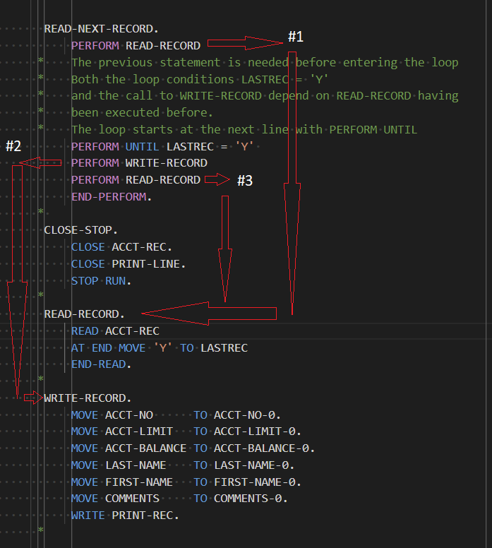

*Figure  7.  Iterative processing*


## Lab

The lab associated with this chapter demonstrates the ‘end-of-file’ COBOL coding technique for reading all data records from a sequential file. If a step has an asterisk (\*) next to it, it will have a hint associated at the end of the lab content.

1. If not already, open VS Code and select Zowe Explorer from the left sidebar.

**Note**: If you are opening a new instance of VS Code (i.e. you closed out of it after the previous usage), you may need to 'Select a filter' again. You can do so by selecting the search icon  next to your named connection in the DATA SETS section and then reselecting the filter previously used. It should be in the listed filters after you have selected the search symbol.

 

2. View these COBOL source code members listed in the id.CBL data set:

- CBL0001

- CBL0002

3. View these three JCL members in the id.JCL data set:

- CBL0001J

- CBL0002J

- CBL0003J

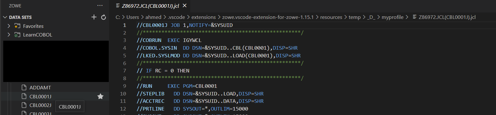

*Figure  8.  Id.JCL(CBL0001J).jcl*

4. Submit job, JCL(CBL0001J), within the DATA SET section.

5. View that job output using the JOBS section.

- COBRUN:SYSPRINT(101) - COBOL program compiler output

- RUN:PRTLINE(103) - COBOL program execution output, shown in Figure  9.

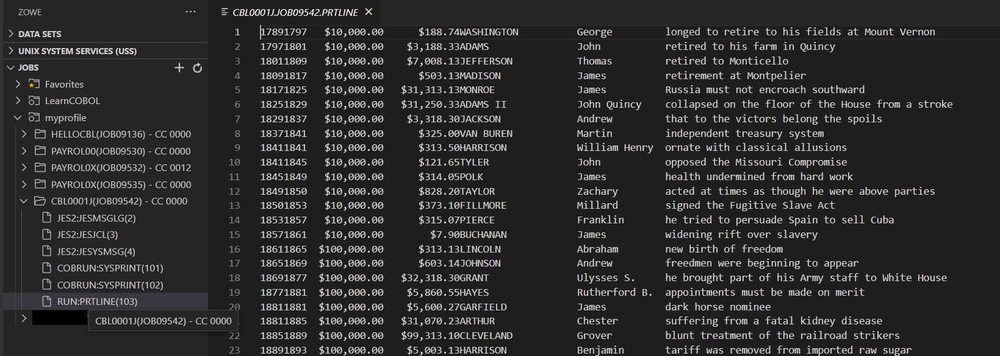

*Figure  9.  RUN:PRTLINE(103) for JCL(CBL0001J)*

 

6. Submit job, JCL(CBL0002J), within the DATA SET section.

 

7. View that job output using the JOBS section.

     - COBRUN:SYSPRINT(101) - COBOL program compiler output

     Locate COBOL compiler severe message IGYPS2121-S within the output file referred to in step 7, shown in Figure  10.

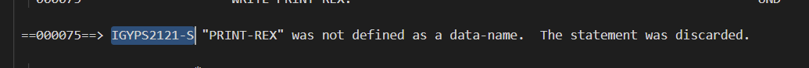

*Figure  10.  IGYPS2121-S message*


8. Edit CBL(CBL0002):

   - Determine the appropriate spelling of PRINT-REX, correct it within the source code, and save the updated source code.

 

9. Re-submit job, JCL(CBL0002J), using the DATA SET section and view the output in the JOBS section.

    - COBRUN:SYSPRINT(101) COBOL program compiler output

   - RUN:PRTLINE(103) is the COBOL program execution output (if correction is successful)

10.  Submit job, JCL(CBL0003J), using the DATA SET section.


11.  View CBL0003J ABENDU4038 output, using the JOBS section:

      - View the IGZ0035S abend message in RUN:SYSOUT(104) from the COBOL program execution output.

- IGZ0035S reads, program is unable to open or close ACCTREC file name, shown in Figure  11. guiding you to the root of the error.

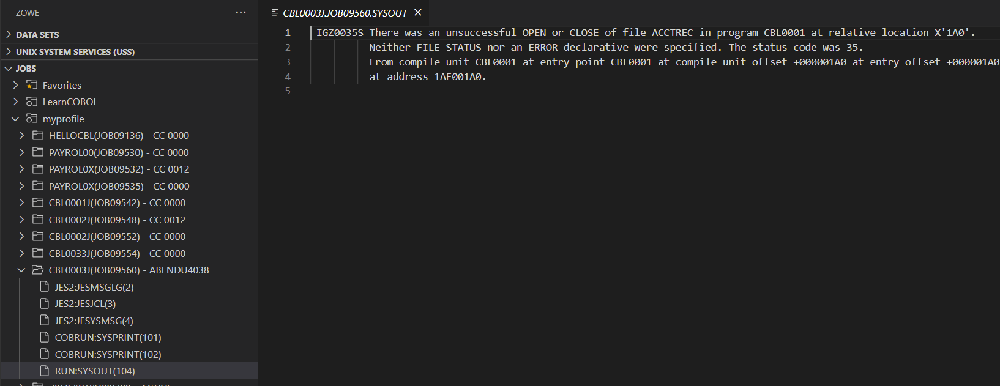

*Figure  11.  RUN:SYSOUT(104) message*

 

12.  Fix this error by editing JCL(CBL0003J):

     - Determine the DDNAME needed, but missing or misspelled. 

     - Correct it within the code and save

 

13.  Re-submit job, JCL(CBL0003J), using the DATA SET section.

 

14.  View CBL0003J output using the JOBS section, your output should look like Figure  12.

     - RUN:PRTLINE - COBOL program execution output (if correction is successful)

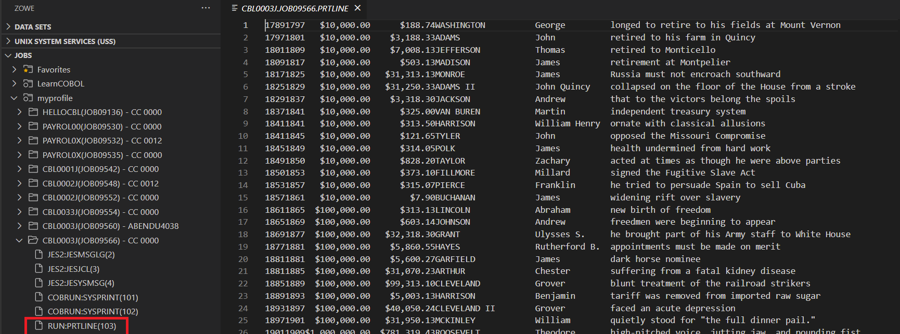

*Figure  12.  RUN:PRTLINE(103) for JCL(CBL0003J)*

**Lab hints**

13. The error is located on line 11, adjust 'ACCTREX' accordingly.

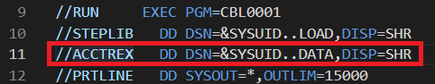

*Figure  13.  Error in id.JCL(CBL0003J).jcl*

\newpage

# Program structure


In this chapter, we discuss the concept of structured programming and how it relates to COBOL.  We highlight the key techniques within the COBOL language that allow you to write good well-structured programs.

 

- **Styles of programming**

     - **What is structured programming**

     - **What is Object Orientated Programming**

     - **COBOL programming style**

- **Structure of the Procedure Division**

     - **Program control and flow through a basic program**

     - **Inline and out of line perform statements**

     - **Using performs to code a loop**

     - **Learning bad behavior using the GO TO keyword**

- **Paragraphs as blocks of code**

     - **Designing the content of a paragraph**

     - **Order and naming of paragraphs**

- **Program control with paragraphs**

     - **PERFORM TIMES**

     - **PERFORM THROUGH**

     - **PERFORM UNTIL**

     - **PERFORM VARYING**

- **Using subprograms**

     - **Specifying the target program**

     - **Specifying program variables**

     - **Specifying the return value**

- **Using copybooks**

- **Summary**
- **Lab**


## Styles of programming

Before we discuss in more detail how to structure a program written in COBOL, it's important to understand the type of language COBOL is and how it's both different from other languages and how it affects the way you might structure your programs.


### What is structured programming

Structured programming is the name given to a set of programming styles that could include functional, procedural amongst others.  Structured programming technique results in program logic being easier to understand and maintain.  Examples of structured programming languages are C, PL/I, Python, and of course, COBOL.  These languages, given specific control flow structures such as loops, functions, and methods, allow a programmer to organize their code in a meaningful way.

Unstructured programming constructs, also known as spaghetti code, are concepts such as GOTO or JUMP which allow the flow of execution to branch wildly around the source code.  Such code like this is hard to analyze and read.  Although COBOL does contain these structures, it is important to use them sparingly and not as the backbone of well-structured code.

Well-structured code is both easy to understand and to maintain.  It is highly likely that at some point in your career you will be required to read and work from someone else's code, often a decade after it was originally written. It would be extremely helpful to you if the original author structured their code well and likewise if it is your code someone else is reading.

 

### What is Object Orientated Programming

Object Orientated Programming, or OO programming, differs from structured programming, although it borrows a lot of the same concepts.  In OO programming, code is split up into multiple classes, each representing an actor within the system.  Each class is made up of variables and a sequence of methods.  Instantiations of a class or objects can execute methods of another object.  Each class within an OO program can be considered a structured program, as it will still contain methods and iteration constructs.  However, it is the composition of the program from a set of individual classes that makes OO programming different.  It is possible to write Object Orientated COBOL; however, it is not supported by some of the middleware products that provide COBOL APIs.  It is not generally used within the market and so it is not covered in this course.


### COBOL programming style

COBOL doesn't directly have some of the components of a structured programming language as you may know them if you have studied a language like C or Java.  COBOL doesn't contain for or while loops, nor does it contain defined functions or methods.  Because COBOL is meant to be a language that is easy to read these concepts are embodied through the use of the PERFORM keyword and the concept of paragraphs.  This allows the programmer to still create these structures, but in a way, that is easy to read and follow.


## Structure of the Procedure Division

As you already know, a COBOL program is split into several divisions, including identification, environment, and data.  However, this chapter concerns itself with how you structure the content of the procedure division to be easy to read, understandable and maintainable in the future.


### Program control and flow through a basic program

Typically, execution in a COBOL program begins at the first statement within the procedure division and progresses sequentially through each line until it reaches the end of the source code.   For example, take a look at Example 1. Snippet from TOTEN1.  This is a simple program that displays a simple message counting to ten.

```COBOL
OPEN OUTPUT PRINT-LINE.

MOVE 'THE NUMBER IS: ' TO MSG-HEADER OF PRINT-REC.  

ADD 1 TO COUNTER GIVING COUNTER.
MOVE COUNTER TO MSG-TO-WRITE.
WRITE PRINT-REC.

ADD 1 TO COUNTER GIVING COUNTER.
MOVE COUNTER TO MSG-TO-WRITE.
WRITE PRINT-REC. 

...

CLOSE PRINT-LINE.
STOP RUN.
```
*Example 1.  Snippet from TOTEN1*

Although this code is very simple to read, it's not very elegant, there is a lot of code repetition as the number is increased.  Obviously, we want to provide some structure to the program.  There are three keywords that we can use to transfer control to a different section of the source code and provide the structure we need.  These keywords are PERFORM, GO TO, and CALL.


### Inline and out of line perform statements

The PERFORM keyword is a very flexible element of the COBOL language, as it allows functions and loops to be entered.  At the most basic level, a PERFORM allows control to be transferred to another section of the code.  Once this section has been executed, control returns to the following line of code.  Take the following example:


```COBOL
    OPEN OUTPUT PRINT-LINE.

    MOVE 'THE NUMBER IS: ' TO MSG-HEADER OF PRINT-REC. 

    PERFORM WRITE-NEW-RECORD.
    PERFORM WRITE-NEW-RECORD.
    PERFORM WRITE-NEW-RECORD.
    PERFORM WRITE-NEW-RECORD.
    PERFORM WRITE-NEW-RECORD.
    PERFORM WRITE-NEW-RECORD.
    PERFORM WRITE-NEW-RECORD.
    PERFORM WRITE-NEW-RECORD.
    PERFORM WRITE-NEW-RECORD.
    PERFORM WRITE-NEW-RECORD.


    CLOSE PRINT-LINE.
    STOP RUN.


WRITE-NEW-RECORD.
    ADD 1 TO COUNTER GIVING COUNTER
    MOVE COUNTER TO MSG-TO-WRITE
    WRITE PRINT-REC.
```
*Example 2.  Snippet from TOTEN2*

In this example, the three lines of code that constructed a new line of output and printed it has been extracted into a new paragraph called WRITE-NEW-RECORD.  This paragraph is then performed ten times by use of the PERFORM keyword.  Each time the PERFORM keyword is used, execution jumps to the paragraph WRITE-NEW-RECORD, executes the three lines contained within that paragraph before returning to the line following the PERFORM statement.  The concept of a paragraph will be covered later in this chapter in more depth.

### Using performs to code a loop

The code we have built so far is still not optimal, the repetition of the perform statement ten times is inelegant and can be optimized.  Observe the following snippet of code:


```COBOL
MOVE 'THE NUMBER IS: ' TO MSG-HEADER OF PRINT-REC.

PERFORM VARYING COUNTER FROM 01 BY 1 UNTIL COUNTER EQUAL 11
    MOVE COUNTER TO MSG-TO-WRITE
    WRITE PRINT-REC
END-PERFORM.

CLOSE PRINT-LINE.
STOP RUN.
```
*Example 3.  Snippet from TOTEN2*

In this example, we are using the PERFORM keyword in a way that is similar to a for loop in other languages.  The loop runs from the PERFORM keyword to the END-PERFORM keyword.  Each time execution iterates over the loop, the value of COUNTER is incremented and tested by one.  For comparison, the same loop would be written in Java like so:


```JAVA
for (int counter = 1; counter < 11; counter++) {
    System.out.println("The number is: " + counter);
}
```
*Example 4.  Java example*

Although the COBOL version is perhaps more verbose than a for loop in other languages, it is easier to read, and remember you always have autocomplete (if you are using a good editor) to help you with the typing.


### Learning bad behavior using the GO TO keyword

Programmers tend to have strong beliefs about the choice of editor, tabs, or spaces and many heated discussions have been had on such subjects.  However, if there is one thing that we can agree on, it is that use of GO TO is usually a bad idea.  To demonstrate why GO TO can be a poor idea, we will take a look at TOTEN2 again, and replace the second instance of the PERFORM keyword with a GO TO, shown in Example 5.


```COBOL
PERFORM WRITE-NEW-RECORD.
GO TO WRITE-NEW-RECORD.
PERFORM WRITE-NEW-RECORD.
```
*Example 5.  GO TO example*

If we were to compile and run the program, you would see that although the job ABENDS (abnormally ends) with a 4038-abend code, it did execute some of the code and wrote the first two lines of the output.  If you were to look at the output in more detail, you would see a message like the following:

 

```
IGZ0037S The flow of control in program TOTEN1 proceeded beyond the last line of the program.
```
*Example 6.  Abend from GO TO example*

So, what went so terribly wrong when we used the GO TO command?  To answer this, we need to understand the key difference between GO TO and PERFORM.  On the first line, we used the PERFORM keyword, that transferred control to the WRITE-NEW-RECORD paragraph.  Once the execution reached the end of that paragraph, execution returned to the line following the PERFORM statement.  The next line used the GOTO keyword to again transfer control to the WRITE-NEW-RECORD paragraph, which prints the second line of output.  However, when that paragraph was completed, execution continued to the next line following the WRITE-NEW-RECORD paragraph.  Since there are no lines of code following that paragraph the processor tried to execute code beyond the program, z/OS caught this as a problem and abended the program.


As we can see, the use of GO TO causes a branch of execution that doesn't return to the line of code that issued it.  Let's demonstrate how messy this code can get:


```COBOL
0 01  FLAG           PIC 9(1) VALUE 1.   

1  OPEN OUTPUT PRINT-LINE.
2    GO TO SAY-HELLO-WORLD DEPENDING ON FLAG.
3
4 PRINT-NEW-MESSAGE.
5    MOVE 2 TO FLAG
6    GO TO SAY-HELLO-COBOL DEPENDING ON FLAG
7    GO TO END-RUN.
8
9 SAY-HELLO-WORLD.
10    MOVE "Hello World" TO MSG-TO-WRITE
11    WRITE PRINT-REC
12    GO TO PRINT-NEW-MESSAGE.
13
14 SAY-HELLO-COBOL.
15    MOVE "Hello COBOL" TO MSG-TO-WRITE
16    WRITE PRINT-REC
17    GO TO END-RUN.
18
19 END-RUN.
20    CLOSE PRINT-LINE
21    STOP RUN.
```
*Example 7.   Messy code using GO TO*

This example is using a mix of conditional and non-conditional GO TO statements, and there are included line numbers to make following the code easier.  Line 2 executes and will branch to SAY-HELLO-WORLD on line 9 if the flag variable is set to 1.  In this case, it is, so we progress through lines 9-12 and branch to lines 4-6 where the value of the flag is updated and tested again to see if we should jump to SAY-HELLO-COBOL.  Since the value of the flag is no longer 1, the execution just continues to line 7 before jumping to line 19 and finishing the run.  Take this program and comment out line 5 and run the program again.  Track the execution of the program.  Messy right?

**Note:** Both the TO and ON parts of the conditional GO TO statement can be omitted, giving a statement that looks like GO SAY-HELLO-WORLD DEPENDING FLAG.  Which although is less verbose, is no less easy to understand.

So why teach you something that we have said is messy and not advised?  Well, by giving you some understanding of its behavior, you will be better equipped when looking through existing code and maintaining it. 


## Paragraphs as blocks of code

So far in this section, we have used a few examples of paragraphs without really explaining what they are, how they work, and what they can be used for.  This section addresses that.

The most analogous way to think about a paragraph in COBOL is to think of a function or method in another language that accepts no parameters, returns no response, and alters global variables.  It is basically a block of code that performs a sequence of actions that could be used multiple times within the same program.

A paragraph is defined within the procedure division and starts at column eight and can have any name that the user likes, apart from a COBOL keyword, and the declaration of the paragraph is completed with a period (.).  A paragraph can contain one to many COBOL sentences and is terminated either by the start of another paragraph or the physical end of the program. 


**Note:** A paragraph can also be ended by END-PROGRAM, END-METHOD, END FACTORY OR END-OBJECT.  Most of these are used within Object Orientated COBOL which is not discussed here.


Considering that a program can be made up of multiple paragraphs and that the PERFORM keyword can be used to call the paragraph, either conditionally or as part of a loop, it is easy to see that good paragraph design really helps makes your COBOL more structured and readable.

### Designing the content of a paragraph

There are no restrictions as to what content can go inside a paragraph, however, there are two main reasons why you might want to refactor code to be inside a paragraph:

1.  To group a sequence of COBOL sentences together that achieve a particular function or task, such as, open all the files that an application is using, calculate a particular function or perform some data validation.  Grouping such sentences into a paragraph allows you to give them a name that explains the purpose of the lines of code. 

2. The sequence of sentences will be used within a loop.  Extracting these lines into a paragraph and then using the PERFORM keyword to create a loop can make for very comprehensible code.

 

Remember that you can also perform other paragraphs within existing paragraphs.  This nested calling of paragraphs can again, help to structure your code. 


### Order and naming of paragraphs

There is no requirement about the order that paragraphs should appear within a COBOL program.  A paragraph can be called from a point either before or after where it is declared.  Although there are no restrictions enforced by the language, there are some techniques that you can follow that will make larger programs easier to follow and understand. Some of these techniques and best practices are:

- Name each paragraph to correspond with its function or behavior.  A paragraph named OPEN-INPUT-FILES. is a lot more understandable than one named DO-FILE-STUFF.

- Order the paragraphs in the general order in which they will be executed at runtime.  Doing this has two main advantages.  Using the outline view in a modern IDE will allow you to 'read' the name of each paragraph from top to bottom, in doing so you will be able to establish the general structure of the program and its behavior.

- Some COBOL programmers prefix the name of paragraphs with a number that increases throughout the source code as per Example 8.

- Because the paragraphs are numbered and appear in the source code in that order, when a sentence references a paragraph it is easier to know where in the program that paragraph might appear.  When initially structuring a program in this way, the numbers used would only increment the highest significant figure, allowing for new paragraphs to be inserted in between if needed.  Although the rise of modern editors, which allow outlining and instant jumping to a reference or declaration, makes this technique of less necessity, it is still useful to understand.

```COBOL
           PERFORM 1000-OPEN-FILES.
           PERFORM 2000-READ-NEXT-RECORD.
           GO TO 3000-CLOSE-STOP.
       1000-OPEN-FILES.   
           OPEN INPUT  ACCT-REC.
           OPEN OUTPUT PRINT-LINE.    
      * 
       2000-READ-NEXT-RECORD.   
           PERFORM 4000-READ-RECORD   
           PERFORM UNTIL LASTREC = 'Y'
               PERFORM 5000-WRITE-RECORD  
               PERFORM 4000-READ-RECORD   
           END-PERFORM. 
      *
       3000-CLOSE-STOP. 
           CLOSE ACCT-REC.
           CLOSE PRINT-LINE.    
           STOP RUN.
      * 
       4000-READ-RECORD.  
           READ ACCT-REC  
               AT END MOVE 'Y' TO LASTREC
           END-READ.
      * 
       5000-WRITE-RECORD. 
           MOVE ACCT-N  -    TO  ACCT-NO-O. 
           MOVE ACCT-LIMIT   TO  ACCT-LIMIT-O.    
           MOVE ACCT-BALANCE TO  ACCT-BALANCE-O.  
           MOVE LAST-NAME    TO  LAST-NAME-O.
           MOVE FIRST-NAME   TO  FIRST-NAME-O.    
           MOVE COMMENTS     TO  COMMENTS-O. 
           WRITE PRINT-REC.
```
*Example 8.  Numbered paragraphs*

- Lastly, it is common to explicitly end a paragraph by coding an empty paragraph following each paragraph, see Example 9.  This empty paragraph does not contain any code, has the same name as the paragraph it is closing, suffixed with -END, and is in turn closed by the starting of the following paragraph. But it can be used as a visual delimiter and is useful when using the PERFORM THRU keyword, which is discussed further in this chapter. Some Java programmers who have learned COBOL have commented that it is equivalent to the closing brace ("}") at the end of a block of code.

```COBOL
 1000-OPEN-FILES.   
     OPEN INPUT  ACCT-REC.
     OPEN OUTPUT PRINT-LINE.    
 1000-OPEN-FILES-END.
* 
 2000-READ-NEXT-RECORD.   
     PERFORM 4000-READ-RECORD   
     PERFORM UNTIL LASTREC = 'Y'
         PERFORM 5000-WRITE-RECORD
         PERFORM 4000-READ-RECORD
     END-PERFORM.
 2000-READ-NEXT-RECORD-END.   
```
*Example 9.  Explicitly closed paragraphs*


## Program control with paragraphs

So far in this chapter, we have discussed the importance of using paragraphs to structure your code.  In doing this, we have used the PERFORM keyword a few times to execute the paragraphs we had created.  Specifically, we used the keyword by itself and used it with the VARYING keyword to construct a loop.  In this section, we will discuss in more detail how the PERFORM keyword can be used.

### PERFORM TIMES

Perhaps the simplest way of repeating a perform statement is to use the TIMES keyword to perform a paragraph or sections of code a static number of times, shown in Example 10.   

```COBOL
 PERFORM 10 TIMES
     MOVE FIELD-A TO FIELD-B
     WRITE RECORD
 END-PERFORM.
```
*Example 10.  TIMES*

The required number of times that the code should be executed can either be a literal, as above, or the value of a numeric variable as shown in Example 11. where the PERFORM keyword is being used to execute a paragraph.

```COBOL
 PERFORM MY-NEW-PARAGRAPH COUNTER TIMES.
```
*Example 11.  TIMES 2*


### PERFORM THROUGH

You may require a sequential list of paragraphs to be executed in turn, instead of performing them individually.  The THROUGH or THRU keyword can be used to list the start and end paragraphs of the list.  Execution will progress through each of the paragraphs as they appear in the source code, from beginning to end, before returning to the line following the initial perform statement, observe Example 12.


```COBOL
 1000-PARAGRAPH-A.   
     PERFORM 2000-PARAGRAPH-B THRU
             3000-PARAGRAPH-C.
* 
 2000-PARAGRAPH-B.
     ...
*
 3000-PARAGRAPH-C.
     ...
*
 4000-PARAGRAPH-D.
     ...
```
*Example 12.  PERFORM THRU*


**Note:** The use of the THRU keyword can also be used alongside the TIMES, UNTIL and VARYING keywords, to allow the list of paragraphs to be executed rather than just a single paragraph or blocks of code.

### PERFORM UNTIL

Adding the UNTIL keyword to a perform sentence allows you to iterate over a group of sentences until the Boolean condition is met.  Effectively allowing you to program while loops in COBOL, take this basic example:


```COBOL
 MOVE 0 TO COUNTER.
 PERFORM UNTIL COUNTER = 10
     ADD 1 TO COUNTER GIVING COUNTER
     MOVE COUNTER TO MSG-TO-WRITE
     WRITE PRINT-REC
 END-PERFORM.
```
*Example 13.  PERFORM UNTIL*

This would be equivalent to the Java code:

```JAVA
int counter = 0;
while (counter != 10) {
    counter++;
    System.out.println("The number is: " + counter);
}
```
*Example 14.  Java while loop*

In this case, the Boolean condition is evaluated before the loop is executed.  However, if you wish for the loop to be executed at least once before the condition is evaluated, you can alter the sentence to read:


```COBOL
 PERFORM WITH TEST AFTER UNTIL COUNTER = 10
     ADD 1 TO COUNTER GIVING COUNTER
     MOVE COUNTER TO MSG-TO-WRITE
     WRITE PRINT-REC
 END-PERFORM.
```
*Example 15.  PERFORM WITH TEST AFTER UNTIL*

This would be similar to a "do while" loop in Java:

```JAVA
int counter = 0;
do {
    counter++;
    System.out.println("The number is: " + counter);
} while (counter != 10);
```
*Example 16.  Java while loop*


### PERFORM VARYING

We've already used the VARYING keyword earlier in the section titled Using performs to code a loop, recall:

```COBOL
PERFORM VARYING COUNTER FROM 01 BY 1 UNTIL COUNTER EQUAL 11
...
END-PERFORM.
```
*Example 17.  Basic loop*

In this example, the variable counter is tested to see if it equals 11, as long as it doesn't then it is incremented, and the statements nested within the perform statement are executed.  This construct can be extended, exemplified in Example 18. However, in this example, we can only execute paragraphs instead of nested statements.


```COBOL
PERFORM 1000-PARAGRAPH-A
    VARYING COUNTER FROM 01 BY 1 UNTIL COUNTER EQUAL 11
    AFTER COUNTER-2 FROM 01 BY 1 UNTIL COUNTER-2 EQUAL 5.
```
*Example 18.  Extended loop*

This may seem complex, but compare it to this Java pseudo-code:

```JAVA
for (int counter = 1; counter < 11; counter++) {
    for (int counter2 = 1; counter2 < 5; counter2++) {
        paragraphA();
    }
}
```
*Example 19.  Java extended loop*


This is really, just two for loops nested within each other.  This construct is very useful when iterating over tables or nested record structures.  As for each loop of the outer varying loop, the inner loop will be executed five times.  As mentioned previously, the test of the condition will be assumed by COBOL to be at the beginning of the loop, however, it can be specified to be evaluated at the end of the loop by adding the phrase WITH TEST AFTER to the initial perform sentence.


## Using subprograms

So far, we have only examined the internal structure of a single COBOL program.  As programs increase in function and number, it is common that a programmer might want certain aspects of a program function to be made available to other programs within the system.  Abstracting generic functions into their own program and allowing them to be called from other programs can reduce the amount of code duplication within a system and therefore decrease the cost of maintenance, as fixes to shared modules only need to be made once. 


**Note:** Although here we will describe the COBOL native way of calling another program, note that some middleware products will provide APIs that might do this in an enhanced way.


When calling another program, we need to consider three main concerns: how we will reference the program we wish to call, the parameters we want to send to the target program, and the parameter that we wish the target program to return.


### Specifying the target program

To call a target program we will use the keyword CALL followed by a reference to the target program we wish to call.  The two main ways to do this are by a literal value or by referencing a variable, shown in Example 20.


```COBOL
CALL 'PROGA1' ...
...
MOVE 'PROGA2' TO PROGRAM-NAME.
CALL PROGRAM-NAME ...
```
*Example 20.  Basic CALL*

It is also possible to reference the target platform by passing a pointer reference to the target program.  If you thought that passing a pointer reference to a function was only something that ultra-modern languages had, nope COBOL got there first!


### Specifying program variables

Now that we have identified the name of the program we wish to call; we must identify the variables that the calling program might want to send.  These are individually specified by the USING keyword.  COBOL provides support to both pass by reference and pass by copy, as well as a pass by value concept.  Each of the supported passing techniques can be applied to all the data items being passed or used selectively against different items.  

By default, COBOL will pass data items by reference.  This means that both the calling and target program will be able to read and write to the same area of memory that is represented by the variable.  This means that if the target program updates the content of the variable, that change will be visible to the calling program once execution has returned.


The BY CONTENT phrase allows a copy of the passed variable to be passed to the target program.  Although the target program can update the variable, those updates will not be visible to the calling program.

 

**Note:** When passing variables either BY REFERENCE or BY CONTENT, note you can send data items of any level.  This means you can pass entire data structures, handy for dealing with common records.

 

You might also see the phrase, BY VALUE, being used in a CALL sentence.  BY VALUE is similar to BY CONTENT, as a copy of the content of the variable is passed.  The difference is that only a subset of COBOL data types are supported and you can only specify elementary data items.  This is because BY VALUE is primarily used when COBOL is calling a program of another language (such as C).


### Specifying the return value

Finally, the RETURNING phrase is used to specify the variable that should be used to store the return value.  This can be any elementary data item declared within the data division.  Note that this is optional.  Some programs might not return anything, or you might have passed values BY REFERENCE to the target program in which case updates to those variables will be visible once the target program returns.

## Using copybooks

If your program contains frequently used code sequences, we can write the code sequence once and put them in a COBOL copy library. These code sequences are referred to as copybooks. Then, we can use the COPY statement to retrieve these code sequences and include them during compile time. Using copybooks in this manner will eliminate repetitive coding.

We would need to specify a copy library in the JCL we used. If you are using the provided procedure (IGYWC, IGYWCL, or IGYWCLG), you can supply a DD statement to the SYSLIB parameter of the COBOL step inside the procedure. For example:

```
//COBOL.SYSLIB  DD  DISP=SHR,DSN=Z99998.COPYLIB
```
*Example 21. JCL SYSLIB statement*

This will tell the compiler to look for the copybooks on the supplied dataset.

Let us take a look at an example of how we can use the COPY statement in a program.

Assume that a copybook with the name of DOWORK is stored and contains the following statement:
```COBOL
COMPUTE SPACE-AVAILABLE = TOTAL-FREE-SPACE
MOVE SPACE-AVAILABLE TO PRINT-SPACE
```
*Example 22.  Content of DOWORK copybook*

We can retrieve the copybook by utilizing the COPY statement:
```COBOL
PROCEDURE DIVISION.
...
    DISPLAY "RETRIEVE COPYBOOK".
    COPY DOWORK.
```
*Example 23.  Basic COPY*

The statements inside the DOWORK procedure will then follows the DISPLAY statement. 

Unlike subprograms, using copybooks does not transfer control over to another program. But the code written inside the copybooks will only be transferred once during compilation. So further changes to the copybooks will require a recompilation of the program.

On the other hand, the code inside a subprogram will only be invoked during the execution of the program. Therefore, assuming that the subprogram is linked dynamically, we can change it without needing to recompile the calling program. 

## Summary

In summary, this chapter should provide the necessary foundation to understand structured programming and how it relates to COBOL and its importance to understanding and maintaining code.  Many examples of how, when, and why to implement key techniques have been provided and explained for further understanding.  You should be able to identify the basic differences between structured programming (COBOL) and OO programming (Java).  You should also understand the general concept of the best practices in the structure of the Procedure Division with reference to the design and content of paragraphs, program control options, and ways to call other programs within the same system.


## Lab

This lab utilizes COBOL program CBL0033, located within your id.CBL data set, as well as JCL job CBL0033J, located within your id.JCL data set.  The JCL jobs are used to compile and execute the COBOL programs, as discussed in previous chapters.

#### Using VS Code and Zowe Explorer

1. Take a moment and look over the source code of the COBOL program provided: CBL0033. 

2. Compare CBL0033 with CBL0001 and CBL0002 from the previous lab. Do you notice the differences? 

   a. Observe the new COUNTER line within the WORKING-STORAGE > DATA DIVISION.

   b. Observe the paragraphs are numerated and they are all explicitly ended by a -END sentence.

   b. Observe the new paragraphs READ-FIRST-RECORD, READ-TEN-RECORDS, READ-ANOTHER-RECORD, READ-NEXT-RECORDS, and CALLING-SUBPROGRAM within the PROCEDURE DIVISION.

   c. These paragraphs perform the same loop as in CBL0001 but using the PERFORM statement in different ways. The CALLING-SUBPROGRAM calls the HELLO program, already presented in the second Lab of this course.

3. Submit job: CBL0033J. This JCL first compiles the program HELLO,
then compiles CBL0033 and links the result of both compilations
together. 

4. View CBL0033J output using the JOBS section and open RUN:PRTLINE, observe the report is identical to CBL0001.

5. View the output of the target program HELLO using the JOBS section and open RUN:SYSOUT. 

\newpage

# File output

Designing a structured layout that is easy to read and understand is required to format output.  Designing a structured layout involves column headings and variable alignment using spaces, numeric format, currency format, etc.  This chapter aims to explain this concept utilizing example COBOL code to design column headings and align data names under such headings. At the end of the chapter, you are asked to complete a lab that practices the implementation of the components covered.

A capability of COBOL data output formatting that is worth noting but not covered in this chapter is that COBOL is a web-enabled computer language.  COBOL includes an easy and quick transformation of existing COBOL code to write JSON (JavaScript Object Notation) where the output is subsequently formatted for a browser, a smartphone, etc. Frequently, the critical data accessed by a smartphone, such as a bank balance, is stored and controlled by z/OS where a COBOL program is responsible for retrieving and returning the bank balance to the smartphone.

- **Review of COBOL write output process**

     - **ENVIRONMENT DIVISION**

- **FILE DESCRIPTOR**

     - **FILLER**

- **Report and column headers**

     - **HEADER-2**

- **PROCEDURE DIVISION**

     - **MOVE sentence**

     - **PRINT-REC FROM sentences**

- **Lab**

## Review of COBOL write output process

This section briefly reviews certain aspects of the ENVIRONMENT DIVISION for the purpose of understanding how it ties together with the content of this chapter.


### ENVIRONMENT DIVISION

The "File handling" section covered the SELECT and respective ASSIGN programmer chosen names, whereas this chapter focuses on output.  Figure  1. shows a coding example using PRINT-LINE as the programmer chosen COBOL internal file name for output.

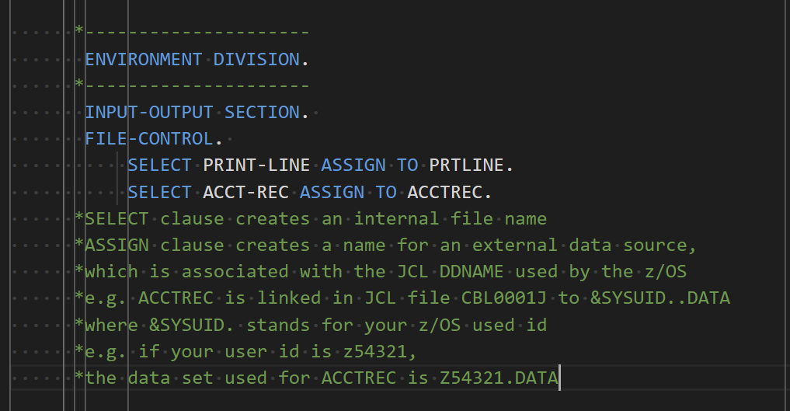

*Figure  1.  SELECT and ASSIGN*

## FILE DESCRIPTOR

The File Description (FD), previously described under the FILE-CONTROL paragraph section, entry represents the highest level of organization in the FILE SECTION.  The FD entry describes the layout of the file defined by a previous FILE-CONTROL SELECT statement.  Therefore, the FD entry connects the SELECT file name with a defined layout of the file name.  An example file descriptor, FD, for PRINT-LINE is shown in Figure  2.  What follows the file descriptor is a defined layout of PRINT-LINE. 

### FILLER

Observe the data name FILLER.  While most data fields have unique names, FILLER is a COBOL reserved word data name, that is useful for output formatting.  This is in part because FILLER allocates memory space without the need for a name.  Also, FILLER allocated memory has a defined length in the output line and may contain spaces or any literal.  Figure  2. shows multiple VALUE SPACES for FILLER.  SPACES create white space between data items in the output which is valuable in keeping the code readable.  More specifically in Figure  2. FILLER PIC X(02) VALUE SPACES, represents the output line containing two spaces.

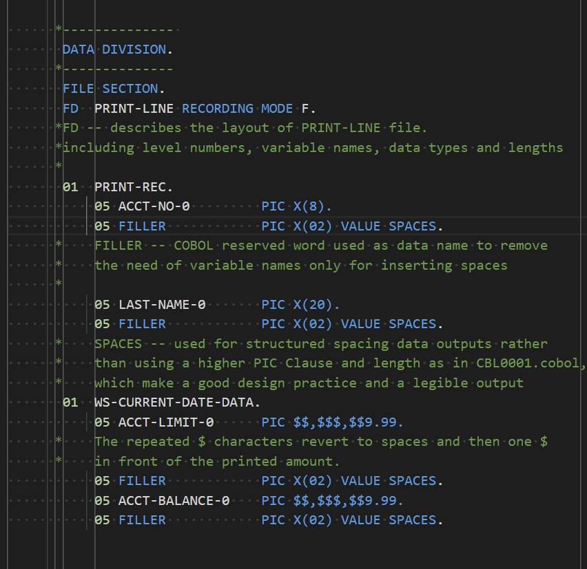

*Figure  2.  FILLER*


## Report and column headers

Writing report or column headers requires a structured output layout designed by the programmer.  Figure  3. illustrates such a structure. The designed output structure layout is implemented within the DATA DIVISION and includes the headers listed and defined below.

- **HEADER-1:**

    - Writes a literal

    - Example: ‘Financial Report for’

 

- **HEADER-2:**

    - Writes literals

    - Examples:

      - ‘Year’ followed by a variable name

      - ‘Month’ followed by a variable name

      - ‘Day’ followed by a variable name

- **HEADER-3:**

    - Writes literals

    - Examples:

       - ‘Account’ followed by FILLER spacing

       - ‘Last Name’ followed by FILLER spacing

      - ‘Limit’ followed by FILLER spacing

      - ‘Balance; followed by FILLER spacing

- **HEADER-4:**

    - Writes dashes followed by FILLER spacing

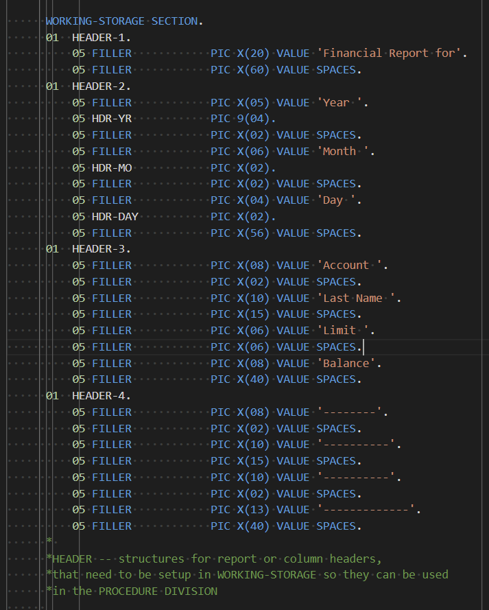

*Figure  3.  Designed output structure layout*


### HEADER-2

HEADER-2 includes the year, month, day of the report together with FILLER area, creating blank spaces between the year, month, and day, as you can see in Figure  3.  Figure  4. is an example of the data name layout used to store the values of CURRENT-DATE.  The information COBOL provides in CURRENT-DATE is used to populate the output file in HEADER-2.

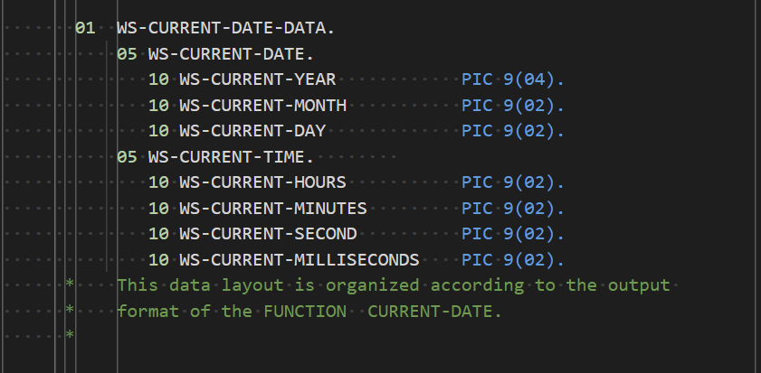

*Figure  4.  CURRENT-DATE intrinsic function*


## PROCEDURE DIVISION

Figures 1 through 4 are a designed data layout that includes a data line and report headers.  Using the storage mapped by the data line and report headers, COBOL processing logic can write the headers followed by each data line. Figure  5. is an example of an execution logic resulting used to write the header layout structure in a COBOL program.

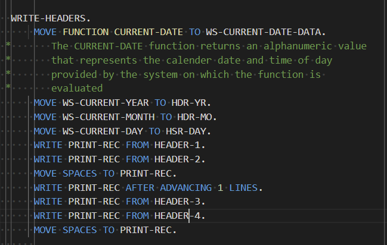

*Figure  5.  Execution logic to write header layout structure*


### MOVE sentences

The COBOL MOVE sentence, on line 1, in the WRITE-HEADERS paragraph, is collecting the current date information from the system and storing that information in a defined data name layout, WS-CURRENT-DATE-DATA.  The use of the reserved word FUNCTION means whatever follows is a COBOL intrinsic function.  The sentences on lines 2, 3, and 4 are storing the date information, year, month, and day, in HEADER-2 defined data name areas, HDR-YR, HDR-MO, and HDR-DAY.  The sentence on line 11, the final sentence in the paragraph, writes spaces into the PRINT-REC area to clear out the line storage in preparation for writing the data lines.

### PRINT-REC FROM sentences

PRINT-REC is opened for output resulting in PRINT-REC FROM following through with a write PRINT-REC FROM a different header or defined data name layout.  The sentences on lines 5 and 6 write the PRINT-REC FROM defined header data names, HEADER-1 and HEADER-2, from Figure  3.   The PRINT-REC file descriptor data names in Figure  2. are effectively replaced with the content of the header data names in Figure  3. written to output.  The sentences on lines 7 and 8 results in a blank line written between headers.  The sentences on lines 9 and 10 write the PRINT-REC FROM defined HEADER-3 and HEADER-4 data names from Figure  3.  The PRINT-REC file descriptor data names in Figure  2. are effectively replaced with the content of the header data names in Figure  3.

## Lab

This lab utilizes two COBOL programs, CBL0004, and CBL0005, located within your id.CBL data set, as well as two JCL jobs, CBL0004J and CBL0005J, located within your id.JCL data set.  The JCL jobs are used to compile and execute the COBOL programs, as discussed in previous chapters.

#### Using VS Code and Zowe Explorer

1. Submit job: CBL0004J

 

2. Observe the report written with headers like Figure  6. below.

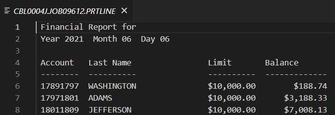

*Figure  6.  Report with headers*


3. Submit job: CBL0005J

4. Observe the report data lines are written without the dollar currency symbol, illustrated in Figure  7.

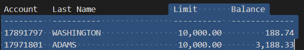

*Figure  7.  No currency symbol in output*

5. Modify id.CBL(CBL0005) to include the dollar currency symbol in the report.

   **Hint: Compare with CBL0004 line 33**


6. Re-submit job: CBL0005J


7. Observe the report data lines should now include the dollar currency symbol.

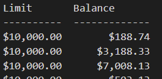

*Figure  8.  Currency symbol added to output*

\newpage

# Conditional expressions

This chapter dives into how programs make decisions based upon the programmer's written logic.  Specifically, programs make these decisions within the PROCEDURE DIVISION of the source code.  We will expand on several topics regarding conditional expressions written in COBOL through useful explanations, examples, and eventually practicing implementation through a lab. 

 

- **Boolean logic, operators, operands, and identifiers**

     - **COBOL conditional expressions and operators**

     - **Examples of conditional expressions using Boolean operators**

- **Conditional expression reserved words and terminology**

     - **IF, EVALUATE, PERFORM and SEARCH**

     - **Conditional states**

     - **Conditional names**

- **Conditional operators**

- **Conditional expressions**

     - **IF ELSE (THEN) statements**

     - **EVALUATE statements**

     - **PERFORM statements**

     - **SEARCH statements**

- **Conditions**

     - **Relation conditions**

     - **Class conditions**

     - **Sign conditions**

- **Lab**


## Boolean logic, operators, operands, and identifiers

Programs make decisions based on the programmer's written logic.  Program decisions are made using Boolean logic where a conditional expression is either true or false, yes or no.  A simple example would be a variable named 'LANGUAGE'.   Many programming languages exist; therefore, the value of variable LANGUAGE could be Java, COBOL, etc...  Assume the value of LANGUAGE is COBOL.  Boolean logic is, IF LANGUAGE = COBOL, THEN DISPLAY COBOL, ELSE DISPLAY NOT COBOL.  IF triggers the Boolean logic to determine the condition of true/false, yes/no, applied to LANGUAGE = COBOL which is the conditional expression.  The result of the IF condition executes what follows THEN when the condition is true and executes what follows ELSE when the condition is false.

The Boolean IF verb operates on two operands or identifiers.  In the example above, LANGUAGE is an operand and COBOL is an operand.  A Boolean relational operator compares the values of each operand. 


### COBOL conditional expressions and operators

Three of the most common type of COBOL conditional expressions are:

  1.  General relation condition

  2.  Class condition

  3.  Sign condition

 

A list of COBOL Boolean relational operators for each of the common types of COBOL conditional expressions is represented in Figures 1, 2, and 3 below.

 

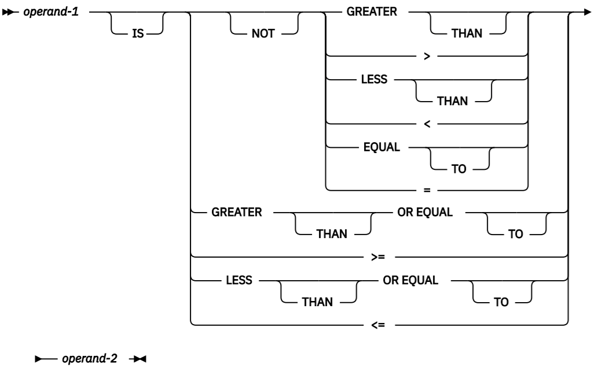

*Figure  1.  General relation condition operators*

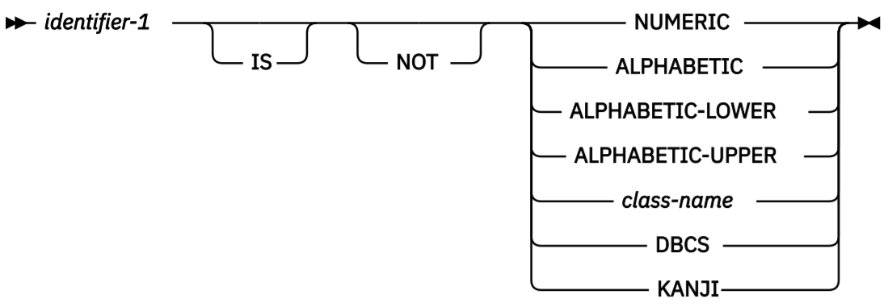

*Figure  2.  Class condition operators*


*Figure  3.  Sign condition operators*


### Examples of conditional expressions using Boolean operators

A simple conditional expression can be written as:

`IF 5 > 1 THEN DISPLAY '5 is greater than 1' ELSE DISPLAY '1 is greater than 5'.`

Compounded conditional expressions are enclosed in parenthesis and their Boolean operators are:

`AND`

`OR`

The code snippet below demonstrates a compounded conditional expression using the AND Boolean operator.

`IF (5 > 1 AND 1 > 2) THEN .... ELSE ....`

This conditional expression evaluates to false because while 5 > 1 is true, 1 > 2 is false.  The AND operation requires both expressions to be true to return true for the compounded condition expression.  Let's show another implementation, this time using the OR Boolean operator.

`IF (5 > 1 OR 1 > 2) THEN .... ELSE ....`

This conditional expression evaluates to true because while 1 > 2 is false, 5 > 1 is true.  The OR operation requires only one of the expressions to be true to return true for the entire compounded condition expression.  More conditional operators used for relation, class, and sign conditions are discussed further in the chapter.


## Conditional expression reserved words and terminology

Thus far in this book, we have touched upon the necessity and use of COBOL reserved words. This section aims to expand on the topic of reserved words, specifically ones that are used when processing conditional expressions.

### IF, EVALUATE, PERFORM and SEARCH

These are COBOL reserved words available for the processing of conditional expressions, where a condition is a state that can be set or changed. 

### Conditional states

TRUE and FALSE are among the most common conditional states.  

### Conditional names

A conditional name is a programmer-defined variable name with the TRUE condition state.  Conditional names are declared in the WORKING STORAGE SECTION with an 88-level number.  The purpose of 88-level is to improve readability by simplifying IF and PERFORM UNTIL statements.

The 88-level conditional data name is assigned a value at compile time.  The program cannot change the 88-level data name during program execution. However, the program can change the data name value in the level number above the 88-level conditional data name.  01-level USA-STATE in Example 1. can be changed.  A program expression referencing the 88-level data name is only true when the current value of the preceding level data name, USA-STATE, is equal to the WORKING-STORAGE 88-level conditional data-name assigned value. 

Observe in Example 1.  'The State is not Texas' is written as a result of the first IF STATE because the value of USA-STATE is AZ which is not equal to the 88-level conditional data name, TX.  The second IF STATE writes, 'The State is Texas' because the value of USA-STATE is equal to the assigned 88-level value of TX.


```COBOL
WORKING-STORAGE SECTION.
01 USA-STATE     PIC X(2) VALUE SPACES.
   88 STATE      VALUE 'TX'.
....
....
PROCEDURE DIVISION.
....
....
MOVE 'AZ' TO USA-STATE.
....
....
IF STATE DISPLAY 'The State is Texas'
   ELSE DISPLAY  'The State is not Texas'
END-IF.
....
....
MOVE 'TX' TO USA-STATE.
....
....
IF STATE DISPLAY 'The State is Texas'
   ELSE DISPLAY  'The State is not Texas'
END-IF.
```
*Example 1.  Using 88-level conditional name*

Numerous 88-level conditional data names can follow an 01-level data name.  As a result, an IF reference to 01-level data-name expression can have numerous values that would return true.

Other level number data-names require the condition expression to include a Boolean operator as shown in Example 2. , where a value can be stored in the 05-level STATE data name to be compared with some other stored value.  Therefore, a little bit of extra coding is needed.


```COBOL
WORKING-STORAGE SECTION.
01 USA-STATE.
   05 STATE      PIC X(2) VALUE SPACES.
....
....
PROCEDURE DIVISION.
....
....
MOVE 'AZ' TO STATE.
....
....
IF STATE = 'TX' DISPLAY 'The State is Texas'
   ELSE DISPLAY  'The State is not Texas'
END-IF.
....
....
MOVE 'TX' TO STATE.
....
....
IF STATE = 'TX' DISPLAY 'The State is Texas'
   ELSE DISPLAY  'The State is not Texas'
END-IF.  
```
*Example 2.  Without 88-level conditional name*

## Conditional operators

Relational operators compare numeric, character string, or logical data.  The result of the comparison, either true (1) or false (0), can be used to make a decision regarding program flow.  Table 1 displays a list of relational operators, how they can be written, and their meaning.


Relational operator | Can be written | Meaning
--- | --- | ---
IS GREATER THAN | IS > | Greater than
IS NOT GREATER THAN | IS NOT > | Not greater than
IS LESS THAN | IS < | Less than
IS NOT LESS THAN | IS NOT < | Not less than
IS EQUAL TO | IS = | Equal to
IS NOT EQUAL TO | IS NOT = | Not equal to
IS GREATER THAN OR EQUAL TO | IS >= | Is greater than or equal to
IS LESS THAN OR EQUAL TO | IS <= | Is less than or equal to

*Table 1.  Relational operator*

## Conditional expressions

A conditional expression causes the object program to select alternative paths of control, depending on the truth value of a test.  Conditional expressions are specified in EVALUATE, IF, PERFORM, and SEARCH statements.


### IF ELSE (THEN) statements

IF statements are used to implement or evaluate relational operations.  IF ELSE is used to code a choice between two processing actions and inclusion of the word THEN is optional.  When an IF statement is present, the statements following the IF statement are processed based on the truth of the conditional expression.  Statements are processed until an END-IF or an ELSE statement is encountered.  The ELSE statement can appear on any line before the END-IF.  IF statements, regardless of the number of lines, are explicitly terminated using END-IF.

Consider this, during program processing something occurs to change the value in the data-name, FACIAL-EXP.  Subsequent statements, the conditional expression, needs to check the value of the data name to decide on how to proceed in the program. Exemplified in Example 3. by the THEN DISPLAY and ELSE DISPLAY statements.


```COBOL
IF FACIAL-EXP = 'HAPPY' THEN
   DISPLAY 'I am glad you are happy'
ELSE DISPLAY 'What can I do to make you happy'
END-IF.
```

*Example 3.  IF, THEN, ELSE, END-IF statement*


### EVALUATE statements

EVALUATE statements are used to code a choice among three or more possible actions. The explicit terminator for an EVALUATE statement is END-EVALUATE.  The EVALUATE statement is an expanded form of the IF statement that allows you to avoid nesting IF statements, a common source of logic errors and debugging issues.  EVALUATE operates on both text string values and numerical variables.  Using the FACIAL-EXP conditional-name, observe the COBOL code implementing an EVALUATE statement, shown in Example 4.

```COBOL
EVALUATE FACIAL-EXP
 WHEN 'HAPPY'
  DISPLAY 'I am glad you are happy'
 WHEN 'SAD'
  DISPLAY 'What can I do to make you happy'
 WHEN 'PERPLEXED'
  DISPLAY 'Can you tell me what you are confused about'
 WHEN 'EMOTIONLESS'
  DISPLAY 'Do you approve or disapprove'
END-EVALUATE
```
*Example 4.  EVALUATE statement*

### PERFORM statements

A PERFORM with UNTIL phrase is a conditional expression.  In the UNTIL phrase format, the procedures referred to are performed until the condition specified by the UNTIL phrase evaluates to true.  Using the FACIAL-EXP conditional-name, the SAY-SOMETHING-DIFFERENT paragraph is executed continuously UNTIL FACIAL-EXP contains 'HAPPY', observe Example 5.


```COBOL
WORKING-STORAGE SECTION.
01 FACIAL-EXP    PIC X(11) VALUE SPACES.
   88 HAPPY      VALUE 'HAPPY'.
....
....
PROCEDURE DIVISION.
....
....
PERFORM SAY-SOMETHING-DIFFERENT UNTIL HAPPY
END-PERFORM.
```

*Example 5. PERFORM statement with 88-level conditional name*


It is also possible to use PERFORM statement without the use of an 88-level conditional name, observe Example 6.

```COBOL
WORKING-STORAGE SECTION.
01 FACIAL-EXP    PIC X(11) VALUE SPACES.
....
....
PROCEDURE DIVISION.
....
....
PERFORM SAY-SOMETHING-DIFFERENT UNTIL FACIAL-EXP = "HAPPY"
END-PERFORM.
```

*Example 6. PERFORM statement without 88-level conditional name*


### SEARCH statements

The SEARCH statement searches a table for an element that satisfies the specified condition and adjusts the associated index to indicate that element. Tables, effectively an array of values, are created with an OCCURS clause applied to WORK-STORAGE data names. A WHEN clause is utilized in SEARCH statements to verify if the element searched for satisfies the specified condition. Assuming FACIAL-EXP has many possible values, then SEARCH WHEN is an alternative conditional expression, observe Example 7.

```COBOL
WORKING-STORAGE SECTION.
01  FACIAL-EXP-TABLE REDEFINES FACIAL-EXP-LIST.
    05  FACIAL-EXP  PIC X(11) OCCURS n TIMES INDEXED BY INX-A.
        88  HAPPY VALUE "HAPPY".
....
....
PROCEDURE DIVISION.
....
....
SEARCH FACIAL-EXP
    WHEN HAPPY(INX-A) DISPLAY 'I am glad you are happy'
END-SEARCH
```
*Example 7. SEARCH WHEN statement*           

## Conditions

A conditional expression can be specified in either simple conditions or complex conditions.  Both simple and complex conditions can be enclosed within any number of paired parentheses; the parentheses, however, do not change whether the condition is simple or complex.  This section will cover three of the five simple conditions:

- Relation

- Class

- Sign


### Relation conditions

A relation condition specifies the comparison of two operands. The relational operator that joins the two operands specifies the type of comparison.  The relation condition is true if the specified relation exists between the two operands; the relation condition is false if the specified relation does not exist.  Provided, is a list of a few defined comparisons:

- Numeric comparisons - Two operands of class numeric

- Alphanumeric comparisons - Two operands of class alphanumeric

- DBCS (Double Byte Character Set) comparisons - Two operands of class DBCS

- National comparisons - Two operands of class national


### Class conditions

The class condition determines whether the content of a data item is alphabetic, alphabetic-lower, alphabetic-upper, numeric, DBCS, KANJI, or contains only the characters in the set of characters specified by the CLASS clause, as defined in the SPECIAL-NAMES paragraph of the environment division.  Provided below is a list of a few valid forms on the class condition for different types of data items.

- Numeric

    - IS NUMERIC or IS NOT NUMERIC

- Alphabetic

    - IS ALPHABETIC or IS NOT ALPHABETIC

    - IS ALPHABETIC-LOWER / ALPHABETIC-UPPER

    - IS NOT ALPHABETIC-LOWER / ALPHABETIC-UPPER

- DBCS

    - IS DBCS or IS NOT DBCS

    - IS KANJI or IS NOT KANJI


### Sign conditions

The sign condition determines whether the algebraic value of a numeric operand is greater than, less than, or equal to zero.  An unsigned operand is either POSITIVE or ZERO.  When a numeric conditional variable is defined with a sign, the following are available:

- IS POSITIVE

- IS NEGATIVE

- IS ZERO

**Note**: To read more information about these conditions please visit the link:

[https://www.ibm.com/docs/en/cobol-zos/6.4?topic=structure-conditional-expressions](https://www.ibm.com/docs/en/cobol-zos/6.4?topic=structure-conditional-expressions)


## Lab

This lab requires two COBOL programs, CBL0006 and CBL0007, and two respective JCL Jobs, CBL0006J and CBL0007J, to compile and execute the COBOL programs. All of which are provided to you in your VS Code - Zowe Explorer.

#### Using VS Code and Zowe Explorer:

1. Take a moment and look over the source code of the two COBOL programs provided: CBL0006 and CBL0007. 

2. Compare CBL0006 with CBL0005 from the previous lab.  Do you notice the differences? 

   a. Observe the new CLIENTS-PER-STATE line within the WORKING-STORAGE > PROCEDURE DIVISION.

   b. Observe the new paragraph IS-STATE-VIRGINIA within that same division.

   c. This paragraph checks whether the client is from Virginia.  If that condition is met (true) then the program should add 1 to the clients from Virginia total.

   d. Program writes “Virginia Clients = “, in the last line of the report.


3. Submit CBL0006J

4. View the job output from the JOBS section and verify the steps mentioned above were executed.

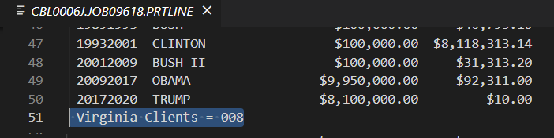

*Figure  4.  Id.JCL(CBL0006J) output*

5. Submit CBL0007J


6. Find the compilation error, IGYPS2113-E, in the job output.

7. Go ahead and modify id.CBL(CBL0007) to correct the syntax error outlined by the IGYPS2113-E message.\*

8. Re-submit CBL0007J

9. Validate that the syntax error was corrected by getting an error-free output file.

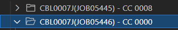

*Figure  5.  Successful compile*

**Lab Hints** 

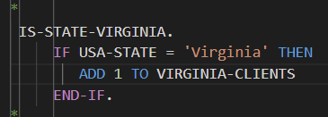


## Additional Exercise: Modify the Program to Count Clients from Another State

This exercise builds upon the existing COBOL program `CBL0006` and its corresponding JCL job `CBL0006J`. In the original program, logic was implemented to count clients from **Virginia** and display the total at the end of the report.

This exercise challenges you to modify the program to count clients from a different state instead of Virginia.

#### Objective

Your task is to understand how the current logic works in `CBL0006` to count clients from Virginia, and then modify the program to count clients from another state, such as **New York**.

**Prerequisites:** First examine `id.DATA` to identify available states. Use exact spelling and formatting.

#### Instructions

1. **Analyze the current implementation**
   - Locate the Virginia state-checking condition in `CBL0006`
   - Find where the client count is updated and displayed

2. **Modify `CBL0006`**
   - Replace Virginia logic with your chosen state
   - Update paragraph names, variables, and output display

   **Note:** Multiple program sections require updates, not just the state name.

3. **Test your changes**
   - Save and submit `CBL0006J`
   - Verify successful compilation and correct output count

**Expected Output:** If you chose New York, the final line of your report should display:


#### Lab Hints

- Update WORKING-STORAGE variables, paragraph names, and output formatting
- Follow COBOL naming conventions
- Verify your chosen state exists in `id.DATA`
- Consider state name length for proper output formatting

#### Learning Objectives

This exercise develops skills in COBOL conditional processing, program structure analysis, and consistent code modification. The goal is building analytical abilities for reading and modifying existing COBOL programs, essential for legacy system maintenance.

**Need Help?** If you encounter difficulties, you can refer to the complete solution code `CBLC1.cobol` available in VS Code Zowe Explorer or find it on [GitHub](https://github.com/openmainframeproject/cobol-programming-course/tree/master/COBOL%20Programming%20Course%20%232%20-%20Learning%20COBOL/Labs/cbl) repository.

\newpage

# Arithmetic expressions

This chapter aims to introduce the concept of implementing arithmetic expressions in COBOL programs.  We will review the basic concept of arithmetic expressions, operators, statements, limitations, statement operands, as well as precedence of operation within the expressions.  You will be able to follow along with a comprehensive example exhibiting the usage of arithmetic expressions in a COBOL program that you have seen in previous chapters and labs.  Following the chapter is a lab to practice the implementation of what you have learned. 

 

- **What is an arithmetic expression?**

     - **Arithmetic operators**

     - **Arithmetic statements**

- **Arithmetic expression precedence rules**

     - **Parentheses**

- **Arithmetic expression limitations**

- **Arithmetic statement operands**

     - **Size of operands**

- **Examples of COBOL arithmetic statements**

- **Lab**


## What is an arithmetic expression?

Arithmetic expressions are used as operands of certain conditional and arithmetic statements.  An arithmetic expression can consist of any of the following items:

1. An identifier is described as a numeric elementary item (including numeric functions).

2. A numeric literal.

3. The figurative constant ZERO.

4. Identifiers and literals, as defined in items 1, 2, and 3, separated by arithmetic operators.

5. Two arithmetic expressions, as defined in items 1, 2, 3, or 4, separated by an arithmetic operator.

6. An arithmetic expression, as defined in items 1, 2, 3, 4, or 5, is enclosed in parentheses.

7. Any arithmetic expression can be preceded by a unary operator.

Identifiers and literals that appear in arithmetic expressions must represent either numeric elementary items or numeric literals on which arithmetic can be performed.  If the value of an expression to be raised to a power is zero, the exponent must have a value greater than zero. Otherwise, the size error condition exists. In any case, where no real number exists as the result of an evaluation, the size error condition exists.


### Arithmetic operators

Five binary arithmetic operators and two unary arithmetic operators can be used in arithmetic expressions.  These operators are represented by specific characters that must be preceded and followed by a space.  However, no space is required between a left parenthesis and unary operator.  These binary and unary arithmetic operators are listed in Table 1.


Binary operator | Meaning | Unary operator | Meaning
--- | --- | --- | ---
+ | Addition | + | Multiplication by +1
- | Subtraction | - | Multiplication by -1
\* | Multiplication |  | 
/ | Division |  | 
\*\* | Exponentiation |  | 

*Table 1.  Arithmetic operators*


### Arithmetic statements

Arithmetic statements are utilized for computations.  Individual operations are specified by the ADD, SUBTRACT, MULTIPLY, and DIVIDE statements.  These individual operations can be combined symbolically in a formula that uses the COMPUTE statement for ease of programming and performance.  The COMPUTE statement assigns the value of an arithmetic expression to one or more data items.  With the COMPUTE statement, arithmetic operations can be combined without the restrictions on receiving data items imposed by the rules for the ADD, SUBTRACT, MULTIPLY, and DIVIDE statements.  When arithmetic operations are combined, the COMPUTE statement can be more efficient than the separate arithmetic statements written in a series.  For these reasons, it is best practice to use the `COMPUTE` statement for most arithmetic evaluations rather than `ADD`, `SUBTRACT`, `MULTIPLY`, and `DIVIDE` statements.  Often, you can code only one `COMPUTE` statement instead of several individual arithmetic statements.  The `COMPUTE` statement assigns the result of an arithmetic expression to one or more data items, for example:

`COMPUTE z     = a + b / c \*\* d - e`

`COMPUTE x y z = a + b / c \*\* d - e`

Some arithmetic calculations might be more intuitive using arithmetic statements other than `COMPUTE`.  You might also prefer to use the `DIVIDE` statement (with its `REMAINDER` phrase) for division in which you want to process a remainder.  The `REM` intrinsic function also provides the ability to process a remainder.

## Arithmetic expression precedence rules

Order of operation rules have been hammered into your head throughout the years of learning mathematics, remember the classic PEMDAS (parentheses, exponents, multiply, divide, add, subtract)?  Arithmetic expressions in COBOL are not exempt from these rules and often use parentheses to specify the order in which elements are to be evaluated.


### Parentheses

Parentheses are used to denote modifications to the normal order of operations (precedence rules).  An arithmetic expression within the parentheses is evaluated first and the result is used in the rest of the expression.  When expressions are contained within nested parentheses, evaluation proceeds from the least inclusive to the most inclusive set.  That means you work from the innermost expression within parentheses to the outermost.  The precedence for how to solve an arithmetic expression in Enterprise COBOL with parentheses is:

1. Parentheses (simplify the expression inside them)

2. Unary operator

3. Exponents

4. Multiplication and division (from left to right)

5. Addition and subtraction (from left to right)


Parentheses either eliminate ambiguities in logic where consecutive operations appear at the same hierarchic level or modify the normal hierarchic sequence of execution when necessary.  When the order of consecutive operations at the same hierarchic level is not completely specified by parentheses, the order is from left to right.


An arithmetic expression can begin only with a left parenthesis, a unary operator, or an operand (that is, an identifier or a literal).  It can end only with a right parenthesis or an operand.  An arithmetic expression must contain at least one reference to an identifier or a literal. 

There must be a one-to-one correspondence between left and right parentheses in an arithmetic expression, with each left parenthesis placed to the left of its corresponding right parenthesis.  If the first operator in an arithmetic expression is a unary operator, it must be immediately preceded by a left parenthesis if that arithmetic expression immediately follows an identifier or another arithmetic expression.


## Arithmetic expression limitations

Exponents in fixed-point exponential expressions cannot contain more than nine digits. The compiler will truncate any exponent with more than nine digits.  In the case of truncation, the compiler will issue a diagnostic message if the exponent is a literal or constant; if the exponent is a variable or data-name, a diagnostic message is issued at run time.


Detailed explanation of fixed-point exponential expressions is an advanced topic and beyond the scope of the chapter.  However, reference is made to fixed-point exponential expressions for your awareness as you advance your experience level with COBOL programming and arithmetic applied to internal data representations.

## Arithmetic statement operands

The data descriptions of operands in an arithmetic statement need not be the same. Throughout the calculation, the compiler performs any necessary data conversion and decimal point alignment.

### Size of operands

If the ARITH(COMPAT) compiler option is in effect, the maximum size of each operand is 18 decimal digits.  If the ARITH(EXTEND) compiler option is in effect, the maximum size of each operand is 31 decimal digits. 

The composite of operands is a hypothetical data item resulting from aligning the operands at the decimal point and then superimposing them on one another.  How to determine the composite of operands for arithmetic statements is shown in Table 2.

If the ARITH(COMPAT) compiler option is in effect, the composite of operands can be a maximum of 30 digits. If the ARITH(EXTEND) compiler option is in effect, the composite of operands can be a maximum of 31 digits.


Statement | Determination of the composite of operands
--- | ---
SUBTRACT, ADD | Superimposing all operands in a given statement, except those following the word GIVING. 
MULTIPLY | Superimposing all receiving data-items
DIVIDE | Superimposing all receiving data items except the REMAINDER data-item
COMPUTE | Restriction does not apply

*Table 2.  How the composite of operands is determined*

In all arithmetic statements, it is important to define data with enough digits and decimal places to ensure the required accuracy in the result.  Arithmetic precision details are available in the [IBM Enterprise COBOL Programming Guide Appendix A](https://publibfp.dhe.ibm.com/epubs/pdf/igy6pg40.pdf).

 

Additionally, in the IBM Enterprise COBOL Language Reference, Chapter 20. "PROCEDURE DIVISION Statements", includes a detailed explanation of DIVIDE and COMPUTE statement capabilities applied to ROUNDING and ON SIZE ERROR handling.


## Examples of COBOL arithmetic statements

In this section, the COBOL source code used in previous labs will be modified to demonstrate arithmetic processing.  Figure  1. shows level number data items in the WORKING-STORAGE section.  The data items will be used to total client account limit and client account balance.  Observe that the initial value is ZERO.

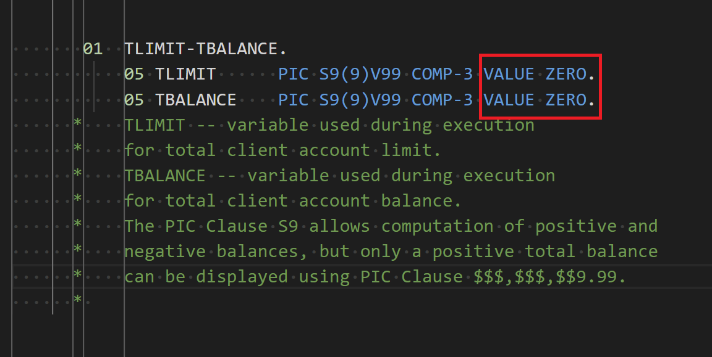

*Figure  1.  Number level data-items (1)*


Shown in Figure  2. is another example of number level data-items in the WORKING-STORAGE section.  These data items are report trailer lines that are used to write a formatted total account limit and total account balance for all clients in the report.  Observe the TLIMIT and TBALANCE data-items with large currency number picture clauses.

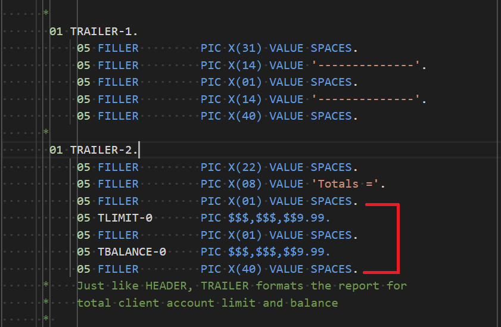

*Figure  2.  Number level data-items (2)*


In Figure  3. the READ-NEXT-RECORD paragraph, located within the PROCEDURE DIVISION, includes a PERFORM LIMIT-BALANCE-TOTAL statement.  The result of this statement is to transfer control to the LIMIT-BALANCE-TOTAL paragraph, located within the PROCEDURE DIVISION, to perform the COMPUTE statements.

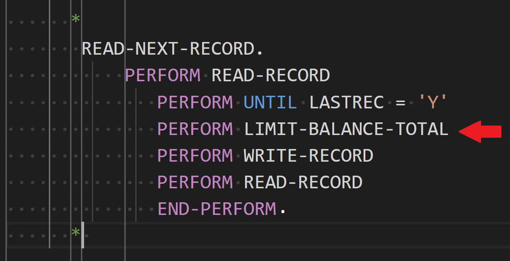

*Figure  3.  READ-NEXT-RECORD.*


Figure  4. is an example of two COMPUTE statements in the paragraph, LIMIT-BALANCE-TOTAL.  Notice that the results of the COMPUTE statements are to add client ACCT-LIMIT to the current TLIMIT and add client ACCT-BALANCE to TBALANCE totals each time the paragraph is executed, which is one time for each client record read in our example.

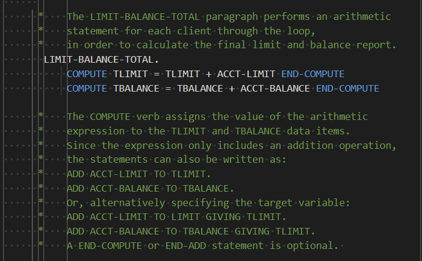

*Figure  4.  COMPUTE statements*


The WRITE-TLIMIT-TBALANCE paragraph shown in Figure  5. is positioned within the PROCEDURE DIVISION to be executed immediately after all records are read and before the final paragraph that closes the files and terminates program execution.

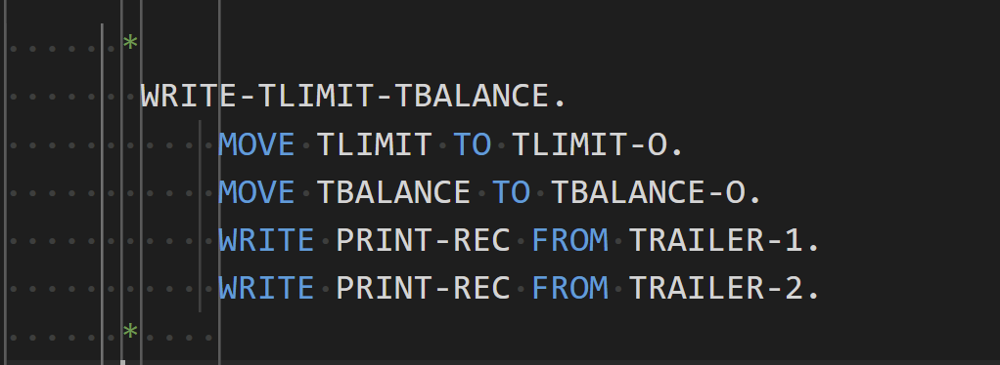

*Figure  5.  WRITE-TLIMIT-TBALANCE*

 

<a name="_Ref36026709"></a>

## Lab

This lab requires two COBOL programs, CBL0008 and CBL0009, and two respective JCL Jobs, CBL0008J and CBL0009J, to compile and execute the COBOL programs. All of which are provided to you in your VS Code - Zowe Explorer.

#### Using VS Code and Zowe Explorer

1. Take a moment and look over the source code of the two COBOL programs provided: CBL0008 and CBL0009.

 

2. Submit CBL0008J

 

3. Observe report written with trailers consisting of limit and balance totals at the bottom of the output.

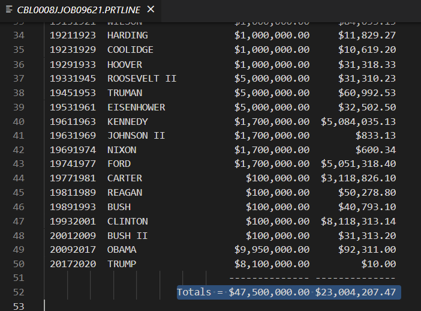

*Figure  6.  Limit and balance totals*

 

4. Submit CBL0009J

 

5. Was the job successful? If not, find the compilation error message to understand why.  

 

6. Modify id.CBL(CBL0009), correcting the compilation error.\*

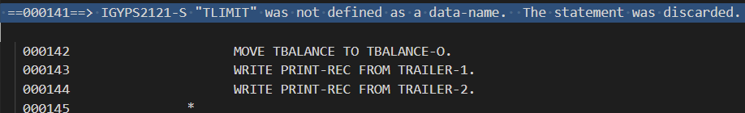

*Figure  7.  IGYPS2121-S error message*

 

7. Re-submit CBL0009J

 

8. Validate that the syntax error was corrected by getting an error-free output file like in Figure  8. The correction should report written with trailers consisting of limit and balance totals, like Figure  6.

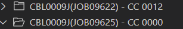

*Figure  8.  Successful compile*

**Lab Hints**

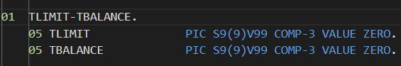

 \newpage

# Data types

A COBOL programmer must be aware that the computer stored internal data representation and formatting can differ, where the difference must be defined in the COBOL source code.  Understanding the computer's internal data representation requires familiarity with binary, hexadecimal, ASCII, and EBCDIC.  Packed-Decimal is needed to explain COBOL Computational and Display data format.  This chapter aims to familiarize the reader with these different "types" of data representation. 

- **Data representation**

     - **Numerical value representation**

     - **Text representation**

- **COBOL DISPLAY vs COMPUTATIONAL**

- **Lab**


## Data representation

Data such as numerical values and text are internally represented by zeros and ones in most computers, including mainframe computers used by enterprises.  While data representation is a somewhat complex topic in computer science, a programmer does not always need to fully understand how various alternative representations work.  It is important, however, to understand the differences and how to specify a specific representation when needed.

### Numerical value representation

COBOL has five computational (numerical) value representations.  The awareness of these representations is important due to two main reasons.  The first reason being, when a COBOL program needs to read or write data, it needs to understand how data is represented in the dataset.  The second reason is when there are specific requirements regarding the precision and range of values being processed. For additional details on binary and hexadecimal numbering systems as well as these numeric representations, consider reading the "Numerical Data Representation" chapter in the advanced topics course.

#### COMP-1

This is also known as a single-precision floating-point number representation.  Due to the floating-point nature, a COMP-1 value can be very small and close to zero, or it can be very large (about 10 to the power of 38).  However, a COMP-1 value has limited precision.  This means that even though a COMP-1 value can be up to 10 to the power of 38, it can only maintain about seven significant decimal digits.  Any value that has more than seven significant digits is rounded.  This means that a COMP-1 value cannot exactly represent a bank balance like $1,234,567.89 because this value has nine significant digits.  Instead, the amount is rounded.  The main application of COMP-1 is for scientific numerical value storage as well as computation.

#### COMP-2

This is also known as a double-precision floating-point number representation.  COMP-2 extends the range of values that can be represented compared to COMP-1.  COMP-2 can represent values up to about 10 to the power of 307.  Like COMP-1, COMP-2 values also have limited precision.  Due to the expanded format, COMP-2 has more significant digits, approximately 15 decimal digits.  This means that once a value reaches certain quadrillions (with no decimal places), it can no longer be exactly represented in COMP-2.

COMP-2 supersedes COMP-1 for more precise scientific data storage as well as computation.  Note that COMP-1 and COMP-2 have limited applications in financial data representation or computation.

#### COMP-3

This is also known as packed BCD (binary coded decimal) representation.  This is, by far, the most utilized numerical value representation in COBOL programs.  Packed BCD is also somewhat unique and native to mainframe computers such as the IBM z architecture.

Unlike COMP-1 or COMP-2, packed BCD has no inherent precision limitation that is independent of the range of values.  This is because COMP-3 is a variable-width format that depends on the actual value format.  COMP-3 exactly represents values with decimal places.  A COMP-3 value can have up to 31 decimal digits.

#### COMP-4

COMP-4 is only capable of representing integers.  Compared to COMP-1 and COMP-2, COMP-4 can store and compute with integer values exactly (unless a division is involved).  Although COMP-3 can also be used to represent integer values, COMP-4 is more compact.

#### COMP-5

COMP-5 is based on COMP-4, but with the flexibility of specifying the position of a decimal point.  COMP-5 has the space efficiency of COMP-4 and the exactness of COMP-3.  Unlike COMP-3, however, a COMP-5 value cannot exceed 18 decimal digits. 


### Text representation

COBOL programs often need to represent text data such as names and addresses.

#### EBCDIC

Extended Binary Coded Decimal Interchange Code (EBCDIC) is an eight binary digits character encoding standard, where the eight digital positions are divided into two pieces.  EBCDIC was devised in the early 1960s for IBM computers.  EBCDIC is used to encode text data so that text can be printed or displayed correctly on devices that also understand EBCDIC.   

#### ASCII

American Standard Code for Information Interchange, ASCII, is another binary digit character encoding standard. 

#### EBCDIC vs ASCII

Why are these two standards when they seemingly perform the same function?

EBCDIC is a standard that traces its root to punch cards designed in 1931.  ASCII, on the other hand, is a standard that was created, unrelated to IBM punch cards, in 1967.  A COBOL program natively understands EBCDIC, and it can comfortably process data originally captured in punch cards as early as 1931.

ASCII is mostly utilized by non-IBM computers.

COBOL can encode and process text data in EBCDIC or ASCII.  This means a COBOL program can simultaneously process data captured in a census many decades ago while exporting data to a cloud service utilizing ASCII or Unicode.  It is important to point out, however, that the programmer must have the awareness and choose the appropriate encoding.


## COBOL DISPLAY vs COMPUTATIONAL

Enterprise COBOL for z/OS by default utilizes EBCDIC encoding.  However, it is possible to read and write ASCII in z/OS.  The EBCDIC format representation of alphabetic characters is in a DISPLAY format.  Zoned decimal for numbers, without the sign, is in a DISPLAY format. Packed decimal, binary, and floating-point are NOT in a DISPLAY format.  COBOL can describe packed decimal, binary, and floating-point fields using COMPUTATIONAL, COMP-1, COMP-2, COMP-3, COMP-4, and COMP-5 reserved words.


## Lab

Many of the previous COBOL lab programs you have worked with thus far are reading records containing two packed decimal fields, the client account limit and the client account balance.  In the Arithmetic expressions lab, the total of all client account limits and balances used a COMPUTE statement, where the COMP-3 fields contained the packed decimal internal data.

What happens when an internal packed decimal field is not described using COMP-3? Without using COMP-3 to describe the field, the COBOL program treats the data as DISPLAY data (EBCDIC format). This lab demonstrates what happens during program execution without using COMP-3.

#### Using VS Code and Zowe Explorer

1. Submit the job, id.JCL(CBL0010J)

2. Observe that the compilation of the COBOL source was successful, however, also observe that the execution of the job failed.  How can you tell? 

   There's no CC code next to CBL0010J(JOB#). Instead, there is an ABENDU4038 message.  U4038 is a common user code error typically involving a mismatch between the external data and the COBOL representation of the data.

 

3. Read the execution SYSOUT message carefully.  The SYSOUT message mistakenly believes the records are 174 characters in length while the program believes the records are 170 characters in length.

    **Explanation**: Packed decimal (COMP-3) expands into two numbers where only one number would typically exist.  If the program reads a packed decimal field without describing the field as COMP-3, then program execution becomes confused about the size of the record because the PIC clause, S9(7)V99, is expecting to store seven numbers plus a sign digit when only three word positions are read.  Therefore, execution reports a four-record length position discrepancy.

 

4. Edit id.CBL(CBL0010) to identify and correct the source code problem.\*

 

5. Submit id.JCL(CBL0010J) and verify correction is successful with a CC 0000 code.


***Lab Hints:*** 

 The ACCT-LIMIT PIC clause in the ACCT-FIELDS paragraph should be the same as the PIC clause for ACCT-BALANCE.

\newpage

# Intrinsic functions

Today’s COBOL is not your parents' COBOL.  Today’s COBOL includes decades of feature/function-rich advancements and performance improvements.  Decades of industry specifications are applied to COBOL to address the growing needs of businesses.  What Enterprise COBOL for z/OS promised and delivered, is decades of upward compatibility with new releases of hardware and operating system software.  The original DNA of COBOL evolved into a powerful, maintainable, trusted, and time-tested computer language with no end in sight. 

Among the new COBOL capabilities is JSON GENERATE and JSON PARSE, providing an easy to use coding mechanism to transform DATA DIVISION defined data-items into JSON for a browser, a smartphone, or any IoT (Internet of Things) device to format in addition to transforming JSON received from a browser, a smartphone, or any IoT device into DATA DIVISION defined data-items for processing.  Frequently, the critical data accessed by a smartphone, such as a bank balance, is stored and controlled by z/OS where a COBOL program is responsible for retrieving and returning the bank balance to the smartphone.  COBOL has become a web-enabled computer language. 

Previous COBOL industry specifications included intrinsic functions, which remain largely relevant today.  An experienced COBOL programmer needs to be familiar with intrinsic functions and stay aware of any new intrinsic functions introduced.  This chapter aims to cover the foundation of intrinsic functions and their usage in COBOL.

 

 

- **What is an intrinsic function?**

     - **Intrinsic function syntax**

     - **Categories of intrinsic functions**

- **Intrinsic functions in Enterprise COBOL for z/OS V6.4**

     - **Mathematical example**

     - **Statistical example**

     - **Date/time example**

     - **Financial example**

     - **Character-handling example**

- **Use of intrinsic functions with reference modifiers**

- **Lab**


## What is an intrinsic function?

Intrinsic functions are effectively re-usable code with simple syntax implementation and are another powerful COBOL capability.  Intrinsic functions enable desired logic processing with a single line of code.  They also provide capabilities for manipulating strings and numbers.  Because the value of an intrinsic function is derived automatically at the time of reference, you do not need to define these functions in the DATA DIVISION.

### Intrinsic function syntax

Written as:

`FUNCTION function-name (argument)`

Where function-name must be one of the intrinsic function names.  You can reference a function by specifying its name, along with any required arguments, in a PROCEDURE DIVISION statement.  Functions are elementary data items, and return alphanumeric characters, national characters, numeric, or integer values.


```COBOL
01  Item-1   Pic x(30)  Value "Hello World!".
01  Item-2   Pic x(30).
. . .
    Display Item-1
    Display Function Upper-case(Item-1)
    Display Function Lower-case(Item-1)
    Move Function Upper-case(Item-1) to Item-2
    Display Item-2
```

*Example 1.  COBOL FUNCTION reserved word usage*

The code shown in Example 1 above, displays the following messages on the system logical output device:

`Hello World!`
`HELLO WORLD!`
`hello world!`
`HELLO WORLD!`

 

### Categories of intrinsic functions

The intrinsic functions can be grouped into six categories, based on the type of service performed.  They are as follows:

1. Mathematical

2. Statistical

3. Date/time

4. Financial

5. Character-handling

6. General

 

Intrinsic functions operate against alphanumeric, national, numeric, and integer data items.

- **Alphanumeric** functions are of class and category alphanumeric.  The value returned has an implicit usage of DISPLAY.  The number of character positions in the value returned is determined by the function definition.

- **National** functions are of class and category national.  The value returned has an implicit usage of NATIONAL and is represented in national characters (UTF-16). The number of character positions in the value returned is determined by the function definition.

- **Numeric** functions are of class and category numeric.  The returned value is always considered to have an operational sign and is a numeric intermediate result.

- **Integer** functions are of class and category numeric.  The returned value is always considered to have an operational sign and is an integer intermediate result.  The number of digit positions in the value returned is determined by the function definition.

## Intrinsic functions in Enterprise COBOL for z/OS V6.4

The current release of Enterprise COBOL for z/OS V6.4 includes 82 intrinsic functions.  Each one of these functions falling into one of the aforementioned six categories.  While an entire book could be written on intrinsic functions, a single example for each of the six categories is provided in this section.


### Mathematical example

Example 2. is storing into X the total of A + B + value resulting from C divided by D.  FUNCTION SUM enables the arithmetic operation.

```COBOL
Compute x = Function Sum(a b (c / d))
```

*Example 2.  Mathematical intrinsic function*

### Statistical example

Example 3. shows three COBOL functions, MEAN, MEDIAN, and RANGE where the arithmetic values are stored in Avg-Tax, Median-Tax, and Tax-Range using the data names with assigned pic clause values.


```COBOL
01  Tax-S           Pic 99v999 value .045.
01  Tax-T           Pic 99v999 value .02.
01  Tax-W           Pic 99v999 value .035.
01  Tax-B           Pic 99v999 value .03.
01  Ave-Tax         Pic 99v999.
01  Median-Tax      Pic 99v999.
01  Tax-Range       Pic 99v999.
. . .
    Compute Ave-Tax      = Function Mean   (Tax-S Tax-T Tax-W Tax-B)
    Compute Median-Tax   = Function Median (Tax-S Tax-T Tax-W Tax-B)
    Compute Tax-Range    = Function Range  (Tax-S Tax-T Tax-W Tax-B)
```
*Example 3.  Statistical intrinsic function*


### Date/time example

Example 4. shows usage of three COBOL functions, Current-Date, Integer-of-Date, and Date-of-Integer applied to MOVE, ADD, and COMPUTE statements.


```COBOL
01  YYYYMMDD        Pic 9(8).
01  Integer-Form    Pic S9(9).
. . .
    Move Function Current-Date(1:8) to YYYYMMDD
    Compute Integer-Form = Function Integer-of-Date(YYYYMMDD)
    Add 90 to Integer-Form
    Compute YYYYMMDD = Function Date-of-Integer(Integer-Form)
    Display 'Due Date: ' YYYYMMDD
```
*Example 4.  Date/time intrinsic function*


### Financial example

Example 5 shows an application of the COBOL function ANNUITY financial algorithm where values for the loan amount, payments, interest, and a number of periods are input to the ANNUITY function.

```COBOL
01  Loan                 Pic 9(9)V99.
01  Payment              Pic 9(9)V99.
01  Interest             Pic 9(9)V99.
01  Number-Periods       Pic 99.
. . .
    Compute Loan = 15000
    Compute Interest = .12
    Compute Number-Periods = 36
    Compute Payment = Loan * Function Annuity((Interest / 12) Number-Periods)
```
*Example 5.  Financial intrinsic function*


### Character-handling example

Example 6 shows a usage of the COBOL function UPPER-CASE where a string or alphabetic variables processed by UPPER-CASE will translate any lower case characters to upper case.


```COBOL
MOVE FUNCTION UPPER-CASE("This is shouting!") TO SOME-FIELD
DISPLAY SOME-FIELD
```
```
Output: THIS IS SHOUTING!
```

*Example 6.  Character-handling intrinsic function*


## Use of intrinsic functions with reference modifiers

A reference modification defines a data item by specifying the leftmost character position and an optional length for the data item, where a colon (:) is used to distinguish the leftmost character position from the optional length, as shown in Example 7.


```COBOL
05 LNAME    PIC X(20).

LNAME(1:1)
LNAME(4:2)
```

*Example 7.  Reference modification*

Reference modification, LNAME(1:1), would return only the first character of data item LNAME, while reference modification, LNAME(4:2), would return the fourth and fifth characters of LNAME as the result of starting in the fourth character position with a length of two.  If LNAME of value SMITH was the data item being referenced in the intrinsic function, the first reference would output, S.  Considering those same specs, the second reference would output, TH.


## Lab

This lab contains data that includes a last name, where last name is all upper-case.  It demonstrates the use of intrinsic functions together with reference modification to lower-case the last name characters, except the first character of the last name.

This lab requires two COBOL programs, CBL0011 and CBL0012, and two respective JCL Jobs, CBL0011J and CBL0012J, to compile and execute the COBOL programs. All of which are provided to you in your VS Code - Zowe Explorer.

#### Using VS Code and Zowe Explorer

1. Submit job, CBL0011J.

 

2. Observe the report output, last name, with first character upper-case and the remaining characters lower-case. 

   Figure  1. , below, illustrates the difference in output from the Data types lab compared to this lab.  Notice that in the previous lab, the last names were listed in all capitalized characters, whereas, as previously stated, this lab output has only the first character of the last name capitalized.

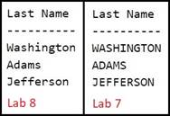

*Figure  1.  Current lab vs. Data types lab output*

 

3. Observe the PROCEDURE DIVISION intrinsic function, lower-case, within the WRITE-RECORD paragraph.  This intrinsic function is paired with a reference modification resulting in an output of last name with upper-case first character and the remainder in lower-case.

 

4.  Submit CBL0012J

 

5.  Observe the compilation error.

Previous lab programs made use of a date/time intrinsic function.  The date/time intrinsic function in this lab has a syntax error that needs to be identified and corrected.

 

6.  Modify id.CBL(CBL0012) correcting compilation error.\*

 

7. Re-submit CBL0012J

 

8. Corrected CBL0012 source code should compile and execute the program successfully.  A successful compile will result in the same output as CBL0011J.


**Lab Hints**

Refer to CBL0011 line 120 for the proper formatting of the function-name causing the compilation error.

\newpage
# ABEND handling

When you do the labs on the previous chapters, you may have encountered an abnormal end or ABEND for short. There are various categories of common COBOL errors which cause ABEND, and in production, software errors can be costly - both in financial and reputation.

This chapter introduces ABEND and gives an overview of frequent ABEND types which a COBOL application programmer may encounter. We will review possible reasons and frequent causes of the ABEND types for the programmer to debug. We will also review some common best practices to avoid ABEND and review reasons why a programmer may purposedly call an ABEND routine in their application. 


- **Why does ABEND happen?**

- **Frequent ABEND Types**

     - **S001 - Record Length / Block Size Discrepancy**

     - **S013 - Conflicting DCB Parameters**

     - **S0C1 - Invalid Instruction**

     - **S0C4 - Storage Protection Exception**

     - **S0C7 - Data Exception**

     - **S0CB - Division by Zero**

     - **S222/S322 - Time Out / Job Cancelled**

     - **S806 - Module Not Found**

     - **B37/D37/E37 - Dataset or PDS Index Space Exceeded**

- **Best Practices to Avoid ABEND**

- **ABEND Routines**


## Why does ABEND happen?

Unlike your normal workstation, the mainframe utilizes an instruction set architecture called the z/Architecture. This instruction set describes what instructions can be executed at the lower machine-code level.

In the case that the system encounters an instruction that is not permitted under the instruction set, an ABEND will happen. This can happen during compilation, link-edit, or execution of your COBOL program.

## Frequent ABEND Types

Listed below are nine of the common ABENDs to get you started. Note that there are more ABEND types and situations that you may encounter as a COBOL programmer, and z/OS may sometimes produce a different ABEND code depending on whether the ABEND occurs in a layer of system software.

These ABEND codes would occasionally be accompanied by a reason code which can be utilized to further narrow down the possible cause of errors.

- **S001** - Record Length / Block Size Discrepancy
- **S013** - Conflicting DCB Parameters
- **S0C1** - Invalid Instruction
- **S0C4** - Storage Protection Exception
- **S0C7** - Data Exception
- **S0CB** - Division by Zero
- **S222/S322** - Time Out / Job Cancelled
- **S806** - Module Not Found
- **B37/D37/E37** - Dataset or PDS Index Space Exceeded

In the next sections, we will go through the ABENDs along with any possible reasons and the frequent causes of the ABENDs. Note that the reasons and causes are non-exhaustive.

### S001 - Record Length / Block Size Discrepancy

z/OS manages data using data sets, which is a file that contains one or more records. These data sets have a predetermined record length and a maximum length of a block of storage (block size) associated with them during their creation. Most of the time the discrepancy happens due to programming errors.

**Reason Codes:**
- S001-0: Conflict between record length specification (program vs JCL vs dataset label)
- S001-2: Damaged storage media or hardware error
- S001-3: Fatal QSAM error
- S001-4: Conflict between block specifications (program vs JCL)
- S001-5: Attempt to read past end-of-file

**Frequent Causes:**
- S001-0: Typos in the FD statement or JCL
- S001-2: Corrupt disk or tape dataset
- S001-3: Internal z/OS problem
- S001-4: Forgot to code BLOCK CONTAINS 0 RECORDS in the FD statement
- S001-5: Logic error

### S013 - Conflicting DCB Parameters

S013 ABEND occurs when the program is expecting the Data Definition (DD) statement to have a specific Data Control Block (DCB), but the DD has a different DCB. Again this can be something like block size, record length, or record format.

To read more on data sets, visit the IBM Knowledge Center:

[https://www.ibm.com/docs/en/zos-basic-skills?topic=more-what-is-data-set](https://www.ibm.com/docs/en/zos-basic-skills?topic=more-what-is-data-set)

**Reason Codes:**
- S013-10: Dummy data set needs buffer space; specify BLKSIZE in JCL
- S013-14: DD statement must specify a PDS
- S013-18: PDS member not found
- S013-1C: I/O error in searching the PDS directory
- S013-20: Block size is not a multiple of the record length
- S013-34: Record length is incorrect
- S013-50: Tried to open a printer for an input
- S013-60: Block size not equal to record length for unblocked size
- S013-64: Attempted to dummy out indexed or relative file
- S013-68: Block size is larger than 32752
- S013-A4: SYSIN or SYSOUT is not QSAM file
- S013-A8: Invalid record format for SYSIN or SYSOUT
- S013-D0: Attempted to define PDS with FBS or FS record format
- S013-E4: Attempted to concatenate more than 16 PDSs

**Frequent Causes:**
Most of the reason for this ABEND code is due to inconsistencies between the JCL and the COBOL program.

### S0C1 - Invalid Instruction

In S0C1, the CPU is attempting to execute an instruction that is either invalid or not supported.

**Reasons:**
- SYSOUT DD statement missing
- The value in an AFTER ADVANCING clause is less than 0 or more than 99
- An index or subscript is out of range
- An I/O verb was issued against an unopened data set
- CALL subroutine linkage does not match the calling program record definition

**Frequent Causes:**
- Incorrect logic in setting AFTER ADVANCING clause
- Incorrect logic in table handling code, or an overflow of table entries

### S0C4 - Storage Protection Exception

When you run your COBOL program in z/OS, the operating system will allocate a block of virtual memory which is called address space. The address space will contain memory addresses that are necessary for the execution of the program.

**Reason:**
With S0C4, the program is attempting to access a memory address that is not within the address space allocated.

**Frequent Causes:**
- Missing or incorrect JCL DD statement
- Incorrect logic in table handling code
- Overflow of table entries
- INITIALIZE a file FD that hasn't been opened

### S0C7 - Data Exception

As you have seen previously, COBOL program handles data using PICTURE clauses, which determine the type of data that particular variable. But occasionally, you may encounter data that are misplaced.

**Reason:**
With S0C7, the program is expecting numeric data, however, it found other invalid types of data. This can happen when you try to MOVE something non-numeric from a PIC 9 field to a PIC X field.

**Frequent Causes:**
- Incorrectly initialized or uninitialized variables
- Missing or incorrect data edits
- MOVE from a 01-level to a 01-level if the sending field is shorter than receiving field
- MOVE of zeros to group-level numeric fields
- Incorrect MOVE CORRESPONDING
- Incorrect assignment statements when MOVE from one field to another

### S0CB - Division by Zero

Just like mathematics, attempting to divide a number with 0 in Enterprise COBOL is an undefined operation.

**Reason:**
CPU attempted to divide a number with 0.

**Frequent Causes:**
- Incorrectly initialized or uninitialized variables
- Missing or incorrect data edits

### S222/S322 - Time Out / Job Cancelled

When you submit a JCL, it is possible to determine how much time you want to allocate to a job. If the job surpasses that allocated time, it will time out. Depending on how your system is set up, a job that has taken a prolonged time may be canceled either manually by the operator or automatically.

**Reason:**
Timeout, likely due to program logic getting caught in a loop with no possible exit (infinite loop). To be specific, S322 ABEND refers to timeout, while S222 refers to the job being canceled.

**Frequent Causes:**
- Invalid logic
- Invalid end-of-file logic
- End-Of-File switch overwritten
- Subscript not large enough
- PERFORM THRU a wrong exit
- PERFORM UNTIL End-Of-File without changing the EOF switch

### S806 - Module Not Found

We have seen previously that it is possible to CALL a subroutine in COBOL. To allow the compiler to know what subroutine we want to call, we need to specify them on the JCL. If you do not indicate them, the compiler will attempt to check the system libraries first before failing.

**Reason:**
CALL was made to a subroutine that could not be located.

**Frequent Causes:**
- Module deleted from the library
- Module name spelled incorrectly
- Load library with the module is not specified on the JCL
- I/O error when z/OS searched the directory of the library

### B37/D37/E37 - Dataset or PDS Index Space Exceeded

We have seen that data set in z/OS have an allocated size to them. When we create many data, at one point the data set won't have enough space to store anything new.

**Reason Codes:**
- B37 - Disk volume out of space
- D37 - Primary space exceeded, no secondary extents defined
- E37 - Primary and secondary extents full
- E37-04 - Disk volume table of contents is full

**Frequent Causes:**
- Not enough space to allocate the output file(s)
- Logic error resulting in an infinite write loop

## Best Practices to Avoid ABEND

To avoid ABEND, we can do something called defensive programming. It is a form of programming where we defensively design our code to ensure that it is still running under unforeseen circumstances.

By doing defensive programming, we can reduce the number of bugs and make the program more predictable regardless of the inputs.

Listed below are some things we can do in COBOL:

- **INITIALIZE fields at the beginning of a routine.** This will ensure that the field has proper data at the start of the program. However, special care needs to be taken to ensure that any flags or accumulators have the appropriate INITIALIZE data.

- **I/O statement checking.** This can be through the use of FILE STATUS variable and checking them before doing any further I/O operation. Additionally, we need to check for empty files and other possible exceptions.

- **Numeric fields checking.** A general policy would be to not trust a numeric field we are doing math on. Assume that the input can be invalid. It would be recommended to use ON OVERFLOW and ON SIZE ERROR phrases to catch invalid or abnormal data. Special care should be taken when we need to do rounding as truncation can occur in some cases.

- **Code formatting.** This will ensure that your code is maintainable and easy to understand by anyone who is reading or maintaining them.

- **Consistent use of scope terminators.** It would be best practice to explicitly terminate a scope using scope terminators such as END-IF, END-COMPUTE, or END-PERFORM.

- **Testing, Checking, and Peer-Review.** Proper tests and peer-review can be conducted to catch possible errors that may have slipped through your program. Additionally, we can also ensure that the business logic is correct.

## ABEND Routines

Even when a system ABEND does not occur, there are possible situations where you will be expected to call an ABEND routine. This could be when you encounter invalid input data for your program or an error being returned from a subroutine.

Usually, such routines would be supplied by your place of employment. But it can be as simple as the following example:

```COBOL
IF abend-condition
    PERFORM ABEND-ROUTINE.
...
ABEND-ROUTINE.
    DISPLAY "Invalid data".
    STOP RUN.
```

Such routine can display more information which would allow you to determine where and why exactly has the program failed.
