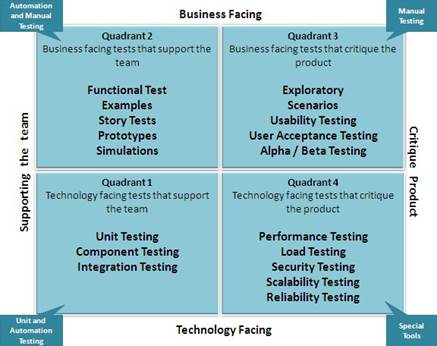

---
geometry:
- margin=1in
header-includes:
- \lstset{basicstyle=\ttfamily,
    stepnumber=2,
    numbersep=5pt,
    backgroundcolor=\color{black!10},
    showspaces=false,
    showstringspaces=false,
    showtabs=false,
    tabsize=2,
    captionpos=b,
    breaklines=true,
    breakatwhitespace=true,
    breakautoindent=true,
    linewidth=\textwidth}
- \hypersetup{colorlinks=true,
              linkcolor=blue}
---
\newpage
# Testing

In this chapter, we focus on the importance of thoroughly testing software to ensure its quality.  No language or program is exempt from the importance of testing and automated testing, including programs written in COBOL.  The chapter explains how this can only be achieved in an effective and efficient way by automating the testing as part of a continuous delivery pipeline and introduces a framework that can enable such automation.

We will look at some of the background to software testing and the different types of testing, the value to an enterprise of using a continuous integration/continuous delivery pipeline, why automation is vital in CI/CD pipelines, and the risks of not adopting automation.

 

- **Importance of testing**

     - **What is testing and why do it?**

     - **What is unit testing?**

     - **What is function/integration/system testing?**

     - **The role of exploratory testing**

- **Basics of continuous integration, continuous delivery**

     - **Introduction to DevOps and CI/CD pipelines**

     - **Focus on efficiency and automation through the pipeline**

     - **Tests as the quality gatekeeper through phases of the pipeline**

     - **Managing the pipeline when test cases fail**

- **Testing on z/OS**

     - **Importance of testing on z/OS**

     - **Challenges for test automation on z/OS**

- **Why does this matter?**

     - **Value of automated testing in continuous delivery**

     - **Dangers of not automating testing**

     - **Risks of not adopting continuous delivery**

     - **Use of automated testing for system reliability**

- **How can test automation be achieved on z/OS?**

## Importance of testing

If software is not tested, how can you or your users have confidence that it will behave as intended?

 

>
### What is testing and why do it?

Testing is the process of validating that software carries out the actions and provides the results that are expected.  It can, and should, encompass a number of different types of testing carried out at a number of different phases during the development lifecycle of the product, and potentially continue after the software has been released.  This allows errors and omissions in the software to be uncovered, as well as ensuring that it meets the user requirements.

 

There are several alarming examples of software defects and problems that could have been avoided by applying the proper and sufficient testing.

 

Put simply, software testing can be described as verification of the system or application under test.  Cem Kaner offers this definition:

"Software testing is an empirical technical investigation conducted to provide stakeholders with information about the quality of the product or service under test."

 

### What is unit testing?

Unit testing is the earliest phase of testing and validates that an individual unit or component of a software solution performs as designed.  Unit testing is typically carried out by the developer who wrote the code within the unit or component under test, along with other early validation activities such as static analysis and code review.  That is not to say that the unit tests created by the developer might also be re-run at later stages in the software lifecycle, to validate that the individual units still behave as intended.

 

Unit testing is important because the earlier defects can be found (or avoided), the less resource is required to resolve them.  A problem found early might be corrected by simple editing in minutes, whereas the same problem found later might require a lot of rewriting and re-testing.  Unit testing also often takes advantage of the developer's knowledge of the internals of the unit or units being tested.

 

The unit tests that are created as part of unit testing can also be very important, if they are designed in such a way that they can be run and re-run later in the development cycle, to validate that the behavior of the software units is still correct.

 
### What is function/integration/system testing?

Beyond the realm of unit testing, which is carried out by the developer, are a range of types of testing that typically fall into the realm of the tester.  These validate that when individual units of code are integrated together, or introduced into an existing software system, the overall system both continues to work correctly without any regressions and displays the new functionality that the new code is intended to enable.  There are a multitude of terms used to define these different types of testing, and in most organizations, there will be a sequence of test phases through which code will pass, each with their own names.

 

A useful approach to categorizing types of testing are the **Agile Test Quadrants** , introduced by Brian Marick ([http://www.exampler.com/old-blog/2003/08/21.1.html#agile-testing-project-1](http://www.exampler.com/old-blog/2003/08/21.1.html#agile-testing-project-1)).  This looks at tests in terms of distinguishing whether they are business facing or technology facing, as well as whether they are used by or on behalf of programmers to support programming or are intended to critique the product.  This results in four quadrants (see Figure 1):

 

- **Quadrant Q1** looks at unit testing, as well as component and integration testing, all of which focus on the technology.

- **Quadrant Q2** looks at more business facing and system level tests, such as functional tests and story tests.

- **Quadrant Q3** represents tests that focus on the business-level capability of the product, and aim to critique or discover any problems with this, such as exploratory testing, usability and user acceptance testing

- **Quadrant Q4** is focused on the system as a whole and how it meets business needs, but from a technology perspective, such as performance, load, stress, and security testing.

- Quadrants Q1 and Q2 often lend themselves to automated testing, while Q3 requires a more exploratory and manual approach, and Q4 might require tools focused on testing for performance or security, for example.

*Figure  1.   Agile Testing Quadrants (from http://tryqa.com/what-are-test-pyramid-and-testing-quadrants-in-agile-testing-methodology/ )*

 

Martin Fowler and Mike Kohn have discussed the concept of a Test Pyramid (see ’The Practical Test Pyramid’: [https://martinfowler.com/articles/practical-test-pyramid.html](https://martinfowler.com/articles/practical-test-pyramid.html)), which emphasizes the importance of a wide base of many small unit tests, then built upon that a set of equally important but less numerous tests that Mike Cohn called 'Service Tests'.  At the top of the pyramid are 'End to End tests', which include user interface tests, and which test the entire system from end to end.  Service tests covers a similar scope of testing as Integration Testing but is a term which has not gained much traction, and in our usage Integration Testing covers all the pyramid above the unit tests.

 

This chapter is not going to attempt to provide definitive definitions of the various types of testing but will use 'Integration Testing' as an umbrella term to cover much of the testing that occurs after development and which lends itself to automation.  This is where individual units of software are tested together, as well as being tested with other components including external parts of the system.  Such tests are usually run in an environment that matches some aspects of the ultimate target environment for the software.  Included within 'Integration Testing' are regression testing, functional testing, system testing, U.I. testing, end-to-end testing, user acceptance testing, performance testing.

 

A distinction should be made between types of **testing** and types of **tests** .  Unit tests for example can, and should, be run during later test phases, especially as part of regression testing.

### The role of exploratory testing

Exploratory testing was defined by Cem Kaner in 1984 (see [http://www.kaner.com/pdfs/QAIExploring.pdf](http://www.kaner.com/pdfs/QAIExploring.pdf)) as, "a style of software testing that emphasizes the personal freedom and responsibility of the individual tester to continually optimize the quality of their work by treating test-related learning, test design, test execution, and test result interpretation as mutually supportive activities that run in parallel throughout the project."

 

Exploratory testing allows a tester to use their skills and experience to discover, investigate and learn about the behavior of the software under test.  In the spirit of the Agile Manifesto, it emphasizes the "personal freedom and responsibility of the individual tester" ([https://www.guru99.com/exploratory-testing.html](https://www.guru99.com/exploratory-testing.html)).

 

In terms of the Agile Testing Quadrants, exploratory testing lies towards the side that aims to 'critique the product', which is covered nicely in this post: [https://www.testingexcellence.com/exploratory-testing-important-agile-projects/](https://www.testingexcellence.com/exploratory-testing-important-agile-projects/) .  

 

Exploratory testing is often referred to as being a 'thinking' activity.  It is also sometimes referred to as ad-hoc testing, but in reality, it is a much more directed and organized activity than being purely ad-hoc.

 

This type of testing makes the best use of the skills of the tester, but clearly by its very nature does not lend itself to automation.  The value of automation of testing lies in freeing the tester from the need to manually carry out repetitive and un-thinking testing.

 
## Basics of continuous integration, continuous delivery

Continuous Integration and Continuous Delivery (CI/CD) are important practices within a DevOps approach, which allow software to be evolved and enhanced at a rate that meets the needs of the business and users, rather than being artificially delayed by long testing cycles which in turn result in a batching up of the delivery of software changes.

### Introduction to DevOps and CI/CD pipelines

At its heart, DevOps refers to a building a greater collaboration between the software development and IT operations teams within an organization.  By working together, the systems development lifecycle of building, testing and releasing software can be shortened, and software changes can be continuously integrated and continuously delivered to provide value more rapidly and reliably.

A key step in adopting a successful DevOps approach is to set up a **CI/CD pipeline** .  

**Continuous Integration (CI)** is a technique first identified by Grady Booch, involving frequent checking in of small code changes made by a development team, which are merged together into a 'Master' code stream.  CI provides a consistent way of building and packaging changes and validating that they work together, encouraging teams to commit changes more frequently.  Martin Fowler summarized the benefits by saying that "Continuous Integration doesn't get rid of bugs, but it does make them dramatically easier to find and remove".  

**Continuous Delivery (CD)** progresses the code changes further around the pipeline process, by automating the delivery of the changed software to a series of environments for testing, and ultimately production.  Some people distinguish between Continuous Delivery, which ensures working and tested releases of software are ready at any time, to production, but requires a manual decision process prior to that final deployment, and continuous deployment which also automates the releasing into production.  

 

All of this requires **Continuous Testing** to ensure that quality software is being made available at each stage, and ultimately delivered to production.  To take this further, there is also value in continuous monitoring of the software in production, continuous feedback from stakeholders and users, and ultimately 'Continuous Everything'.

 

Making everything as continuous and as automated as possible is what a **DevOps pipeline** aims to achieve.  Such pipelines are often represented pictorially as a funnel, with code units being fed in at one end, passing through various phases of building and testing within a sequence of environments, and being delivered into production at the end. 

 

We prefer to represent the pipeline as a cyclical and iterative process, where developers write, build and unit test their code, repeating steps as needed.  Then those units are fed into further cycles of integration and system styles of testing.  Following release into production, the software system is continually monitored, and further enhancements are planned, resulting in the cycle being repeated.   Figure 2 shows a schematic that represents this view of the pipeline.

 

*Figure  2.  Representation of a DevOps pipeline*

 

In Figure 2, after planning for the next release, based on user input, and potentially analyzing the code to understand where to introduce the changes, the coding phase begins.  The developer will write, build and unit test the code, gradually adding in function and ensuring that it works as an individual unit as intended, using their preferred IDE and preferred tools for source code management, dependency resolution, etc.  When the code is ready, it will be delivered into the pipeline, which uses an artifact repository to manage the process.  The software now enters the testing phases, where the test environments are provisioned (or might already exist), the code changes are deployed into the environment to be tested, and tests are run.  The tests might, themselves, drive the provisioning and deployment, or this might be done separately.  This phase of the pipeline is an iterative process, moving through different levels of testing, often in different environments.  When failures occur, they need to be efficiently diagnosed, and if needed, the code will be amended, rebuilt, and unit tested again.  Feedback from users will be sought during this phase, to ensure that what is being delivered meets their needs.  When the code change has successfully passed all the required phases of testing, it will be released to production.  The software changes and the production environment will continue to be monitored and planning for the next release can begin.  Figure 2 illustrates some of the tools and products that might be used to implement the various stages of the pipeline.

Some of these building blocks are probably in place at many enterprises, but it is likely that most of the activities are carried out in a manual way and it is the lack of automation of those steps that slows delivery.

 

A DevOps pipeline can only be efficient, or indeed practical, if it can be automated. 

 
### Focus on efficiency and automation through the pipeline

The driver for building a CI/CD pipeline is to increase efficiency and speed of delivery.  This means that all the steps in the pipeline need to be both quick and reliable and the only realistic way of achieving that is through automation. 

### Tests as the quality gatekeeper through phases of the pipeline

As a software change is delivered through a CI/CD pipeline, it is important to ensure its quality and readiness to move on to the next phase.  Testing is the gatekeeper that can give confidence that this is the case - and can also flag up where it is not.

This testing also needs to be carried out continuously, as each change is delivered.  'Continuous testing' has been described as being a process of "testing early, testing often, testing everywhere, and automate" ([https://www.guru99.com/continuous-testing.html](https://www.guru99.com/continuous-testing.html)).

 

A key principle of the move to DevOps and a CI/CD pipeline is that as much of the testing as possible needs to be automated.  Also, it is not just the tests themselves that need to be automated, but also the checking of whether the tests have passed.

 

**Some quotes on the importance of test automation:**

"To achieve such speed and agility, it is important to automate all the testing processes and configure them to run automatically when the deployment is completed in the QA environment." From [https://www.softwaretestinghelp.com/devops-and-software-testing/](https://www.softwaretestinghelp.com/devops-and-software-testing/)

"Test automation has become crucial to keep quality control intact while maintaining the speed of releases." From [https://dzone.com/articles/role-of-test-automation-in-devops](https://dzone.com/articles/role-of-test-automation-in-devops)

[DevOps can simply not succeed if it still requires a large number of test cases to be run manually.](https://twitter.com/intent/tweet?source=webclient&amp;via=atlassian&amp;text=DevOps%20can%20simply%20not%20succeed%20if%20it%20still%20requires%20a%20large%20number%20of%20test%20cases%20to%20be%20run%20manually.&amp;url=https://www.atlassian.com/blog/devops/test-automation-secret-devops-success)

 

However, not all testing can or should be automated.  Exploratory testing might well follow different paths as a result of what is discovered during the process.  Penetration testing often relies on innovation and trying something new, which is difficult to automate.  User acceptance testing will often involve users interacting with the system in a flexible way. 

 

**Testing versus Checking**

Testing is an interactive activity that involves evaluating whether software meets its purpose, by exploring and experimenting with its behavior.  This requires human creativity and cannot be automated.  What is possible to automate is the checking that the software meets these expectations that we have discovered by testing.  James Bach and Michael Bolton introduced this distinction between testing and checking (see [https://www.satisfice.com/blog/archives/856](https://www.satisfice.com/blog/archives/856)): "we distinguish between aspects of the testing process that machines can do versus those that only skilled humans can do. We have done this linguistically by adapting the ordinary English word “checking” to refer to what tools can do.".

 

When we speak of testing in this chapter from this point on, we are referring to what would more strictly be called **checking**, rather than testing.

 

The key point is that anything that lends itself to automation should be automated, to allow time for these other activities where automation is genuinely not appropriate.  The fact that something is quite difficult to automate should not be used as an excuse for failing to automate it.

 
### Managing the pipeline when test cases fail

As noted above, if the tests are automated, but checking or reacting to their results is not, then that is only half of the story.  When building a CI/CD pipeline, thought should be given to what happens when test cases fail. 

 

The diagnostics that will reveal the cause of the failure should be collected in a known location and made available in an easy way to the engineer who will investigate the problem.  The software change that caused the failure should be easily identifiable, and its progress through the pipeline should be halted, or reversed.  Other software changes that have not caused the failure should be able to continue unimpeded, unless they are only viable with the failing change, which should also be something the pipeline can detect and act upon.  Finally, it is possible that the failure could be due to a problem with the test or the test environment, and those possibilities must also be easy to detect and investigate.

 
## Testing on z/OS

Many organizations have chosen IBM Z for the most critical aspects of their businesses, especially in industries including banking, insurance, and retail, where disruptions cannot be tolerated.  This means that in addition to relying on the inherent reliability, security and resilience of the platform, such companies also carry out extensive testing before introducing any change.

### Importance of testing on z/OS

Due to the mission critical nature of the software and applications running on z/OS, testing is vital to ensure that services can be provided uninterrupted, and that any change will both work as intended and not impact anything else.  This makes testing arguably more vital on z/OS than on any other platform.

 

The terminology used to describe the various phases of testing of z/OS applications indicate the importance that organizations attach to this testing, with terms like 'Quality Assurance' testing, 'Pre-Production' testing, 'User Acceptance' testing, not to mention the extensive phases of regression testing and performance testing required when introducing any change into the system.

 

This means that the estimates for any project that makes changes to an application on z/OS, or for a new application, include a very large portion of effort allocated to testing.

### Challenges for test automation on z/OS

With such extensive testing required, it might be thought that test automation would be widespread on z/OS.  However, test automation on z/OS has historically proved to be very difficult. 

 

Surveys and user research carried out by the IBM CICS Transaction Server for z/OS organization have shown that between 92 and 95% of testing on the platform is entirely or mostly manual, which is in line with industry estimates that place the percentage of manual testing at around 80% ("Even today, 80 percent of enterprise testing is done manually." - Sandeep Johri, Tricentis CEO).  The manual testing can vary in nature from a test suite that just needs to be set up and run manually, to typing in a sequence of steps that are described in a hardcopy book of test cases.

 

Why is test automation such a challenge on z/OS?  Some of the reasons are:

- Very large systems have been built up over the years; large both in terms of the number and size of components making up each application, and in terms of the environment in which the applications run.  Finding a way to drive these large systems as part of an automated test has proved challenging.

- There is a lack of test automation tools that understand the z/OS operating system, its subsystems and file stores, to make it practical to adopt these tools.

- The data is tightly integrated with the applications which use it and is often used by multiple applications.  Providing suitable test data, which can be isolated for use by each test run, and reset to known values, has been very challenging.

- Many applications rely on components which were developed many years ago, which means that testing needs to ensure these components will still run without issues or regressions. As Rosalind Radcliffe put it, "The best thing about the mainframe is a module compiled 40 years ago will still run. The worst thing about the mainframe is a module compiled 40 years ago will still run." [https://www.sonatype.com/an-innovators-journey-rosalind-radcliffe](https://www.sonatype.com/an-innovators-journey-rosalind-radcliffe)

The difficulty in achieving this has resulted in falling back to manual processes and checks, and as a result continuing to use waterfall processes.  To quote Sandeep Johri again, "If you move to Agile development but your testing cycle is still 6 to 12 weeks due to manual testing, you’ll fall right back into a Waterfall mode” ([https://devops.com/devops-chat-continuous-testing-w-sandeep-johri-ceo-tricentis/](https://devops.com/devops-chat-continuous-testing-w-sandeep-johri-ceo-tricentis/)).  If the testing cycle takes a long time, then developers will be tempted to group together lots of changes to get them tested all together, which is entirely counter to the idea of continuous integration.

 

## Why does this matter?

Organizations that use z/OS for their mission-critical systems have enjoyed growth and success for many years.  So, does it matter if most of the testing is done manually?  In today's world, it is important to be able to respond very rapidly to new market opportunities and threats, and to have confidence in the quality and robustness of the services that you provide. 

 
### Value of automated testing in continuous delivery

As we have seen, if testing cannot be automated, then it is difficult if not impossible to gain the benefits of continuous delivery, reducing the agility of an organization and its ability to react and innovate quickly.  Even responding to a new competitive threat or compliance regulation might not be possible without a CI/CD pipeline and automated testing.

### Dangers of not automating testing

If an organization continues to test manually, then they run the risk that the test cycle will be too long to enable the required agility and speed to market, or the amount of testing will have to be reduced, leading to uncertainty over the quality of the software being delivered, or perhaps both.

### Risks of not adopting continuous delivery

If an organization does not adopt a continuous delivery approach, in which small changes can be constantly delivered and tested, then there is a tendency to save up all the changes until enough have been made to justify the large effort involved in testing a software release.  Not only does this mean that users endure a long wait for new function to become available, but if problems occur then it is harder to identify the cause and to isolate the failing component.
 

Even more damaging could be the impact of being unable to deliver function rapidly into the marketplace, and missing opportunities as a result.

### Use of automated testing for system reliability

With automated testing in place, it is easy to run the checks which ensure the software is working as expected.  So, whenever a change is introduced into the system, such as applying maintenance, a hardware upgrade, or updates to another component, there is automation available to verify that all is as it should be.  This also means that such changes can be made more easily and with more confidence.

 
## How can test automation be achieved on z/OS?

Many organizations have built, or are now building, CI/CD pipelines for their z/OS applications, with considerable success.  These teams are looking to test automation to help them achieve an efficient pipeline. This chapter described an approach to test automation on z/OS, by using a framework for automating tests which offers deep integration with z/OS capabilities.