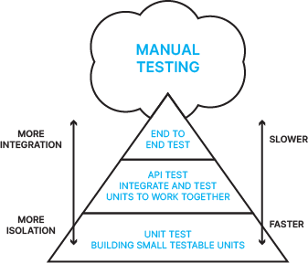

---
geometry:
- margin=1in
header-includes:
- \lstset{basicstyle=\ttfamily,
    stepnumber=2,
    numbersep=5pt,
    backgroundcolor=\color{black!10},
    showspaces=false,
    showstringspaces=false,
    showtabs=false,
    tabsize=2,
    captionpos=b,
    breaklines=true,
    breakatwhitespace=true,
    breakautoindent=true,
    linewidth=\textwidth}
colorlinks: true
toccolor: Blue
---
\newpage
# Testing

In this chapter, we focus on the importance of thoroughly testing software to ensure its quality.  No language or program is exempt from the importance of testing and automated testing, including programs written in COBOL.  The chapter explains how this can only be achieved in an effective and efficient way by automating the testing as part of a continuous delivery pipeline and introduces a framework that can enable such automation.


We will look at some of the background to software testing and the different types of testing, the value to an enterprise of using a continuous integration/continuous delivery pipeline, why automation is vital in CI/CD pipelines, and the risks of not adopting automation.

 

- **Importance of testing**

     - **What is testing and why do it?**

     - **What is unit testing?**

     - **What is function/integration/system testing?**

     - **The role of exploratory testing**

- **Why does automated testing matter?**

    - **Value of automated testing in continuous delivery**

    - **Dangers of not automating testing**

    - **Risks of not adopting continuous delivery**

    - **Use of automated testing for system reliability**

- **Testing on z/OS**

     - **Importance of testing on z/OS**

     - **Challenges for test automation on z/OS**

- **Basics of continuous integration, continuous delivery**

    - **Introduction to DevOps and CI/CD pipelines**

    - **Focus on efficiency and automation through the pipeline**

    - **Tests as the quality gatekeeper through phases of the pipeline**

    - **Managing the pipeline when test cases fail**

- **How can test automation be achieved on z/OS?**


## Importance of testing

If software is not tested, how can you or your users have confidence that it will behave as intended?


### What is testing and why do it?

Testing is the process of validating that software carries out the actions and provides the results that are expected.  It can, and should, encompass a number of different types of testing carried out at a number of different phases during the development lifecycle of the product, and potentially continue after the software has been released.  This allows errors and omissions in the software to be uncovered, as well as ensuring that it meets the user requirements.

 

There are several alarming examples of software defects and problems that could have been avoided by applying the proper and sufficient testing.

 

Put simply, software testing can be described as verification of the system or application under test.  Cem Kaner offers this definition:

"Software testing is an empirical technical investigation conducted to provide stakeholders with information about the quality of the product or service under test."

 

### What is unit testing?

Unit testing is the earliest phase of testing and validates that an individual unit or component of a software solution performs as designed.  Unit testing is typically carried out by the developer who wrote the code within the unit or component under test, along with other early validation activities such as static analysis and code review.  That is not to say that the unit tests created by the developer might also be re-run at later stages in the software lifecycle, to validate that the individual units still behave as intended.

 

Unit testing is important because the earlier defects can be found (or avoided), the less resource is required to resolve them.  A problem found early might be corrected by simple editing in minutes, whereas the same problem found later might require a lot of rewriting and re-testing.  Unit testing also often takes advantage of the developer's knowledge of the internals of the unit or units being tested.

 

The unit tests that are created as part of unit testing can also be very important, if they are designed in such a way that they can be run and re-run later in the development cycle, to validate that the behavior of the software units is still correct.

 
### What is function/integration/system testing?

Beyond the realm of unit testing, which is carried out by the developer, are a range of types of testing that typically fall into the realm of the tester.  These validate that when individual units of code are integrated together, or introduced into an existing software system, the overall system both continues to work correctly without any regressions and displays the new functionality that the new code is intended to enable.  There are a multitude of terms used to define these different types of testing, and in most organizations, there will be a sequence of test phases through which code will pass, each with their own names.

 

A useful approach to categorizing types of testing are the **Agile Test Quadrants** , introduced by Brian Marick ([http://www.exampler.com/old-blog/2003/08/21.1.html#agile-testing-project-1](http://www.exampler.com/old-blog/2003/08/21.1.html#agile-testing-project-1)).  This looks at tests in terms of distinguishing whether they are business facing or technology facing, as well as whether they are used by or on behalf of programmers to support programming or are intended to critique the product.  This results in four quadrants (see Figure 1):

 

- **Quadrant Q1** looks at unit testing, as well as component and integration testing, all of which focus on the technology.

- **Quadrant Q2** looks at more business facing and system level tests, such as functional tests and story tests.

- **Quadrant Q3** represents tests that focus on the business-level capability of the product, and aim to critique or discover any problems with this, such as exploratory testing, usability and user acceptance testing

- **Quadrant Q4** is focused on the system as a whole and how it meets business needs, but from a technology perspective, such as performance, load, stress, and security testing.

- Quadrants Q1 and Q2 often lend themselves to automated testing, while Q3 requires a more exploratory and manual approach, and Q4 might require tools focused on testing for performance or security, for example.


*Figure  1.   Agile Testing Quadrants (from http://tryqa.com/what-are-test-pyramid-and-testing-quadrants-in-agile-testing-methodology/ )*

 

Martin Fowler and Mike Kohn have discussed the concept of a Test Pyramid (see ’The Practical Test Pyramid’: [https://martinfowler.com/articles/practical-test-pyramid.html](https://martinfowler.com/articles/practical-test-pyramid.html)), which emphasizes the importance of a wide base of many small unit tests, then built upon that a set of equally important but less numerous tests that Mike Cohn called 'Service Tests'.  At the top of the pyramid are 'End to End tests', which include user interface tests, and which test the entire system from end to end.  Service tests covers a similar scope of testing as Integration Testing but is a term which has not gained much traction, and in our usage Integration Testing covers all the pyramid above the unit tests.

 

This chapter is not going to attempt to provide definitive definitions of the various types of testing but will use 'Integration Testing' as an umbrella term to cover much of the testing that occurs after development and which lends itself to automation.  This is where individual units of software are tested together, as well as being tested with other components including external parts of the system.  Such tests are usually run in an environment that matches some aspects of the ultimate target environment for the software.  Included within 'Integration Testing' are regression testing, functional testing, system testing, U.I. testing, end-to-end testing, user acceptance testing, performance testing.

 

A distinction should be made between types of **testing** and types of **tests** .  Unit tests for example can, and should, be run during later test phases, especially as part of regression testing.


### The role of exploratory testing

Exploratory testing was defined by Cem Kaner in 1984 (see [http://www.kaner.com/pdfs/QAIExploring.pdf](http://www.kaner.com/pdfs/QAIExploring.pdf)) as, "a style of software testing that emphasizes the personal freedom and responsibility of the individual tester to continually optimize the quality of their work by treating test-related learning, test design, test execution, and test result interpretation as mutually supportive activities that run in parallel throughout the project."

 

Exploratory testing allows a tester to use their skills and experience to discover, investigate and learn about the behavior of the software under test.  In the spirit of the Agile Manifesto, it emphasizes the "personal freedom and responsibility of the individual tester" ([https://www.guru99.com/exploratory-testing.html](https://www.guru99.com/exploratory-testing.html)).

 

In terms of the Agile Testing Quadrants, exploratory testing lies towards the side that aims to 'critique the product', which is covered nicely in this post: [https://www.testingexcellence.com/exploratory-testing-important-agile-projects/](https://www.testingexcellence.com/exploratory-testing-important-agile-projects/) .  

 

Exploratory testing is often referred to as being a 'thinking' activity.  It is also sometimes referred to as ad-hoc testing, but in reality, it is a much more directed and organized activity than being purely ad-hoc.

 

This type of testing makes the best use of the skills of the tester, but clearly by its very nature does not lend itself to automation.  The value of automation of testing lies in freeing the tester from the need to manually carry out repetitive and un-thinking testing.


## Why does automated testing matter?

Organizations that use z/OS for their mission-critical systems have enjoyed growth and success for many years.  So, does it matter if most of the testing is done manually?  In today's world, it is important to be able to respond very rapidly to new market opportunities and threats, and to have confidence in the quality and robustness of the services that you provide.


### Value of automated testing in continuous delivery

As we have seen, if testing cannot be automated, then it is difficult if not impossible to gain the benefits of continuous delivery, reducing the agility of an organization and its ability to react and innovate quickly.  Even responding to a new competitive threat or compliance regulation might not be possible without a CI/CD pipeline and automated testing.


### Dangers of not automating testing

If an organization continues to test manually, then they run the risk that the test cycle will be too long to enable the required agility and speed to market, or the amount of testing will have to be reduced, leading to uncertainty over the quality of the software being delivered, or perhaps both.


### Risks of not adopting continuous delivery

If an organization does not adopt a continuous delivery approach, in which small changes can be constantly delivered and tested, then there is a tendency to save up all the changes until enough have been made to justify the large effort involved in testing a software release.  Not only does this mean that users endure a long wait for new function to become available, but if problems occur then it is harder to identify the cause and to isolate the failing component.


Even more damaging could be the impact of being unable to deliver function rapidly into the marketplace, and missing opportunities as a result.


### Use of automated testing for system reliability

With automated testing in place, it is easy to run the checks which ensure the software is working as expected.  So, whenever a change is introduced into the system, such as applying maintenance, a hardware upgrade, or updates to another component, there is automation available to verify that all is as it should be.  This also means that such changes can be made more easily and with more confidence.


## Testing on z/OS

Many organizations have chosen IBM Z for the most critical aspects of their businesses, especially in industries including banking, insurance, and retail, where disruptions cannot be tolerated.  This means that in addition to relying on the inherent reliability, security and resilience of the platform, such companies also carry out extensive testing before introducing any change.


### Importance of testing on z/OS

Due to the mission critical nature of the software and applications running on z/OS, testing is vital to ensure that services can be provided uninterrupted, and that any change will both work as intended and not impact anything else.  This makes testing arguably more vital on z/OS than on any other platform.

 

The terminology used to describe the various phases of testing of z/OS applications indicate the importance that organizations attach to this testing, with terms like 'Quality Assurance' testing, 'Pre-Production' testing, 'User Acceptance' testing, not to mention the extensive phases of regression testing and performance testing required when introducing any change into the system.

 

This means that the estimates for any project that makes changes to an application on z/OS, or for a new application, include a very large portion of effort allocated to testing.


### Challenges for test automation on z/OS

With such extensive testing required, it might be thought that test automation would be widespread on z/OS.  However, test automation on z/OS has historically proved to be very difficult. 

 

Surveys and user research carried out by the IBM CICS Transaction Server for z/OS organization have shown that between 92 and 95% of testing on the platform is entirely or mostly manual, which is in line with industry estimates that place the percentage of manual testing at around 80% ("Even today, 80 percent of enterprise testing is done manually." - Sandeep Johri, Tricentis CEO).  The manual testing can vary in nature from a test suite that just needs to be set up and run manually, to typing in a sequence of steps that are described in a hardcopy book of test cases.

 

Why is test automation such a challenge on z/OS?  Some of the reasons are:

- Very large systems have been built up over the years; large both in terms of the number and size of components making up each application, and in terms of the environment in which the applications run.  Finding a way to drive these large systems as part of an automated test has proved challenging.

- There is a lack of test automation tools that understand the z/OS operating system, its subsystems and file stores, to make it practical to adopt these tools.

- The data is tightly integrated with the applications which use it and is often used by multiple applications.  Providing suitable test data, which can be isolated for use by each test run, and reset to known values, has been very challenging.

- Many applications rely on components which were developed many years ago, which means that testing needs to ensure these components will still run without issues or regressions. As Rosalind Radcliffe put it, "The best thing about the mainframe is a module compiled 40 years ago will still run. The worst thing about the mainframe is a module compiled 40 years ago will still run." [https://www.sonatype.com/an-innovators-journey-rosalind-radcliffe](https://www.sonatype.com/an-innovators-journey-rosalind-radcliffe)

The difficulty in achieving this has resulted in falling back to manual processes and checks, and as a result continuing to use waterfall processes.  To quote Sandeep Johri again, "If you move to Agile development but your testing cycle is still 6 to 12 weeks due to manual testing, you’ll fall right back into a Waterfall mode” ([https://devops.com/devops-chat-continuous-testing-w-sandeep-johri-ceo-tricentis/](https://devops.com/devops-chat-continuous-testing-w-sandeep-johri-ceo-tricentis/)).  If the testing cycle takes a long time, then developers will be tempted to group together lots of changes to get them tested all together, which is entirely counter to the idea of continuous integration.


# COBOL Check

In this chapter, we discuss the concept of unit testing in COBOL programming language with the use of COBOL Check. It delivers precise, fine-grained unit testing/checking capabilities for COBOL, matching the conceptual level of detail found in unit testing frameworks designed for popular languages like Python, Ruby, C#, Java etc.


- **Introduction to COBOL Check**

  - **What is COBOL Check?**
  - **Where Can you run COBOL Check?**
  - **How does COBOL Check accomplish unit testing?**


## Introduction to COBOL Check

### What is COBOL Check?

COBOL Check serves as a unit testing framework specifically designed to assist COBOL programmers who encounter challenges with modern development methods like test-driven development. One notable drawback of existing tools for COBOL and other mainframe languages is their limited granularity when it comes to unit testing, especially when compared to languages like Java, C++, and C# etc. However, COBOL Check offers a solution by enabling developers to conduct fine-grained unit testing using both gnuCOBOL and Enterprise COBOL.


### Where can you run COBOL Check?

COBOL Check strives to facilitate the maintenance and modernization of legacy COBOL applications on IBM zSeries systems. It achieves this by providing developers with the flexibility to work on either the mainframe platform or off-platform environments such as Windows, Unix, Linux, or OS X instances disconnected from the mainframe. By harnessing the advantages of fine-grained "micro test" development at the level of individual COBOL paragraphs. 

In this chapter, our focus will be on utilizing COBOL Check with Enterprise COBOL on a mainframe environment.

## How does COBOL Check accomplish unit testing?

With COBOL Check, we can exercise individual COBOL paragraphs in isolation from the rest of the program and without any access to any external resources such as datasets or CICS facilities. COBOL is not designed to do this kind of thing at runtime then how does COBOL check accomplish it?

Developers write test cases using the DSL (domain specific language). The DSL is designed to look similar to COBOL source code, so that it could be intuitive for COBOL programmers.

COBOL Check interprets these test cases and converts them into standard COBOL statements and merges them with the source of the program under the test. This copy of the program under test which contains test code is then compiled and executed. The test code does not run the entire procedure division; instead, it only calls the specific paragraphs that are mentioned in the test case.

COBOL Check uses a default directory structure to retrieve the COBOL programs, the test suites, copybooks etc. you can take a look at the wiki to get a clear understanding of the directory structures: https://github.com/openmainframeproject/cobol-check/wiki/Default-Directory-Structure

### The test pyramid


Cobol Check supports fine-grained unit-testing. Let's provide some contextual information to make the meaning of that clearer. This is a popular level of test automation; lets call it a pyramid or a triangle. The fundamental concept revolves around conducting software testing at various levels of abstraction. As we ascend in the diagram, the testing scope encompasses larger software components, whereas descending in the diagram involves testing smaller software elements.

The figure is wide at the bottom and narrow at the top to suggest that we want a large number of small test cases and a smaller number of big test cases. It is preferred because considering how difficult it is to test an entire application with all its external dependencies, environment configuration and test data and to test every combination of inputs and operating conditions at this level would be very tedious and time-consuming. Organizations that do all their testing by running the full system often lack sufficient time to test thoroughly before each release. If we push most of the test cases down to a level, we find we can write more test cases with less effort, so we can exercise each part of the code thoroughly. The test case runs in less time, and each test failure is easier to diagnose and fix.


### Test suites and test cases

* TESTSUITE - Provides a description for a series of test cases. The description is echoed in the output from the test run.  

* TESTCASE - identifies a test case. The description is echoed in the output of the test run.

A program can have multiple test suites, and each test suite can have multiple test cases.

The typical automated check follows these steps:

* Arrange: Establish the preconditions for the test case.

* Act: Execute the code under examination.

* Assert: Validate the anticipated outcome of the test

You can take a look at the COBOL Check wiki page for better understanding: https://github.com/openmainframeproject/cobol-check/wiki/A-Brief-Example


//

# Automation with GitHub Actions
GitHub Actions allows you to automate workflows within your GitHub repository. We thought that it would be a powerful and easy to use platform for automating tasks related to Zowe CLI commands and running COBOL Check. It allows defining workflows in a YAML configuration file, similar to other CI/CD tools.

This YAML file can specify Zowe CLI commands to be executed along with options for handling outputs and chaining actions.

To that end we have created a workflow that streamlines the testing process, making it easier and more efficient for developers to test their COBOL programs on the mainframe, all integrated seamlessly with GitHub.

One of the key objectives for future development is to further automate the process by extending the current workflow by incorporating the submission of jobs using JCL (Job Control Language) files.

In this tutorial, we'll be walking you through the steps we've taken to create this automation, from setting up the environment to running the final GitHub Actions workflow. We'll cover everything from the basics of using COBOL Check to integrating it with GitHub Actions.

Whether you're new to COBOL or an experienced programmer looking to modernize your workflow with GitHub Actions, we hope you'll find this tutorial helpful and informative.

So, let's dive in and see how we can make COBOL testing a breeze with automation and GitHub Actions!

## Lab 1: Setup
Now that we've introduced our project, let's talk about what you'll need to follow along and how to get started with GitHub.

Before we dive into creating our GitHub repository, let's go over the prerequisites you'll need to follow along with this tutorial:

1. A GitHub account: If you don't have one already, you'll need to sign up at github.com. It's free and only takes a few minutes.
2. Git installed on your local machine: This is essential for interacting with your GitHub repository from your computer. You can download it from git-scm.com. Make sure to choose the version appropriate for your operating system.
3. Basic understanding of Git: While we won't be diving deep into Git commands, familiarity with concepts like repositories, commits, and branches will be helpful.
4. A text editor: You'll need this for editing files locally. Popular choices include Visual Studio Code, Sublime Text, or even Notepad++.
5. Access to a mainframe environment: This is where we'll be running our COBOL programs. Your course instructor should have provided you with the necessary access details.
6. (Optional) GitHub Desktop: If you're new to Git or prefer a graphical interface, GitHub Desktop can be a user-friendly alternative to command-line Git. You can download it from desktop.github.com.

If you need to install Git or set up any of these tools, please pause the video now to do so. You can find installation guides for Git on the official Git website.

Now that we've covered the prerequisites, let's move on to creating our GitHub repository.

1. First, log into your GitHub account.
2. In the upper-right corner of the page, click the '+' icon, then select 'New repository'.
3. For the repository name, let's call it 'cobol-check-automation'.
4. You can add a description if you like. I'll add: "Automating COBOL testing with cobolcheck and GitHub Actions."
5. Keep the repository public so others can see and learn from your work.
6. Now, here's an important step: Check the box that says 'Initialize this repository with a README'. This will create a README file for us to start with.
7. You can add a .gitignore file if you want, but for now, we'll skip this.
8. For the license, you can choose an open-source license if you plan to share your code widely. For this tutorial, I'll select the MIT License.
9. Finally, click 'Create repository'.

And there we have it! We've just created our new GitHub repository with a README file initialized.

Great! Now that we've created our repository on GitHub, let's get it onto your local machine so you can work with the files directly. There are many ways to do this, but for the sake of simplicity, we will do this using Git from the command line.

1. First, open your terminal or command prompt.
2. Navigate to the directory where you want to store your project.
3. On your GitHub repository page, click the green 'Code' button and copy the URL provided.
4. In your terminal, type the following command, replacing `[URL]` with the URL you just copied:
```bash
   git clone [URL]
```
1. Press Enter, and Git will clone the repository to your local machine.

We will now discuss the last step before we are all set to begin cobolcheck.

### GitHub Secrets:

GitHub Secrets are a way to store sensitive information in your GitHub repository. These could be things like API keys, passwords, or in our case, mainframe credentials. The key feature of GitHub Secrets is that they're encrypted and only exposed to selected GitHub Actions during runtime.

Why do we use GitHub Secrets?

1. Security: We never want to hardcode sensitive information directly into our scripts or workflows. That would be like leaving your house key under the doormat - anyone who can see your code would have access to your sensitive data.
2. Flexibility: By using secrets, we can easily update our credentials without changing our code.
3. Best Practices: Using secrets is considered a best practice in DevOps and helps in maintaining compliance with various security standards.

For our COBOL automation project, we'll need to store our mainframe credentials as secrets. This way, our GitHub Actions can securely access the mainframe without exposing the credentials in our code.

Let me show you how to set up a secret in our repository:

```plaintext
[Switch to GitHub repository screen]
```

1. In your repository, click on the 'Settings' tab.
2. In the left sidebar, click on 'Secrets and variables', then 'Actions'.
3. Click on 'New repository secret'.
4. For the name, let's enter `ZOWE_USERNAME`. This will be our mainframe username.
5. In the value field, enter your actual mainframe username.
6. Click 'Add secret'.

Let's add another secret for our password:

1. Click 'New repository secret' again.
2. Name this one `ZOWE_PASSWORD`.
3. Enter your mainframe password as the value.
4. Click 'Add secret'.

Great! Now we have our mainframe credentials stored securely as GitHub Secrets.

In our GitHub Actions workflow, we'll be able to access these secrets using special syntax, like this:
```bash
${{ secrets.ZOWE_USERNAME }} ${{ secrets.ZOWE_PASSWORD }}
```
This allows our workflow to use the credentials without ever exposing them in our code.

Remember, never share your secrets or commit them to your repository. GitHub Secrets are designed to keep this information secure, so always use them for sensitive data.

In the next segment, we'll start setting up our GitHub Actions workflow and see how we can use these secrets in our automation.

### Workflows:
Now that we have our repository set up and our secrets in place, it's time to create our GitHub Actions workflow. This is where the magic happens - we'll automate our COBOL testing process.

First, let's talk about what GitHub Actions are. They're essentially automated workflows that you can set up in your GitHub repository. These workflows can do things like run tests, deploy code, or in our case, run COBOL checks whenever we make changes to our code.

Let's create our workflow:

1. In your GitHub repository, click on the 'Actions' tab.
2. You'll see a page suggesting some workflow templates. For our custom workflow, click on 'set up a workflow yourself'.

This will create a new YAML file in a `.github/workflows` directory. YAML is a human-friendly data serialization standard that's commonly used for configuration files.

Let's go through this file and set it up for our needs:

```yaml
name: COBOL Check Automation

on:
  push:
    branches: [ main ]

jobs:
  cobol-check:
    runs-on: ubuntu-latest

    steps:
    - uses: actions/checkout@v3

    - name: Set up Java
      uses: actions/setup-java@v2
      with:
        java-version: '11'
        distribution: 'adopt'
        
    - name: Install Zowe CLI
      run: npm install -g @zowe/cli@latest
      
    - name: Run COBOL Check
      env:
        ZOWE_USERNAME: ${{ secrets.ZOWE_USERNAME }}
        ZOWE_PASSWORD: ${{ secrets.ZOWE_PASSWORD }}
      run: |
        # Here we'll add our commands to run cobolcheck
        echo "Running COBOL Check"
        # Add actual cobolcheck commands here
```

Let's break this down:

- We're defining a job called 'cobol-check' that runs on the latest Ubuntu environment.
- The 'steps' section outlines what the job will do:
  1. It checks out our repository.
  2. It sets up Java, which is needed for cobolcheck.
  3. It installs Zowe CLI, which we will need for mainframe interaction.
  4. It runs our COBOL check commands.

Notice how we're using our GitHub Secrets here. We're setting them as environment variables that our script can use, but their values are never exposed in the logs.

Now, let's commit this workflow file:

```plaintext
[Switch to GitHub interface]
```

1. Scroll down and click 'Start commit'.
2. Add a commit message like "Add GitHub Actions workflow for COBOL checking".
3. Click 'Commit new file'.

Great! We've just set up our GitHub Actions workflow. To test it, if it hasn't already been triggered by our commit, let's make a small change to our repository - maybe update the README file.

```plaintext
[Make a change and commit]
```

Now, if we go to the Actions tab, we should see our workflow running. Click on it to see the details.

```plaintext
[Show workflow running]
```

You can see each step being executed. If there are any issues, they'll be highlighted here.

And that's it! We've successfully set up a GitHub Actions workflow to automate our COBOL checking process. In the next segment, we'll dive deeper into the actual COBOL checking commands and how to interpret the results.

### COBOL Check:
Now that we have our GitHub Actions workflow set up, we need to add the COBOL Check tool to our repository. This will ensure that our workflow has access to the tool when it runs.

Let's go through this process step by step:

1. Navigate to the COBOL Check GitHub repository at https://github.com/openmainframeproject/cobol-check/tree/Developer/build/distributions.

2. Here, we're looking for the latest .zip file. It should be named something like 'cobol-check-0.X.X.zip' (as of March 2025 newest version is 2.16). Click on the 'View raw' button or the download button in the top right corner to download this file.

3. Once the download is complete, let's extract the contents of the zip file.

    ```plaintext
    [Switch to file explorer]
    ```

    Right-click on the downloaded zip file and select 'Extract All' (on Windows) or use your preferred extraction method.

4. Now that we have the files extracted, let's add them to our repository.

    ```plaintext
    [Switch to your local repository folder]
    ```

    On your local environment, drag the extracted 'cobol-check-0.X.X' folder into your own repository (i.e. inside 'cobol-check-automation') and rename it to just 'cobol-check' by removing its '-0.X.X' suffix. This way, regardless of future COBOL Check versions we can always use `./cobol-check` inside our scripts to access the utility.

5. Next, we need to stage these new files for commit.

    ```plaintext
    [Open terminal/command prompt]
    ```

    Navigate to your repository folder and run these Git commands:

    ```bash
    git add cobol-check
    git status
    ```

    The `git status` command will show you all the new files that are staged for commit.

6. Now, let's commit these changes:

    ```bash
    git commit -m "Add COBOL Check tool to repository"
    ```

7. Finally, we need to push these changes to GitHub:

    ```bash
    git push origin main
    ```

    ```plaintext
    [Switch to GitHub repository page and refresh]
    ```

    Great! Now, you should see the new 'cobol-check' folder in your GitHub repository.

    By adding COBOL Check directly to our repository, we ensure that our GitHub Actions workflow will have access to the tool without needing to download it each time the workflow runs. This can save time and reduce potential points of failure in our automation.

    In the next segment, we'll update our GitHub Actions workflow to use this local copy of COBOL Check, and we'll start writing the actual commands to run our COBOL tests.

### Basic Script
In this segment, we're going to create a crucial script for our COBOL Check automation process. This script, which we'll call `zowe_operations.sh`, is responsible for setting up our mainframe environment and uploading the necessary files for COBOL Check to run there.

But before we create it, let's understand why we need this script and what it does:

1. **Mainframe Interaction**: This script uses Zowe CLI to interact with the mainframe. Zowe is an open-source framework that simplifies interaction with z/OS systems.
2. **Environment Setup**: It ensures that we have the correct directory structure on the mainframe to run our COBOL Check tests there.
3. **File Transfer**: It uploads our COBOL Check files from our GitHub repository to the mainframe.

By automating these steps, we ensure that every time our GitHub Actions workflow runs, we have the correct environment and up-to-date files on the mainframe to run our COBOL Check tests.

**Now, let's create this script in our repository.**

1. Navigate to your GitHub repository in your web browser.
2. Click on the 'Add file' button, then select 'Create new file'.
3. In the name field, type `.github/scripts/zowe_operations.sh`. This will automatically create the `.github` and `scripts` folders if they don't exist.
4. In the file editor, let's add our script:

    ```bash
    #!/bin/bash

    # zowe_operations.sh

    # Convert username to lowercase
    LOWERCASE_USERNAME=$(echo "$ZOWE_USERNAME" | tr '[:upper:]' '[:lower:]')

    # Check if directory exists, create if it doesn't
    if ! zowe zos-files list uss-files "/z/$LOWERCASE_USERNAME/cobolcheck" &>/dev/null; then
      echo "Directory does not exist. Creating it..."
      zowe zos-files create uss-directory "/z/$LOWERCASE_USERNAME/cobolcheck"
    else
      echo "Directory already exists."
    fi

    # Upload files
    zowe zos-files upload dir-to-uss "./cobol-check" "/z/$LOWERCASE_USERNAME/cobolcheck" --recursive --binary-files "cobol-check-0.2.16.jar"

    # Verify upload
    echo "Verifying upload:"
    zowe zos-files list uss-files "/z/$LOWERCASE_USERNAME/cobolcheck"
    ```

5. Please take notice of the "Upload files" section at the end. It runs a Zowe command that uploads the COBOL Check folder to the mainframe and we need to make sure that the Java binary file within it (which includes an evolving version suffix in its name) is correctly specified in the "--binary-files" flag. In this example, it's "cobol-check-0.2.16.jar". 
6. Also, make sure this long command is typed in a single line, even if it appears to be split in this document's text.
7. Scroll down to the 'Commit new file' section.
8. Add a commit message like "Add Zowe operations script in .github/scripts/".
9. Ensure 'Commit directly to the main branch' is selected.
10. Click 'Commit new file'.

Great! Now our Zowe operations script is in the repository, neatly organized in the `.github/scripts/` directory.

**Next, let's update our GitHub Actions workflow to use this new script:**

1. In your repository, navigate to the `.github/workflows` directory.
2. Click on the workflow file we created earlier (which GitHub calls `main.yml` by default).
3. Click the pencil icon to edit the file.
4. Find the step we previously named 'Run COBOL Check' and update it to look like this:

    ```yaml
    - name: Setup Mainframe Environment and Upload COBOL Check
      env:
        ZOWE_OPT_HOST: 204.90.115.200
        ZOWE_OPT_PORT: 10443
        ZOWE_OPT_USER: ${{ secrets.ZOWE_USERNAME }}
        ZOWE_OPT_PASSWORD: ${{ secrets.ZOWE_PASSWORD }}
        ZOWE_OPT_REJECT_UNAUTHORIZED: false 
        ZOWE_USERNAME: ${{ secrets.ZOWE_USERNAME }}
        ZOWE_PASSWORD: ${{ secrets.ZOWE_PASSWORD }}
      run: |
        chmod +x .github/scripts/zowe_operations.sh
        .github/scripts/zowe_operations.sh
    ```

5. Scroll down to the 'Commit changes' section.
6. Add a commit message like "Update workflow to use Zowe operations script from .github/scripts/".
7. Ensure 'Commit directly to the main branch' is selected.
8. Click 'Commit changes'.

We've now created our Zowe operations script in a dedicated scripts folder and updated our workflow to use it, all directly on GitHub. This organization keeps our repository clean and makes it easier to manage multiple scripts as our project grows.

### Testing Script:
Now that we have our environment set up and COBOL Check files uploaded to the mainframe, we need to create the main script that will actually run COBOL Check on our mainframe. This script will set up the necessary environment variables, make our files executable, and run COBOL Check for each of our programs.

Let's create this script directly on GitHub:

1. Navigate to your GitHub repository in your web browser.
2. Click on the 'Add file' button, then select 'Create new file'.
3. Name the file `.github/scripts/mainframe_operations.sh`.
4. In the file editor, let's add our script:

    ```bash
    #!/bin/bash

    # mainframe_operations.sh

    # Set up environment
    export PATH=$PATH:/usr/lpp/java/J8.0_64/bin
    export JAVA_HOME=/usr/lpp/java/J8.0_64
    export PATH=$PATH:/usr/lpp/zowe/cli/node/bin

    # Check Java availability
    java -version

    # Set ZOWE_USERNAME
    ZOWE_USERNAME="Z99998"  # Replace with your actual username

    # Change to the cobolcheck directory
    cd cobolcheck
    echo "Changed to $(pwd)"
    ls -al

    # Make cobolcheck executable
    chmod +x cobolcheck
    echo "Made cobolcheck executable"

    # Make script in scripts directory executable
    cd scripts
    chmod +x linux_gnucobol_run_tests
    echo "Made linux_gnucobol_run_tests executable"
    cd ..

    # Function to run cobolcheck and copy files
    run_cobolcheck() {
      program=$1
      echo "Running cobolcheck for $program"

      # Run cobolcheck, but don't exit if it fails
      ./cobolcheck -p $program
      echo "Cobolcheck execution completed for $program (exceptions may have occurred)"

      # Note: The "CC##99.CBL" file name below is NOT a placeholder
      # Keep it as is in the code

      # Check if CC##99.CBL was created, regardless of cobolcheck exit status
      if [ -f "CC##99.CBL" ]; then
        # Copy to the MVS dataset
        if cp CC##99.CBL "//'${ZOWE_USERNAME}.CBL($program)'"; then
          echo "Copied CC##99.CBL to ${ZOWE_USERNAME}.CBL($program)"
        else
          echo "Failed to copy CC##99.CBL to ${ZOWE_USERNAME}.CBL($program)"
        fi
      else
        echo "CC##99.CBL not found for $program"
      fi

      # Copy the JCL file if it exists
      if [ -f "${program}.JCL" ]; then
        if cp ${program}.JCL "//'${ZOWE_USERNAME}.JCL($program)'"; then
          echo "Copied ${program}.JCL to ${ZOWE_USERNAME}.JCL($program)"
          # Submit job to run testing version of the program
          submit ${program}.JCL
          echo "Submitted job ${program}.JCL"
        else
          echo "Failed to copy ${program}.JCL to ${ZOWE_USERNAME}.JCL($program)"
        fi
      else
        echo "${program}.JCL not found"
      fi
    }

    # Run for each program
    for program in NUMBERS EMPPAY DEPTPAY; do
      run_cobolcheck $program
    done

    echo "Mainframe operations completed"
    ```

5. Scroll down to the 'Commit new file' section.
6. Add a commit message like "Add main COBOL Check execution script".
7. Ensure 'Commit directly to the main branch' is selected.
8. Click 'Commit new file'.

Now that we've added this script, we need to update our GitHub Actions workflow to use it. Let's add a new step to our workflow:

[Navigate to the workflow file]

Add this new step after the 'Setup Mainframe Environment and Upload COBOL Check' step:

```yaml
- name: Run COBOL Check on Mainframe
  env:
    ZOWE_USERNAME: ${{ secrets.ZOWE_USERNAME }}
    ZOWE_PASSWORD: ${{ secrets.ZOWE_PASSWORD }}
  run: |
    sshpass -p "$ZOWE_PASSWORD" ssh -o StrictHostKeyChecking=no $ZOWE_USERNAME@204.90.115.200 'sh -s' < .github/scripts/mainframe_operations.sh
```

Note that this new step will execute our mainframe operations script directly on the mainframe itself, by way of establishing a secure shell (ssh) connection and feeding our bash script into it, thus running COBOL Check for each specified program using the file structure previously uploaded to your user directory in the zOS Unix System Services (i.e. "/z/z99999/cobolcheck/").

This is in contrast to our previous shell script which ran within the GitHub Actions environment using the files and folders located in the repository itself. Again, make sure that this long last command is typed in a single line of code.

Remember to commit these changes to the workflow file with an appropiate message like "Update workflow with new mainframe step".

In the GitHub Actions output for this step, you should expect to see:

1. Confirmation that the script changed to the correct directory (note that here the directory is called "cobolcheck", with no dash, as we named it when uploading the folder into mainframe earlier).
2. Messages about making files executable.
3. Output from COBOL Check for each program (NUMBERS, EMPPAY, DEPTPAY). Note that only NUMBERS exists for now, as we will be creating the other ones on upcoming lab steps.
4. Messages about copying files to MVS datasets.
5. Any error messages if something goes wrong.

### JCL:
Now that we have our main COBOL Check execution script, we need to create the Job Control Language (JCL) files for each of our COBOL programs. These JCL files are crucial as they define how our programs will be compiled and executed on the mainframe.

**Let's start by creating the JCL file for our NUMBERS program:**

1. Navigate to your GitHub repository in your web browser.
2. Be sure to be inside your "cobol-check" folder.
3. Click on the 'Add file' button, then select 'Create new file'.
4. Name the file `NUMBERS.JCL`.
5. In the file editor, let's add our JCL content:

```plaintext
//NUMBERSJ JOB 1,NOTIFY=&SYSUID
//*******************************************************
//COBRUN  EXEC IGYWCL
//COBOL.SYSIN  DD DSN=&SYSUID..CBL(NUMBERS),DISP=SHR
//LKED.SYSLMOD DD DSN=&SYSUID..LOAD(NUMBERS),DISP=SHR
//*******************************************************
// IF RC = 0 THEN
//*******************************************************
//RUN     EXEC PGM=NUMBERS
//STEPLIB   DD DSN=&SYSUID..LOAD,DISP=SHR
//SYSOUT    DD SYSOUT=*,OUTLIM=15000
//CEEDUMP   DD DUMMY
//SYSUDUMP  DD DUMMY
//*******************************************************
// ENDIF
```

Now, let's break down what this JCL file does:

1. `//NUMBERSJ JOB 1,NOTIFY=&SYSUID`: This line defines the job name and parameters.
2. `//COBRUN  EXEC IGYWCL`: This executes the COBOL compiler and linkage editor.
3. `//COBOL.SYSIN  DD DSN=&SYSUID..CBL(NUMBERS),DISP=SHR`: This specifies the input COBOL source code.
4. `//LKED.SYSLMOD DD DSN=&SYSUID..LOAD(NUMBERS),DISP=SHR`: This specifies where to store the compiled program.
5. The `IF RC = 0 THEN` block: This checks if the compilation was successful.
6. `//RUN     EXEC PGM=NUMBERS`: This executes the NUMBERS program.
7. The subsequent DD statements define the necessary datasets for the program execution.

This JCL file will compile our NUMBERS COBOL program and, if successful, run it on the mainframe.

5. Scroll down to the 'Commit new file' section.
6. Add a commit message like "Add JCL file for NUMBERS program".
7. Ensure 'Commit directly to the main branch' is selected.
8. Click 'Commit new file'.

**Now that we've added this JCL file, our `mainframe_operations.sh` script will be able to find and use it when running COBOL Check for the NUMBERS program.**

In the GitHub Actions output, you should now expect to see:

1. A message indicating that `NUMBERS.JCL` was found.
2. A message confirming that `NUMBERS.JCL` was copied to the appropriate MVS dataset.

Remember, we still need to create similar JCL files for the upcoming EMPPAY and DEPTPAY programs. In a real-world scenario, each program would have its own specific JCL file tailored to its requirements as file definitions and other dependencies needed to run will usually vary on a case-by-case basis. However, for this practice we'll keep it simple with minimal data definitions.

**Now that we've created and committed our JCL file, let's review how we can also manually submit this job using Zowe Explorer in Visual Studio Code. As you'll recall from the introductory chapter of this course, you should already have Zowe Explorer set up and configured in your VSCode environment.**

Let's go through the process of submitting our NUMBERS job:

1. Open VSCode and locate the Zowe Explorer icon in your sidebar. Click on it to open the Zowe Explorer panel.
2. In the Zowe Explorer panel, you should see your mainframe connection that we set up earlier in the course.
3. Expand your connection and navigate to your partitioned JCL dataset. It should likely be named `<YOURUSERID>.JCL`.
4. Find the NUMBERS member we just created and uploaded via script.
5. Right-click on the NUMBERS member and select 'Submit Job'.
6. Zowe Explorer will submit the job to the mainframe and show you the job ID. You'll see a notification in the bottom right corner of VSCode with this information.
7. Once the job is completed, right-click on the job in the 'Jobs' view and select 'View Job Output' to see the results of your job submission.

This process allows you to quickly test your JCL and see the results without leaving your VSCode environment. It's particularly useful when you're making changes to your COBOL programs or JCL and want to test them immediately.

Remember, while our GitHub Actions workflow can automate this process, being able to manually submit jobs is an important skill for mainframe development and debugging. It allows you to iteratively test and refine your programs and JCL files.

## Lab 2: Unit Testing
Now that we've set up our environment and created our JCL files, let's dive into unit testing our COBOL programs using COBOL Check. In this segment, we'll focus on creating and testing our EMPPAY program.

**First, let's create our `EMPPAY.CBL` program:**

1. Navigate to your GitHub repository in your web browser.
2. Go to the `src/main/cobol` directory, where the NUMBERS.CBL file already resides.
3. Click on the 'Add file' button, then select 'Create new file'.
4. Name the file `EMPPAY.CBL`.
5. In the file editor, let's add our COBOL program:

    ```cobol
          IDENTIFICATION DIVISION.
          PROGRAM-ID. EMPPAY.
          AUTHOR. ASHIS KUMAR NAIK.

          DATA DIVISION.
          WORKING-STORAGE SECTION.
          77  REC-COUNTER              PIC 9(1).
          01  EMP-RECORD.
              05  EMP-NAME.
                    10 EMP-FNAME        PIC X(15) VALUE 'FRANCISCO'.
                    10 EMP-LNAME        PIC X(15).
              05  EMP-HOURLY-RATE      PIC 9(3)V99.
              05  EMP-OT-RATE          PIC V99.
              05  EMP-REWARD           PIC V99.
              05  EMP-HOURS            PIC 9(3).
              05  EMP-PAY-WEEK         PIC 9(7)V99.
              05  EMP-PAY-MONTH        PIC 9(7)V99.

          PROCEDURE DIVISION.
              PERFORM INITIALIZATION.
              PERFORM PAYMENT-WEEKLY.
              PERFORM PAYMENT-MONTHLY.
              PERFORM SHOW-OUTPUT.
              STOP RUN.

          INITIALIZATION.
              MOVE "Millard"           TO EMP-FNAME.
              MOVE "Fillmore"          TO EMP-LNAME.
              MOVE 19                  TO EMP-HOURS.
              MOVE 23.50               TO EMP-HOURLY-RATE.

          PAYMENT-WEEKLY.
              IF  EMP-HOURS >= 40
                  MOVE .25 TO  EMP-OT-RATE
              ELSE IF EMP-HOURS >= 50
                  MOVE .50 TO EMP-OT-RATE 
              ELSE
                  MOVE ZERO TO EMP-OT-RATE.
              COMPUTE EMP-PAY-WEEK =
                    (EMP-HOURS * EMP-HOURLY-RATE) * (1 + EMP-OT-RATE).

          PAYMENT-MONTHLY.
              IF  EMP-HOURS > 150
                  MOVE .50 TO  EMP-REWARD
              ELSE
                  MOVE ZERO TO EMP-REWARD.
              COMPUTE EMP-PAY-MONTH =
                    (EMP-PAY-WEEK * 4) * (1 + EMP-REWARD).

          SHOW-OUTPUT.
              DISPLAY "Name: " EMP-NAME.
              DISPLAY "Hours Worked Per Week: " EMP-HOURS.
              DISPLAY "Hourly Rate: " EMP-HOURLY-RATE.
              DISPLAY "Bonus-Rate: " EMP-OT-RATE.
              DISPLAY "Gross Pay Per Week: " EMP-PAY-WEEK .
              DISPLAY "Gross Pay Per Month: " EMP-PAY-MONTH .
              DISPLAY "Hi Chris - how's Loretta today?".
    ```

    6. Commit this new file to your repository with an appropiate message like "Add EMPPAY COBOL program".

    **Now that we have our EMPPAY program, let's create our test suite:**

    1. In your repository, navigate to the `test/cobol` directory.
    2. Create a new directory named `EMPPAY`.
    3. Inside the EMPPAY directory, create a new file named `EMPPAY.cut`.
    4. In this file, we'll write our test cases:

    ```plaintext
    TestSuite 'Checks the employee payment'

    TestCase 'checks the EMP-OT-RATE TO be 0.25'
        MOVE 50 TO EMP-HOURS
        MOVE 23.50 TO EMP-HOURLY-RATE
        PERFORM PAYMENT-WEEKLY
        EXPECT EMP-OT-RATE TO BE 0.25

    TestCase 'checks the EMP-PAY-WEEKLY > 900 if EMP-HOURS >= 40'
        MOVE 40 TO EMP-HOURS
        MOVE 23.50 TO EMP-HOURLY-RATE
        PERFORM PAYMENT-WEEKLY
        EXPECT EMP-PAY-WEEK >= 900

    TestCase 'checks the EMP-PAY-WEEKLY > 1600 '
        MOVE 60 TO EMP-HOURS
        MOVE 23.50 TO EMP-HOURLY-RATE
        PERFORM PAYMENT-WEEKLY
        EXPECT EMP-PAY-WEEK >= 1600

    TestCase 'checks the EMP-PAY-MONTHLY to be greater than 9600'
        MOVE 160 TO EMP-HOURS
        MOVE 1600 TO EMP-PAY-WEEK
        PERFORM PAYMENT-MONTHLY
        EXPECT EMP-PAY-MONTH >= 9600
    ```

    5. Commit these changes to your repository with an appropiate message like "Add EMPPAY test suite".

    **Now that we have our EMPPAY program and its test suite, we need to create the JCL file to run it on the mainframe. Let's create `EMPPAY.JCL`:**

    1. In your GitHub repository, navigate to the `cobol-check` directory.
    2. Click on 'Add file', then 'Create new file'.
    3. Name the file `EMPPAY.JCL`.
    4. In the file editor, add the following JCL content:

    ```plaintext
    //EMPPAY JOB 1,NOTIFY=&SYSUID
    //*******************************************************
    //* Copyright Contributors to the COBOL Programming Course
    //* SPDX-License-Identifier: CC-BY-4.0
    //*******************************************************
    //COBRUN  EXEC IGYWCL
    //COBOL.SYSIN  DD DSN=&SYSUID..CBL(EMPPAY),DISP=SHR
    //LKED.SYSLMOD DD DSN=&SYSUID..LOAD(EMPPAY),DISP=SHR
    // IF RC = 0 THEN
    //RUN     EXEC PGM=EMPPAY
    //STEPLIB   DD DSN=&SYSUID..LOAD,DISP=SHR
    //SYSOUT    DD SYSOUT=*,OUTLIM=15000
    //CEEDUMP   DD DUMMY
    //SYSUDUMP  DD DUMMY
    // ENDIF
    ```

5. Commit this new file to your repository with an appropiate message like "Add EMPPAY JCL file".

This JCL file will compile our EMPPAY program and, if successful, run it on the mainframe. It's crucial for executing our tests in the mainframe environment.

When we run our GitHub Actions workflow, it will now:

1. Upload `EMPPAY.CBL` to the mainframe.
2. Run COBOL Check on EMPPAY.
3. Generate the `CC##99.CBL` file.
4. Copy this file as `EMPPAY` to the appropriate MVS dataset.
5. Submit the `EMPPAY.JCL` job to run the tests.

In the GitHub Actions output, you should expect to see:

1. Messages about running COBOL Check for EMPPAY.
2. Output from the COBOL Check process.
3. Messages about copying `CC##99.CBL` to the MVS dataset.
4. Job submission and output for `EMPPAY.JCL`.

Remember, writing good unit tests is crucial for maintaining code quality. These tests help us catch bugs early and ensure that our code behaves correctly even as we make changes.

## Lab 3: Test Driven Development
Now that we've seen how to write unit tests for existing code, let's explore Test-Driven Development (TDD) using COBOL Check. TDD is a software development process where you write tests before writing the actual code. This approach can lead to better code quality and design.

### Let's create a new program called DEPTPAY using TDD:

1. First, we'll write our test cases. In your GitHub repository, create a new file at 'src/test/cobol/DEPTPAY.cut' with the following content:
```
TestSuite "Calculation of average Salary"

TestCase 'NUMBER OF PERSON TO BE 19'
    PERFORM AVERAGE-SALARY.
    EXPECT DEPT-NBR-EMPS TO BE 19

TestCase 'TOTAL AVERAGE SALARY TO BE 111111.11'
    PERFORM AVERAGE-SALARY.
    EXPECT DEPT-TOTAL-SALARIES TO BE 111111.11
```
2. Now, let's create our COBOL program to pass these tests. Create a new file at 'src/main/cobol/DEPTPAY.CBL':

```cobol
       IDENTIFICATION DIVISION.
       PROGRAM-ID. DEPTPAY.

       DATA DIVISION.
       WORKING-STORAGE SECTION.
       01  DEPT-RECORD.
           05  DEPT-NAME            PIC X(20).
           05  DEPT-LOC             PIC X(12).
           05  DEPT-MANAGER.
                10 MANAGER-FNAME    PIC X(15).
                10 MANAGER-LNAME    PIC X(15).
           05  DEPT-NBR-EMPS        PIC 9(3).
           05  DEPT-TOTAL-SALARIES  PIC 9(7)V99.
           05  DEPT-AVG-SALARY      PIC 9(7)V99.

       PROCEDURE DIVISION.
           PERFORM AVERAGE-SALARY.
           PERFORM DISPLAY-DETAILS.
           STOP RUN.

       AVERAGE-SALARY.
           MOVE "FINANCE"           TO DEPT-NAME.
           MOVE "SOUTHWEST"         TO DEPT-LOC.
           MOVE "Millard"           TO MANAGER-FNAME.
           MOVE "Fillmore"          TO MANAGER-LNAME.
           MOVE 19                  TO DEPT-NBR-EMPS.
           MOVE 111111.11           TO DEPT-TOTAL-SALARIES.
           COMPUTE DEPT-AVG-SALARY =
                (DEPT-TOTAL-SALARIES / DEPT-NBR-EMPS).

       DISPLAY-DETAILS.
           DISPLAY "Department Name: " DEPT-NAME.
           DISPLAY "Department Location: " DEPT-LOC.
           DISPLAY "Manager FNAME: " MANAGER-FNAME.
           DISPLAY "Manager NAME: " MANAGER-FNAME.
           DISPLAY "Department AVG Salary: " DEPT-AVG-SALARY.
           DISPLAY "Number of employees: " DEPT-NBR-EMPS.
```

3. Now, let's create a JCL file to run our tests. Create 'DEPTPAY.JCL' in the `cobol-check` directory of your repository:
```
  //DEPTPAYJ JOB 1,NOTIFY=&SYSUID
  //*******************************************************
  //* Copyright Contributors to the COBOL Programming Course
  //* SPDX-License-Identifier: CC-BY-4.0
  //*******************************************************
  //COBRUN  EXEC IGYWCL
  //COBOL.SYSIN  DD DSN=&SYSUID..CBL(DEPTPAY),DISP=SHR
  //LKED.SYSLMOD DD DSN=&SYSUID..LOAD(DEPTPAY),DISP=SHR
  // IF RC = 0 THEN
  //RUN     EXEC PGM=DEPTPAY
  //STEPLIB   DD DSN=&SYSUID..LOAD,DISP=SHR
  //SYSOUT    DD SYSOUT=*,OUTLIM=15000
  //CEEDUMP   DD DUMMY
  //SYSUDUMP  DD DUMMY
  // ENDIF

```

4. Commit all these changes to your repository with an appropiate message like "Add DEPTPAY COBOL, JCL and Test files".

Now, let's add a new test case to demonstrate the TDD process. Add the following to your DEPTPAY.cut file:

```
TestCase 'AVERAGE SALARY WILL BE GREATER THAN 5840'
    PERFORM AVERAGE-SALARY.
    EXPECT DEPT-AVG-SALARY >= 5840
```

Commit this change to your repository with an appropiate message like "Add DEPTPAY Test Case".

When you run your GitHub Actions workflow now, it will:
1. Run COBOL Check on `DEPTPAY`.
2. Copy the generated `CC##99.CBL` to the mainframe as `DEPTPAY`.
3. Submit the `DEPTPAY.JCL` job.

In the job output, look for the status code. A 'CC 0000' indicates success. If you see a different code, you'll need to adjust your code or tests and rerun the workflow.

This TDD approach ensures that your code is testable from the start and that all functionality is covered by tests. It can lead to better design decisions and more maintainable code.


## Basics of continuous integration, continuous delivery

Continuous Integration and Continuous Delivery (CI/CD) are important practices within a DevOps approach, which allow software to be evolved and enhanced at a rate that meets the needs of the business and users, rather than being artificially delayed by long testing cycles which in turn result in a batching up of the delivery of software changes.


### Introduction to DevOps and CI/CD pipelines

At its heart, DevOps refers to a building a greater collaboration between the software development and IT operations teams within an organization.  By working together, the systems development lifecycle of building, testing and releasing software can be shortened, and software changes can be continuously integrated and continuously delivered to provide value more rapidly and reliably.

A key step in adopting a successful DevOps approach is to set up a **CI/CD pipeline** .

**Continuous Integration (CI)** is a technique first identified by Grady Booch, involving frequent checking in of small code changes made by a development team, which are merged together into a 'Master' code stream.  CI provides a consistent way of building and packaging changes and validating that they work together, encouraging teams to commit changes more frequently.  Martin Fowler summarized the benefits by saying that "Continuous Integration doesn't get rid of bugs, but it does make them dramatically easier to find and remove".

**Continuous Delivery (CD)** progresses the code changes further around the pipeline process, by automating the delivery of the changed software to a series of environments for testing, and ultimately production.  Some people distinguish between Continuous Delivery, which ensures working and tested releases of software are ready at any time, to production, but requires a manual decision process prior to that final deployment, and continuous deployment which also automates the releasing into production.


All of this requires **Continuous Testing** to ensure that quality software is being made available at each stage, and ultimately delivered to production.  To take this further, there is also value in continuous monitoring of the software in production, continuous feedback from stakeholders and users, and ultimately 'Continuous Everything'.


Making everything as continuous and as automated as possible is what a **DevOps pipeline** aims to achieve.  Such pipelines are often represented pictorially as a funnel, with code units being fed in at one end, passing through various phases of building and testing within a sequence of environments, and being delivered into production at the end.


We prefer to represent the pipeline as a cyclical and iterative process, where developers write, build and unit test their code, repeating steps as needed.  Then those units are fed into further cycles of integration and system styles of testing.  Following release into production, the software system is continually monitored, and further enhancements are planned, resulting in the cycle being repeated.   Figure 2 shows a schematic that represents this view of the pipeline.


*Figure  2.  Representation of a DevOps pipeline*


In Figure 2, after planning for the next release, based on user input, and potentially analyzing the code to understand where to introduce the changes, the coding phase begins.  The developer will write, build and unit test the code, gradually adding in function and ensuring that it works as an individual unit as intended, using their preferred IDE and preferred tools for source code management, dependency resolution, etc.  When the code is ready, it will be delivered into the pipeline, which uses an artifact repository to manage the process.  The software now enters the testing phases, where the test environments are provisioned (or might already exist), the code changes are deployed into the environment to be tested, and tests are run.  The tests might, themselves, drive the provisioning and deployment, or this might be done separately.  This phase of the pipeline is an iterative process, moving through different levels of testing, often in different environments.  When failures occur, they need to be efficiently diagnosed, and if needed, the code will be amended, rebuilt, and unit tested again.  Feedback from users will be sought during this phase, to ensure that what is being delivered meets their needs.  When the code change has successfully passed all the required phases of testing, it will be released to production.  The software changes and the production environment will continue to be monitored and planning for the next release can begin.  Figure 2 illustrates some of the tools and products that might be used to implement the various stages of the pipeline.

Some of these building blocks are probably in place at many enterprises, but it is likely that most of the activities are carried out in a manual way and it is the lack of automation of those steps that slows delivery.


A DevOps pipeline can only be efficient, or indeed practical, if it can be automated.


### Focus on efficiency and automation through the pipeline

The driver for building a CI/CD pipeline is to increase efficiency and speed of delivery.  This means that all the steps in the pipeline need to be both quick and reliable and the only realistic way of achieving that is through automation.


### Tests as the quality gatekeeper through phases of the pipeline

As a software change is delivered through a CI/CD pipeline, it is important to ensure its quality and readiness to move on to the next phase.  Testing is the gatekeeper that can give confidence that this is the case - and can also flag up where it is not.

This testing also needs to be carried out continuously, as each change is delivered.  'Continuous testing' has been described as being a process of "testing early, testing often, testing everywhere, and automate" ([https://www.guru99.com/continuous-testing.html](https://www.guru99.com/continuous-testing.html)).


A key principle of the move to DevOps and a CI/CD pipeline is that as much of the testing as possible needs to be automated.  Also, it is not just the tests themselves that need to be automated, but also the checking of whether the tests have passed.


**Some quotes on the importance of test automation:**

"To achieve such speed and agility, it is important to automate all the testing processes and configure them to run automatically when the deployment is completed in the QA environment." From [https://www.softwaretestinghelp.com/devops-and-software-testing/](https://www.softwaretestinghelp.com/devops-and-software-testing/)

"Test automation has become crucial to keep quality control intact while maintaining the speed of releases." From [https://dzone.com/articles/role-of-test-automation-in-devops](https://dzone.com/articles/role-of-test-automation-in-devops)

[DevOps can simply not succeed if it still requires a large number of test cases to be run manually.](https://twitter.com/intent/tweet?source=webclient&amp;via=atlassian&amp;text=DevOps%20can%20simply%20not%20succeed%20if%20it%20still%20requires%20a%20large%20number%20of%20test%20cases%20to%20be%20run%20manually.&amp;url=https://www.atlassian.com/blog/devops/test-automation-secret-devops-success)


However, not all testing can or should be automated.  Exploratory testing might well follow different paths as a result of what is discovered during the process.  Penetration testing often relies on innovation and trying something new, which is difficult to automate.  User acceptance testing will often involve users interacting with the system in a flexible way.


**Testing versus Checking**

Testing is an interactive activity that involves evaluating whether software meets its purpose, by exploring and experimenting with its behavior.  This requires human creativity and cannot be automated.  What is possible to automate is the checking that the software meets these expectations that we have discovered by testing.  James Bach and Michael Bolton introduced this distinction between testing and checking (see [https://www.satisfice.com/blog/archives/856](https://www.satisfice.com/blog/archives/856)): "we distinguish between aspects of the testing process that machines can do versus those that only skilled humans can do. We have done this linguistically by adapting the ordinary English word “checking” to refer to what tools can do.".


When we speak of testing in this chapter from this point on, we are referring to what would more strictly be called **checking**, rather than testing.


The key point is that anything that lends itself to automation should be automated, to allow time for these other activities where automation is genuinely not appropriate.  The fact that something is quite difficult to automate should not be used as an excuse for failing to automate it.


### Managing the pipeline when test cases fail

As noted above, if the tests are automated, but checking or reacting to their results is not, then that is only half of the story.  When building a CI/CD pipeline, thought should be given to what happens when test cases fail.


The diagnostics that will reveal the cause of the failure should be collected in a known location and made available in an easy way to the engineer who will investigate the problem.  The software change that caused the failure should be easily identifiable, and its progress through the pipeline should be halted, or reversed.  Other software changes that have not caused the failure should be able to continue unimpeded, unless they are only viable with the failing change, which should also be something the pipeline can detect and act upon.  Finally, it is possible that the failure could be due to a problem with the test or the test environment, and those possibilities must also be easy to detect and investigate.


## How can test automation be achieved on z/OS?

Many organizations have built, or are now building, CI/CD pipelines for their z/OS applications, with considerable success.  These teams are looking to test automation to help them achieve an efficient pipeline. This chapter described an approach to test automation on z/OS, by using a framework for automating tests which offers deep integration with z/OS capabilities.
