---
geometry:
- margin=1in
header-includes:
- \lstset{basicstyle=\ttfamily,
    stepnumber=2,
    numbersep=5pt,
    backgroundcolor=\color{black!10},
    showspaces=false,
    showstringspaces=false,
    showtabs=false,
    tabsize=2,
    captionpos=b,
    breaklines=true,
    breakatwhitespace=true,
    breakautoindent=true,
    linewidth=\textwidth}
- \hypersetup{colorlinks=true,
              linkcolor=blue}
---
\newpage

# Part 1 - Getting started {.unnumbered}

# Why COBOL?

This chapter introduces COBOL, specifically with reference to its use in enterprise systems.

- **What is COBOL?** 

- **How is COBOL being used today?**

- **Why should I care about COBOL?**

## What is COBOL?

One computer programming language was designed specifically for business, Common Business-Oriented Language, COBOL.  COBOL has been transforming and supporting business globally since its invention in 1959.  COBOL is responsible for the efficient, reliable, secure and unseen day-to-day operation of the world's economy.  The day-to-day logic used to process our most critical data is frequently done using COBOL.

Many COBOL programs have decades of improvements which includes business logic, performance, programming paradigm, and application program interfaces to transaction processors, data sources, and the Internet.

Many hundreds of programming languages were developed during the past 60 years with expectations to transform the information technology landscape.  Some of these languages, such as C, C++, Java, and JavaScript, have indeed transformed the ever-expanding information technology landscape.  However, COBOL continues to distinguish itself from other programming languages due to its inherent ability to handle vast amounts of critical data stored in the largest servers such as the IBM Z mainframe. 

Continuously updated to incorporate modernized and proven programming paradigms and best practices, COBOL will remain a critical programming language into the foreseeable future.  Learning COBOL enables you to read and understand the day-to-day operation of critical systems.  COBOL knowledge and proficiency is a required skill to be a "full stack developer" in large enterprises.

## How is COBOL being used today?

COBOL is everywhere. You have probably used an application written in COBOL today. For example, consider the following statistics:

- About 95% of ATM swipes use COBOL code.

- COBOL powers 80% of in-person transactions.

- Every day, COBOL systems handle $3 trillion in commerce.

How pervasive is COBOL? Consider these mind-boggling facts:

- Every day there are 200 times more COBOL transactions executed than there are Google searches.

- There are over 220 billion lines of COBOL programs running today, which equates to around 80% of the world's actively used code.

- 1,500,000,000 lines of new COBOL code is written each year.

## Why should I care about COBOL?

The COBOL programming language, COBOL compiler optimization, and COBOL run time performance have over 50 years of technology advancements that contribute to the foundation of world's economy.  The core business logic of many large enterprises has decades of business improvement and tuning embedded in COBOL programs.

The point is - whatever you read or hear about COBOL, be very skeptical.  If you have the opportunity to work directly with someone involved in writing or maintaining critical business logic using COBOL, you will learn about the operation of the core business. Business managers, business analysts, and decision makers come and go.  The sum of all good business decisions can frequently be found in the decades of changes implemented in COBOL programs.  The answer to "How does this business actually work?" can be found in COBOL programs.

Add the following to your awareness of COBOL.  It is an absolute myth that you must be at least 50 years old to be good with COBOL.  COBOL is incredibly easy to learn and understand.  One of the many reasons financial institutions like COBOL, is the fact that it is not necessary to be a programmer to read and understand the logic.  This is important because critical business logic code is subject to audit.  Auditors are not programmers. However, auditors are responsible for ensuring the business financial statements are presented fairly.  It is COBOL processing that frequently result in the business ledger updates and subsequent financial statements.

Now for a real-world lesson.  A comment recently made in a well-known business journal by someone with a suspect agenda was quoted as saying, "COBOL is a computing language used in business and finance.  It was first designed in 1959 and is pretty old and slow."  A highly experienced business technology person knows the only true part of that last sentence was that COBOL was first designed in 1959.

It's no secret that lots of banks still run millions of lines of COBOL on mainframes.  They probably want to replace that at some point.  So why haven't they?  Most banks have been around long enough to still feel the pain from the ~1960's software crisis.  After spending enormous amounts of money, and time, on developing their computer systems, they finally ended up with a fully functional, well-tested, stable COBOL core system.

Speaking with people that have worked on such systems, nowadays they have Java front ends and wrappers which add functionality or more modern interfaces, they run the application on virtualized replicated servers, but in the end, everything runs through that single core logic.  And that core logic is rarely touched or changed, unless necessary.

From a software engineering perspective, that even makes sense.  Rewrites are always more expensive than planned, and always take longer than planned (OK, probably not always. But often.).  Never change a running system etc., unless very good technical and business reasons exist.

\newpage

# VSCode with Z Open Editor and Zowe extensions

In this chapter we will explain how to use the IBM Z Open Editor extension for VSCode and how using it can help you develop COBOL source code in a feature rich environment.


- **Introduction to the IBM Z Open Editor**

     - **What is the IBM Z Open Editor?** 
     - **The role of the Language Server Protocol**
     - **Installing the IBM Z Open Editor for VS Code**

- **Basic editing**
     - **Known file extensions**
     - **Margins**
     - **Variable expansion**
     - **Syntax highlighting**

- **Navigation of code**
     - **Outline view**
     - **Breadcrumb view**
     - **Jump to declaration / reference**

- **Code-completion**
     - **COBOL reserved word completion**
     - **Variable completion**
     - **CICS, MQ, DB2 API completion**

- **Refactoring code**
     - **Renaming variables**
     - **Handling errors**

- **Summary**

## Introduction to the IBM Z Open Editor

This section introduces the IBM Z Open Editor.

### What is the IBM Z Open Editor?

The IBM Z Open Editor is a free extension for Visual Studio Code (VSCode) that provides language support for COBOL, PL/I and JCL languages.  Along with this language support it also provides content assistance for applications that call CICS, MQ, IMS and DB2 APIs.  The source code doesn't even need to reside on z/OS, it could be in a source code repository, locally in a file or on z/OS.  Although this course focuses on COBOL as a source language, a lot of the functions we will discuss will also apply to PL/I and JCL.

### The role of the Language Server Protocol

Integrated development environments always want to provide a rich platform for all supported programming languages, however, the proliferation of programming languages and the speed at which new editors reach the market makes keeping pace difficult.  Each editor would need to provide an editor specific plugin for each language they wished to support, thus support for a certain language would differ between different editors. 

Microsoft designed the Language Server Protocol (LSP) to act as a common description of how features like auto-complete should be implemented for a specific language.  Languages which have an implemented LSP server can therefore be used within any editor that supports LSP.  Many companies and the open source community have collaborated to provide LSP servers for an array of different languages. 

The language server protocol defines six broad capabilities that should be implemented for a language server to be LSP compliant. These capabilities include code completion, hover, jump to definition, workspace symbols, find references and diagnostics.  The IBM Z Open Editor provides compliant language servers for both the Enterprise Cobol and Enterprise PL/I for z/OS languages.  In addition to being compliant, they also provide additional capabilities that we will discuss further on. 

**Note:** More information on Language Server Protocol implementations can be found at: `https://langserver.org`

### Installing the IBM Z Open Editor for VS Code

The IBM Z Open Editor can be installed into VS code by searching the Extensions Marketplace inside VSCode for "IBM Z Open Editor" and selecting install.  Once installed, the default editor will be enabled to provide a rich editing experience for COBOL, PL/I and JCL.  There is no need to use a specific editor for these languages. To see a more detailed instruction on installing this extension, refer to "Installation of VSCode and extensions". 

## Basic editing

For the rest of this chapter we will use the CBL0001 sample program to demonstrate how rich of an experience editing COBOL in VSCode can be.  So, let's fire up VSCode, install IBM Z Open Editor (if it's not already) open up CBL0001 and get started.

### Known file extensions

For VSCode to use the capabilities of the IBM Z Open Editor, it needs to know that the file we are editing is in fact COBOL type.  VSCode accomplishes this by comparing the location and name of the file being opened against a list of known extensions to map the file to a known language.  For COBOL the following associations are used:

- \*.COBOL\*

- \*.CBL\*

- \*.COB\*

- \*.COBCOPY\*

- \*.COPYBOOK\*

- \*.COPY\*

These are applied to both local files and files held in a Partitioned Data Set or PDS on the mainframe, which for simplicity you can think of as a folder.  Thus, a PDS called:

```

Z99994.COBOL

```

Or a file on the local file system called:

```

PROGA1.COBOL

```

Will be assumed to be COBOL code.  This information is stored in the global VSCode settings.json file that can be accessed through VSCode preferences.  This allows for a user to tailor VSCode’s known extensions to a particular site naming convention.

### Margins

The first thing you will notice when editing COBOL source code is that VSCode will have inserted five vertical lines down the file.  These lines segment each line of code into the areas reserved for sequence numbers, comment / continuation characters, area A and area B.  When coding without this basic aid I cannot recount the number of times I have made a compilation error because I started coding in the wrong column.  This alone is a very useful aid to a new COBOL programmer.  Move information about COBOL syntax and in particular the columns will be discussed later

### Variable expansion

As you browse through CBL0001 type `CTRL + G` to jump to a specific line of code.  A small dialog will open asking you for the line you wish to jump to, type `68` and press the enter key.  VSCode will highlight that line of code and navigate you directly to it, as shown in Figure  1.

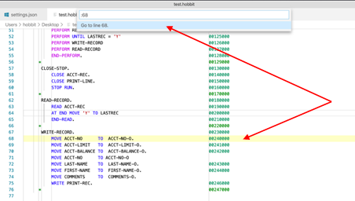

*Figure  1.  Navigating to a specific line of code*

If you hover your mouse over the 'ACCT-NO-O' field a pop up will appear displaying the declaration of that variable, shown in Figure  2.

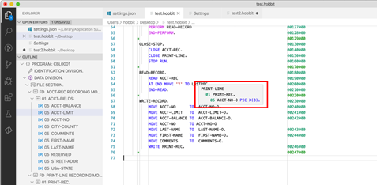

*Figure  2.  View declaration of variable*

Since this field is a 05-level variable nested within a 01-level variable, the pop up shows the declaration of the field as an eight-byte picture variable, the name of the parent structure and the file definition that it is within.  If you hold the CMD/Ctrl key while hovering over the field, then the pop up will additionally contain the line of code where the variable is defined as well as the following three lines of code.  These features can be extremely helpful when analyzing existing code.

### Syntax highlighting

The COBOL code that you are editing will also be highlighted to help you understand the different elements of the COBOL language.  Depending on the color theme that you have selected in VSCode, comments, COBOL reserved words, literal values and variables will be colored differently allowing you to spot obvious syntax issues early on before even submitting the code to a build.

## Navigation of code

Although the code examples we are using in this section are fairly small, the code that you could be writing could have hundreds or thousands of lines.  Being able to understand the general structure of the source code and being able to find your way around it without getting lost is a big advantage when editing COBOL. Fortunately, there are some great features to help you out, which we will discuss next.

### Outline view

Within the explorer side bar of VSCode, there is an outline view that will be populated whenever you are editing a COBOL file.  This view contains a collapsible look at each division, data structure and paragraph within your code.  This allows you to easily view the structure of the source code.  Clicking on a particular paragraph, division or data element will simultaneously move the editor to show that section of the code and highlight it, depicted in Figure  3.  This makes jumping to a specific part of the code very easy.

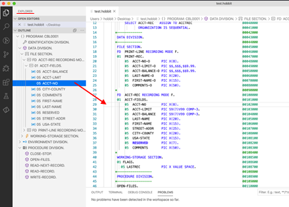

*Figure  3.  Outline view in VSCode*

### Breadcrumb view

Similarly, the breadcrumb view across the top of the editor can show where the current line of code exists within the structure of the COBOL source code.  As you navigate the source code in the editor, the breadcrumb trail will automatically update to reflect where you are in the structure of the program and provides you a mechanism to move to a different element of the code.  Again, if you open CBL0001 in VSCode and jump to line 36, this line is a declaration of the field USA-STATE within the structure ACCT-FIELDS, in the FILE-SECTION of the DATA-DIVISION.  Across the top of the editor the breadcrumb trail will show the information displayed in Figure  4.

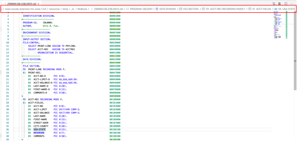

*Figure  4.  Breadcrumb trail in VSCode*

Clicking on any of the items in the breadcrumb trail will highlight that element of the code in the editor, quickly showing you the location of that element within the code.  It will also show a view of the code in a pop-up window, shown in Figure  5. , similar to the outline view previously discussed.

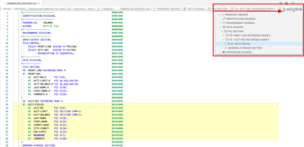

*Figure  5.  Pop-up view of code via breadcrumb selection*

### Jump to declaration / reference

As you browse through code you will come across COBOL PERFORM statements or variable references.  Often you will need to navigate to the definition of that paragraph or variable to follow the execution of the code.  At line 50 of CBL0001 we see a set of perform statements.  Place the cursor within the name, READ-RECORD, on line 51, right click and select **Go to Definition** .  The editor then navigates to the READ-RECORD paragraph on line 62.  Instead of the right click, the same function can be reached by using the F12 key.

"Go to References" does the reverse of this operation and allows you to navigate from the definition of a paragraph or variable to all the places within the application that reference that paragraph or variable.  To demonstrate this, navigate to line 62 of CBL0001, which again is the declaration of the READ-RECORD paragraph.  To see all of the places where this paragraph is called, right click and select **Go to References** , or hit the key combination **SHIFT+F12** .  This will summon a new pop up dialog which shows all the references to this paragraph in the code, shown in Figure  6.

 

**Note:** If **SHIFT+F12** does not work for your machine, you may need to use the key combination, **Fn+F12** **instead.**

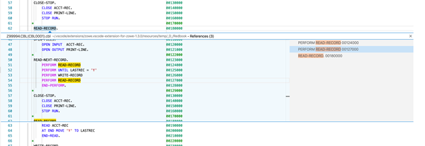

*Figure  6.  Finding paragraph/variable references in VSCode*

## Code-completion

Code completion isn't exactly a new concept in most IDEs.  For example, the Eclipse editor has provided auto-completion for Java APIs for a long time.  The same key combination, **CTRL+SPACE** , triggers this auto-completion function while you are coding and can be used to help guide you through COBOL syntax and CICS, IMS API calls.

### COBOL reserved word completion

As you are typing a COBOL reserved word, you can type `CTRL+SPACE` and the IBM Z Open Editor will present, in a pop-up, a list of possible COBOL reserved words that you might be trying to use.  Using the cursor keys or the mouse allows you to select the correct recommended keyword and press enter to select it and the rest of the reserved word will be entered for you, aka auto-completed!

### Variable completion

The same technique can be applied to variable completion.  This can be particularly useful when you are referencing a variable that exists multiple times within different structures.  In these cases, auto-completion can help you identify the variable you want to use.  As an example, create a new line within the WRITE-RECORD paragraph.  On the new line, enter the code `MOVE ACCT-BA` and then press **CTRL+SPACE** to invoke code auto-completion.  You should see a pop up similar to the one shown in Figure  7. below.

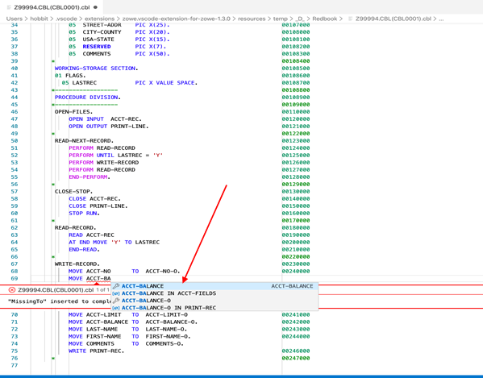

*Figure  7.  Auto-completion in VSCode*

You can see that not only is the variable ACCT-BALANCE prompted as a potential candidate, but it also presents ACCT_BALANCE IN ACCT-FIELDS. 

### CICS, MQ, DB2 API completion

The auto-completion of variables also extends to the CICS and DB2 APIs, known as EXEC CICS and EXEC SQL statements.  Although COBOL programming for DB2 and CICS is not a primary focus here, note that if you find yourself programming for either of these APIs that the capability is available.

## Refactoring code

Working with source code is seldom just about the initial creation, during a programs life cycle it will be changed and re-worked we often call this work refactoring.  This section explores renaming variables and handling errors.

### Renaming variables

During maintenance of existing code, you might need to refactor variable names or paragraph names.  Doing this manually can be a painful process, as you probably need to update both the original declaration and all the references within the source code.  Fortunately, there is a function for that, let's work through an example.  Back in CBL0001 hit **CTRL+G** to bring up the go to line function and go to line 29.  This is the declaration of the variable ACCT-NO.  Right click on the variable and select "**Find All References** ".  From this we can see that apart from the declaration, the variable is also referenced on line 68. So, if we rename the variable, we probably need to update this reference as well.  To perform the rename, ensure that the cursor is on the variable and then press **SHIFT/Fn+F2** .  This will bring up a small pop-up asking you to provide a new variable name, as shown in Figure  8.  Enter `ACCT-NO-TEST` and press **enter** .

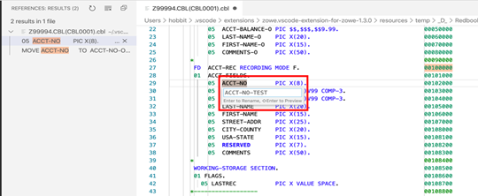

*Figure  8.  Renaming variables*

You will note that both the declaration of the variable and the reference on line 68 have been updated to the new value. As stated previously, the same process also works for paragraph names. For example, go ahead and refactor the name of the paragraph READ-RECORD to be READ-NEW-RECORD.

### Handling errors

The IBM Z Open Editor plugin also provides a level of syntax checking for local source code.  Although not as thorough as the compiler, it is a method of quickly identifying basic errors in your code before submitting it for compilation.  To demonstrate, let's create an error and then see how the editor shows it to us.  First, open the problems view by selecting **View** and then **Problems** from the editor menu.  The problems view should open at the bottom of the window, as depicted in Figure  9.

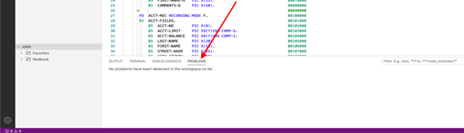

*Figure  9.  Problems view*

Now we need to introduce an error into the code. After line 68, add the line:

`MOVE ACCT-NO TO ACCT-N-0.`

Note that this line incorrectly identifies the second variable, which doesn't exist.  Once entering that line, you will notice that the invalid variable has been underlined in red to highlight it as an error.  Also, the problems view has a new error.  Clicking on the error will highlight the line of code at fault in the editor, shown in Figure  10. , allowing you to view the error directly.

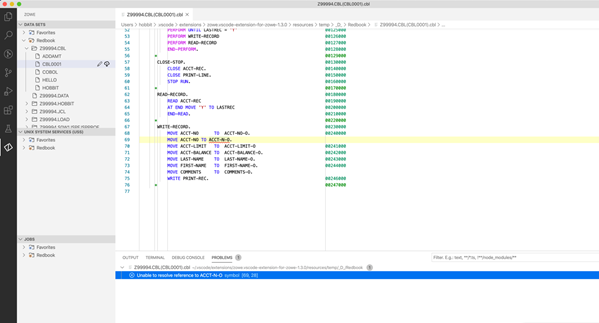

*Figure  10.  Highlighting error in source code*

Now that you see where the error is located, it can now be corrected.  As soon as the error has been rectified, the problem disappears from the problem view.

## Summary

In this chapter you have been able to go through some of the editing features of the Z Open Editor for VSCode. These capabilities make editing COBOL, PL/Iand JCL a lot friendlier and easier than some of the other editors in the market.

\newpage

# Zowe CLI and Zowe CLI Plug-ins

In this chapter we will explain what a CLI is and why you would use it, how to use Zowe CLI interactively, how to abstract CLI commands into useful scripts, and how Zowe CLI enables the use of familiar open source tooling while developing COBOL applications on the mainframe. 

- **What is a CLI and why would you use it?**

- **What is Zowe CLI?**

- **Zowe CLI interactive use**
     - **Installing Zowe CLI**
     - **Interactive Help**
     - **Zowe Profiles**
     - **Interacting with z/OS Data Sets**
     - **Interacting with z/OS Jobs**

- **Automating tasks using Zowe CLI**
     - **Automated Job Submission**
     - **Using Other Programming Languages and Continuous Integration**
     - **Additional Examples**

- **The world of modern open source tooling**

- **Summary**

## What is a CLI and why would you use it?

CLI stands for Command Line Interface. It is a program that allows for user interaction through text based input. In the early days of computing, command line interfaces were the only means to interact with operating systems. The invention of the mouse and development of graphical user interfaces led to the experience we are familiar with today. Well-designed GUIs certainly yield an improved interactive experience. However, CLIs are still heavily used today and are very powerful. Windows shell and bash are common examples of terminals where command line tools are run interactively.

If well-designed GUIs yield an improved interactive experience, why would you use a CLI? Simply put, automation. Command line interfaces can be used interactively allowing for quick exploration of available commands. They are also usually self-guided and some even offer modern help displays by launching content in a browser. But, they are also programmatic interfaces where command sequences and tasks can be easily abstracted into scripts.

## What is Zowe CLI?

Zowe CLI is an open source CLI for the mainframe. It is a tool that can be run on Windows, Linux, and Mac offering a means to interact with the mainframe from an environment where modern open source tooling is available. Cloud platforms like Amazon Web Services, Azure, and Google Cloud Platform all provide heavily used CLIs. The Zowe CLI helps make interacting with the mainframe like interacting with other cloud services. 

At its core, Zowe CLI provides remote interaction with z/OS data sets & jobs, Unix System Services files, TSO and Console commands, and provisioning services. Zowe CLI is also an extensible technology and numerous plug-ins exist that extend its reach to z/OS subsystems and vendor software.

Zowe CLI is a bridge tool between distributed systems and the mainframe. Pick your favorite language or open source tool and leverage it for mainframe development with the assistance of the Zowe CLI. Want to develop automation in Python? Want to write tests in Node? Want to run Jenkins pipelines for continuous integration? Want to use open source testing frameworks like Mocha or Facebook’s Jest? Want to leverage code quality tools like SonarQube? Go for it! 

CLIs are useful for automating repeated tasks. For mainframe COBOL apps, Zowe CLI can help you automate your build, deployment, and testing processes. Check out this [blog](https://medium.com/zowe/continuous-integration-for-a-mainframe-app-800657e84e96) for more info and the sample code that made it possible! Zowe CLI can also help you to automate administrative tasks. 

Most IDEs have integrated terminals as well so the CLI can be leveraged from your favorite distributed development environment, including VS Code! 

## Zowe CLI interactive use

The Zowe CLI can be leveraged for quick exploration of z/OS services as well as issuing commands that are not yet available in your IDE of choice. Before developing automation, it is common to first accomplish a commonly repeated task from the CLI interactively.

### Installing Zowe CLI

The Zowe CLI is a node package and is one of over 1.2 million node packages available on the public npm registry. After Node.js and npm are installed on the client machine, the core CLI can be installed by simply issuing `npm install -g @zowe/cli@zowe-v1-lts`. There is an alternative installation method if your workstation does not have access to the public registry. More details on installing Zowe CLI and Zowe CLI plug-ins are provided in a future section titled "Installation of Zowe CLI and plug-ins". 

### Interactive Help

To get started, you can simply open a terminal and issue zowe. This will yield the top level help. 

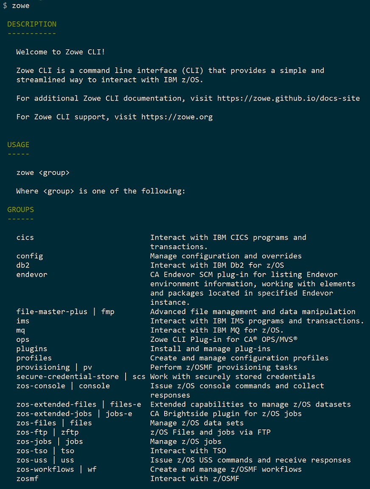

*Figure 1. Zowe CLI Help*

In the example above, multiple extensions are installed. The structure of commands is `zowe <group> <action> <object>` followed by various parameters and options specific to the command. For example, a valid command is `zowe files list data-set "HLQ.*"`. This command will list data-sets matching a pattern of "HLQ.*". You can append `-h` to any command to find out more information. Frequently referring to the help can be difficult and time consuming so if your environment has access to a web browser, simply append `--help-web` or `--hw` to any command to launch interactive web help.

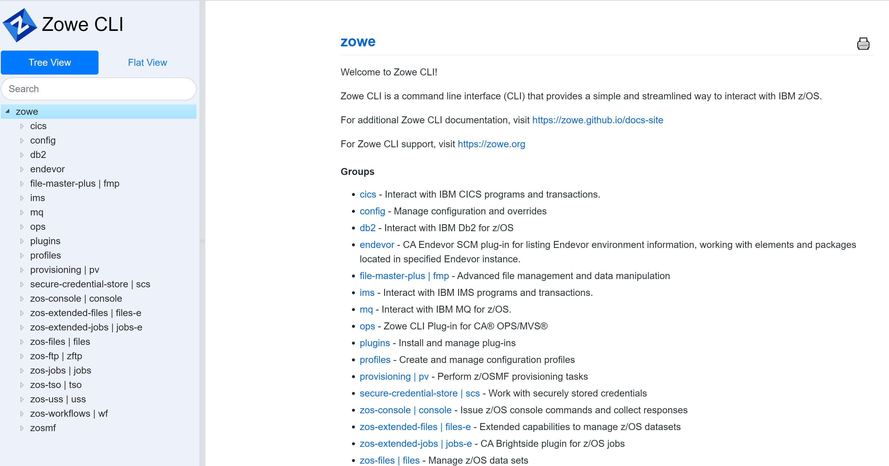

*Figure 2. Zowe CLI Web Help*

Don’t have the CLI installed yet? You can also check out a copy of the web help for the core Zowe CLI and Zowe plug-ins [here](https://docs.zowe.org/stable/web_help/index.html).

### Zowe Profiles
Zowe client technologies like Zowe CLI and the Zowe Explorer VS Code Extension store connection information in files commonly known as profiles. This provides convenience as after profiles for services are created, users do not have to constantly provide this information. For the secure storage of credentials, there is the Secure Credential Store plug-in which is discussed more in a later section titled "Installation of Zowe CLI and plug-ins". The Secure Credential Store provides a means to store creds in the operating system’s secure credential vault.

When creating profiles you can also specify the `prompt*` keyword to be prompted for your username and password so they will be masked on the command line. Figure 3 shows a sample command to create a zosmf profile. This will eliminate the need to provide these details on future commands.

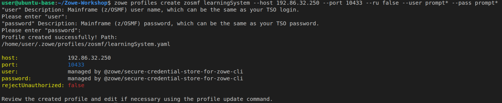

*Figure 3. Zowe CLI z/OSMF Profile Creation Command*

### Interacting with z/OS Data Sets
Zowe CLI provides a significant suite of z/OS data set interaction functionality. See the following figures for details on available actions and a sample list command.

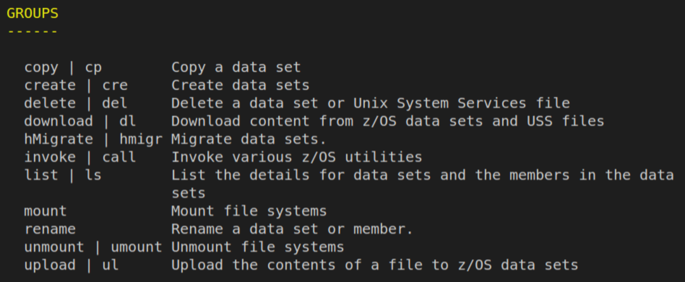

*Figure 4. Zowe CLI zos-files actions*

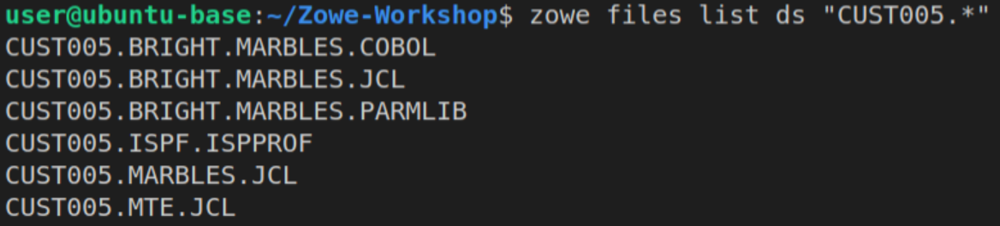

*Figure 5. Sample Zowe CLI zos-files list ds command*

### Interacting with z/OS Jobs
Zowe CLI provides a significant suite of z/OS jobs interaction functionality. See the following figures for details on available actions and a sample job submission command. 

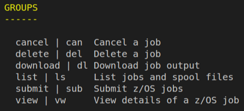

*Figure 6. Zowe CLI zos-jobs actions*


*Figure 7. Sample Zowe CLI zos-jobs submit ds command*

## Automating tasks using Zowe CLI
Running commands interactively is a great way to learn the capabilities of the Zowe CLI. However, creating custom automation for your commonly repeated tasks and making use of valuable development tooling is where significant value lies. For COBOL development, significant time can be spent reviewing compiler output and testing programs. These repetitive tasks are excellent candidates for automation. 

### Automated Job Submission
Let’s investigate automating submitting a job and verifying the return code is 0. Of course, we could also parse the spool output for specific messages of interest but we will keep it simple for now. For this sample, we will leverage Node.js to develop a new automation suite. To start, I will create a package.json file to make it easy for others to manage and install the project. It will contain the list of dependencies for my project as well as the automation tasks I will develop. A quick way to create a package.json is to issue `npm init` and answer the prompts. Once created I will add a submitJob task. You can add whatever automation you want here. My final package.json is shown in the next figure. You can learn more about package.json files [here](https://docs.npmjs.com/creating-a-package-json-file).

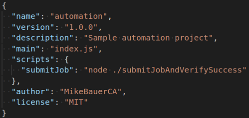

*Figure 8. Sample package.json*

Then I will create a config.json file to store all the variables I may wish to change for my project. In this case, we will set the job to submit and the maximum allowable return code for that job.

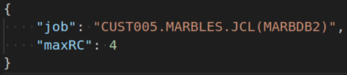

*Figure 9. Sample config.json*

Next we will write our automation. The Zowe CLI was built with scripting in mind and can output responses in JSON format which can be easily parsed.


*Figure 10. Sample Zowe CLI response format JSON output*

Now, instead of issuing this command and reviewing it to see if the retcode is less than or equal to 4, we want to automate it. See the implementation in a node script below.


*Figure 11. Sample code to submit job and verify output is less than or equal to a maximum allowable RC*

I had to make the investment to write this automation but for future job submissions I can simply issue `npm run submitJob`. IDEs like VS Code can visualize these tasks making my commonly repeated tasks as easy as clicking a button :). This job could compile, link, and/or run a COBOL program.

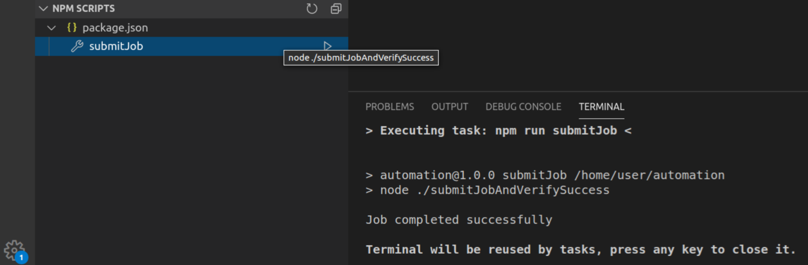

*Figure 12. Vizualization of npm script and sample run*

More advanced code automating the compilation, deployment to test environment, and testing of a COBOL CICS application is described in this [blog](https://medium.com/zowe/continuous-integration-for-a-mainframe-app-800657e84e96). 

### Using Other Programming Languages and Continuous Integration
Another good example of automating tasks using Zowe CLI is when you want to integrate other programming languages into your COBOL development. Similar to 3.4.1, you can use other languages such as Typescript to write a COBOL program generator and use Zowe CLI to create a "one-click" process for creating your program. The figure below is a representation of that "one-click" automated process where several tasks are executed such as creating your COBOL program, uploading it in mainframe, compiling it and running your JCL to test it.

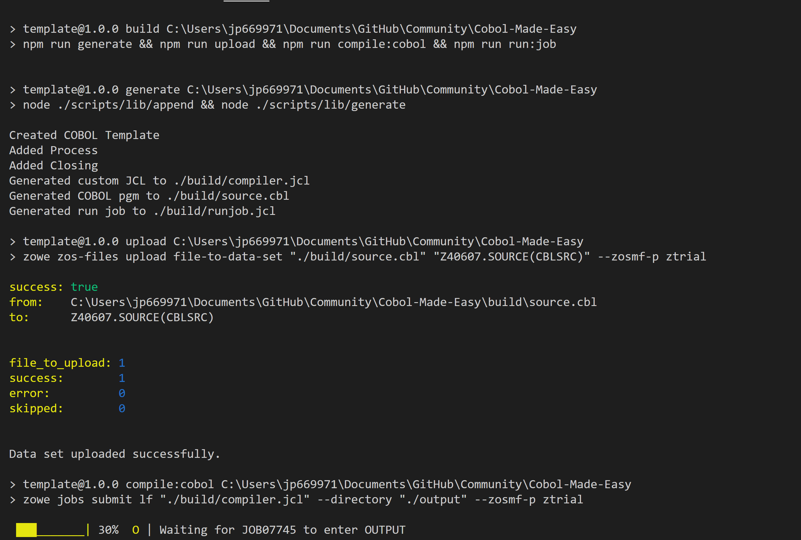

*Figure 13. "One Click" COBOL build process*

You can then level-up this process by leveraging a CI/CD pipeline. What is a CI/CD pipeline? It is an automated way of building, testing, and deploying your application and you can do the same with your COBOL development. The figure below shows the pipeline for the same automated tasks that we did earlier.

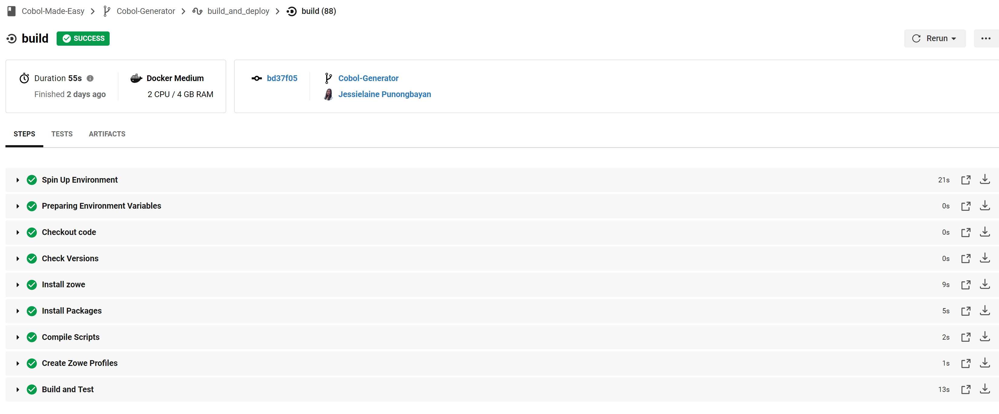

*Figure 14. CI/CD pipeline of the "one click" COBOL build process*

To know more about this topic, check [this](https://medium.com/@jessielaine.punongbayan/how-i-used-typescript-to-generate-my-cobol-programs-a2a180209148) out.

### Additional Examples
If you are looking for an example on how to use Zowe Explorer and Zowe CLI with Db2 Stored Procedures, check out this [blog](https://www.idug.org/p/bl/et/blogid=278&blogaid=1007?es_id=c5a317e73e).

If you are interested in using open source tools in your development, you can review this [blog](https://medium.com/zowe/how-to-write-cleaner-and-safer-z-os-code-with-zowe-cli-and-sonarqube-6afb283348f9) where it talks about using Zowe CLI to leverage static code analysis tools when developing COBOL applications.

For additional blogs and articles on leveraging Zowe technologies, check out [https://medium.com/zowe/users/home](https://medium.com/zowe/users/home).

## The world of modern open source tooling
We have only scratched the surface of using modern tools and languages for mainframe development and incorporating mainframe applications into enterprise DevOps pipelines. As a bridge tool, the Zowe CLI enables the use of a plethora of tools being developed by an enormous community for mainframe development. If you are new to mainframe, hopefully this offers some familiarity as you transition into this space. If you are an experienced mainframer, hopefully you find time to give some of these available technologies a try to see if they can help you.

## Summary
As both a user and programmatic interface, command line interfaces offer significant value in simplifying complex repeatable processes into single tasks. CLIs are commonly used when developing on popular cloud platforms like Amazon Web Services. The Zowe CLI is the CLI for the mainframe that has been extended via numerous plug-ins. Zowe CLI acts as a bridge tool enabling the use of distributed development tooling while working with mainframe applications. Numerous resources and articles are available for using Zowe CLI to create custom automation, build CI pipelines, and incorporate static analysis into your COBOL development processes. Development tooling created by the distributed open source community can now be effectively leveraged for mainframe development.

\newpage

# Installation of VSCode and extensions

This chapter covers all aspects of download and installation of Visual Studio (VS) Code and any prerequisites that are needed.  It includes:

- **Install prerequisites**
     - **Install node.js**
     - **Install Java SDK**
- **Install VSCode**

- **Install VSCode extensions**
     - **Zowe Explorer**
     - **IBM Z Open Editor**

- **Summary**

## Install prerequisites

This section will cover the necessary steps and information to download and install the prerequisites needed for the subsequent labs within this book.  This software is needed for one of more of the applications we will be utilizing in our labs throughout the book. The prerequisites include:

- Install node.js

- Install Java SDK

### Install node.js

1. Check for node.js installation and verify that the version number is v8 or higher.

   Open your workstation's version of the command prompt (called Terminal on Mac OS X). Once the command prompt is open, use the command in Example 1.  to check if your workstation currently has a version of node.js installed.

```
C:\Users\User> node -v

V12.16.1    
```
*Example 1.  Node.js version*

If you do not see a version number after you submit the command, you do not have node.js installed, or if it shows a version less than v8, you should continue following these instructions.  If you do see a version number and it is v8 or higher, you can move on to section Install Java SDK.

2. If node.js version is less than v8, or node isn't installed at all. 

   Updating node.js to the appropriate version number is a relatively simple process because the installer takes care of most of the "heavy lifting".  All you will need to do is visit the Node.js download site, provided below and follow the download and installation instructions for your specific workstation platform.  Do this same process if you do not already have node.js installed.

[`https://nodejs.org/en/download/`](https://nodejs.org/en/download/)

This process will install the latest versions of Node.js and the node package manager (npm) and overwrite any older version files in your system.  This removes the step of needing to manually uninstall the previous versions beforehand.

3. Once completed, verify the installation and proper version number, as shown previously in Example 1.
 
**Note** : The version numbers in our examples are provided purely for reference and may not reflect the latest versions of the software.

### Install Java SDK

1. Check for Java installation and verify that the version number is v8 or higher.

   Open your workstation's version of the command prompt, if not already open.  Once the command prompt is open, use the command in Example 2. to check if your workstation currently has a version of Java installed.  Java SDK 8 is the preferred version for these labs, however, any versions higher than that will suffice.

```
C:\Users\User> java -version

java version "1.8.0_241"

Java(TM) SE Runtime Environment (build 1.8.0_241-b07)

Java HotSpot(TM) 64-Bit Server VM (build 25.241-b07, mixed mode)
```
*Example 2.  Java version*

If you do not see a version number after you submit the command, you do not have Java installed or if it shows a version less than v8, you should continue following these instructions.  The display format of the version number for Java is slightly different than what is displayed for node.js.  With Java, the second value in the displayed version number, i.e. the "8" in Example 2. , is the version number.  So, our example is showing Java SDK version 8.  If you do see a version number and it is v8 or higher, you can move on to section Install VSCode.

2. If your version of Java displayed is less than v8, you need to uninstall the current version on your workstation and reinstall the correct version.  Follow the link below to uninstall instructions that represent your workstation operating system (OS).

-Linux:

[`https://www.java.com/en/download/help/linux_uninstall.xml` ](https://www.java.com/en/download/help/linux_uninstall.xml)

-Mac:

[`https://www.java.com/en/download/help/mac_uninstall_java.xml` ](https://www.java.com/en/download/help/mac_uninstall_java.xml)

-Windows:

[`https://www.java.com/en/download/help/uninstall_java.xml` ](https://www.java.com/en/download/help/uninstall_java.xml)

 
3. Once Java is uninstalled from your workstation, you can click the Java JDK 8 download link below and follow the installation instructions for your specific OS.

[`https://www.oracle.com/java/technologies/javase-jdk8-downloads.html` ](https://www.oracle.com/java/technologies/javase-jdk8-downloads.html)

4. Verify the installation and proper version number as shown in Example 2.

**Note** : You will be prompted to register a new Oracle account in order to download the installation file, please do so.  If you have an existing account, you may use that to log in and continue.

## Install VSCode

If you do not already have VSCode installed on your workstation, please do so now by following the download and installation instructions at the link below:

[`https://code.visualstudio.com/download` ](https://code.visualstudio.com/download)

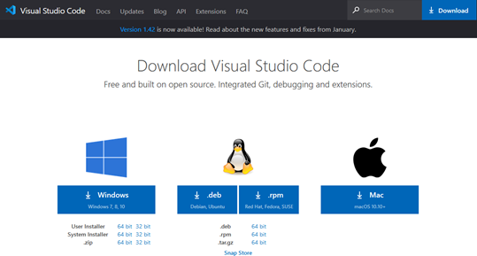

*Figure  1.  VSCode download site*

**Note** : Be sure to select the correct installation file for your workstations respective OS, shown in Figure  1.

## Install VSCode extensions

This section introduces two VSCode extensions, Zowe Explorer and IBM Z Open Editor listed in Figure  2. , and instructions on how to install them.


*Figure  2.  VSCode required extensions*

### Zowe Explorer

Zowe is a new, and the first open source framework for z/OS and provides solutions for development and operations teams to securely manage, control, script and develop on the mainframe like any other cloud platform.  Out of the box, the Zowe Explorer provides a lot of functionality allowing z/OS developers access to jobs, datasets and (USS) files on a z/OS server.  Backed by the Zowe CLI and z/OSMF, developers now have powerful features that makes it easy to work with z/OS within the familiar VSCode environment.  This extension can be used to edit COBOL and PL/I files opened on z/OS MVS™ and USS using the Zowe extension's Data Sets and USS views.  It can even run JCL and lets you browse job spool files.  For more information on Zowe Explorer and its interaction with z/OS please visit:

[https://ibm.github.io/zopeneditor-about/Docs/zowe_interactwithzos.html](https://ibm.github.io/zopeneditor-about/Docs/zowe_interactwithzos.html)

#### Install Zowe Explorer

Open VSCode and in the left side tool menu select **Extensions**.  From there, in the "Search Extensions in Marketplace" search field, type `Zowe Explorer`.  Search results will begin populating, select **"Zowe Explorer"** and click **install**, depicted in Figure  3.

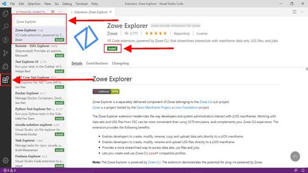

*Figure  3.  Install Zowe Explorer in VSCode*

### IBM Z Open Editor

IBM Z Open Editor brings COBOL and PL/I language support to Microsoft VSCode.  It is one of the several next generation capabilities for an open development experience for z/OS®.  It also works in association with the Zowe Explorer plugin. For more information on IBM Z Open Editor, please visit:

[https://ibm.github.io/zopeneditor-about/Docs/introduction.html#key-capabilities](https://ibm.github.io/zopeneditor-about/Docs/introduction.html#key-capabilities)

#### Install IBM Z Open Editor

Open VSCode and in the left side tool menu select **Extensions**.  From there, in the "Search Extensions in Marketplace" search field, type `IBM Z Open Editor`.  Search results will begin populating, select **" IBM Z Open Editor "** and click **install**, depicted in Figure  4.


*Figure  4.  Install IBM Z Open Editor in VSCode*

**Note** : There may be some limitations with IBM Z Open Editor if running a 32-bit Java version on Windows.

## Summary

In this chapter you have been introduced to VSCode and some of the extension tools available to it.  We have walked through the process of installing the pre-requisite software, Node.js and Java SDK, as well as VSCode, Zowe Explorer and IBM Z Open Editor.  You have also been briefly introduced to the utility of these extensions in VSCode.  In the subsequent chapters we will delve deeper into how and when to use them and get some practice through lab assignments. 

\newpage

# Installation of Zowe CLI and Plug-ins

This chapter covers all aspects of the download and installation of Zowe CLI and Zowe CLI plug-ins. 

- **Install prerequisites - Node.js**

- **Install Zowe CLI**
     - **Public npm Registry**
     - **Package from Zowe.org**

- **Install Zowe CLI Plug-ins**
     - **Public npm Registry**
     - **Package from Zowe.org**

- **Summary**

## Install prerequisites - Node.js

Before installing Zowe CLI, please ensure an LTS version of Node v8.0 or higher is installed. Please refer back to the section titled "Install Node.js" if you have not already completed it. Please also verify that you have a version of Node Package Manager (npm) that is compatible with your version of Node.js. For a list of compatible versions, see [https://nodejs.org/en/download/releases/](https://nodejs.org/en/download/releases/). npm is included with the Node.js installation. Issue the command `npm --version` to view the version of npm that is installed.

## Install Zowe CLI
There are two recommended methods for installing the Zowe CLI. If you have access to the public npm registry from your workstation, we recommend using that installation method as pulling updates is seamless. If you do not have access to this registry, we recommend downloading the package from zowe.org and installing from the bundled package.

### Install from Public npm Registry
Issue the following command in your terminal (e.g. Command Prompt or if you are using VS Code, Terminal -> New Terminal):

```
npm install -g @zowe/cli@zowe-v1-lts
```

If the command returns an EACCESS error, refer to [Resolving EACCESS permissions errors when installing packages globally](https://docs.npmjs.com/resolving-eacces-permissions-errors-when-installing-packages-globally) in the npm documentation.
If other issues are encountered in your environment, please review [known Zowe CLI issues](https://docs.zowe.org/stable/troubleshoot/cli/known-cli.html#known-zowe-cli-issues) for solutions.

We also highly recommend installing the Secure Credential Store plug-in before using the CLI. The Secure Credential Store Plug-in for Zowe CLI lets you store your credentials securely in the default credential manager in your computer's operating system. On Linux, libsecret will need to be installed.

If running Linux, please run the following command for your Linux distribution:

- Debian/Ubuntu: `sudo apt-get install libsecret-1-dev`
- Red Hat-based: `sudo yum install libsecret-devel`
- Arch Linux: `sudo pacman -S libsecret`

To install the Secure Credential Store Plug-in for Zowe CLI, issue the following command:

```
zowe plugins install @zowe/secure-credential-store-for-zowe-cli@zowe-v1-lts
```

User profiles, which contain connection information for interacting with various z/OS services, created after installing the plug-in will automatically store your credentials securely.

To securely store credentials in existing user profiles (profiles that you created prior to installing the SCS plug-in), issue the following command:

```
zowe scs update
```

### Install from Bundled Package 
Navigate to [Zowe.org Downloads](https://www.zowe.org/#download) and click the CLI Core button to download the core package which includes Zowe CLI and the Secure Credential Store plug-in. After accepting the EULA for Zowe, a package named `zowe-cli-package-v.r.m.zip` will be downloaded to your machine. Unzip the contents of `zowe-cli-package-v.r.m.zip` to a preferred location on your machine.

Open your terminal (e.g. Command Prompt or if you are using VS Code, Terminal -> New Terminal), change your working directory to wherever you unzipped the contents, and issue the following command:

```
npm install -g zowe-cli.tgz
```

If the command returns an EACCESS error, refer to [Resolving EACCESS permissions errors when installing packages globally](https://docs.npmjs.com/resolving-eacces-permissions-errors-when-installing-packages-globally) in the npm documentation.
If other issues are encountered in your environment, please review [known Zowe CLI issues](https://docs.zowe.org/stable/troubleshoot/cli/known-cli.html#known-zowe-cli-issues) for solutions.

The highly recommended Secure Credential Store Plug-in for Zowe CLI lets you store your credentials securely in the default credential manager in your computer's operating system. On Linux, libsecret will need to be installed.

If running Linux, please run the following command for your Linux distribution:

- Debian/Ubuntu: `sudo apt-get install libsecret-1-dev`
- Red Hat-based: `sudo yum install libsecret-devel`
- Arch Linux: `sudo pacman -S libsecret`

To install the Secure Credential Store Plug-in for Zowe CLI, issue the following command from where you unzipped the core CLI package contents:

```
zowe plugins install secure-credential-store-for-zowe-cli.tgz
```

User profiles, which contain connection information for interacting with various z/OS services, created after installing the plug-in will automatically store your credentials securely.

To securely store credentials in existing user profiles (profiles that you created prior to installing the SCS plug-in), issue the following command:

```
zowe scs update
```

## Install Zowe CLI Plug-ins
Zowe CLI is an extendable technology that can be enhanced by installing plug-ins. Zowe offers a number of [plug-ins](https://docs.zowe.org/stable/user-guide/cli-extending.html). At the time of this writing, these include plug-ins for [CICS](https://www.npmjs.com/package/@zowe/cics-for-zowe-cli), [Db2](https://www.npmjs.com/package/@zowe/db2-for-zowe-cli), [FTP](https://www.npmjs.com/package/@zowe/zos-ftp-for-zowe-cli), [IMS](https://www.npmjs.com/package/@zowe/ims-for-zowe-cli), and [MQ](https://www.npmjs.com/package/@zowe/mq-for-zowe-cli). There are also many vendor plug-ins, many of which are available on the [public registry](https://www.npmjs.com/search?q=zowe-cli). At the time of this writing, these include plug-ins for [CA Endevor](https://www.npmjs.com/package/@broadcom/endevor-for-zowe-cli), [CA Endevor Bridge for Git](https://www.npmjs.com/package/@broadcom/endevor-bridge-for-git-for-zowe-cli), [CA File Master Plus](https://www.npmjs.com/package/@broadcom/file-master-plus-for-zowe-cli), [CA OPS/MVS](https://www.npmjs.com/package/@broadcom/ops-for-zowe-cli), [CA View](https://www.npmjs.com/package/@broadcom/caview-for-zowe-cli), [IBM CICS Bundle Generation and Deployment](https://www.npmjs.com/package/zowe-cli-cics-deploy-plugin), and [IBM z/OS Connect EE](https://www.npmjs.com/package/@zosconnect/zosconnect-zowe-cli).

### Install from Public npm Registry 
To install a Zowe CLI plug-in from the registry, simply locate the plug-in you wish to install, e.g. `@zowe/cics-for-zowe-cli`, find the distribution tag for the distribution you want to install, e.g. `zowe-v1-lts`, and issue the following command: 

```
zowe plugins install <name>@<distTag>
```

For example,

```
zowe plugins install @zowe/cics-for-zowe-cli@zowe-v1-lts
```

Multiple plug-ins can be installed in a single command. For example, to install all Zowe CLI plug-ins available from the Zowe organization, you could issue:

```{.bash}
zowe plugins install @zowe/cics-for-zowe-cli@zowe-v1-lts @zowe/ims-for-zowe-cli@zowe-v1-lts @zowe/mq-for-zowe-cli@zowe-v1-lts @zowe/zos-ftp-for-zowe-cli@zowe-v1-lts @zowe/db2-for-zowe-cli@zowe-v1-lts
```

Vendor plug-ins on the registry are installed in the same way. For example, to install the CA Endevor plug-in, you would issue

```
zowe plugins install @broadcom/endevor-for-zowe-cli@zowe-v1-lts
```

### Install from Bundled Package
Navigate to [Zowe.org Downloads](https://www.zowe.org/#download) and click the CLI Plugins button to download the package which includes all Zowe CLI plug-ins for the Zowe organization. After accepting the EULA for Zowe, a package named `zowe-cli-plugins-v.r.m.zip` will be downloaded to your machine. Unzip the contents of `zowe-cli-plugins-v.r.m.zip` to a preferred location on your machine. You can select which plug-ins you want to install. The IBM Db2 plug-in requires [additional configuration](https://docs.zowe.org/stable/user-guide/cli-db2plugin.html#installing-from-a-local-package) when installing from a local package. To install all plug-ins you can issue:

```
zowe plugins install cics-for-zowe-cli.tgz zos-ftp-for-zowe-cli.tgz ims-for-zowe-cli.tgz mq-for-zowe-cli.tgz db2-for-zowe-cli.tgz
```

For offline installation of vendor plug-ins, please reach out to the specific vendor for details.

## Summary
In this chapter we walked through the process of installing the prerequisite software, Node.js and npm, as well as Zowe CLI and various plug-ins.

\newpage

# Part 2 - Learning COBOL {.unnumbered}

# Basic COBOL

This chapter introduces the basics of COBOL syntax. It then demonstrates how to view and run a basic COBOL program in VSCode.

 
- **COBOL characteristics**
     - **Enterprise COBOL**
     - **Chapter objectives**

- **What must a novice COBOL programmer know to be an experienced COBOL programmer?**
     - **What are the coding rules and the reference format?**
     - **What is the structure of COBOL?**
     - **What are COBOL reserved words?**
     - **What is a COBOL statement?**
     - **What is the meaning of a scope terminator?**
     - **What is a COBOL sentence?**
     - **What is a COBOL paragraph?**
     - **What is a COBOL section?**

- **COBOL Divisions**
     - **COBOL Divisions structure**
     - **What are the four Divisions of COBOL?**


- **PROCEDURE DIVISION explained**

- **Additional information**
     - **Professional manuals**
     - **Learn more about recent COBOL advancements**

- **Lab**


## COBOL characteristics

COBOL is an English-like computer language enabling COBOL source code to be easier to read, understand, and maintain.  Learning to program in COBOL includes knowledge of COBOL source code rules, COBOL reserved words, COBOL structure, and the ability to locate and interpret professional COBOL documentation.  These COBOL characteristics must be understood, to be proficient in reading, writing, and maintaining COBOL programs.

### Enterprise COBOL

COBOL is a standard and not owned by any company or organization.  "Enterprise COBOL" is the name for the COBOL programming language compiled and executed in the IBM Z Operating System, z/OS.  COBOL details and explanations in the following chapters apply to Enterprise COBOL.

Enterprise COBOL has decades of advancements, including new functions, feature extensions, improved performance, application programming interfaces (APIs), etc. It works with modern infrastructure technologies with native support for JSON, XML, and Java®.

### Chapter objectives

The object of the chapter is to expose the reader to COBOL terminology, coding rules, and syntax while the remaining chapters include greater detail with labs for practicing what is introduced in this chapter.

## What must a novice COBOL programmer know to be an experienced COBOL programmer?

This section will provide the reader with the information needed to more thoroughly understand the questions and answers being asked in each subsequent heading.

### What are the coding rules and the reference format?

COBOL source code is column dependent, meaning column rules are strictly enforced.   Each COBOL source code line has five areas, where each of these areas has a beginning and ending column.

COBOL source text must be written in COBOL reference format.  Reference format consists of the areas depicted in Figure  1. in a 72-character line.


*Figure  1.  COBOL reference format*


The COBOL reference format is formatted as follows:
#### Sequence Number Area (columns 1 - 6)

- Blank or reserved for line sequence numbers.
#### Indicator Area (column 7)

- A multi-purpose area:

    - Comment line (generally an asterisk symbol)

    - Continuation line (generally a hyphen symbol)

    - Debugging line (D or d) 

    - Source listing formatting (a slash symbol)
#### Area A (columns 8 - 11)

- Certain items must begin in Area A, they are:

    - Level indicators

    - Declarative

    - Division, Section, Paragraph headers

    - Paragraph names

- Column 8 is referred to as the A Margin
#### Area B (columns 12 - 72)

- Certain items must begin in Area B, they are:

    - Entries, sentences, statements, and clauses

    - Continuation lines

- Column 12 is referred to as the B Margin
#### Identification Area (columns 73 - 80)

- Ignored by the compiler.

- Can be blank or optionally used by programmer for any purpose.

### What is the structure of COBOL?

COBOL is a hierarchy structure consisting and in the top-down order of:

- Divisions

- Sections

- Paragraphs

- Sentences

- Statements

### What are COBOL reserved words?

COBOL programming language has many words with specific meaning to the COBOL compiler, referred to as reserved words.  These reserved words cannot be used as programmer chosen variable names or programmer chosen data type names.

A few COBOL reserved words pertinent to this book are: PERFORM, MOVE, COMPUTE, IF, THEN, ELSE, EVALUATE, PICTURE, etc..  You can find a table of all COBOL reserved words is located at:

[https://www.ibm.com/support/knowledgecenter/zh/SSZJPZ_9.1.0/com.ibm.swg.im.iis.ds.mfjob.dev.doc/topics/r_dmnjbref_COBOL_Reserved_Words.html](https://www.ibm.com/support/knowledgecenter/zh/SSZJPZ_9.1.0/com.ibm.swg.im.iis.ds.mfjob.dev.doc/topics/r_dmnjbref_COBOL_Reserved_Words.html)


### What is a COBOL statement?

Specific COBOL reserved words are used to change the execution flow based upon current conditions.  “Statements” only exist within the Procedure Division, the program processing logic.  Examples of COBOL reserved words used to change the execution flow are:

- IF

- Evaluate

- Perform

### What is the meaning of a scope terminator?

A scope terminator can be explicit or implicit.  An explicit scope terminator marks the end of certain PROCEDURE DIVISION statements with the “END-” COBOL reserved word.  Any COBOL verb that is either, always conditional (IF, EVALUATE), or has a conditional clause (COMPUTE, PERFORM, READ) will have a matching scope terminator.  An implicit scope terminator is a period (.) that ends the scope of all previous statements that have not yet been ended.

### What is a COBOL sentence?

A COBOL “Sentence” is one or more “Statements” followed by a period (.), where the period serves as a scope terminator.

### What is a COBOL paragraph?

A COBOL “Paragraph” is a user-defined or predefined name followed by a period.  A “Paragraph” consists of zero or more sentences and are the subdivision of a “Section” or “Division”, see Example 1. below.

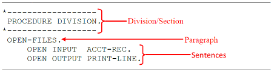

*Example 1.  Division -> paragraph -> sentences*

### What is a COBOL section?

A “Section” is either a user-defined or a predefined name followed by a period and consists of zero or more sentences.  A “Section” is a collection of paragraphs. 

## COBOL Divisions

This section introduces the four COBOL Divisions and briefly describes their purpose and characteristics.

### COBOL Divisions structure

Divisions are subdivided into Sections.

Sections are subdivided into Paragraphs.

Paragraphs are subdivided into Sentences.

Sentences consists of Statements.

Statements begin with COBOL reserved words and can be subdivided into “Phrases”

### What are the four Divisions of COBOL?
#### IDENTIFICATION DIVISION

The IDENTIFICATION DIVISION identifies the program with a name and, optionally, gives other identifying information, such as the Author name, program compiled date (last modified), etc.
#### ENVIRONMENT DIVISION

The ENVIRONMENT DIVISION describes the aspects of your program that depend on the computing environment, such as the computer configuration and the computer inputs and outputs.
#### DATA DIVISION

The DATA DIVISION is where characteristics of data are defined in one of the following sections:

- FILE SECTION:

   Defines data used in input-output operations.

- LINKAGE SECTION:

   Describes data from another program. When defining data developed for internal processing.

- WORKING-STORAGE SECTION:

   Storage allocated and remaining for the life of the program.

- LOCAL-STORAGE SECTION:

   Storage allocated each time a program is called and de-allocated when the program ends.

#### PROCEDURE DIVISION

The PROCEDURE DIVISION contains instructions related to the manipulation of data and interfaces with other procedures are specified.

## PROCEDURE DIVISION explained

The PROCEDURE DIVISION is where the work gets done in the program.  Statements are in the PROCEDURE DIVISION where they are actions to be taken by the program.  The PROCEDURE DIVISION is required for data to be processed by the program.  PROCEDURE DIVISION of a program is divided into sections and paragraphs, which contain sentences and statements, as described here:

- **Section** - A logical subdivision of your processing logic. A section has a header and is optionally followed by one or more paragraphs. A section can be the subject of a PERFORM statement. One type of section is for declaratives.  Declaratives are a set of one or more special purpose sections. Special purpose sections are exactly what they sound like, sections written for special purposes and may contain things like description of inputs and outputs.  They are written at the beginning of the PROCEDURE DIVISION, the first of which is preceded by the key word DECLARATIVES and the last of which is followed by the key word END DECLARATIVES.

- **Paragraph** - A subdivision of a section, procedure, or program. A paragraph can be the subject of a statement.

- **Sentence** - A series of one or more COBOL statements ending with a period.

- **Statement** - An action to be taken by the program, such as adding two numbers.

- **Phrase** - A small part of a statement (i.e. subdivision), analogous to an English adjective or preposition

## Additional information

This section provides useful resources in the form of manuals and videos to assist in learning more about the basics of COBOL.

### Professional manuals

As Enterprise COBOL experience advances, the need for the professional documentation is greater.  An internet search for Enterprise COBOL manuals includes: “Enterprise COBOL for z/OS documentation library - IBM”, link provided below.  The site content has tabs for each COBOL release level.  As of April 2020, the current release of Enterprise COBOL is V6.3.  Highlight V6.3 tab, then select product documentation.

[https://www.ibm.com/support/pages/enterprise-cobol-zos-documentation-library](https://www.ibm.com/support/pages/enterprise-cobol-zos-documentation-library)


Three ‘Enterprise COBOL for z/OS” manuals are referenced throughout the chapters as sources of additional information, for reference and to advance the level of knowledge. They are:

1. Language Reference - Describes the COBOL language such as program structure, reserved words, etc. 

   [http://publibfp.boulder.ibm.com/epubs/pdf/igy6lr30.pdf](http://publibfp.boulder.ibm.com/epubs/pdf/igy6lr30.pdf)

2. Programming Guide - Describes advanced topics such as COBOL compiler options, program performance optimization, handling errors, etc.

   [http://publibfp.boulder.ibm.com/epubs/pdf/igy6pg30.pdf](http://publibfp.boulder.ibm.com/epubs/pdf/igy6pg30.pdf)

3. Messages and Codes - To better understand certain COBOL compiler messages and return codes to diagnose problems.

   [http://publibfp.boulder.ibm.com/epubs/pdf/c2746481.pdf](http://publibfp.boulder.ibm.com/epubs/pdf/c2746481.pdf)

### Learn more about recent COBOL advancements

- What’s New in Enterprise COBOL for z/OS V6.1:

   [https://youtu.be/N_Zsd1W8hWc](https://youtu.be/N_Zsd1W8hWc)``

- What’s New in Enterprise COBOL for z/OS V6.2:

   [https://youtu.be/H0iweEbVNFs](https://youtu.be/H0iweEbVNFs)

- What’s New in Enterprise COBOL for z/OS V6.3:

   [https://youtu.be/bRLKGeB6W2A](https://youtu.be/bRLKGeB6W2A)

## Lab

In this lab exercise you will connect to an IBM Z system, view a simple COBOL hello world program in VSCode, submit JCL to compile the COBOL program, and view the output.  Refer to "Installation of VSCode and extensions" to configure VSCode with the Zowe Explorer and Z Open Editor extensions if you have not already done so.

1. The lab assumes installation of VSCode with Z Open Editor and Zowe Explorer extensions as shown in Figure  2.

   Click the **Extensions** icon. List should include:

   1. IBM Z Open Editor
   2. Zowe Explorer
 

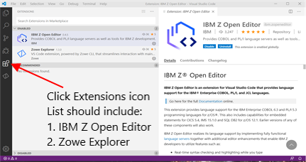

*Figure  2.  VSCode extensions*

2. Click the Zowe Explorer icon as shown in Figure  3.

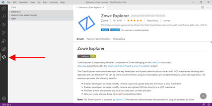

*Figure  3.   Zowe Explorer   Zowe Explorer icon*

3. Zowe Explorer can list Data Sets, Unix System Services (USS) files, and Jobs output as shown in Figure  4. + will appear when hovering to the far right on the DATA SETS line.  Click the + to define a VSCode profile.

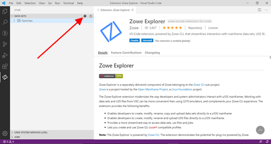

*Figure  4.  Zowe Explorer*

4. A box appears to define a new profile.  Click + to the left of Create a New Connection to z/OS as shown in Figure  5.

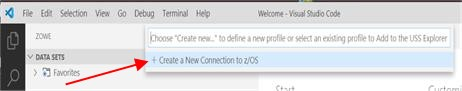

*Figure  5.  Create a new connection to z/OS*

 
5. Select a name to enter, then enter.  Figure  6. used `LearnCOBOL` as the selected connection name.

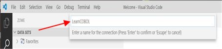

*Figure  6.  Set connection name*

 
6. VSCode prompts for z/OSMF URL and port as shown in Figure  7.  The z/OSMF URL and port will normally be provided by z/OS System Administrator.

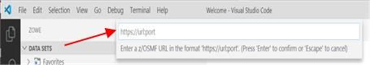

*Figure  7.  z/OSMF URL*

7. A sample z/OSMF URL and port is entered as shown in Figure  8.

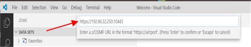

*Figure  8.  Specified z/OSMF URL*

8. The connection prompts for Username as shown in Figure  9.

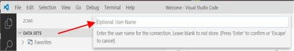

*Figure  9.  User name prompt*

9. A sample username, Z99998, is entered as shown in Figure  10.  The ID is assigned by the System Administrator.

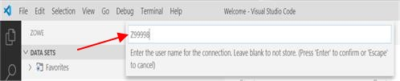

*Figure  10.  Specified user name*


10. The connection prompts for the Username Password as shown in Figure  11.

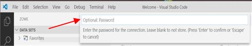

*Figure  11.  Password prompt*

11. Enter the Username Password as shown in Figure  12.

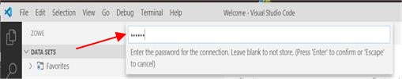

*Figure  12.  Specified password*

12. Select **False - Accept connections with self-signed certificates** to authorize workstation connection as shown in Figure  13.

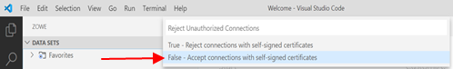

*Figure  13.  Accept connections with self-signed certifications*

13. Result is Favorites in the Data Sets, Unix System Services, and Jobs sections as shown in Figure  14.

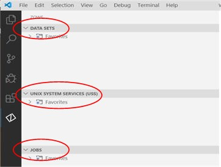

*Figure  14.  Favorites*

14.  Again, click on the + to the far right on the Data Sets selection.  Result is another prompt to Create a New Connection to z/OS.  LearnCOBOL is in the connection list.  Select **LearnCOBOL** for the Data Sets available to the previously defined LearnCOBOL connection to z/OS as shown in Figure  15.


*Figure  15.  LearnCOBOL connection*

 

15.  Expansion of LearnCOBOL reads “Use the search button to display datasets”.  Click the search button as shown in Figure  16.

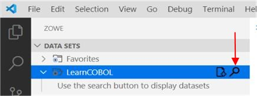

*Figure  16.  Search button*

 

16.  A prompt to “Select a filter” appears for ID Z99998.  Select the + to ‘Create a new filter” as shown in Figure  17.

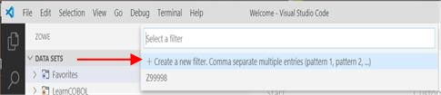

*Figure  17.  Select a filter*

 

17.  A prompt appears to enter the filter name to be searched as shown in Figure  18.

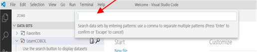

*Figure  18.  Filter name to be searched*

 

18.  ID Z99998 has lab data set names that begin the Z99998.  Therefore, Z99998 is entered as the filter to searched for ID Z99998 as shown in Figure  19.

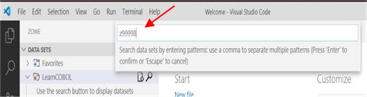

*Figure  19.   Entered filter name*

 

19.  A list of data set names beginning with Z99998 for ID Z99998 from z/OS Connection LearnCOBOL appears as shown in Figure  20.

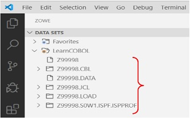

*Figure  20.  Filtered data set names*

 

20.  Expand **Z99998.CBL** to view COBOL source members, then select member **HELLO** to see a simple COBOL ‘Hello World!’ program as shown in Figure  21.

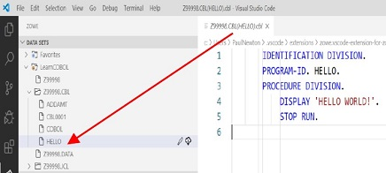

*Figure  21.  Z9998.CBL*

 

21.  Expand **Z99998.JCL** to view JCL and select member HELLO which is the JCL to compile and execute simple ‘Hello World!’ COBOL source code as shown in Figure  22.

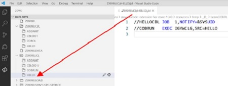

*Figure  22.  Z99998.JCL*

 

22.  Right click on JCL member **HELLO** .  A section box appears.  Select **Submit Job** for system to process HELLO JCL as shown in Figure  23.  The submitted JCL job compiles the COBOL HELLO source code, then executes the COBOL HELLO program.

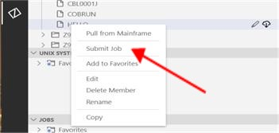

*Figure  23.  Submit Job*

 

23.  Observe the ‘Jobs’ section in Zowe Explorer as shown in Figure  24.


*Figure  24.  JOBS section*

 

24.  Again, click on the + to the far right on the Jobs selection.  Result is another prompt to ‘Create new’.  Select **LearnCOBOL** from the list as shown in Figure  25.

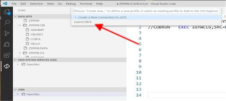

*Figure  25.   +   Select LearnCOBOL connection*

 

25.  As a result, the JCL jobs owned by ID Z99998 appears.  HELLOCBL is the JCL job name previously submitted.  Expand **HELLOCBL** output to view sections of the output as shown in Figure  26.

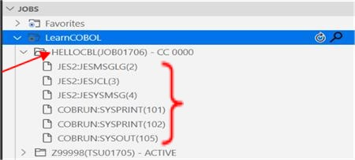

*Figure  26.  HELLOCBL output*

 

26.  Select **COBRUN:SYSPRINT(101)** to view the COBOL compiler output.  Scroll forward in the COBOL compile to locate the COBOL source code compiled into an executable module as shown in Figure  27.  Observe the Indicator Area in column 7, A Area beginning in column 8, and B Area beginning in column 12.  Also, observe the period (.) scope terminators in the COBOL source.

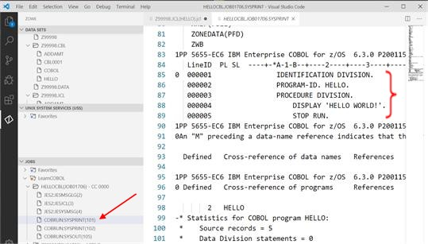

*Figure  27.  COBOL compiler output*

 

27.  View the COBOL program execution by selecting **COBRUN:SYSOUT(105)** from the LearnCOBOL in the Jobs section of Zowe Explorer as shown in Figure  28.

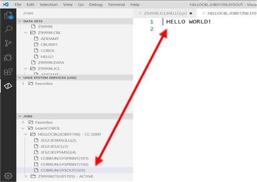

*Figure  28.  COBOL program execution*

 

28.  The following URL is another excellent document describing the above VSCode and Zowe Explore details with examples:
   [https://marketplace.visualstudio.com/items?itemName=Zowe.vscode-extension-for-zowe](https://marketplace.visualstudio.com/items?itemName=Zowe.vscode-extension-for-zowe)

\newpage

# Data division

Understanding COBOL variables and program processing of variables are essential to effectively learning the COBOL language.  An experienced COBOL programmer must master characteristics of COBOL variables and the program processing using the variables introduced in this chapter.  The objective is to introduce the reader to the basics of COBOL variables while exposing the reader to the many advanced COBOL variable options.

Following this chapter is a lab available to compile and execute the COBOL source code provided later in the chapter.   Following the successful compile and execution of one provided program, a second provided COBOL program with a minor change is available to compile.  The second program has an embedded error and on compile will fail.  The failed compilation is an opportunity to identify the error associated with the significance of PICTURE clause data types associated with the operation of the COMPUTE statement (discussed in this chapter) and how to solve the error.

- **Variables / Data-items**

     - **Variable / Data-item name restrictions and data types**

- **PICTURE clause**

     - **PIC clause symbols and data types**

     - **Coding COBOL variable / data-item names**

     - **PICTURE clause character-string representation**

- **Literals**

     - **Figurative constants**

     - **Data relationships**

     - **Levels of data**

- **MOVE and COMPUTE**

- **Lab**

## Variables / Data-items

A COBOL variable, also known as a data-item, is a name and is chosen by the COBOL programmer.  The named variable is coded to hold data where the data value can vary, hence the generic term 'variable'. A COBOL variable name is also known as 'Data Name'.  A COBOL variable name has restrictions. 


### Variable / Data-item name restrictions and data types

A list of COBOL variable name restrictions or rules are:

- Must not be a COBOL reserved word.

- Must not contain a space as a part of the name.

- Name contains letters (A-Z), digits (0-9), underscores (_) and hyphens (-).

- Maximum length of 30 characters.

- A hyphen cannot appear as the first or last character.

- An underscore cannot appear as the first character.

**Note** : A full list of COBOL reserved words can be found in the Enterprise COBOL Language Reference, Appendix E.

When COBOL source code is compiled into an executable program, the COBOL compiler is expecting a named COBOL variable to possess attributes such as a length and data type.  During program execution, the variable represents a defined area of processing memory where the memory location has a maximum length and designated data type.

A list of the most common COBOL data types are:

- Numeric (0-9)

- Alphabetic (A-Z), (a-z), or a space

- Alphanumeric Numeric and Alphabetic Combination

## PICTURE clause

The COBOL reserved word, PICTURE (PIC), determines the length and data type of a programmer selected variable name. Data types described by PIC are commonly referred to as a picture clause or pic clause.  Some simple pic clauses are:

- PIC 9 - single numeric value where length is one

- PIC 9(4) - four numeric values where length is four

- PIC X - single alphanumeric (character) value where length is one

- PIC X(4) - four alphanumeric values where length is four

### PIC clause symbols and data types

The maximum length of a picture clause is dependent upon the data type and compiler options.  The PIC reserved word has many more data types beyond numeric (PIC 9) and alphanumeric (PIC X).  As an example, an alphabetic only data type is defined as PIC A.  Other PIC clause symbols are:

`B E G N P S U V Z 0 / + - , . * CR DB cs`

Where cs is any valid currency symbols such as the dollar sign ($).

All PIC clause symbols are described in the [Enterprise COBOL for z/OS Language Reference manual](https://www.ibm.com/support/knowledgecenter/SS6SG3_4.2.0/com.ibm.entcobol.doc_4.2/PGandLR/igy3lr50.pdf). 


### Coding COBOL variable / data-item names

A PIC clause describes the data type of a variable/data-item name.  Coding a variable/data-item is done in the DATA DIVISION.  The COBOL code describing a variable/data-item name is accomplished using a level number and a picture clause.

- Level number - A hierarchy of fields in a record.

- Variable name / Data-item name - Assigns a name to each field to be referenced in the program and must be unique within the program.

- Picture clause - For data type checking.

Figure  1. below is an example of COBOL level numbers with respective variable/data-item names and picture clause.

### PICTURE clause character-string representation

Some PIC clause symbols can appear only once in a PIC clause character-string, while other can appear more than once.  For example:

- PIC clause to hold value 1123.45 is coded as follows, where the V represents the decimal position.

   `PIC 9(4)V99`

- PIC clause for a value such as $1,123.45 is coded as follows:

   `PIC $9,999V99`

## Literals

A COBOL literal is constant data value, meaning the value will not change like a variable can. The COBOL statement, `DISPLAY "HELLO WORLD!",` is a COBOL reserved word, `DISPLAY` , followed by a literal, `HELLO WORLD!`

### Figurative constants

Figurative constants are reserved words that name and refer to specific constant values. Examples of figurative constants are:

- ZERO, ZEROS, ZEROES

- SPACE, SPACES

- HIGH-VALUE, HIGH-VALUES

- LOW-VALUE, LOW-VALUES

- QUOTE, QUOTES

- NULL, NULLS

### Data relationships

The relationships among all data to be used in a program is defined in the DATA DIVISION, through a system of level indicators and level-numbers.  A level indicator, with its descriptive entry, identifies each file in a program. Level indicators represent the highest level of any data hierarchy with which they are associated.  A level-number, with its descriptive entry, indicates the properties of specific data. Level-numbers can be used to describe a data hierarchy; they can indicate that this data has a special purpose.

#### Level numbers

A structured level number hierarchic relationship is available to all DATA DIVISION sections.  Figure  1. shows the level number hierarchic relationship with programmer chosen level numbers, variable names and PIC clauses in the File Section where “01  PRINT-REC” references the following “05”-level group of variables and the “01  ACCT-FIELDS” references the following “05"-level group of variables.  Observe 05-level CLIENT-ADDR is further subdivided into several 10-level names.  COBOL code referencing the name CLIENT-ADDR includes the 10-level names.

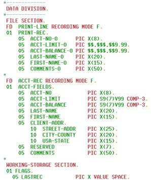

*Figure  1.  Level number hierarchic relationship*

### Levels of data

After a record is defined, it can be subdivided to provide more detailed data references as seen in Figure  1.  A level number is a one-digit or two-digit integer between 01 and 49, or one of three special level numbers: 66, 77, or 88 where the variable names are assigned attributes different from the 01-49-level numbers.  The relationship between level numbers within a group item defines the hierarchy of data within that group.  A group item includes all group and elementary items that follow it until a level number less than or equal to the level number of that group is encountered. 

## MOVE and COMPUTE

MOVE and COMPUTE reserved word statements alter the value of variable names.  Each MOVE shown in Figure  2. results in a literal stored in a 77-level variable name.  The COMPUTE statement, also shown in Figure  2. , stores the value of `HOURS * RATE` in `GROSS-PAY.`   All three variable names are assigned a numeric value data type using PIC 9, which is necessary for the operation of the COMPUTE statement.


*Figure  2.  MOVE and COMPUTE example*

## Lab

**Note** : It may take a few seconds to load in all segments of this lab.  If files are not loading, hit the refresh button on the list that appears when hovering over the section bar.

1. View the PAYROL00 COBOL source code member in the 'id'.CBL data set.

2. Submit the JCL member, PAYROL00, from the id.JCL, where id is your id,dropdown. This is where id.JCL(PAYROL00) compiles and successfully executes the PAYROL00. program.


*Figure  3.  Submit PAYROL00 job*

**Note** : If you receive this error message after submitting the job:

That is because you submitted the job from the .CBL data set and not the .JCL data set.

3. View both compile and execution of PAYROL00 job output, referenced in Figure  4.


*Figure  4.  PAYROL00 output*

4. Next, view PAYROL0X COBOL source code member in id.CBL data set.

5. View and submit the JCL member, PAYROL0X, from the id.JCL dropdown. This is where id.JCL(PAYROL0X) compiles and executes the PAYROL0X program.

6. View the compile of PAYROLL0X job output, notice there is no execution output.

   Do you notice a difference between this compile and the previous job compile shown in Figure  5. ?


*Figure  5.  Compare job compiles*

The difference is the return/completion code associated with each job output, located both next to the job output name within the JOBS section as shown above, or at the end of the compile output as, 0Return code ##. A return code of 12 means there was an error, but how do we know what that error was? Continue to find out!

7. Observe the text associated with IGYPA3146-S on line 137 within the job output (compile), illustrated in Figure  6.


*Figure  6.  IGYPA3146-S message*

Notice that this line tells you to focus on the GROSS-PAY picture clause in order to identify the problem. Use this information, modify the PAYROL0X COBOL source code to fix the error. Be sure you are editing the correct code.

8. After modifying, re-submit the PAYROL0X JCL to verify the problem has been identified and corrected, resulting in a successful compile and execution with a return code of zero, shown in Figure  7.
 


*Figure  7.  Compare return codes*

\newpage

# File handling

The previous chapter and lab focused on variables and moving literals into variables, then writing variable content using the COBOL DISPLAY statement.  This section introduces reading records from files into variables, moving the variables to output variables, and writing the output variables to a different file. A simple COBOL program to read each record from a file and write each record to a different file is used to illustrate COBOL code necessary to read records from an input external data source and write records to an output external data source.

An experienced COBOL programmer can answer the question, "How does an Enterprise COBOL program read data from an input external data source and write data to an output external data source?"  The objective of this chapter is to provide enough comprehensive information for the reader to be able to answer that question.


- **COBOL code used for sequential file handling**

     - **COBOL inputs and outputs**

     - **FILE-CONTROL paragraph**

     - **COBOL external data source**

     - **Data sets, records, and fields**

     - **Blocks**

     - **ASSIGN clause**

- **PROCEDURE DIVISION sequential file handling**

     - **Open input and output for read and write**

     - **Close input and output**

- **COBOL programming techniques to read and write records sequentially**

     - **READ-NEXT-RECORD paragraph execution**

     - **READ-RECORD paragraph**

     - **WRITE-RECORD paragraph**

     - **Iterative processing of READ-NEXT-RECORD paragraph**

- **Lab**


## COBOL code used for sequential file handling

COBOL code used for sequential file handling involves:

- ENVIRONMENT DIVISION.

    - SELECT clauses

    - ASSIGN clauses

- DATA DIVISION.

    - FD statements

- PROCEDURE DIVISION.

    - OPEN statements

    - CLOSE statements

    - READ INTO statement

    - WRITE FROM statement


### COBOL inputs and outputs

The ENVIRONMENT DIVISION and DATA DIVISION describes the inputs and outputs used in the PROCEDURE DIVISION program logic.  Previous chapters introduced variable descriptions in the DATA DIVISION and literals were moved into the defined variables.  The role of the ENVIRONMENT DIVISION and more specifically, the INPUT-OUTPUT SECTION, FILE-CONTROL paragraph introduces accessing external data sources where the data from external sources are moved into defined variables.

### FILE-CONTROL paragraph

The FILE-CONTROL paragraph associates each COBOL internal file name with an external dataset name.   Within the FILE-CONTROL paragraph, the SELECT clause creates an internal file name and the ASSIGN clause creates an external dataset name.  Figure  1. shows the PRINT-LINE internal file name associated with the PRTLINE external dataset name and the ACCT-REC internal file name associated with the ACCTREC external dataset name.  Section titled Assign Clause further explains the SELECT ASSIGN TO relationship.


*Figure  1.  FILE-CONTROL*

 

While SELECT gives a name to an internal file and ASSIGN gives a name to the external dataset name, a COBOL program needs more information about both.  The COBOL compiler is given more information about both in the DATA DIVISION, FILE SECTION.

The COBOL reserved word 'FD' is used to give the COBOL compiler more information about internal file names in the FILE-SECTION.  The code below the FD statement is the record layout.  The record layout consists of level numbers, variable names, data types, and lengths as shown in Figure  2.


*Figure  2.  FILE-SECTION*


### COBOL external data source

Enterprise COBOL source code compiles and executes on IBM Z Mainframe hardware where z/OS is the operating system software.  z/OS stores data in both data sets and Unix files.  z/OS includes many data storage methods.  This chapter will focus on the z/OS sequential data storage method.  A sequential dataset is a collection of records.

### Data sets, records, and fields

A dataset has many records.  A record is a single line in the dataset and has a defined length.  Each record can be subdivided into fields where each field has a defined length.  Therefore, the sum of all field lengths would equal the length of the record.  Observe Figure  3.


### Blocks

Each record read by the program can result in disk storage access.   A program typically reads 1 record at a time in sequential order until all records are read.  When a record is read, the record retrieved from disk is stored in memory for program access.  When each next record read requires the need to retrieve the record from disk, system performance is impacted negatively.  Records can be blocked where a block is a group of records.  The result is when the first record is read, then an entire block of records is read into memory assuming the program will be reading the second, third, etc. records avoiding unnecessary disk retrievals and negative system performance.  The memory holding a record or block of records to be read by the program is known as a buffer.  COBOL BLOCK CONTAINS clause is available to specify the size of the block in the buffer.  Observe Figure  3.


*Figure  3.  Records, fields, and blocks*

### ASSIGN clause

While the SELECT clause name is an internal file name, the ASSIGN clause name is describing a data source external to the program.  z/OS uses Job Control Language, JCL, operations to tell the system what program to load and execute followed by input and output names needed by the program. The JCL input and output names are call DDNAMEs. The JCL DDNAME statement includes a JCL DD operation where DD is an abbreviation for Data Definition. On the same DDNAME statement is the system-controlled data set name.

COBOL code “SELECT ACCT-REC ASSIGN TO ACCTREC” requires a JCL DDNAME ACCTREC with a DD redirecting ACCTREC to a z/OS controlled dataset name, MY.DATA. The COBOL program is shown in Example 1.

The purpose of the redirection of ACCT-REC, via ASSIGN TO, to JCL DDNAME, ACCTREC is flexibility.  ACCT-REC is used in the program itself, ACCTREC is a bridge to JCL, shown in Example 1. , and a DD JCL statement links ACCTREC to an actual dataset, shown in Example 2.  This flexibility allows the same COBOL program to access a different data source with a simple JCL modification avoiding requirement to change the source code to reference the alternate data source. 


```
SELECT ACCT-REC ASSIGN TO **ACCTREC**
```
*Example 1.  COBOL program*

The JCL statement required by the compiled COBOL program during execution to redirect ACCTREC to the MY.DATA z/OS controlled dataset is shown in Example 2.

```
//**ACCTREC**   DD  DSN=MY.DATA,DISP=SHR
```
*Example 2.  JCL statement*

In summary, ACCT-REC is the internal file name.  ACCTREC is the external name where a JCL DDNAME must match the COBOL ASSIGN TO ACCTREC name.  At program execution the JCL ACCTREC DDNAME statement is redirected to the dataset name identified immediately after the JCL DD operation.

`ACCT-REC >>> ACCTREC >>> //ACCTREC  >>> DD >>> MY.DATA`

As a result, the COBOL internal ACCT-REC file name reads data records from sequential dataset named MY.DATA.

JCL is a separate z/OS technical skill.  The introduction to COBOL explains just enough about JCL to understand how the COBOL internal file name locates the external sequential dataset name. To read more on JCL, visit the IBM Knowledge Center:

[https://www.ibm.com/support/knowledgecenter/zosbasics/com.ibm.zos.zjcl/zjclc_basicjclconcepts.htm](https://www.ibm.com/support/knowledgecenter/zosbasics/com.ibm.zos.zjcl/zjclc_basicjclconcepts.htm)


## PROCEDURE DIVISION sequential file handling

During COBOL program runtime, SELECT ASSIGN TO a JCL DDNAME is mandatory.  If the ASSIGN TO name fails to associate with a JCL DDNAME of the same spelling, at runtime, then a program runtime error occurs when the OPEN operation is attempted.  A message appears in the runtime output indicating the DDNAME was not found.  READ and WRITE are dependent upon successful completion of the OPEN operation.  The compiler cannot detect the runtime error because the compiler is unaware of the actual runtime JCL DDNAME dataset name subject to OPEN, READ, or WRITE.  The FD, File Descriptor, mapping of the data record fields requires a successful OPEN to be populated by subsequent READ or WRITE operations.


### Open input and output for read and write

COBOL inputs and outputs must be opened to connect the selected internal name to the assigned external name.  Figure  4. opens the file name ACCT-REC as program input and file name PRINT-LINE as program output.


*Figure  4.  OPEN-FILES*

### Close input and output

COBOL inputs and outputs should be closed at program completion or better yet when the program is done reading from or writing to the internal file name.  Figure  5. closes the internal file name ACCT-REC and internal file name PRINT-LINE, then stops processing, STOP RUN.


*Figure  5.  CLOSE-STOP*

## COBOL programming techniques to read and write records sequentially

When reading records, the program needs to first check for no records to be read or check for no more records to be read.  If a record exists, then the fields in the read record populate variable names defined by the FD clause.  COBOL uses a PERFORM statement for iteration.  In computer programming, iterative is used to describe a situation in which a sequence of instructions or statements can be executed multiple times. One pass through the sequence is called an iteration.  Iterative execution is also called a loop.  In other programming languages, ‘DO’ or ‘FOR’ statements are used for iterative execution.  COBOL uses a PERFORM statement for iterative execution.  Figure  6. shows four programmer chosen paragraph names in the PROCEDURE DIVISION.

- READ-NEXT-RECORD

- CLOSE-STOP

- READ-RECORD

- WRITE-RECORD

READ-NEXT-RECORD repeatedly executes READ-RECORD and WRITE-RECORD until a last record is encountered.  When the last record is encountered, then CLOSE-STOP is executed stopping the program.


*Figure  6.  Reading and writing records*

**Note:** COBOL is English-like and COBOL reserved words are English-like.  The programmer is free to use English-like variable names to help remember the purpose of the variable names.  The PROCEDURE DIVISION structure is English-like.  A paragraph contains one or more sentences.  A sentence contains one or more statements.  The implicit scope terminator, a period (.), terminates a sentence or terminates several consecutive statements which would be analogous to a compounded sentence where ‘and’ joins potentially independent sentences together. 
###


### READ-NEXT-RECORD paragraph execution

The READ-NEXT-RECORD paragraph is a COBOL programming technique used to read all records from a sequential file UNTIL the last record is read.  The paragraph contains a compounded sentence terminated by an implicit scope terminator, (.) period, on a separate line following the END-PERFORM statement.  The PERFORM UNTIL through END-PERFORM, explicit scope terminator, is repeatedly executed until LASTREC variable contains Y.  The first PERFORM READ-RECORD results in a branch to the READ-RECORD paragraph.  Observe #1 in Figure  7.


### READ-RECORD paragraph

The READ-RECORD paragraph executes the COBOL READ statement resulting in the external sequential file populating the variables associated with ACCT-REC internal file name. If ‘AT END’ of records read, then Y is moved into the LASTREC variable.  The READ statement is terminated by an explicit scope terminator, END-READ.  The paragraph is terminated by an implicit scope terminator, (.) period.  Control is returned to READ-NEXT-RECORD paragraph to execute the next statement, PERFORM WRITE-RECORD.

### WRITE-RECORD paragraph

The WRITE-RECORD paragraph contains several sentences terminated by an implicit scope terminator, (.) period.  The MOVE statements result in each input file variable name moved to an output file variable name.  The last sentence in the paragraph writes the collection of output file variable names, PRINT-REC.

PRINT-REC is assigned to PRTREC.  JCL is used to execute the COBOL program.  An associated JCL PRTREC DDNAME redirects the written output to a z/OS controlled data set name, etc. using JCL DD operation on the JCL DDNAME statement.  Observe #2 in Figure  7.

### Iterative processing of READ-NEXT-RECORD paragraph

Once all statements in the WRITE-RECORD paragraph are executed, then control is returned to the READ-NEXT-RECORD paragraph where the next sentence to be executed is the second PERFORM READ-RECORD statement.

Again, the READ-RECORD paragraph executes the COBOL READ statement, resulting in the external sequential file populating the variables associated with ACCT-REC internal file name. If ‘AT END’ of records read, Y is moved into the LASTREC variable, then returns control to READ-NEXT-RECORD paragraph.  The READ-NEXT-RECORD paragraph would continue the iterative process UNTIL Y is found in the LASTREC variable.  Observe #3 in Figure  7.


*Figure  7.  Iterative processing*


## Lab

The lab associated with this chapter demonstrates the ‘end-of-file’ COBOL coding technique for reading all data records from a sequential file. If a step has an asterisk (\*) next to it, it will have a hint associated at the end of the lab content.

1. If not already, open VSCode and select Zowe Explorer from the left sidebar.

**Note** : If you are opening a new instance of VSCode (i.e. you closed out of it after the previous usage), you may need to 'Select a filter' again. You can do so by selecting the search icon () next to your named connection in the DATA SETS section and then reselecting the filter previously used. It should be in the listed filters after you have selected the search symbol.

 

2. View these COBOL source code members listed in the id.CBL data set:

- CBL0001

- CBL0002

3. View these three JCL members in the id.JCL data set:

- CBL0001J

- CBL0002J

- CBL0003J


*Figure  8.  Id.JCL(CBL0001J).jcl*

4. Submit job, JCL(CBL0001J), within the DATA SET section.

5. View that job output using the JOBS section.

- COBRUN:SYSPRINT(101) - COBOL program compiler output

- RUN:PRTLINE(103) - COBOL program execution output, shown in Figure  9.


*Figure  9.  RUN:PRTLINE(103) for JCL(CBL0001J)*

 

6. Submit job, JCL(CBL0002J), within the DATA SET section.

 

7. View that job output using the JOBS section.

     - COBRUN:SYSPRINT(101) - COBOL program compiler output

     Locate COBOL compiler severe message IGYPS2121-S within the output file referred to in step 7, shown in Figure  10.


*Figure  10.  IGYPS2121-S message*


8. Edit CBL(CBL0002):

   - Determine appropriate spelling of PRINT-REX, correct it within the source code and save the updated source code.

 

9. Re-submit job, JCL(CBL0002J), using the DATA SET section and view the output in the JOBS section.

    - COBRUN:SYSPRINT(101) COBOL program compiler output

   - RUN:PRTLINE(103) is the COBOL program execution output (if correction is successful)

10.  Submit job, JCL(CBL0003J), using the DATA SET section.


11.  View CBL0003J ABENDU4038 output, using the JOBS section:

      - View the IGZ00355 abend message in RUN:SYSOUT(104) from the COBOL program execution output.

- IGZ00355 reads, program is unable to open or close ACCTREC file name, shown in Figure  11. guiding you to the root of the error.


*Figure  11.  RUN:SYSOUT(104) message*

 

12.  Fix this error by editing JCL(CBL0003J):

     - Determine the DDNAME needed, but missing or misspelled. 

     - Correct it within the code and save

 

13.  Re-submit job, JCL(CBL0003J), using the DATA SET section.

 

14.  View CBL0003J output using the JOBS section, your output should look like Figure  12.

     - RUN:PRTLINE - COBOL program execution output (if correction is successful)


*Figure  12.  RUN:PRTLINE(103) for JCL(CBL0003J)*

**Lab hints**

13. The error is located on line 11, adjust 'ACCTREX' accordingly.


*Figure  13.  Error in id.JCL(CBL0003J).jcl*

\newpage

# Program structure


In this chapter we discuss the concept of structured programming and how it relates to COBOL.  We highlight the key techniques within the COBOL language that allow you to write good well-structured programs.

 

- **Styles of programming**

     - **What is structured programming**

     - **What is Object Orientated Programming**

     - **COBOL programming style**

- **Structure of the Procedure Division**

     - **Program control and flow through a basic program**

     - **Inline and out of line perform statements**

     - **Using performs to code a loop**

     - **Learning bad behavior using the GO TO keyword**

- **Paragraphs as blocks of code**

     - **Designing the content of a paragraph**

     - **Order and naming of paragraphs**

- **Program control with paragraphs**

     - **PERFORM TIMES**

     - **PERFORM THROUGH**

     - **PERFORM UNTIL**

     - **PERFORM VARYING**

- **Using subprograms**

     - **Specifying the target program**

     - **Specifying program variables**

     - **Specifying the return value**

- **Summary**


## Styles of programming

Before we discuss in more detail how to structure a program written in COBOL, it's important to understand the type of language COBOL is and how it's both different from other languages and how it affects the way you might structure your programs.


### What is structured programming

Structured programming is the name given to a set of programming styles that could include functional, procedural amongst others.  Structured programming technique results in program logic being easier to understand and maintain.  Examples of structured programming languages are C, PL/I, Python and of course, COBOL.  These languages, given specific control flow structures such as loops, functions and methods, allow a programmer to organize their code in a meaningful way.

Unstructured programming constructs, also known as spaghetti code, are concepts such as GOTO or JUMP which allow the flow of execution to branch wildly around the source code.  Such code like this is hard to analyze and read.  Although COBOL does contain these structures, it is important to use them sparingly and not as the backbone of well-structured code.

Well-structured code is both easy to understand and to maintain.  It is highly likely that at some point in your career you will be required to read and work from someone else's code, often a decade after it was originally written. It would be extremely helpful to you if the original author structured their code well and likewise if it is your code someone else is reading.

 

### What is Object Orientated Programming

Object Orientated programming, or OO programming, differs from structured programming, although it borrows a lot of the same concepts.  In OO programming, code is split up into multiple classes, each representing an actor within the system.  Each class is made up of variables and a sequence of methods.  Instantiations of a class or objects can execute methods of another object.  Each class within an OO program can be considered a structured program, as it will still contain methods and iteration constructs.  However, it is the composition of the program from a set of individual classes that makes OO programming different.  It is possible to write Object Orientated COBOL; however, it is not supported by some of the middleware products that provide COBOL APIs.  It is not generally used within the market and so it is not covered in this course.


### COBOL programming style

COBOL doesn't directly have some of the components of a structured programming language as you may know them if you have studied a language like C or Java.  COBOL doesn't contain for or while loops, nor does it contain defined functions or methods.  Because COBOL is meant to be a language that is easy to read these concepts are embodied through the use of the PERFORM keyword and the concept of paragraphs.  This allows the programmer to still create these structures, but in a way that is easy to read and follow.


## Structure of the Procedure Division

As you already know, a COBOL program is split into several divisions, including identification, environment and data.  However, this chapter concerns itself with how you structure the content of the procedure division to be easy to read, understandable and maintainable in the future.


### Program control and flow through a basic program

Typically, execution in a COBOL program begins at the first statement within the procedure division and progresses sequentially through each line until it reaches the end of the source code.   For example, take a look at Example 1. Snippet from TOTEN1.  This is a simple program that displays a simple message counting to ten.

```
OPEN OUTPUT PRINT-LINE.

MOVE 'THE NUMBER IS: ' TO MSG-HEADER OF PRINT-REC.  

ADD 1 TO COUNTER GIVING COUNTER.
MOVE COUNTER TO MSG-TO-WRITE.
WRITE PRINT-REC.

ADD 1 TO COUNTER GIVING COUNTER.
MOVE COUNTER TO MSG-TO-WRITE.
WRITE PRINT-REC. 

...

CLOSE PRINT-LINE.
STOP RUN.
```
*Example 1.  Snippet from TOTEN1*

Although this code is very simple to read, it's not very elegant, there is a lot of code repetition as the number is increased.  Obviously, we want to provide some structure to the program.  There are three keywords that we can use to transfer control to a different section of the source code and provide the structure we need.  These keywords are PERFORM, GO TO and CALL.


### Inline and out of line perform statements

The PERFORM keyword is a very flexible element of the COBOL language, as it allows functions and loops to be entered.  At the most basic level, a PERFORM allows control to be transferred to another section of the code.  Once this section has executed, control returns to the following line of code.  Take the following example:


```
    OPEN OUTPUT PRINT-LINE.

    MOVE 'THE NUMBER IS: ' TO MSG-HEADER OF PRINT-REC. 

    PERFORM WRITE-NEW-RECORD.
    PERFORM WRITE-NEW-RECORD.
    PERFORM WRITE-NEW-RECORD.
    PERFORM WRITE-NEW-RECORD.
    PERFORM WRITE-NEW-RECORD.
    PERFORM WRITE-NEW-RECORD.
    PERFORM WRITE-NEW-RECORD.
    PERFORM WRITE-NEW-RECORD.
    PERFORM WRITE-NEW-RECORD.
    PERFORM WRITE-NEW-RECORD.


    CLOSE PRINT-LINE.
    STOP RUN.


WRITE-NEW-RECORD.
    ADD 1 TO COUNTER GIVING COUNTER
    MOVE COUNTER TO MSG-TO-WRITE
    WRITE PRINT-REC.
```
*Example 2.  Snippet from TOTEN2*

In this example, the three lines of code that constructed a new line of output and printed it has been extracted into a new paragraph called WRITE-NEW-RECORD.  This paragraph is then performed ten times by use of the PERFORM keyword.  Each time the PERFORM keyword is used, execution jumps to the paragraph WRITE-NEW-RECORD, executes the three lines contained within that paragraph before returning to the line following the PERFORM statement.  The concept of a paragraph will be covered later in this chapter in more depth.

### Using performs to code a loop

The code we have built so far is still not optimal, the repetition of the perform statement ten times is inelegant and can be optimized.  Observe the following snippet of code:


```
MOVE 'THE NUMBER IS: ' TO MSG-HEADER OF PRINT-REC.

PERFORM VARYING COUNTER FROM 01 BY 1 UNTIL COUNTER EQUAL 11
MOVE COUNTER TO MSG-TO-WRITE
WRITE PRINT-REC
END-PERFORM.

CLOSE PRINT-LINE.
STOP RUN.
```
*Example 3.  Snippet from TOTEN2*

In this example, we are using the PERFORM keyword in a way that is similar to a for loop in other languages.  The loop runs from the PERFORM keyword to the END-PERFORM keyword.  Each time execution iterates over the loop, the value of COUNTER is incremented and tested by one.  For comparison, the same loop would be written in Java like so:


```
for(int counter =0; counter<11; counter++){
    //move counter to msg-to-write
    //write print-rec
}
```
*Example 4.  Java example*

Although the COBOL version is perhaps more verbose than a for loop in other languages, it is easier to read, and remember you always have autocomplete (if you are using a good editor) to help you with the typing.


### Learning bad behavior using the GO TO keyword

Programmers tend to have strong beliefs about choice of editor, tabs or spaces and many heated discussions have been had on such subjects.  However, if there is one thing that we can agree on, it is that use of GO TO is usually a bad idea.  To demonstrate why GO TO can be a poor idea, we will take a look at TOTEN2 again, and replace the second instance of the PERFORM keyword with a GO TO, shown in Example 5.


```
PERFORM WRITE-NEW-RECORD.
GO TO WRITE-NEW-RECORD.
PERFORM WRITE-NEW-RECORD.
```
*Example 5.  GO TO example*

If we were to compile and run the program, you would see that although the job ABENDS (abnormally ends) with a 4038-abend code, it did execute some of the code and wrote the first two lines of the output.  If you were to look at the output in more detail, you would see a message like the following:

 

```
IGZ0037S The flow of control in program TOTEN1 proceeded beyond the last line of the program.
```
*Example 6.  Abend from GO TO example*

So, what went so terribly wrong when we used the GO TO command?  To answer this, we need to understand the key difference between GO TO and PERFORM.  On the first line we used the PERFORM keyword, that transferred control to the WRITE-NEW-RECORD paragraph.  Once the execution reached the end of that paragraph, execution returned to the line following the PERFORM statement.  The next line used the GOTO keyword to again transfer control to the WRITE-NEW-RECORD paragraph, which prints the second line of output.  However, when that paragraph completed, execution continued to the next line following the WRITE-NEW-RECORD paragraph.  Since there are no lines of code following that paragraph the processor tried to execute code beyond the program, z/OS caught this as a problem and abended the program.

 
As we can see, the use of GO TO causes a branch of execution that doesn't return to the line of code that issued it.  Let's demonstrate how messy this code can get:


```
0 01  FLAG           PIC 9(1) VALUE 1.   

1  OPEN OUTPUT PRINT-LINE.
2    GO TO SAY-HELLO-WORLD DEPENDING ON FLAG.
3
4 PRINT-NEW-MESSAGE.
5    MOVE 2 TO FLAG
6    GO TO SAY-HELLO-COBOL DEPENDING ON FLAG
7    GO TO END-RUN.
8
9 SAY-HELLO-WORLD.
10    MOVE "Hello World" TO MSG-TO-WRITE
11    WRITE PRINT-REC
12    GO TO PRINT-NEW-MESSAGE.
13
14 SAY-HELLO-COBOL.
15    MOVE "Hello COBOL" TO MSG-TO-WRITE
16    WRITE PRINT-REC
17    GO TO END-RUN.
18
19 END-RUN.
20    CLOSE PRINT-LINE
21    STOP RUN.
```
*Example 7.   Messy code using GO TO*

This example is using a mix of conditional and non-conditional GO TO statements, and there are included line numbers to make following the code easier.  Line 2 executes and will branch to SAY-HELLO-WORLD on line 9, if the flag variable is set to 1.  In this case, it is, so we progress through lines 9-12 and branch to lines 4-6 where the value of the flag is updated and tested again to see if we should jump to SAY-HELLO-COBOL.  Since the value of flag is no longer 1, execution just continues to line 7 before jumping to line 19 and finishing the run.  Take this program and comment out line 5 and run the program again.  Track the execution of the program.  Messy right?

**Note:** Both the TO and ON parts of the conditional GO TO statement can be omitted, giving a statement that looks like GO SAY-HELLO-WORLD DEPENDING FLAG.  Which although is less verbose, is no less easy to understand.

So why teach you something that we have said is messy and not advised?  Well, by giving you some understanding of its behavior, you will be better equipped when looking through existing code and maintaining it. 


## Paragraphs as blocks of code

So far in this section we have used a few examples of paragraphs without really explaining what they are, how they work and what they can be used for.  This section addresses that.

The most analogous way to think about a paragraph in COBOL is to think of a function or method in another language that accepts no parameters, returns no response and alters global variables.  It is basically a block of code that performs a sequence of actions that could be used multiple times within the same program.

A paragraph is defined within the procedure division and starts at column eight and can have any name that the user likes, apart from a COBOL keyword, and the declaration of the paragraph is completed with a period (.).  A paragraph can contain one to many COBOL sentences and is terminated either by the start of another paragraph or the physical end of the program. 
 

**Note:** A paragraph can also be ended by END-PROGRAM, END-METHOD, END FACTORY OR END-OBJECT.  Most of these are used within Object Orientated COBOL which is not discussed here.


Considering that a program can be made up of multiple paragraphs and that the PERFORM keyword can be used to call the paragraph, either conditionally or as part of a loop, it is easy to see that good paragraph design really helps makes your COBOL more structured and readable.

### Designing the content of a paragraph

There are no restrictions as to what content can go inside a paragraph, however, there are two main reasons why you might want to refactor code to be inside a paragraph:

1.  To group a sequence of COBOL sentences together that achieve a particular function or task, such as, open all the files that an application is using, calculate a particular function or perform some data validation.  Grouping such sentences into a paragraph allows you to give them a name that explains the purpose of the lines of code. 

2. The sequence of sentences will be used within a loop.  Extracting these lines into a paragraph and then using the PERFORM keyword to create a loop can make for very comprehensible code.

 

Remember that you can also perform other paragraphs within existing paragraphs.  This nested calling of paragraphs can again, help to structure your code. 


### Order and naming of paragraphs

There is no requirement about the order that paragraphs should appear within a COBOL program.  A paragraph can be called from a point either before or after where it is declared.  Although there are no restrictions enforced by the language, there are some techniques that you can follow that will make larger programs easier to follow and understand. Some of these techniques and best practices are:

- Name each paragraph to correspond with its function or behavior.  A paragraph named OPEN-INPUT-FILES. is a lot more understandable than one named DO-FILE-STUFF.

- Order the paragraphs in the general order in which they will be executed at runtime.  Doing this has two main advantages.  Using the outline view in a modern IDE will allow you to 'read' the name of each paragraph from top to bottom, in doing so you will be able to establish the general structure of the program and its behavior.

- Some COBOL programmers prefix the name of paragraphs with a number that increases throughout the source code as per Example 8.

- Because the paragraphs are numbered and appear in the source code in that order, when a sentence references a paragraph it is easier to know where in the program that paragraph might appear.  When initially structuring a program in this way, the numbers used would only increment the highest significant figure, allowing for new paragraphs to be inserted in between if needed.  Although the rise of modern editors, which allow outlining and instant jumping to a reference or declaration, makes this technique of less necessity, it is still useful to understand.

```
           PERFORM 1000-OPEN-FILES.
           PERFORM 2000-READ-NEXT-RECORD.
           GO TO 3000-CLOSE-STOP.
       1000-OPEN-FILES.   
           OPEN INPUT  ACCT-REC.
           OPEN OUTPUT PRINT-LINE.    
      * 
       2000-READ-NEXT-RECORD.   
           PERFORM 4000-READ-RECORD   
           PERFORM UNTIL LASTREC = 'Y'
           PERFORM 5000-WRITE-RECORD  
           PERFORM 4000-READ-RECORD   
           END-PERFORM. 
      *
       3000-CLOSE-STOP. 
           CLOSE ACCT-REC.
           CLOSE PRINT-LINE.    
           STOP RUN.
      * 
       4000-READ-RECORD.  
           READ ACCT-REC  
           AT END MOVE 'Y' TO LASTREC 
           END-READ.
      * 
       5000-WRITE-RECORD. 
           MOVE ACCT-N  -    TO  ACCT-NO-O. 
           MOVE ACCT-LIMIT   TO  ACCT-LIMIT-O.    
           MOVE ACCT-BALANCE TO  ACCT-BALANCE-O.  
           MOVE LAST-NAME    TO  LAST-NAME-O.
           MOVE FIRST-NAME   TO  FIRST-NAME-O.    
           MOVE COMMENTS     TO  COMMENTS-O. 
           WRITE PRINT-REC.
```
*Example 8.  Numbered paragraphs*

- Lastly, it is common to explicitly end a paragraph by coding an empty paragraph following each paragraph, see Example 9.  This empty paragraph does not contain any code, has the same name as the paragraph it is closing, suffixed with -END and is in turn closed by the starting of a following paragraph. But it can be used as a visual delimiter and is useful when using the PERFORM THRU keyword, which is discussed further on in this chapter. Some Java programmers who have learned COBOL have commented that it is equivalent to the closing brace ("}") at the end of a block of code.

```
 1000-OPEN-FILES.   
     OPEN INPUT  ACCT-REC.
     OPEN OUTPUT PRINT-LINE.    
 1000-OPEN-FILES-END.
* 
 2000-READ-NEXT-RECORD.   
     PERFORM 4000-READ-RECORD   
     PERFORM UNTIL LASTREC = 'Y'
     PERFORM 5000-WRITE-RECORD  
     PERFORM 4000-READ-RECORD   
     END-PERFORM.
 2000-READ-NEXT-RECORD-END.   
```
*Example 9.  Explicitly closed paragraphs*


## Program control with paragraphs

So far in this chapter we have discussed the importance of using paragraphs to structure your code.  In doing this, we have used the PERFORM keyword a few times to execute the paragraphs we had created.  Specifically, we used the keyword by itself and used it with the VARYING keyword to construct a loop.  In this section, we will discuss in more detail how the PERFORM keyword can be used.

### PERFORM TIMES

Perhaps the simplest way of repeating a perform statement is to use the TIMES keyword to perform a paragraph or sections of code a static number of times, shown in Example 10.   

```
 PERFORM 10 TIMES
  MOVE FIELD-A TO FIELD-B
  WRITE RECORD
 END-PERFORM.
```
*Example 10.  TIMES*

The required number of times that the code should be executed can either be a literal, as above, or the value of a numeric variable as shown in Example 11. where the PERFORM keyword is being used to execute a paragraph.

```
 PERFORM MY-NEW-PARAGRAPH COUNTER TIMES.
```
*Example 11.  TIMES 2*
 

### PERFORM THROUGH

You may require a sequential list of paragraphs to be executed in turn, instead of performing them individually.  The THROUGH or THRU keyword can be used to list the start and end paragraphs of the list.  Execution will progress through each of the paragraphs as they appear in the source code, from beginning to end, before returning to the line following the initial perform statement, observe Example 12.


```
 1000-PARAGRAPH-A.   
     PERFORM 2000-PARAGRAPH-B THRU
             3000-PARAGRAPH-C.
* 
 2000-PARAGRAPH-B.
     ...
*
 3000-PARAGRAPH-C.
     ...
*
 4000-PARAGRAPH-D.
     ...
```
*Example 12.  PEFORM THRU*
 

**Note:** The use of the THRU keyword can also be used alongside the TIMES, UNTIL and VARYING keywords, to allow the list of paragraphs to be executed rather than just a single paragraph or blocks of code.

### PERFORM UNTIL

Adding the UNTIL keyword to a perform sentence allows you to iterate over a group of sentences until the Boolean condition is met.  Effectively allowing you to program while loops in COBOL, take this basic example:

 
```
 MOVE 0 TO COUNTER.
 PERFORM UNTIL COUNTER = 10
  ADD 1 TO COUNTER GIVING COUNTER
  MOVE COUNTER TO MSG-TO-WRITE
  WRITE PRINT-REC
 END-PERFORM.
```
*Example 13.  PERFORM UNTIL*
  
This would be equivalent to the Java code:

```
while(counter != 10){
    //counter++
    //move counter to msg-to-write
    //write print-rec
}
```
*Example 14.  Java while loop*
 
In this case, the Boolean condition is evaluated before the loop is executed.  However, if you wish for the loop to be executed at least once before the condition is evaluated, you can alter the sentence to read:


```
 PERFORM UNTIL COUNTER = 10 WITH TEST AFTER
  ADD 1 TO COUNTER GIVING COUNTER
  MOVE COUNTER TO MSG-TO-WRITE
  WRITE PRINT-REC
 END-PERFORM.
```
*Example 15.  PERFORM UNTIL WITH TEST AFTER*
 
This would be similar to a "do while" loop in Java:

```
do{
    //counter++
    //move counter to msg-to-write
    //write print-rec
}
While(counter != 10);
```
*Example 16.  Java while loop*
 

### PERFORM VARYING

We've already used the VARYING keyword earlier in the section titled Using performs to code a loop, recall:

```
PERFORM VARYING COUNTER FROM 01 BY 1 UNTIL COUNTER EQUAL 11
...
END-PERFORM.
```
*Example 17.  Basic loop*

In this example, the variable counter is tested to see if it equals 11, as long as it doesn't then it is incremented, and the sentences nested within the perform statement are executed.  This construct can be extended, exemplified in Example 18.


```
PERFORM VARYING COUNTER FROM 01 BY 1 UNTIL COUNTER EQUAL 11
     AFTER COUNTER-2 FROM 01 BY 1 UNTIL COUNTER-2 EQUAL 5
...
END-PERFORM.
```
*Example 18.  Extended loop*

This may seem complex, but compare it to this Java pseudo-code:

```
for(int counter = 0; counter < 11; counter++){
    for(int counter-2 = 0; counter < 5; counter++{
       //move counter to msg-to-write
       //write print-rec
    }
}
```
*Example 19.  Java extended loop*


This is really, just two for loops nested within each other.  This construct is very useful when iterating over tables or nested record structures.  As for each loop of the outer varying loop, the inner loop will be executed five times.  As mentioned previously, the test of the condition will be assumed by COBOL to be at the beginning of the loop, however, it can be specified to be evaluated at the end of the loop by adding the phrase WITH TEST AFTER to the initial perform sentence.

 
## Using subprograms

So far, we have only examined the internal structure of a single COBOL program.  As programs increase in function and number, it is common that a programmer might want certain aspects of a programs function to be made available to other programs within the system.  Abstracting generic functions into their own program and allowing them to be called from other programs can reduce the amount of code duplication within a system and therefore decrease the cost of maintenance, as fixes to shared modules only need to be made once. 


**Note:** Although here we will describe the COBOL native way of calling another program, note that some middleware products will provide APIs that might do this in an enhanced way.


When calling another program, we need to consider three main concerns: how we will reference the program we wish to call, the parameters we want to send to the target program and the parameter that we wish the target program to return.


### Specifying the target program

To call a target program we will use the keyword CALL followed by a reference to the target program we wish to call.  The two main ways to do this are by a literal value or by referencing a variable, shown in Example 20.


```
CALL 'PROGA1' ...
...
MOVE 'PROGA2' TO PROGRAM-NAME.
CALL PROGRAM-NAME ...
```
*Example 20.  Basic CALL*

It is also possible to reference the target platform by passing a pointer reference to the target program.  If you thought that passing a pointer reference to a function was only something that ultra-modern languages had, nope COBOL got there first!


### Specifying program variables

Now that we have identified the name of the program we wish to call; we must identify the variables that the calling program might want to send.  These are individually specified by the USING keyword.  COBOL provides support to both pass by reference and pass by copy, as well as a pass by value concept.  Each of the supported passing techniques can be applied to all the data-items being passed or used selectively against different items.  

By default, COBOL will pass data items by reference.  This means that both the calling and target program will be able to read and write to the same area of memory that is represented by the variable.  This means that if the target program updates the content of the variable, that change will be visible to the calling program once execution has returned.


The BY CONTENT phrase allows a copy of the passed variable to be passed to the target program.  Although the target program can update the variable, those updates will not be visible to the calling program.

 

**Note:** When passing variables either BY REFERENCE or BY CONTENT, note you can send data items of any level.  Which means you can pass entire data structures, handy for dealing with common records.

 

You might also see the phrase, BY VALUE, being used in a CALL sentence.  BY VALUE is similar to BY CONTENT, as a copy of the content of the variable is passed.  The difference is that only a subset of COBOL datatypes are supported and you can only specify elementary data-items.  This is because BY VALUE is primarily used when COBOL is calling a program of another language (such as C).


### Specifying the return value

Finally, the RETURNING phrase is used to specify the variable that should be used to store the return value.  This can be any elementary data-item declared within the data-division.  Note that this is optional.  Some programs might not return anything, or you might have passed values BY REFERENCE to the target program in which case updates to those variables will be visible once the target program returns.


## Summary

In summary, this chapter should provide the necessary foundation to understand structured programming and how it relates to COBOL and its importance to understanding and maintaining code.  Many examples of how, when and why to implement key techniques have been provided and explained for further understanding.  You should be able to identify the basic differences between structured programming (COBOL) and OO programming (Java).  You should also understand the general concept of the best practices in the structure of the Procedure Division with reference to the design and content of paragraphs, program control options and ways to call other programs within the same system.

\newpage

# File output

Designing a structured layout that is easy to read and understand is required to format output.  Designing a structured layout involves column headings and variable alignment using spaces, numeric format, currency format, etc.  This chapter aims to explain this concept utilizing example COBOL code to design column headings and align data names under the such headings. At the end of the chapter you are asked to complete a lab that practices implementation of the components covered.

A capability of COBOL data output formatting that is worth noting but not covered in this chapter is that COBOL is a web enabled computer language.  COBOL includes easy and quick transformation of existing COBOL code to write JSON (JavaScript Object Notation) where the output is sub-sequentially formatted for a browser, a smartphone, etc. Frequently, the critical data accessed by a smart phone, such as a bank balance, is stored and controlled by z/OS where a COBOL program is responsible for retrieving and returning the bank balance to the smart phone.

- **Review of COBOL write output process**

     - **ENVIRONMENT DIVISION**

- **FILE DESCRIPTOR**

     - **FILLER**

- **Report and column headers**

     - **HEADER-2**

- **PROCEDURE DIVISION**

     - **MOVE sentence**

     - **PRINT-REC FROM sentences**

- **Lab**

## Review of COBOL write output process

This section briefly reviews certain aspects of the ENVIRONMENT DIVISION for the purpose of understanding how it ties together with the content of this chapter.


### ENVIRONMENT DIVISION

The "File handling" section covered the SELECT and respective ASSIGN programmer chosen names, whereas this chapter focuses on output.  Figure  1. shows a coding example using PRINT-LINE as the programmer chosen COBOL internal file name for output.


*Figure  1.  SELECT and ASSIGN*

## FILE DESCRIPTOR

The File Description (FD), previously described under the FILE-CONTROL paragraph section, entry represents the highest level of organization in the FILE SECTION.  The FD entry describes the layout of the file defined by a previous FILE-CONTROL SELECT statement.  Therefore, the FD entry connects the SELECT file name with a defined layout of the file name.  An example file descriptor, FD, for PRINT-LINE is shown in Figure  2.  What follows the file descriptor is a defined layout of PRINT-LINE. 

### FILLER

Observe the data name FILLER.  While most data fields have unique names, FILLER is a COBOL reserved word data name, that is useful for output formatting.  This is in part because FILLER allocates memory space without the need for a name.  Also, FILLER allocated memory has a defined length in the output line and may contain spaces or any literal.  Figure  2. shows multiple VALUE SPACES for FILLER.  SPACES create white space between data-items in the output which is valuable in keeping the code readable.  More specifically in Figure  2. FILLER PIC X(02) VALUE SPACES, represents the output line containing two spaces.


*Figure  2.  FILLER*


## Report and column headers

Writing report or column headers requires a structured output layout designed by the programmer.  Figure  3. illustrates such a structure. The designed output structure layout is implemented within the DATA DIVISION and includes the headers listed and defined below.

- **HEADER-1:**

    - Writes a literal

    - Example: ‘Financial Report for’

 

- **HEADER-2:**

    - Writes literals

    - Examples:

      - ‘Year’ followed by a variable name

      - ‘Month’ followed by a variable name

      - ‘Day’ followed by a variable name

- **HEADER-3:**

    - Writes literals

    - Examples:

       - ‘Account’ followed by FILLER spacing

       - ‘Last Name’ followed by FILLER spacing

      - ‘Limit’ followed by FILLER spacing

      - ‘Balance; followed by FILLER spacing

- **HEADER-4:**

    - Writes dashes followed by FILLER spacing


*Figure  3.  Designed output structure layout*


### HEADER-2

HEADER-2 includes the year, month, day of the report together with FILLER area, creating blank spaces between the year, month, and day, as you can see in Figure  3.  Figure  4. is an example of the data name layout used to store the values of CURRENT-DATE.  The information COBOL provides in CURRENT-DATE is used to populate the output file in HEADER-2.


*Figure  4.  CURRENT-DATE intrinsic function*


## PROCEDURE DIVISION

Figures 1 through 4 are a designed data layout that includes a data line and report headers.  Using the storage mapped by the data line and report headers, COBOL processing logic can write the headers followed by each data line. Figure  5. is an example of an execution logic resulting used to write the header layout structure in a COBOL program.


*Figure  5.  Execution logic to write header layout structure*


### MOVE sentences

The COBOL MOVE sentence, on line 1, in the WRITE-HEADERS paragraph is collecting the current date information from the system and storing that information in a defined data name layout, WS-CURRENT-DATE-DATA.  The use of the reserved word FUNCTION means whatever follows is a COBOL intrinsic function.  The sentences on lines 2, 3, and 4 are storing the date information, year, month and day, in HEADER-2 defined data name areas, HDR-YR, HDR-MO and HDR-DAY.  The sentence on line 11, the final sentence in the paragraph, writes spaces into the PRINT-REC area to clear out the line storage in preparation for writing the data lines.

### PRINT-REC FROM sentences

PRINT-REC is opened for output resulting in PRINT-REC FROM following through with a write PRINT-REC FROM a different header or defined data name layout.  The sentences on lines 5 and 6 write the PRINT-REC FROM defined header data names, HEADER-1 and HEADER-2, from Figure  3.   The PRINT-REC file descriptor data names in Figure  2. are effectively replaced with the content of the header data names in Figure  3. written to output.  The sentences on lines 7 and 8 result in a blank line written between headers.  The sentences on lines 9 and 10 write the PRINT-REC FROM defined HEADER-3 and HEADER-4 data names from Figure  3.  The PRINT-REC file descriptor data names in Figure  2. are effectively replaced with the content of the header data names in Figure  3.

## Lab

This lab utilizes two COBOL programs, CBL0004 and CBL0005, located within your id.CBL data set, as well as two JCL jobs, CBL0004J and CBL0005J, located within your id.JCL data set.  The JCL jobs are used to compile and execute the COBOL programs, as discussed in previous chapters.
#### Using VSCode and Zowe Explorer

1. Submit job: CBL0004J

 

2. Observe the report written with headers like Figure  6. below.


*Figure  6.  Report with headers*


3. Submit job: CBL0005J

4. Observe the report data lines are written without dollar currency symbol, illustrated in Figure  7.


*Figure  7.  No currency symbol in output*

5. Modify id.CBL(CBL0005) to include the dollar currency symbol in the report.

   **Hint: Compare with CBL0004 line 25**


6. Re-submit job: CBL0005J


7. Observe the report data lines should now include the dollar currency symbol.


*Figure  8.  Currency symbol added to output*

\newpage
  
# Conditional expressions

This chapter dives into how programs make decisions based upon the programmer written logic.  Specifically, programs make these decisions within the PROCEDURE DIVISION of the source code.  We will expand on several topics regarding conditional expressions written in COBOL through useful explanations, examples and eventually practicing implementation through a lab. 

 

- **Boolean logic, operators, operands, and identifiers**

     - **COBOL conditional expressions and operators**

     - **Examples of conditional expressions using Boolean operators**

- **Conditional expression reserved words and terminology**

     - **IF, EVALUATE, PERFORM and SEARCH**

     - **Conditional states**

     - **Conditional names**

- **Conditional operators**

- **Conditional expressions**

     - **IF ELSE (THEN) statements**

     - **EVALUATE statements**

     - **PERFORM statements**

     - **SEARCH statements**

- **Conditions**

     - **Relation conditions**

     - **Class conditions**

     - **Sign conditions**

- **Lab**

 
## Boolean logic, operators, operands, and identifiers

Programs make decisions based upon the programmer written logic.  Program decisions are made using Boolean logic where a conditional expression is either true or false, yes or no.  A simple example would be a variable named 'LANGUAGE'.   Many programming languages exist; therefore, the value of variable LANGUAGE could be Java, COBOL, etc...  Assume the value of LANGUAGE is COBOL.  Boolean logic is, IF LANGUAGE = COBOL, THEN DISPLAY COBOL, ELSE DISPLAY NOT COBOL.  IF triggers the Boolean logic to determine the condition of true/false, yes/no, applied to LANGUAGE = COBOL which is the conditional expression.  The result of IF condition executes what follows THEN when the condition is true and executes what follows ELSE when the condition is false.

The Boolean IF verb operates on two operands or identifiers.  In the example above, LANGUAGE is an operand and COBOL is an operand.  A Boolean relational operator compares the values of each operand. 


### COBOL conditional expressions and operators

Three of the most common type of COBOL conditional expressions are:

  1.  General relation condition

  2.  Class condition

  3.  Sign condition

 

A list of COBOL Boolean relational operators for each of the common type of COBOL conditional expressions are represented in Figures 1, 2 and 3 below.

 


*Figure  1.  General relation condition operators*


*Figure  2.  Class condition operators*


*Figure  3.  Sign condition operators*

 
### Examples of conditional expressions using Boolean operators

A simple conditional expression can be written as:

`IF 5 > 1 THEN DISPLAY '5 is greater than 1' ELSE DISPLAY '1 is greater than 5'.`

Compounded conditional expressions are enclosed in parenthesis and their Boolean operators are:

`AND`

`OR`

The code snippet below demonstrates a compounded conditional expression using the AND Boolean operator.

`IF (5 > 1 AND 1 > 2) THEN .... ELSE ....`

This conditional expression evaluates to false because while 5 > 1 is true, 1 > 2 is false.  The AND operation requires both expressions to be true to return true for the compounded condition expression.  Let's show another implementation, this time using the OR Boolean operator.

`IF (5 > 1 OR 1 > 2) THEN .... ELSE ....`

This conditional expression evaluates to true because while 1 > 2 is false, 5 > 1 is true.  The OR operation requires only one of the expressions to be true to return true for the entire compounded condition expression.  More conditional operators used for relation, class, and sign conditions are discussed further on in the chapter.

 
## Conditional expression reserved words and terminology

Thus far in this book, we have touched upon the necessity and use of COBOL reserved words. This section aims to expand on the topic of reserved words, specifically ones that are used when processing conditional expressions.

### IF, EVALUATE, PERFORM and SEARCH

These are COBOL reserved words available for the processing of conditional expressions, where a condition is a state that can be set or changed. 

### Conditional states

TRUE and FALSE are among the most common conditional states.  

### Conditional names

A conditional-name is a programmer defined variable name with the TRUE condition state.  Conditional names are declared in the WORKING STORAGE SECTION with an 88-level number.  The purpose of 88-level is to improve readability by simplifying IF and PERFORM UNTIL statements.

The 88-level conditional data-name is assigned a value at compile time.  The program cannot change the 88-level data-name during program execution. However, the program can change the data name value in the level number above the 88-level conditional data-name.  01-level USA-STATE in Example 1. can be changed.  A program expression referencing the 88-level data-name is only true when the current value of the preceding level data name, USA-STATE, is equal to the WORKING-STORAGE 88-level conditional data-name assigned value. 

Observe in Example 1.  'The State is not Texas' is written as a result of the first IF STATE because the value of USA-STATE is AZ which is not equal to the 88-level conditional data-name, TX.  The second IF STATE writes, 'The State is Texas' because the value of USA-STATE is equal to the assigned 88-level value of TX.


```
WORKING-STORAGE.
01 USA-STATE     PIC X(2) VALUE SPACES.
   88 STATE      VALUE 'TX'.
....
....
PROCEDURE DIVISION.
....
....
MOVE 'AZ' TO USA-STATE.
....
....
IF STATE DISPLAY 'The State is Texas'
   ELSE DISPLAY  'The State is not Texas'
END-IF.
....
....
MOVE 'TX' TO USA-STATE.
....
....
IF STATE DISPLAY 'The State is Texas'
   ELSE DISPLAY  'The State is not Texas'
END-IF.
```
*Example 1.  Using 88-level conditional name*

Numerous 88-level conditional data-names can follow an 01-level data-name.  As a result an IF reference to 01-level data-name expression can have numerous values that would return true.

Other level number data-names require the condition expression to include a Boolean operator as shown in Example 2. , where a value can be stored in the 05-level STATE data name to be compared with some other stored value.  Therefore, a little bit of extra coding is needed.


```
WORKING-STORAGE.
01 USA-STATE.
   05 STATE      PIC X(2) VALUE SPACES.
....
....
PROCEDURE DIVISION.
....
....
MOVE 'AZ' TO STATE.
....
....
IF STATE = 'TX' DISPLAY 'The State is Texas'
   ELSE DISPLAY  'The State is not Texas'
END-IF.
....
....
MOVE 'TX' TO STATE.
....
....
IF STATE = 'TX' DISPLAY 'The State is Texas'
   ELSE DISPLAY  'The State is not Texas'
END-IF.  
```
*Example 2.  Without 88-level conditional name*

## Conditional operators

Relational operators compare numeric, character string, or logical data.  The result of the comparison, either true (1) or false (0), can be used to make a decision regarding program flow.  Table 1 displays a list of relational operators, how they can be written and their meaning.

 
Relational operator | Can be written | Meaning
--- | --- | ---
IS GREATER THAN | IS > | Greater than
IS NOT GREATER THAN | IS NOT > | Not greater than
IS LESS THAN | IS < | Less than
IS NOT LESS THAN | IS NOT < | Not less than
IS EQUAL TO | IS = | Equal to
IS NOT EQUAL TO | IS NOT = | Not equal to
IS GREATER THAN OR EQUAL TO | IS >= | Is greater than or equal to
IS LESS THAN OR EQUAL TO | IS <= | Is less than or equal to

*Table 1.  Relational operator*

## Conditional expressions

A conditional expression causes the object program to select alternative paths of control, depending on the truth value of a test.  Conditional expressions are specified in EVALUATE, IF, PERFORM, and SEARCH statements.


### IF ELSE (THEN) statements

IF statements are used to implement or evaluate relational operations.  IF ELSE is used to code a choice between two processing actions and inclusion of the word THEN is optional.  When an IF statement is present, the statements following the IF statement are processed based on the truth of the conditional expression.  Statements are processed until an END-IF or an ELSE statement is encountered.  The ELSE statement can appear on any line before the END-IF.  IF statements, regardless of the number of lines, are explicitly terminated using END-IF.

Consider this, during program processing something occurs to change the value in the data-name, FACIAL-EXP.  Subsequent statements, the conditional expression, needs to check the value of the data-name to decide on how to proceed in the program. Exemplified in Example 3. by the THEN DISPLAY and ELSE DISPLAY statements.


```
IF FACIAL-EXP = 'HAPPY' THEN
   DISPLAY 'I am glad you are happy'
ELSE DISPLAY 'What can I do to make you happy'
END-IF.
```

*Example 3.  IF, THEN, ELSE, END-IF statement*


### EVALUATE statements

EVALUATE statements are used to code a choice among three or more possible actions. The explicit terminator for an EVALUATE statement is END-EVALUATE.  The EVALUATE statement is an expanded form of the IF statement that allows you to avoid nesting IF statements, a common source of logic errors and debugging issues.  EVALUATE operates on both text string values and numerical variables.  Using the FACIAL-EXP conditional-name, observe the COBOL code implementing an EVALUATE statement, shown in Example 4.

```
EVALUATE FACIAL-EXP
 WHEN 'HAPPY'
  DISPLAY 'I am glad you are happy'
 WHEN 'SAD'
  DISPLAY 'What can I do to make you happy'
 WHEN 'PERPLEXED'
  DISPLAY 'Can you tell me what you are confused about'
 WHEN 'EMOTIONLESS'
  DISPLAY 'Do you approve or disapprove'
END-EVALUATE
```
*Example 4.  EVALUATE statement*

### PERFORM statements

A PERFORM with UNTIL phrase is a conditional expression.  In the UNTIL phrase format, the procedures referred to are performed until the condition specified by the UNTIL phrase evaluates to true.  Using the FACIAL-EXP conditional-name, the SAY-SOMETHING-DIFFERENT paragraph is executed continuously UNTIL FACIAL-EXP contains 'HAPPY', observe Example 5.


```
PERFORM SAY-SOMETHING-DIFFERENT BY FACIAL-EXP UNTIL 'HAPPY'
END-PERFORM.
```

*Example 5. PERFORM statement*
 

### SEARCH statements

The SEARCH statement searches a table for an element that satisfies the specified condition and adjusts the associated index to indicate that element.  Tables, effectively an array of values, are created with an OCCURS clause applied to WORK-STORAGE data-names.  A WHEN clause is utilized in SEARCH statements to verify if the element searched for satisfies the specified condition.  Assuming FACIAL-EXP has many possible values, then SEARCH WHEN is an alternative conditional expression, observe Example 6.


```
SEARCH FACIAL-EXP
WHEN 'HAPPY' STOP RUN
END-SEARCH
```
*Example 6. SEARCH WHEN statement*
           

## Conditions

A conditional expression can be specified in either simple conditions or complex conditions.  Both simple and complex conditions can be enclosed within any number of paired parentheses; the parentheses, however, do not change whether the condition is simple or complex.  This section will cover three of the five simple conditions:

- Relation

- Class

- Sign


### Relation conditions

A relation condition specifies the comparison of two operands. The relational operator that joins the two operands specifies the type of comparison.  The relation condition is true if the specified relation exists between the two operands; the relation condition is false if the specified relation does not exist.  Provided, is a list of a few defined comparisons:

- Numeric comparisons - Two operands of class numeric

- Alphanumeric comparisons - Two operands of class alphanumeric

- DBCS (Double Byte Character Set) comparisons - Two operands of class DBCS

- National comparisons - Two operands of class national


### Class conditions

The class condition determines whether the content of a data item is alphabetic, alphabetic-lower, alphabetic-upper, numeric, DBCS, KANJI, or contains only the characters in the set of characters specified by the CLASS clause, as defined in the SPECIAL-NAMES paragraph of the environment division.  Provided below is a list of a few valid forms on the class condition for different types of data items.

- Numeric

    - IS NUMERIC or IS NOT NUMERIC

- Alphabetic

    - IS ALPHABETIC or IS NOT ALPHABETIC

    - IS ALPHABETIC-LOWER / ALPHABETIC-UPPER

    - IS NOT ALPHABETIC-LOWER / ALPHABETIC-UPPER

- DBCS

    - IS DBCS or IS NOT DBCS

    - IS KANJI or IS NOT KANJI


### Sign conditions

The sign condition determines whether the algebraic value of a numeric operand is greater than, less than, or equal to zero.  An unsigned operand is either POSITIVE or ZERO.  When a numeric conditional variable is defined with a sign, the following are available:

- IS POSITIVE

- IS NEGATIVE

- IS ZERO

**Note** : To read more information about these conditions please visit the link:

[IBM Knowledge Center - Enterprise COBOL for z/OS 4.2.0](https://www.ibm.com/support/knowledgecenter/en/SS6SG3_4.2.0/com.ibm.entcobol.doc_4.2/PGandLR/ref/rlpdsxco.htm)

 
## Lab

This lab requires two COBOL programs, CBL0006 and CBL0007 and two respective JCL Jobs, CBL0006J and CBL0007J, to compile and execute the COBOL programs. All of which are provided to you in your VSCode - Zowe Explorer.
#### Using VSCode and Zowe Explorer:

1. Take a moment and look over the source code of the two COBOL programs provided: CBL0006 and CBL0007. 

2. Compare CBL0006 with CBL0005 from the previous lab.  Do you notice the differences? 

   a. Observe the new CLIENTS-PER-STATE line within the WORKING-STORAGE > PROCEDURE DIVISION.

   b. Observe the new paragraph IS-STATE-VIRGINIA within that same division.

   c. This paragraph checks whether the client is from Virginia.  If that condition is met (true) then the program should add 1 to the clients from Virginia total.

   d. Program writes “Virginia Clients = “, in last line of report.


3. Submit CBL0006J

4. View the job output from the JOBS section and verify the steps mentioned above were executed.


*Figure  4.  Id.JCL(CBL0006J) output*

5. Submit CBL0007J


6. Find the compile error, IGYPS2113-E, in the job output.

7. Go ahead and modify id.CBL(CBL0007) to correct the syntax error outlined by the IGYPS2113-E message.\*

8. Re-submit CBL0007J

9. Validate that the syntax error was corrected by getting an error free output file.


*Figure  5.  Successful compile*

**Lab Hints** 


\newpage
 
# Arithmetic expressions

This chapter aims to introduce the concept of implementing arithmetic expressions in COBOL programs.  We will review the basic concept of arithmetic expressions, operators, statements, limitations, statement operands, as well as precedence of operation within the expressions.  You will be able to follow along with a comprehensive example exhibiting the usage of arithmetic expressions in a COBOL program that you have seen in previous chapters and labs.  Following the chapter is a lab to practice the implementation of what you have learned. 

 

- **What is an arithmetic expression?**

     - **Arithmetic operators**

     - **Arithmetic statements**

- **Arithmetic expression precedence rules**

     - **Parentheses**

- **Arithmetic expression limitations**

- **Arithmetic statement operands**

     - **Size of operands**

- **Examples of COBOL arithmetic statements**

- **Lab**


## What is an arithmetic expression?

Arithmetic expressions are used as operands of certain conditional and arithmetic statements.  An arithmetic expression can consist of any of the following items:

- An identifier described as a numeric elementary item (including numeric functions).

- A numeric literal.

- The figurative constant ZERO.

- Identifiers and literals, as defined in items 1, 2, and 3, separated by arithmetic operators.

- Two arithmetic expressions, as defined in items 1, 2, 3, or 4, separated by an arithmetic operator.

- An arithmetic expression, as defined in items 1, 2, 3, 4, or 5, enclosed in parentheses.

- Any arithmetic expression can be preceded by a unary operator.

Identifiers and literals that appear in arithmetic expressions must represent either numeric elementary items or numeric literals on which arithmetic can be performed.  If the value of an expression to be raised to a power is zero, the exponent must have a value greater than zero. Otherwise, the size error condition exists. In any case where no real number exists as the result of an evaluation, the size error condition exists.


### Arithmetic operators

Five binary arithmetic operators and two unary arithmetic operators can be used in arithmetic expressions.  These operators are represented by specific characters that must be preceded and followed by a space.  However, no space is required between a left parenthesis and unary operator.  These binary and unary arithmetic operators are listed in Table 1.

 
Binary operator | Meaning | Unary operator | Meaning
--- | --- | --- | ---
+ | Addition | + | Multiplication by +1
- | Subtraction | - | Multiplication by -1
\* | Multiplication |  | 
/ | Division |  | 
\*\* | Exponentiation |  | 

*Table 1.  Arithmetic operators*


 
### Arithmetic statements

Arithmetic statements are utilized for computations.  Individual operations are specified by the ADD, SUBTRACT, MULTIPLY, and DIVIDE statements.  These individual operations can be combined symbolically in a formula that uses the COMPUTE statement for ease of programming and performance.  The COMPUTE statement assigns the value of an arithmetic expression to one or more data items.  With the COMPUTE statement, arithmetic operations can be combined without the restrictions on receiving data items imposed by the rules for the ADD, SUBTRACT, MULTIPLY, and DIVIDE statements.  When arithmetic operations are combined, the COMPUTE statement can be more efficient than the separate arithmetic statements written in a series.  For these reasons, it is best practice to use the `COMPUTE` statement for most arithmetic evaluations rather than `ADD` , `SUBTRACT` , `MULTIPLY` , and `DIVIDE` statements.  Often, you can code only one `COMPUTE` statement instead of several individual arithmetic statements.  The `COMPUTE` statement assigns the result of an arithmetic expression to one or more data items, for example:

`COMPUTE z     = a + b / c \*\* d - e`

`COMPUTE x y z = a + b / c \*\* d - e`

Some arithmetic calculations might be more intuitive using arithmetic statements other than `COMPUTE` .  You might also prefer to use the `DIVIDE` statement (with its `REMAINDER` phrase) for division in which you want to process a remainder.  The `REM` intrinsic function also provides the ability to process a remainder.

## Arithmetic expression precedence rules

Order of operation rules have been hammered into your head throughout the years of learning mathematics, remember the classic PEMDAS (parentheses, exponents, multiply, divide, add, subtract)?  Arithmetic expressions in COBOL are not exempt from these rules and often use parentheses to specify the order in which elements are to be evaluated.


### Parentheses

Parentheses are used to denote modifications to normal order of operations (precedence rules).  An arithmetic expression within the parentheses is evaluated first and result is used in the rest of the expression.  When expressions are contained within nested parentheses, evaluation proceeds from the least inclusive to the most inclusive set.  That means you work from the inner most expression within parentheses to the outer most.  The precedence for how to solve an arithmetic expression in Enterprise COBOL with parentheses is:

1. Parentheses (simplify the expression inside them)

2. Unary operator

3. Exponents

4. Multiplication and division (from left to right)

5. Addition and subtraction (from left to right)


Parentheses either eliminate ambiguities in logic where consecutive operations appear at the same hierarchic level or modify the normal hierarchic sequence of execution when necessary.  When the order of consecutive operations at the same hierarchic level is not completely specified by parentheses, the order is from left to right.


An arithmetic expression can begin only with a left parenthesis, a unary operator, or an operand (that is, an identifier or a literal).  It can end only with a right parenthesis or an operand.  An arithmetic expression must contain at least one reference to an identifier or a literal. 

There must be a one-to-one correspondence between left and right parentheses in an arithmetic expression, with each left parenthesis placed to the left of its corresponding right parenthesis.  If the first operator in an arithmetic expression is a unary operator, it must be immediately preceded by a left parenthesis if that arithmetic expression immediately follows an identifier or another arithmetic expression.


## Arithmetic expression limitations

Exponents in fixed-point exponential expressions cannot contain more than nine digits. The compiler will truncate any exponent with more than nine digits.  In the case of truncation, the compiler will issue a diagnostic message if the exponent is a literal or constant; if the exponent is a variable or data-name, a diagnostic message is issued at run time.


Detailed explanation of fixed-point exponential expressions is an advanced topic and beyond the scope of the chapter.  However, reference is made to fixed-point exponential expressions for your awareness as you advance your experience level with COBOL programming and arithmetic applied to internal data representations.

## Arithmetic statement operands

The data descriptions of operands in an arithmetic statement need not be the same. Throughout the calculation, the compiler performs any necessary data conversion and decimal point alignment.

### Size of operands

If the ARITH(COMPAT) compiler option is in effect, the maximum size of each operand is 18 decimal digits.  If the ARITH(EXTEND) compiler option is in effect, the maximum size of each operand is 31 decimal digits. 

The composite of operands is a hypothetical data-item resulting from aligning the operands at the decimal point and then superimposing them on one another.  How to determine the composite of operands for arithmetic statements is shown in Table 2.

If the ARITH(COMPAT) compiler option is in effect, the composite of operands can be a maximum of 30 digits. If the ARITH(EXTEND) compiler option is in effect, the composite of operands can be a maximum of 31 digits.

 
Statement | Determination of the composite of operands
--- | ---
SUBTRACT, ADD | Superimposing all operands in a given statement, except those following the word GIVING. 
MULTIPLY | Superimposing all receiving data-items
DIVIDE | Superimposing all receiving data items except the REMAINDER data-item
COMPUTE | Restriction does not apply

*Table 2.  How the composite of operands is determined*

In all arithmetic statements, it is important to define data with enough digits and decimal places to ensure the required accuracy in the result.  Arithmetic precision details are available in the [IBM Enterprise COBOL Programming Guide Appendix A](https://www.ibm.com/support/pages/enterprise-cobol-zos-documentation-library).

 

Additionally, in the IBM Enterprise COBOL Language Reference, Chapter 20. "PROCEDURE DIVISION Statements", includes a detailed explanation of DIVIDE and COMPUTE statement capabilities applied to ROUNDING and ON SIZE ERROR handling.

 
## Examples of COBOL arithmetic statements

In this section, COBOL source code used in previous labs will be modified to demonstrate arithmetic processing.  Figure  1. shows level number data-items in the WORKING-STORAGE section.  The data-items will be used to total client account limit and client account balance.  Observe that the initial value is ZERO.


*Figure  1.  Number level data-items (1)*


Shown in Figure  2. is another example of number level data-items in the WORKING-STORAGE section.  These data-items are report trailer lines that are used to write a formatted total account limit and total account balance for all clients in the report.  Observe the TLIMIT and TBALANCE data-items with large currency number picture clauses.


*Figure  2.  Number level data-items (2)*


In Figure  3. the READ-NEXT-RECORD paragraph, located within the PROCEDURE DIVISION, includes a PERFORM LIMIT-BALANCE-TOTAL statement.  The result of this statement is to transfer control to the LIMIT-BALANCE-TOTAL paragraph, located within the PROCEDURE DIVISION, to perform the COMPUTE statements.


*Figure  3.  READ-NEXT-RECORD.*


Figure  4. is an example of two COMPUTE statements in the paragraph, LIMIT-BALANCE-TOTAL.  Notice that the results of the COMPUTE statements are to add client ACCT-LIMIT to the current TLIMIT and add client ACCT-BALANCE to TBALANCE totals each time the paragraph is executed, which is one time for each client record read in our example.


*Figure  4.  COMPUTE statements*


The WRITE-TLIMIT-TBALANCE paragraph shown in Figure  5. is positioned within the PROCEDURE DIVISION to be executed immediately after all records are read and before the final paragraph that closes the files and terminates program execution.


*Figure  5.  WRITE-TLIMIT-TBALANCE*

 

<a name="_Ref36026709"></a>

## Lab

This lab requires two COBOL programs, CBL0008 and CBL0009 and two respective JCL Jobs, CBL0008J and CBL0009J, to compile and execute the COBOL programs. All of which are provided to you in your VSCode - Zowe Explorer.
#### Using VSCode and Zowe Explorer

1. Take a moment and look over the source code of the two COBOL programs provided: CBL0008 and CBL0009.

 

2. Submit CBL0008J

 

3. Observe report written with trailers consisting of limit and balance totals at the bottom of the output.


*Figure  6.  Limit and balance totals*

 

4. Submit CBL0009J

 

5. Was the job successful? If not, find the compile error message to understand why.  

 

6. Modify id.CBL(CBL0009), correcting the compile error.\*


*Figure  7.  IGYPS2121-S error message*

 

7. Re-submit CBL0009J

 

8. Validate that the syntax error was corrected by getting an error free output file like in Figure  8. The correction should report written with trailers consisting of limit and balance totals, like Figure  6.


*Figure  8.  Successful compile*

 
**Lab Hints**


 \newpage

# Data types

 
A COBOL programmer must be aware that the computer stored internal data representation and formatting can differ, where the difference must be defined in the COBOL source code.  Understanding the computer's internal data representation requires familiarity with binary, hexadecimal, ASCII, and EBCDIC.  Packed-Decimal is needed to explain COBOL Computational and Display data format.  This chapter aims to familiarize the reader with these different "types" of data representation. 

 

- **Data representation**

     - **Numerical value representation**

     - **Text representations**

- **COBOL DISPLAY vs COMPUTATIONAL**

- **Lab**


## Data representation

Data such as numerical values and text are internally represented by zeros and ones in most computers, including mainframe computers used by enterprises.  While data representation is a somewhat complex topic in computer science, a programmer does not always need to fully understand how various alternative representations work.  It is important, however, to understand the differences and how to specify a specific representation when needed.

 
### Numerical value representation

COBOL has five computational (numerical) value representations.  The awareness of these representations is important due to two main reasons.  The first reason being, when a COBOL program needs to read or write data, it needs to understand how data is represented in the dataset.  The second reason is when there are specific requirements regarding the precision and range of values being processed.  The following sections describe each computational representation keyword.
#### COMP-1

This is also known as a single-precision floating point number representation.  Due to the floating-point nature, a COMP-1 value can be very small and close to zero, or it can be very large (about 10 to the power of 38).  However, a COMP-1 value has limited precision.  This means that even though a COMP-1 value can be up to 10 to the power of 38, it can only maintain about seven significant decimal digits.  Any value that has more than seven significant digits are rounded.  This means that a COMP-1 value cannot exactly represent a bank balance like $1,234,567.89 because this value has nine significant digits.  Instead, the amount is rounded.  The main application of COMP-1 is for scientific numerical value storage as well as computation.
#### COMP-2

This is also known as a double-precision floating point number representation.  COMP-2 extends the range of value that can be represented compared to COMP-1.  COMP-2 can represent values up to about 10 to the power of 307.  Like COMP-1, COMP-2 values also have a limited precision.  Due to the expanded format, COMP-2 has more significant digits, approximately 15 decimal digits.  This means that once a value reaches certain quadrillions (with no decimal places), it can no longer be exactly represented in COMP-2.

 

COMP-2 supersedes COMP-1 for more precise scientific data storage as well as computation.  Note that COMP-1 and COMP-2 have limited applications in financial data representation or computation.
#### COMP-3

This is also known as packed BCD (binary coded decimal) representation.  This is, by far, the most utilized numerical value representation in COBOL programs.  Packed BCD is also somewhat unique and native to mainframe computers such as the IBM z architecture.

 

Unlike COMP-1 or COMP-2, packed BCD has no inherent precision limitation that is independent to the range of values.  This is because COMP-3 is a variable width format that depends on the actual value format.  COMP-3 exactly represents values with decimal places.  A COMP-3 value can have up to 31 decimal digits.
#### COMP-4

COMP-4 is only capable of representing integers.  Compared to COMP-1 and COMP-2, COMP-4 can store and compute with integer values exactly (unless a division is involved).  Although COMP-3 can also be used to represent integer values, COMP-4 is more compact.
#### COMP-5

COMP-5 is based on COMP-4, but with the flexibility of specifying the position of a decimal point.  COMP-5 has the space efficiency of COMP-4, and the exactness of COMP-3.  Unlike COMP-3, however, a COMP-5 value cannot exceed 18 decimal digits.

 

### Text representations

COBOL programs often need to represent text data such as names and addresses.
#### EBCDIC

Extended Binary Coded Decimal Interchange Code (EBCDIC) is an eight binary digits character encoding standard, where the eight digital positions are divided into two pieces.  EBCDIC was devised in the early 1960’s for IBM computers.  EBCDIC is used to encode text data so that text can be printed or displayed correctly on devices that also understand EBCDIC.   

#### ASCII
American Standard Code for Information Interchange, ASCII, is another binary digit character encoding standard. 

#### EBCDIC vs ASCII

Why are these two standards when they seemingly perform the same function?

EBCDIC is a standard that traces its root to punch cards designed in 1931.  ASCII, on the other hand, is a standard that was created, unrelated to IBM punch cards, in 1967.  A COBOL program natively understands EBCDIC, and it can comfortably process data originally captured in punch cards as early as 1931.

ASCII is mostly utilized by non-IBM computers.

COBOL can encode and process text data in EBCDIC or ASCII.  This means a COBOL program can simultaneously process data captured in a census many decades ago while exporting data to a cloud service utilizing ASCII or Unicode.  It is important to point out, however, that the programmer must have the awareness and choose the appropriate encoding.

 
## COBOL DISPLAY vs COMPUTATIONAL

Enterprise COBOL for z/OS by default utilizes EBCDIC encoding.  However, it is possible to read and write ASCII in z/OS.  The EBCDIC format representation of numbers and alphabetic characters is in a DISPLAY format.  Packed decimal and zoned decimal are NOT in a DISPLAY format.  COBOL can describe packed decimal and zoned decimal fields using COMPUTATIONAL, COMP-1, COMP-2, COMP-3, COMP-4, and COMP-5 reserved words.


## Lab

Many of the previous COBOL lab programs you have worked with thus far are reading records containing two packed decimal fields, the client account limit and the client account balance.  In the Arithmetic expressions lab, the total of all client account limits and balances used a COMPUTE statement, where the COMP-3 fields contained the packed decimal internal data.

What happens when an internal packed decimal field is not described using COMP-3? Without using COMP-3 to describe the field, the COBOL program treats the data as DISPLAY data (EBCDIC format). This lab demonstrates what happens during program execution without using COMP-3.

#### Using VSCode and Zowe Explorer

1. Submit the job, id.JCL(CBL0010J)

2. Observe that the compile of the COBOL source was successful, however, also observe that the execution of the job failed.  How can you tell? 

   There's no CC code next to CBL0010J(JOB#), instead there is an ABENDU4038 message.  U4038 is a common user code error typically involving a mismatch between the external data and the COBOL representation of the data.

 

3. Read the execution SYSOUT message carefully.  The SYSOUT message mistakenly believes the records are 174 characters in length while the program believes the records are 170 characters in length.

    **Explanation**: Packed decimal (COMP-3) expands into two numbers where only one number would typically exist.  If the program reads a packed decimal field without describing the field as COMP-3, then program execution becomes confused about the size of the record because the PIC clause, S9(7)V99, is expecting to store seven numbers plus a sign digit when only three word positions are read.  Therefore, execution reports a four-record length position discrepancy.

 

4. Edit id.CBL(CBL0010) to identify and correct the source code problem.\*

 

5. Submit id.JCL(CBL0010J) and verify correction is successful with a CC 0000 code.


***Lab Hints:*** 

 The ACCT-LIMIT PIC clause in the ACCT-FIELDS paragraph should be the same as the PIC clause for ACCT-BALANCE.

\newpage
 
# Intrinsic functions

Today’s COBOL is not your parents COBOL.  Today’s COBOL includes decades of feature/function rich advancements and performance improvements.  Decades of industry specifications are applied to COBOL to address the growing needs of businesses.  What Enterprise COBOL for z/OS promised and delivered, is decades of upward compatibility with new releases of hardware and operating system software.  The original DNA of COBOL evolved into a powerful, maintainable, trusted, and time-tested computer language with no end in sight. 

Among the new COBOL capabilities is JSON GENERATE and JSON PARSE, providing an easy to use coding mechanism to transform DATA DIVISION defined data-items into JSON for a browser, a smart phone, or any IoT (Internet of Things) device to format in addition to transforming JSON received from a browser, a smart phone, or any IoT device into DATA DIVISION defined data-items for processing.  Frequently, the critical data accessed by a smart phone, such as a bank balance, is stored and controlled by z/OS where a COBOL program is responsible for retrieving and returning the bank balance to the smart phone.  COBOL has become a web enabled computer language. 

Previous COBOL industry specifications included intrinsic functions, which remain largely relevant today.  An experienced COBOL programmer needs to be familiar with intrinsic functions and stay aware of any new intrinsic functions introduced.  This chapter aims to cover the foundation of intrinsic functions and their usage in COBOL.

 

 

- **What is an intrinsic function?**

     - **Intrinsic function syntax**

     - **Categories of intrinsic functions**

- **Intrinsic functions in Enterprise COBOL for z/OS V6.3**

     - **Mathematical example**

     - **Statistical example**

     - **Date/time example**

     - **Financial example**

     - **Character-handling example**

- **Use of intrinsic functions with reference modifiers**

- **Lab**


## What is an intrinsic function?

Intrinsic functions are effectively re-usable code with simple syntax implementation and are another powerful COBOL capability.  Intrinsic functions enable desired logic processing with a single line of code.  They also provide capabilities for manipulating strings and numbers.  Because the value of an intrinsic function is derived automatically at the time of reference, you do not need to define these functions in the DATA DIVISION.

### Intrinsic function syntax

Written as:

`FUNCTION function-name (argument)`

Where function-name must be one of the intrinsic function names.  You can reference a function by specifying its name, along with any required arguments, in a PROCEDURE DIVISION statement.  Functions are elementary data items, and return alphanumeric characters, national characters, numeric, or integer values.


```
01  Item-1   Pic x(30)  Value "Hello World!".
01  Item-2   Pic x(30).
. . .
    Display Item-1
    Display Function Upper-case(Item-1)
    Display Function Lower-case(Item-1)
    Move Function Upper-case(Item-1) to Item-2
    Display Item-2
```

*Example 1.  COBOL FUNCTION reserved word usage*

The code shown in Example 1.  above, displays the following messages on the system logical output device:

`Hello World!`
`HELLO WORLD!`
`hello world!`
`HELLO WORLD!`

 

### Categories of intrinsic functions

The intrinsic functions can be grouped into six categories, based on the type of service performed.  They are as follows:

1. Mathematical

2. Statistical

3. Date/time

4. Financial

5. Character-handling

6. General

 

Intrinsic functions operate against alphanumeric, national, numeric, and integer data-items.

- **Alphanumeric** functions are of class and category alphanumeric.  The value returned has an implicit usage of DISPLAY.  The number of character positions in the value returned is determined by the function definition.

- **National** functions are of class and category national.  The value returned has an implicit usage of NATIONAL and is represented in national characters (UTF-16). The number of character positions in the value returned is determined by the function definition.

- **Numeric** functions are of class and category numeric.  The returned value is always considered to have an operational sign and is a numeric intermediate result.

- **Integer** functions are of class and category numeric.  The returned value is always considered to have an operational sign and is an integer intermediate result.  The number of digit positions in the value returned is determined by the function definition.

## Intrinsic functions in Enterprise COBOL for z/OS V6.3

The current release of Enterprise COBOL for z/OS V6.3, includes 70 intrinsic functions.  Each one of these functions falling into one of the aforementioned six categories.  While an entire book could be written on intrinsic functions, a single example for each of the six categories are provided in this section.


### Mathematical example

Example 2. is storing into X the total of A + B + value resulting from C divided by D.  FUNCTION SUM enables the arithmetic operation.

```
Compute x = Function Sum(a b (c / d))
```

*Example 2.  Mathematical intrinsic function*

### Statistical example

Example 3. shows three COBOL functions, MEAN, MEDIAN, and RANGE where the arithmetic values are stored in Avg-Tax, Median-Tax, and Tax-Range using the data names with assigned pic clause values.


```
01  Tax-S           Pic 99v999 value .045.
01  Tax-T           Pic 99v999 value .02.
01  Tax-W           Pic 99v999 value .035.
01  Tax-B           Pic 99v999 value .03.
01  Ave-Tax         Pic 99v999.
01  Median-Tax      Pic 99v999.
01  Tax-Range       Pic 99v999.
. . .
    Compute Ave-Tax      = Function Mean   (Tax-S Tax-T Tax-W Tax-   B)
    Compute Median-Tax   = Function Median (Tax-S Tax-T Tax-W Tax-B)
    Compute Tax-Range    = Function Range  (Tax-S Tax-T Tax-W Tax-B)
```
*Example 3.  Statistical intrinsic function*


### Date/time example

Example 4. shows usage of three COBOL functions, Current-Date, Integer-of-Date, and Date-of-Integer applied to MOVE, ADD, and COMPUTE statements.


```
01  YYYYMMDD        Pic 9(8).
01  Integer-Form    Pic S9(9).
. . .
    Move Function Current-Date(1:8) to YYYYMMDD
    Compute Integer-Form = Function Integer-of-Date(YYYYMMDD)
    Add 90 to Integer-Form
    Compute YYYYMMDD = Function Date-of-Integer(Integer-Form)
    Display 'Due Date: ' YYYYMMDD
```
*Example 4.  Date/time intrinsic function*


### Financial example

Example 5.  shows application of COBOL function ANNUITY financial algorithm where values for loan amount, payments, interest, and number of periods are input to ANNUITY function.

```
01  Loan                 Pic 9(9)V99.
01  Payment              Pic 9(9)V99.
01  Interest             Pic 9(9)V99.
01  Number-Periods       Pic 99.
. . .
    Compute Loan = 15000
    Compute Interest = .12
    Compute Number-Periods = 36
    Compute Payment = Loan * Function Annuity((Interest / 12) Number-Periods)
```
*Example 5.  Financial intrinsic function*


### Character-handling example

Example 6.  shows used of COBOL function UPPER-CASE where an string or alphabetic variable processed by UPPER-CASE will translate any lower case characters to upper case.


```
MOVE FUNCTION UPPER-CASE("This is shouting!") TO SOME-FIELD
DISPLAY SOME-FIELD
Output - THIS IS SHOUTING!
```

*Example 6.  Character-handling intrinsic function*
 

## Use of intrinsic functions with reference modifiers

A reference modification defines a data item by specifying the leftmost character position and an optional length for the data item, where a colon (:) is used to distinguish the leftmost character position from the optional length, as shown in Example 7.


```
05 LNAME    PIC X(20).

LNAME(1:1)
LNAME(4:2)
```

*Example 7.  Reference modification*

Reference modification, LNAME(1:1), would return only the first character of data item LNAME, while reference modification, LNAME(4:2), would return the fourth and fifth characters of LNAME as the result of starting in the fourth character position with a length of two.  If LNAME of value SMITH was the data item being referenced in the intrinsic function, the first reference would output, S.  Considering those same specs, the second reference would output, TH.


## Lab

This lab contains data that includes a last name, where last name is all upper-case.  It demonstrates the use of intrinsic functions together with reference modification to lower-case the last name characters, except the first character of the last name.

This lab requires two COBOL programs, CBL0011 and CBL0012 and two respective JCL Jobs, CBL0011J and CBL0012J, to compile and execute the COBOL programs. All of which are provided to you in your VSCode - Zowe Explorer.
#### Using VSCode and Zowe Explorer

1. Submit job, CBL0011J.

 

2. Observe the report output, last name, with first character upper-case and the remaining characters lower-case. 

   Figure  1. , below, illustrates the difference in output from the Data types lab compared to this lab.  Notice that in the previous lab, the last names were listed in all capitalized characters, whereas, as previously stated, this lab output has only the first character of the last name capitalized.


*Figure  1.  Current lab vs. Data types lab output*

 

3. Observe the PROCEDURE DIVISION intrinsic function, lower-case, within the WRITE-RECORD paragraph.  This intrinsic function is paired with a reference modification resulting in output of last name with upper-case first character and the remainder in lower-case.

 

4.  Submit CBL0012J

 

5.  Observe the compile error.

Previous lab programs made use of a date/time intrinsic function.  The date/time intrinsic function in this lab has a syntax error that needs to be identified and corrected.

 

6.  Modify id.CBL(CBL0012) correcting compile error.\*

 

7. Re-submit CBL0012J

 

8. Corrected CBL0012 source code should compile and execute the program successfully.  A successful compile will result in the same output as CBL0011J.

 
**Lab Hints**

Refer to CBL0011 line 120 for the proper formatting of the function-name causing   the compile error.

\newpage
 
# Part 3 - VSCode alternatives and testing {.unnumbered}

# Installing IBM Developer for Z

This chapter covers all aspects of download and installation of IBM Developer for z/OS and any prerequisites that are needed.  It includes: 

- **Install prerequisites**

     - **Hardware prerequisites**

     - **Software prerequisites**

     - **Download and install IBM's Installation Manager**

- **Install product offerings through IM**

- **Summary**

## Install prerequisites

This section will cover the necessary steps and information to download and install the prerequisites needed for the installation of IBM Developer for z/OS.  This includes both hardware and software pre-requisites.  It is important to verify your workstation hardware and software meets the prerequisites below before attempting to install IBM Developer for z/OS (IDz).


### Hardware prerequisites

From the link below, you will find the requirements for installing and running IDz on the different supported OS platforms: Windows, Linux, Mac and z/OS.  Select your proper platform and verify that your system meets the operating systems and hardware minimum requirements.

- [https://www.ibm.com/support/pages/node/713257](https://www.ibm.com/support/pages/node/713257)``


### Software prerequisites

Also found in the link above, are the software requirements for each supported OS platform.  After selecting your platform from the link, the software prerequisites are listed under the "Prerequisites" tab. 

- You will use the Installation Manager to automate the process of installing IBM Developer for z/OS (IDz) by selecting it in the Install Packages window.

 
### Download and install IBM's Installation Manager

Use the following steps to download and install IBM's Installation Manager.

1. Click the following link: [https://developer.ibm.com/mainframe/products/downloads/eclipse-tools/](https://developer.ibm.com/mainframe/products/downloads/eclipse-tools/)

    - This will open a page where you can scroll down to locate IBM Developer for z/OS

 

**2.** **Check the box** , then scroll to the bottom of the page and click **Select**

 

3. Click the **Aqua 3.1 Select** button

 

4. Click either the **Installation Manager install** option or the**Eclipse p2 install** option

    - Note that Installation Manager is preferred as it automates much of the install process.

 

5. Select "**Starting from fresh** "

 

6. Download, unzip and install IBM Installation Manager (IM) and IDz using one of the following options:

    - User install: imLauncherWindowsUser.bat

    - Admin install: imLauncherWindows.bat

The process of installing Installation Manager runs unattended.  After it's finished, click **Restart Installation Manager** to install the product.

 

## Install product offerings through IM

Use the following steps to install IM packages:

 

1. Select the product by **checking the box** next to IBM Developer for z/OS in Install Packages, shown in Figure  1.


*Figure  1.  Install packages*

2. Click **Next**

    - Installation Manager will download the software components after resolving references to your operating system and to the Trial Software Repository.

 

3. Read the License Agreement terms - and if you're willing to continue

 
4. **Accept** and click **Next**

 

5. From Install Packages - click **Next** to accept the installation defaults

 

6. From Select Language - English is the default, but you can change the language from the displayed product options.

 

7.  From Install Packages - click **Next**    


8. From Configuration:

    - Check **Configure my z/OS connection now**

    - Enter the following values from Figure  2. :


*Figure  2.  Configuration options*

9. Click **Next** and then **Finish**

**Note:** The version numbers in our examples are provided purely for reference and may not reflect the latest versions of the software.

## Summary

In this chapter we have walked through the process of downloading and installing IBM's Installation Manage.  Which was subsequently used to walk through a series of dialogs to install IDz. 

\newpage
 
# Enabling IBM Developer for Z to work with COBOL

In this chapter we will explain how to use IDz and its COBOL-specific language-sensitive-editor as an alternative to other editors mentioned in this book.  We will also cover how using the editor can help you develop COBOL source code in a feature rich environment.
 

- **Introduction to IDz**

     - **What is IDz?**

     - **IDz architecture**

     - **Installing the IDz client**

- **Basic editing in** IDz

     - **Launch IDz**

     - **Overview of the IDz/Eclipse workspace and tools**

     - **Accessing code on the mainframe - open a COBOL program**

     - **COBOL program syntax highlighting**

     - **Navigating within a COBOL file**

     - **Working with COBOL source**

     - **Saving your work**

     - **Working in Full Screen Mode**

     - **Code-completion (Content Assist)**

     - **Handling syntax errors - the IDz COBOL Parser**

- **Access to batch jobs - launch and view results in JES**

- **Summary**


## Introduction to IDz

This section introduces IDz - IBM's flagship Integrated Development Environment for both today's production z/OS application work - tomorrow's DevOps application work - and future work with modern architectures and component-based systems.


### What is IDz?

IBM Developer for z/OS Enterprise Edition is a comprehensive solution for creating and maintaining z/OS applications efficiently.  The rich set of COBOL, PL/I, C/C++, High Level Assembler (HLASM), JCL, DB/SQL - including Stored Procedures and Java development tools and optimized tooling for Batch, CICS, IMS and DB2 runtimes, provide z/OS application developers a modern development environment for enhanced productivity.

Typical uses for IDz include but are not limited to:

- Access to Multiple Virtual Storage (MVS), z/OS Unix, Job Entry Subsystem (JES) artifacts from an Eclipse based environment

    - Eclipse is a modern GUI framework - widely used throughout the software development world on new and existing enterprise applications.

- Issue z/OS commands directly - from within the Eclipse development environment.

- Create new z/OS Datasets, members, Unix files and folders.

- Drag and drop files from one z/OS logical partition (LPAR) to another or from workstation to z/OS and vice versa.

- Intelligent and advanced remote edit / save and compile.

### IDz architecture

IDz has two basic components:

a. An IDz Client

b. A server-based "listener" that responds to development requests from the client

The IDz Client is installed on your machine, by you, while your company's systems administration staff installs and configures the Server Listener on z/OS.  The relationship between these two components is shown in Figure  1.


*`Figure  1.` `IDz client/server architecture`*

 
### Installing the IDz client

IBM provides a 60-day free, client trial license for this course. You can start the installation process from here:

[https://developer.ibm.com/mainframe/products/downloads/eclipse-tools/](https://developer.ibm.com/mainframe/products/downloads/eclipse-tools/)

 

## Basic editing in IDz

For the rest of this chapter, we will use the CBL0001 sample program to demonstrate how rich of an experience editing COBOL in IDz can be.  The steps covered are simply informative, to help the reader better understand through examples and visuals and are not required for the reader to complete.


### Launch IDz

- Upon launching IDz from your desktop, IDz will prompt you for a "workspace" directory, shown in Figure  2.

    - For this example, we accept the default workspace and click **OK.**


*Figure  2.  IDz workspace directory selection*

**Note:** a "Workspace" is a collection of folders on your PC that contain and manage your IDz client development environment, tools, preferences, etc.


### Overview of the IDz/Eclipse workspace and tools

When the product loads it will look something like Figure  3. 


*Figure  3.  IDz workbench - after launch*

Here are few terms and vocabulary that will be helpful at this point, illustrated in Figure  4.

- The entire product (IDz client) you're looking at in Figure 4 is called the Workspace.

    - You can think of this Workspace as analogous to a development workbench - that has several preferences pre-configured.

- The Workspace contains several Perspectives and a perspective is a defined layout for your tools - which are called Views.

- A View is a singular tool for working on some aspect of a z/OS application. There are hundreds of IDz Views, each has a purpose, and in this book, we will use a subset of these views:

    - Editor - a view used to create or modify code

    - Remote Systems - a view for accessing code that resides on a mainframe

    - Properties - a view that shows you the attributes of something (often a file characteristics)

    - z/OS Projects - a view used to organize specific files for faster access

 


*Figure  4.  The Workspace annotated*


### Accessing code on the mainframe - open a COBOL program

If you're using the IBM mainframe you will have a TSO ID assigned (and password) along with a group of files called "Libraries" named:  `<TSOID>.CBL`  `<TSOID>.JCL`  `<TSOID>.LOAD` etc.  To access code on the mainframe you would:

- **Expand** `<TSOID>.CBL`

- **Double-click: CBL0001.cbl** to load the program into the editor

When the warning message in Figure  5. appears:

- **Check "Do not show this message window again"**

- **Close the Warning**


*Figure  5.  Warning message*


### COBOL program syntax highlighting

The first thing you'll notice is that the COBOL source is highlighted in Figure  6, designating:

- COBOL Keywords are indicated with blue font.

- Variable (field) definitions:

    - Variables are defined elements in your COBOL program that hold data your program will process.

     - The variable names appear black in the editor.

     - Definitions of your variables are displayed in red/maroon font.

- Remarks:

    - COBOL Remarks are used to document your program's behavior, design, purpose, etc.  In CBL0001, Remarks (which start with an asterisk \* in column 7) are used to separate source lines making the program more legible.

 


*Figure  6.  CBL0001 sample program*


### Navigating within a COBOL file

The first thing you will want to do with an open COBOL program file is to navigate within the file. There are several options you can use for this:

- The scroll bars on the right-hand side of the view behave just like MS-Word.

- Click the up/down arrows in the right-hand side to move down one line at a time.

- PgUp and PgDn navigate through the code, one physical "page" of lines at a time.

- You can click your mouse (set focus) inside the COBOL source and use the mouse scrolling wheel to move up and down within the file.

- Ctrl+home jumps to the top of the source file.

- Ctrl+End jumps to the bottom of the file.

- The Outline View in Figure  7.  is basically a program table-of-contents - displaying all the elements in your program organized within the COBOL language structure.  Each element in the Outline View hyper-links the variables file definition and/or Paragraph in the program source to where the element is defined.

 


*Figure  7.  Outline view hyper-links*

 

<a name="_Ref36213582"></a>
### Working with COBOL source

The Editor contains several dozen tools for doing efficient/effective development work with COBOL programs. None of the tools are difficult to use, but in this book, we concentrate on the tools & techniques needed for introductory COBOL programming.

 

Before doing any development, you could press (simultaneously) **Ctrl+Shift+M.** This hot-key combination turns on COBOL line-number management - and will keep the sequence numbers in columns 7380 from shifting to the left and causing syntax errors.
#### Basic source editing functionality:

- How to change an existing line:

    - Select a line with your mouse cursor and type-over the existing statement.

     - Note that the standard MS-Windows Shift+Home, Shift+End keys work.

- How to delete a line:

    - To Delete a line, select the line and delete it with the **Delete** key on your PC.

     - Or select the line and press: **Ctrl+X** , this will cut the line copying it to your clipboard.

- How to add a line:

     - To add a line, click your mouse-cursor at the right-most end of the line (but to the left of the green COBOL sequence numbers in columns 73 80) and press **Enter.**

 
### Saving your work

There are various ways that you can save your work during your session. From simply closing the file (Figure  8. ) and selecting **Yes** , to using a "hot-key" combination such as:

- **Ctrl+S** - Saves your work (back to the mainframe)

- **Ctrl+Z** - "Undoes" (backs out) previous edits - one at a time

- **Ctrl+F4** - Displays the same save dialog shown in Figure 8


*Figure  8.  Close and save a file*

 

**Note:** From Figure 8 - Select **Yes** to close and save your work, **No** to close the file without saving and **Cancel** to return to Edit without having saved.


### Working in Full Screen Mode

While the COBOL programs you have learned from and worked with in this course are not colossal in size, there are times you may have noticed the benefit from working in Full Screen Mode.  Full Screen Mode allows you to see far more code at-a-glance, making it easier to both understand what a program does and make changes to the appropriate elements.

- To enter Full-Screen Mode you would **double-click the tab with the program name on it** - on the top of the Editor View, shown in Figure  9.

- To restore the View out of Full-Screen, double-click the tab a second time.


*Figure  9.  Double-Click the Editor View tab to enter Full-Screen mode*

 


*Figure  10.  Source code in Full Screen mode*


### Code-completion (Content Assist)

Code-completion (or in Eclipse terms; "Content Assist") allows you to type partial text, press **Ctrl+Spacebar** and choose the completed COBOL keyword, variable name or COBOL paragraph label from a popup window, see Figure  11.  All variables with names that begin with "ACC" are displayed. 


*Figure  11.  Content Assist*

You can also reference COBOL keywords by entering the beginning of the keyword and pressing Ctrl+Spacebar, displayed in Figure  12.

 


*Figure  12.  Pressing Ctrl+Spacebar to view & select COBOL keywords*


### Handling syntax errors - the IDz COBOL Parser

IDz also provides a level of syntax checking for its supported languages, including COBOL, JCL, SQL, PL/I, etc.  Although not as complete and authoritative as the mainframe COBOL compiler (which produces executable machine instructions), it is a method of quickly identifying syntax errors in your code and is helpful to see before submitting the source file for compilation. 

To demonstrate, let's create an error and then see how the editor shows it to us.  From Figure  13. you can see that we've misspelled "LASTREC" (it's been changed to LASTREC1).

- Immediately after typing the letter "1" at the end of LASTREC the IDz COBOL parser:

    - Recognized the error and flagged it

    - Added a statement tip (recommendation) to change the spelling to LASTREC

 


*Figure  13.  Highlighting errors in source code*

 

We can either choose to select the recommended change or do some more research on why that statement is considered invalid COBOL syntax.


## Access to batch jobs - launch and view results in JES

After you have edited a program in the labs throughout this book, cleared up any syntax errors, saved and closed your file, you likely launched a JCL job to "compile and link" the code.  This is often termed a "build operation", as it creates an executable version of your COBOL program ready to test and/or run and produce business results.

 

The action of launching a batch job has been described in greater detail previously in this book. Below is a simple series of steps to illustrate an example of doing such in IDz:

1. Obtain a "JCL file" that does the compile/link procedure, in our case this is HELLO.jcl, displayed in Figure  14.

 

2. We then modified portions of the file in order to build the program/code, shown in Figure  14.

 

3. Submit the JCL to a z/OS subsystem called JES (Job Entry Subsystem) by right clicking and selecting **Submit** from the menu that appears, as shown in Figure  14.


*Figure  14. Submitting a JCL file*

 

4. After submitting the JCL, there will be a prompt to locate the job from a job submission confirmation pop-up, see Figure  15. Here, you would select **Locate Job** .

 


*Figure  15.  Locate the Job after submission*

5. Then navigate down to the JES elements in the Remote Systems view, open the job like Figure 16 shows and inspect the job results.

 


*Figure  16.  Access to JES and Jobs through Remote Systems*

 

**JCL = Job Control Language -** A mainframe computing language that controls the running of "batch" jobs. A JCL File consists of JCL statements.

**JES = Job Entry Subsystem -** An area in a mainframe that handles the running of "batch jobs"

**Batch Job -** Work done on a mainframe in a non-interactive mode - overnight financial processing, updates to online databases and systems, etc.

 
## Summary

In this chapter, you have been able to go through some of the key editing features of the IDz.  These capabilities make editing COBOL, PL/I, JCL, Assembler, SQL and several other z/OS software languages (Java, JavaScript, HTLM, JSON, etc.) a little easier.

 

We've covered, in this chapter, less than 5% of what IDz has to offer for the z/OS professional.  To learn more:


- IBM instructional videos on IDz:

   [https://developer.ibm.com/mainframe/videos/](https://developer.ibm.com/mainframe/videos/)``


- Ongoing IBM (free) Remote Instructor-led training on IDz:

   [https://developer.ibm.com/mainframe/idzrdz-remote-training/](https://developer.ibm.com/mainframe/idzrdz-remote-training/)

\newpage

# Using ISPF to work with COBOL

In this chapter we will explain how to use the tools of ISPF to develop COBOL source code, submit and manage jobs.

- **Introduction to TSO/ISPF**

     - **What is TSO/ISPF?**

     - **TSO vs. ISPF**

     - **TSO/ISPF in the real world**

     - **ISPF emulation architecture**

     - **Accessing the 3270-Emulator**

- **Basic editing**

     - **Launch IDz**

     - **Access TSO/ISPF from IDz**

     - **Log in to ISPF**

- **Overview of the ISPF primary option menu**

     - **What if my cursor becomes stuck in the user interface?**

     - **Edit entry panel**

     - **ISPF edit**

     - **Navigating within a COBOL file**

     - **Working with COBOL source - Prefix Area**

     - **Saving your work**

- **Access to batch jobs - launch and view results in JES**

     - **Steps - using the same basic workflow as edit**

- **Summary**

 
## Introduction to TSO/ISPF

This section introduces TSO/ISPF, IBM's central z/OS tooling, used in nearly 100% of the world's mainframe facilities to do application development and systems administration.

### What is TSO/ISPF?

Introduced in 1974, TSO/ISPF is a set of mainframe software components that built out almost all the mainframe systems and applications present in the business world yesterday and today.  TSO/ISPF tooling is accessed via 3270-data stream technology ("Emulation") products that are PF-Key (program function key) tools, living in a character-based (not GUI) user interface.

### TSO vs. ISPF

Technically, TSO (Time Sharing Option) is an application that runs directly on z/OS machines - and ISPF (Interactive Systems Programming Facility) is the user-interface to TSO tools and functionality.  Sometimes you will hear the term TSO, sometimes ISPF and sometimes TSO/ISPF.  From the standpoint of COBOL programming, you can consider these to be synonymous.  In this chapter, we will use the term ISPF (no one actually ever says "interactive systems programming facility" anyway).


### TSO/ISPF in the real world

Every company's ISPF uses a base set of tools and features, but then customizes the interface; adding, changing or uninstalling features they feel are necessary for optimal use in their business/technical environment.

Standard ISPF functionality includes:

- Access to MVS files, z/OS Unix and JES artifacts using 3270-data stream (character-based) emulator.

    - Note that there are several ISPF emulation packages available. In this chapter, we'll be demonstrating and discussing ISPF using IDz's "Host Connection Emulation", which is a free component of IDz.

    - Ultimately, all the host ISPF software functionality is the same, so it won't matter much which product you use.

- Issue z/OS commands directly.

- Submit and manage z/OS "batch jobs" - executables that run unattended on the mainframe.

- Create new z/OS Datasets, members, Unix files and folders.

- Edit MVS files and Datasets.

    - Primary focus of this chapter.


### ISPF emulation architecture

There are two basic components:

a.       A server-based "listener" that responds to development requests from the emulation client.

b.      Your ISPF Emulation Client, usually termed: 3270-Emulator - or just "emulator".

You would be responsible for installing the emulator on your machine.  Your company's systems administration staff would be responsible for installing and configuring the server listener on z/OS.  In this book you spent nearly 100% of your time performing COBOL development activities, primarily; program edit and compile/link/run coding and testing programs.

 

The ISPF Emulation architecture is depicted in Figure  1.  Note that definitions of terms like RACF/ACF-2 and Top Secret (along with JES, CICS, REXX, etc.) can be found on the web.

 


*Figure  1.  `ISPF Emulation-z/OS architecture`*

 
### Accessing the 3270-Emulator

Depending on what 3270-emulation product you're using, launching the product and setting it up will be different, and we can't cover all the alternatives in this book.  However, because we will be documenting the use of TSO/ISPF using IDz, that is what our examples will be based on utilizing.  To see a more detailed instruction on installing the client visit "Installing IBM Developer for Z". 

 
## Basic editing

For the rest of this chapter we will use the CBL0001 sample program to demonstrate editing COBOL using ISPF.  The steps covered are simply informative, to help the reader better understand through examples and visuals and are not required for the reader to complete.


### Launch IDz

- First, launch IDz from your desktop.

- IDz will prompt for a "workspace" directory.

    - For the purposes of this book we accept the default workspace and click OK.

- You will also be prompted for your TSO USERID and PASSWORD.


### Access TSO/ISPF from IDz

- After IDz has launched - from Remote Systems:

    - Right-click on MVS Files and select: Host Connection Emulator.


*Figure  2.  Accessing IDz's built-in emulator*


### Log in to ISPF

After selecting Host Connection Emulator, you should see something like a mainframe 3270-Emulator screen that lists mainframe applications available on your system, shown in Figure  3. This screen is site-specific, so what you see may not look exactly like Figure 3, but you should see something like "TSO" or "LOGON".

 

*Figure  3.  TN3270 z/OS access screen*

 

If you've typed your TSO ID correctly, you will then be prompted for your TSO password, which you must obtain from your company or from you class instructor.  See Figure  4.

 


*Figure  4.  Password login screen*

Following a successfully entered password, you will see several system broadcast message screens.  Each of them followed by three asterisks, shown in Figure  5.   The asterisks are informing you that the system wants you to press **Enter** .

 

 


*Figure  5.  TSO "waiting for Enter messages or "prompts"*

 

**Note:** The TSO system messages may contain important information, such as the disposition of a submitted job.

 

## Overview of the ISPF primary option menu

After you’ve pressed **Enter** , you should see something like Figure  6. , the ISPF Primary Option Menu, or simply the "primary menu".

 


*Figure  6.  ISPF primary option dialog*

 

Note that the primary menu in Figure 6 shows 14 options - numbered 0 11, SD and U.  There are also some PF Key assignments at the bottom of the screen.  These PF Key assignments are consistent throughout the product and are defined as:

- **F1** **Help** on the current screen (many ISPF professionals refer to these screens as "dialogs")

- **F2** **Split** the screen horizontally. This allows you to work in two different areas simultaneously.

- **F3** **Exit** or return from the prior tool menu.

- **F7** **Page backward**

- **F8** **Page forward**

- **F9** **Swap** your cursor focus between split screens.

- **F10** **Actions** bounces your cursor up to the Options at the top of the screen.

- **F12** **Cancel** returns you to the previous z/OS application.  In this case, F12 logs you out of ISPF and puts you in "Native TSO mode", which is similar to command line Unix and where you can enter commands to z/OS (the mainframe OS), but you cannot use ISPF to do development work.

- **SD** **SDSF** (Systems Display and Search Facility) to view the status of batch "jobs".

- **U** **Unix** access to the Unix subsystem running on z/OS.

Every shop will have some small variation on the ISPF primary menu, but for now let's type the number two on the Option line and press **Enter,** as shown in Figure  7.

 


*Figure  7.  Accessing edit - option 2 from the ISPF primary menu*


### What if my cursor becomes stuck in the user interface?

There are specific areas of 3270 screens designated for input, prefixed with:

**Option = = = >**

 

If your cursor focus is not on the option line and you type, you will "freeze" the screen. To get out of this situation:

- Click the tiny square at the bottom left corner of your 3270 screen.

- And press the **Attn** key, this will reset the screen for input allowing you to continue, shown in Figure  8.

- 

*Figure  8.  IDz 3270 control keys*

 

### Edit entry panel

Figure  9.  is an example of the edit entry panel.  This screen allows you to specify the location of what you wish to edit.  Note that you can create new programs and source files in TSO libraries (often referred to as Partitioned Data Sets (PDS).  That is outside the scope of this chapter.

 

There are numerous ways to specify a file to edit, but for now we're going to:

1. List all the program files in a library.

2. Select the program to edit from a list.


- From Figure  9. :

- Type `CBL` on the Name . . . entry area

- Press **Enter**

This will bring up the PDS member selection screen (Figure  10. ).  Note that you did not have to enter: <TSOID>.CBL.  This is because ISPF knows your TSO logon and automatically prefixes it before file names on the dialog input lines, if the file name isn't surrounded by apostrophes.

 

On the selection screen, hit the **tab** key three times and type an `S` next to CBL0001**,** then press **Enter** .  This will open CBL0001 with the ISPF screen where we can edit the source, shown in Figure  12.


*Figure  9.  Edit (option 2) dialog (entry panel) - where you select a file to edit*

 


*Figure  10.  The PDS member selection screen - where you select (S) the file you want to edit*

 

When the file initially opens you will probably get some warning text, which can be removed by typing `res` on the command line and pressing **Enter** , shown in Figure  11.

 


*Figure  11.  Resetting the warnings on the command line*

 


*Figure  12.  ISPF editor*


### ISPF edit

The layout of the ISPF Editor is shown in Figure  12. The prominent areas include:

- Command line - Where you issue change, find and navigation commands.

- Prefix Area - Where you issue line-level source modification commands (copy/paste/etc.).

- Your source file (COBOL Program Source).

- PF-Key definitions for editing, for example, PF3 == "save and close my edit session".

Note that there are dozens of ISPF productivity techniques, but in this chapter, we explore only a subset of them.

 

### Navigating within a COBOL file

The first thing you will want to do with an open COBOL program file is to navigate within the file. There are several options you can use for this:

- PF-Key command navigation:

    - PF8 - Scrolls down in the source one physical page at a time.

    - PF7 - Scrolls up in the source one physical page at a time.

- Command line command navigation: (see Figure  13. ) - note that the commands are not case-sensitive:

    - Bottom - Scrolls to the bottom of the file

    - Top - Scrolls to the top of file

    - Locate nn - Scrolls to the exact line number entered

     - Locate can be abbreviated to L


*Figure  13.  Issuing command line commands*


### Working with COBOL source - Prefix Area

The ISPF editor contains several dozen tools for doing efficient/effective development work with COBOL programs.  All are easy to learn, but in this section will concentrate on the tools & editing techniques needed for introductory COBOL programming.
#### Basic source editing functionality (see Figure  14. )

- Change an existing line:

    - Type-over the existing statement(s).

- Delete a line:

    - Type a `D` on the line in the Prefix Area.

    - Type `DD` on a line and `DD` on some line below it to "Block Delete" lines.

- Repeat a line:

    - Type an `R` on the line in the Prefix Area.

    - Type `RR` on a line and `RR` on some line below it - to "Block Repeat" lines.

- Insert a line:

    - Type an `I` on one line above where you want the line inserted.

    - Type `In` to insert multiple lines.

- Copy a line:

    - Type a `C` on the line in the Prefix Area - and `A` (above) or `B` (below) a line where you want copied line to go.

    - Type `CC` on a line and `CC` on some line below it "Block Copy" lines.

- Move a line:

    - Type an `M` on the line in the Prefix Area - and `A` (above) or `B` (below) a line where you want copied line to go.

**o** Type `MM` on a line and `MM` on some line below it "Block Move" lines.


*Figure  14.  Series of Prefix Area commands "stacked" or issued simultaneously*


### Saving your work

There are various ways that you can save your work:

- Typing `save` on the command line saves your work and leaves you in ISPF edit.

- Pressing **PF3** saves your work and exits ISPF edit.

- Typing `cancel` on the command line cancels all changes since the previous save or the beginning of your ISPF edit session.

- Typing `=X` on the command line exits ISPF edit back to the Primary Option Menu.

    - Note that you will be prompted to save or cancel changes to the file.

 >
## Access to batch jobs - launch and view results in JES

After you have edited a program, cleared up any syntax errors, saved and closed your file, you will launch a JCL job to "compile and link" the code.  This is often termed a "build operation", as it creates an executable version of your COBOL program ready to test and/or run and produce business results.

This section demonstrates:

- How to obtain a "JCL file" that does the compile/link procedure.

- How to modify portions of the file in order to build your program/code.

- How to "Submit the JCL" to a z/OS subsystem called "JES" (Job Entry Subsystem), see Figure  15.

- After submitting the JCL, how to access the Outlist, see Figure  16.

- How to navigate down to the JES elements in the Remote Systems view, open the job and inspect the job results shown in Figure  16.

 

**JCL = Job Control Language -** A mainframe computing language that controls the running of "batch" jobs.  A JCL file consists of JCL statements.

**JES = Job Entry Subsystem -** An area in a mainframe that handles the running of "batch jobs".

**Batch Job -** Work done on a mainframe in a non-interactive mode - overnight financial processing, updates to online databases and systems, etc.

 
### Steps - using the same basic workflow as edit

- From Option 2:

    - Type `JCL` on the Other Partitioned files line and press **Enter** to create a list of files in this library

    - From the list, hit **tab** three times and select CBL0001J by typing an `S` next to the file name and pressing **Enter.**

    - Type `sub (or submit)` on the ISPF editor command line and press **Enter.**

    - Jot down - or remember - the JES number assigned to the job, shown in Figure  15.

    - Use the job Outlist tool assigned to you by your shop or instructor to validate results.

     - There are several different tools by IBM and third-party vendors that support the viewing, saving, printing, etc. of job output.

     - Consult with your instructor or manager to learn the steps in order to use them.

 


*Figure  15.` `Submitting a JCL file*


*Figure  16.  Job number assigned by JES*

 

## Summary

In this chapter we have walked through some of the editing features using TSO/ISPF and the ISPF editor.  These capabilities ease editing COBOL, PL/I, JCL, Assembler, SQL and several other z/OS software languages (REXX, CLIST, etc.).

 

We've covered in this chapter less than 5% of what ISPF offers for the z/OS professional.  To learn more, there are several quality books on the subject and videos available on YouTube.

- A link to an excellent instructional video on ISPF:

   [https://www.youtube.com/watch?v=vOiHiI7b9iY](https://www.youtube.com/watch?v=vOiHiI7b9iY)``

\newpage

# Testing

In this chapter, we focus on the importance of thoroughly testing software to ensure its quality.  No language or program is exempt from the importance of testing and automated testing, including programs written in COBOL.  The chapter explains how this can only be achieved in an effective and efficient way by automating the testing as part of a continuous delivery pipeline and introduces a framework that can enable such automation.


We will look at some of the background to software testing and the different types of testing, the value to an enterprise of using a continuous integration/continuous delivery pipeline, why automation is vital in CI/CD pipelines, and the risks of not adopting automation.

 

- **Importance of testing**

     - **What is testing and why do it?**

     - **What is unit testing?**

     - **What is function/integration/system testing?**

     - **The role of exploratory testing**

- **Basics of continuous integration, continuous delivery**

     - **Introduction to DevOps and CI/CD pipelines**

     - **Focus on efficiency and automation through the pipeline**

     - **Tests as the quality gatekeeper through phases of the pipeline**

     - **Managing the pipeline when test cases fail**

- **Testing on z/OS**

     - **Importance of testing on z/OS**

     - **Challenges for test automation on z/OS**

- **Why does this matter?**

     - **Value of automated testing in continuous delivery**

     - **Dangers of not automating testing**

     - **Risks of not adopting continuous delivery**

     - **Use of automated testing for system reliability**

- **How can test automation be achieved on z/OS?**


## Importance of testing

If software is not tested, how can you or your users have confidence that it will behave as intended?

 

>
### What is testing and why do it?

Testing is the process of validating that software carries out the actions and provides the results that are expected.  It can, and should, encompass a number of different types of testing carried out at a number of different phases during the development lifecycle of the product, and potentially continue after the software has been released.  This allows errors and omissions in the software to be uncovered, as well as ensuring that it meets the user requirements.

 

There are several alarming examples of software defects and problems that could have been avoided by applying the proper and sufficient testing.

 

Put simply, software testing can be described as verification of the system or application under test.  Cem Kaner offers this definition:

"Software testing is an empirical technical investigation conducted to provide stakeholders with information about the quality of the product or service under test."

 

### What is unit testing?

Unit testing is the earliest phase of testing and validates that an individual unit or component of a software solution performs as designed.  Unit testing is typically carried out by the developer who wrote the code within the unit or component under test, along with other early validation activities such as static analysis and code review.  That is not to say that the unit tests created by the developer might also be re-run at later stages in the software lifecycle, to validate that the individual units still behave as intended.

 

Unit testing is important because the earlier defects can be found (or avoided), the less resource is required to resolve them.  A problem found early might be corrected by simple editing in minutes, whereas the same problem found later might require a lot of rewriting and re-testing.  Unit testing also often takes advantage of the developer's knowledge of the internals of the unit or units being tested.

 

The unit tests that are created as part of unit testing can also be very important, if they are designed in such a way that they can be run and re-run later in the development cycle, to validate that the behavior of the software units is still correct.

 
### What is function/integration/system testing?

Beyond the realm of unit testing, which is carried out by the developer, are a range of types of testing that typically fall into the realm of the tester.  These validate that when individual units of code are integrated together, or introduced into an existing software system, the overall system both continues to work correctly without any regressions and displays the new functionality that the new code is intended to enable.  There are a multitude of terms used to define these different types of testing, and in most organizations, there will be a sequence of test phases through which code will pass, each with their own names.

 

A useful approach to categorizing types of testing are the **Agile Test Quadrants** , introduced by Brian Marick ([http://www.exampler.com/old-blog/2003/08/21.1.html#agile-testing-project-1](http://www.exampler.com/old-blog/2003/08/21.1.html#agile-testing-project-1)).  This looks at tests in terms of distinguishing whether they are business facing or technology facing, as well as whether they are used by or on behalf of programmers to support programming or are intended to critique the product.  This results in four quadrants (see Figure 1):

 

- **Quadrant Q1** looks at unit testing, as well as component and integration testing, all of which focus on the technology.

- **Quadrant Q2** looks at more business facing and system level tests, such as functional tests and story tests.

- **Quadrant Q3** represents tests that focus on the business-level capability of the product, and aim to critique or discover any problems with this, such as exploratory testing, usability and user acceptance testing

- **Quadrant Q4** is focused on the system as a whole and how it meets business needs, but from a technology perspective, such as performance, load, stress, and security testing.

- Quadrants Q1 and Q2 often lend themselves to automated testing, while Q3 requires a more exploratory and manual approach, and Q4 might require tools focused on testing for performance or security, for example.


*Figure  1.   Agile Testing Quadrants (from http://tryqa.com/what-are-test-pyramid-and-testing-quadrants-in-agile-testing-methodology/ )*

 

Martin Fowler and Mike Kohn have discussed the concept of a Test Pyramid (see ’The Practical Test Pyramid’: [https://martinfowler.com/articles/practical-test-pyramid.html](https://martinfowler.com/articles/practical-test-pyramid.html)), which emphasizes the importance of a wide base of many small unit tests, then built upon that a set of equally important but less numerous tests that Mike Cohn called 'Service Tests'.  At the top of the pyramid are 'End to End tests', which include user interface tests, and which test the entire system from end to end.  Service tests covers a similar scope of testing as Integration Testing but is a term which has not gained much traction, and in our usage Integration Testing covers all the pyramid above the unit tests.

 

This chapter is not going to attempt to provide definitive definitions of the various types of testing but will use 'Integration Testing' as an umbrella term to cover much of the testing that occurs after development and which lends itself to automation.  This is where individual units of software are tested together, as well as being tested with other components including external parts of the system.  Such tests are usually run in an environment that matches some aspects of the ultimate target environment for the software.  Included within 'Integration Testing' are regression testing, functional testing, system testing, U.I. testing, end-to-end testing, user acceptance testing, performance testing.

 

A distinction should be made between types of **testing** and types of **tests** .  Unit tests for example can, and should, be run during later test phases, especially as part of regression testing.


### The role of exploratory testing

Exploratory testing was defined by Cem Kaner in 1984 (see [http://www.kaner.com/pdfs/QAIExploring.pdf](http://www.kaner.com/pdfs/QAIExploring.pdf)) as, "a style of software testing that emphasizes the personal freedom and responsibility of the individual tester to continually optimize the quality of their work by treating test-related learning, test design, test execution, and test result interpretation as mutually supportive activities that run in parallel throughout the project."

 

Exploratory testing allows a tester to use their skills and experience to discover, investigate and learn about the behavior of the software under test.  In the spirit of the Agile Manifesto, it emphasizes the "personal freedom and responsibility of the individual tester" ([https://www.guru99.com/exploratory-testing.html](https://www.guru99.com/exploratory-testing.html)).

 

In terms of the Agile Testing Quadrants, exploratory testing lies towards the side that aims to 'critique the product', which is covered nicely in this post: [https://www.testingexcellence.com/exploratory-testing-important-agile-projects/](https://www.testingexcellence.com/exploratory-testing-important-agile-projects/) .  

 

Exploratory testing is often referred to as being a 'thinking' activity.  It is also sometimes referred to as ad-hoc testing, but in reality, it is a much more directed and organized activity than being purely ad-hoc.

 

This type of testing makes the best use of the skills of the tester, but clearly by its very nature does not lend itself to automation.  The value of automation of testing lies in freeing the tester from the need to manually carry out repetitive and un-thinking testing.

 
## Basics of continuous integration, continuous delivery

Continuous Integration and Continuous Delivery (CI/CD) are important practices within a DevOps approach, which allow software to be evolved and enhanced at a rate that meets the needs of the business and users, rather than being artificially delayed by long testing cycles which in turn result in a batching up of the delivery of software changes.


### Introduction to DevOps and CI/CD pipelines

At its heart, DevOps refers to a building a greater collaboration between the software development and IT operations teams within an organization.  By working together, the systems development lifecycle of building, testing and releasing software can be shortened, and software changes can be continuously integrated and continuously delivered to provide value more rapidly and reliably.

A key step in adopting a successful DevOps approach is to set up a **CI/CD pipeline** .  

**Continuous Integration (CI)** is a technique first identified by Grady Booch, involving frequent checking in of small code changes made by a development team, which are merged together into a 'Master' code stream.  CI provides a consistent way of building and packaging changes and validating that they work together, encouraging teams to commit changes more frequently.  Martin Fowler summarized the benefits by saying that "Continuous Integration doesn't get rid of bugs, but it does make them dramatically easier to find and remove".  

**Continuous Delivery (CD)** progresses the code changes further around the pipeline process, by automating the delivery of the changed software to a series of environments for testing, and ultimately production.  Some people distinguish between Continuous Delivery, which ensures working and tested releases of software are ready at any time, to production, but requires a manual decision process prior to that final deployment, and continuous deployment which also automates the releasing into production.  

 

All of this requires **Continuous Testing** to ensure that quality software is being made available at each stage, and ultimately delivered to production.  To take this further, there is also value in continuous monitoring of the software in production, continuous feedback from stakeholders and users, and ultimately 'Continuous Everything'.

 

Making everything as continuous and as automated as possible is what a **DevOps pipeline** aims to achieve.  Such pipelines are often represented pictorially as a funnel, with code units being fed in at one end, passing through various phases of building and testing within a sequence of environments, and being delivered into production at the end. 

 

We prefer to represent the pipeline as a cyclical and iterative process, where developers write, build and unit test their code, repeating steps as needed.  Then those units are fed into further cycles of integration and system styles of testing.  Following release into production, the software system is continually monitored, and further enhancements are planned, resulting in the cycle being repeated.   Figure 2 shows a schematic that represents this view of the pipeline.

 


*Figure  2.  Representation of a DevOps pipeline*

 

In Figure 2, after planning for the next release, based on user input, and potentially analyzing the code to understand where to introduce the changes, the coding phase begins.  The developer will write, build and unit test the code, gradually adding in function and ensuring that it works as an individual unit as intended, using their preferred IDE and preferred tools for source code management, dependency resolution, etc.  When the code is ready, it will be delivered into the pipeline, which uses an artifact repository to manage the process.  The software now enters the testing phases, where the test environments are provisioned (or might already exist), the code changes are deployed into the environment to be tested, and tests are run.  The tests might, themselves, drive the provisioning and deployment, or this might be done separately.  This phase of the pipeline is an iterative process, moving through different levels of testing, often in different environments.  When failures occur, they need to be efficiently diagnosed, and if needed, the code will be amended, rebuilt, and unit tested again.  Feedback from users will be sought during this phase, to ensure that what is being delivered meets their needs.  When the code change has successfully passed all the required phases of testing, it will be released to production.  The software changes and the production environment will continue to be monitored and planning for the next release can begin.  Figure 2 illustrates some of the tools and products that might be used to implement the various stages of the pipeline.

Some of these building blocks are probably in place at many enterprises, but it is likely that most of the activities are carried out in a manual way and it is the lack of automation of those steps that slows delivery.

 

A DevOps pipeline can only be efficient, or indeed practical, if it can be automated. 

 
### Focus on efficiency and automation through the pipeline

The driver for building a CI/CD pipeline is to increase efficiency and speed of delivery.  This means that all the steps in the pipeline need to be both quick and reliable and the only realistic way of achieving that is through automation. 


### Tests as the quality gatekeeper through phases of the pipeline

As a software change is delivered through a CI/CD pipeline, it is important to ensure its quality and readiness to move on to the next phase.  Testing is the gatekeeper that can give confidence that this is the case - and can also flag up where it is not.

This testing also needs to be carried out continuously, as each change is delivered.  'Continuous testing' has been described as being a process of "testing early, testing often, testing everywhere, and automate" ([https://www.guru99.com/continuous-testing.html](https://www.guru99.com/continuous-testing.html)).

 

A key principle of the move to DevOps and a CI/CD pipeline is that as much of the testing as possible needs to be automated.  Also, it is not just the tests themselves that need to be automated, but also the checking of whether the tests have passed.

 

**Some quotes on the importance of test automation:**

"To achieve such speed and agility, it is important to automate all the testing processes and configure them to run automatically when the deployment is completed in the QA environment." From [https://www.softwaretestinghelp.com/devops-and-software-testing/](https://www.softwaretestinghelp.com/devops-and-software-testing/)

"Test automation has become crucial to keep quality control intact while maintaining the speed of releases." From [https://dzone.com/articles/role-of-test-automation-in-devops](https://dzone.com/articles/role-of-test-automation-in-devops)

[DevOps can simply not succeed if it still requires a large number of test cases to be run manually.](https://twitter.com/intent/tweet?source=webclient&amp;via=atlassian&amp;text=DevOps%20can%20simply%20not%20succeed%20if%20it%20still%20requires%20a%20large%20number%20of%20test%20cases%20to%20be%20run%20manually.&amp;url=https://www.atlassian.com/blog/devops/test-automation-secret-devops-success)

 

However, not all testing can or should be automated.  Exploratory testing might well follow different paths as a result of what is discovered during the process.  Penetration testing often relies on innovation and trying something new, which is difficult to automate.  User acceptance testing will often involve users interacting with the system in a flexible way. 

 

**Testing versus Checking**

Testing is an interactive activity that involves evaluating whether software meets its purpose, by exploring and experimenting with its behavior.  This requires human creativity and cannot be automated.  What is possible to automate is the checking that the software meets these expectations that we have discovered by testing.  James Bach and Michael Bolton introduced this distinction between testing and checking (see [https://www.satisfice.com/blog/archives/856](https://www.satisfice.com/blog/archives/856)): "we distinguish between aspects of the testing process that machines can do versus those that only skilled humans can do. We have done this linguistically by adapting the ordinary English word “checking” to refer to what tools can do.".

 

When we speak of testing in this chapter from this point on, we are referring to what would more strictly be called **checking**, rather than testing.

 

The key point is that anything that lends itself to automation should be automated, to allow time for these other activities where automation is genuinely not appropriate.  The fact that something is quite difficult to automate should not be used as an excuse for failing to automate it.

 
### Managing the pipeline when test cases fail

As noted above, if the tests are automated, but checking or reacting to their results is not, then that is only half of the story.  When building a CI/CD pipeline, thought should be given to what happens when test cases fail. 

 

The diagnostics that will reveal the cause of the failure should be collected in a known location and made available in an easy way to the engineer who will investigate the problem.  The software change that caused the failure should be easily identifiable, and its progress through the pipeline should be halted, or reversed.  Other software changes that have not caused the failure should be able to continue unimpeded, unless they are only viable with the failing change, which should also be something the pipeline can detect and act upon.  Finally, it is possible that the failure could be due to a problem with the test or the test environment, and those possibilities must also be easy to detect and investigate.

 
## Testing on z/OS

Many organizations have chosen IBM Z for the most critical aspects of their businesses, especially in industries including banking, insurance, and retail, where disruptions cannot be tolerated.  This means that in addition to relying on the inherent reliability, security and resilience of the platform, such companies also carry out extensive testing before introducing any change.


### Importance of testing on z/OS

Due to the mission critical nature of the software and applications running on z/OS, testing is vital to ensure that services can be provided uninterrupted, and that any change will both work as intended and not impact anything else.  This makes testing arguably more vital on z/OS than on any other platform.

 

The terminology used to describe the various phases of testing of z/OS applications indicate the importance that organizations attach to this testing, with terms like 'Quality Assurance' testing, 'Pre-Production' testing, 'User Acceptance' testing, not to mention the extensive phases of regression testing and performance testing required when introducing any change into the system.

 

This means that the estimates for any project that makes changes to an application on z/OS, or for a new application, include a very large portion of effort allocated to testing.


### Challenges for test automation on z/OS

With such extensive testing required, it might be thought that test automation would be widespread on z/OS.  However, test automation on z/OS has historically proved to be very difficult. 

 

Surveys and user research carried out by the IBM CICS Transaction Server for z/OS organization have shown that between 92 and 95% of testing on the platform is entirely or mostly manual, which is in line with industry estimates that place the percentage of manual testing at around 80% ("Even today, 80 percent of enterprise testing is done manually." - Sandeep Johri, Tricentis CEO).  The manual testing can vary in nature from a test suite that just needs to be set up and run manually, to typing in a sequence of steps that are described in a hardcopy book of test cases.

 

Why is test automation such a challenge on z/OS?  Some of the reasons are:

- Very large systems have been built up over the years; large both in terms of the number and size of components making up each application, and in terms of the environment in which the applications run.  Finding a way to drive these large systems as part of an automated test has proved challenging.

- There is a lack of test automation tools that understand the z/OS operating system, its subsystems and file stores, to make it practical to adopt these tools.

- The data is tightly integrated with the applications which use it and is often used by multiple applications.  Providing suitable test data, which can be isolated for use by each test run, and reset to known values, has been very challenging.

- Many applications rely on components which were developed many years ago, which means that testing needs to ensure these components will still run without issues or regressions. As Rosalind Radcliffe put it, "The best thing about the mainframe is a module compiled 40 years ago will still run. The worst thing about the mainframe is a module compiled 40 years ago will still run." [https://www.sonatype.com/an-innovators-journey-rosalind-radcliffe](https://www.sonatype.com/an-innovators-journey-rosalind-radcliffe)

The difficulty in achieving this has resulted in falling back to manual processes and checks, and as a result continuing to use waterfall processes.  To quote Sandeep Johri again, "If you move to Agile development but your testing cycle is still 6 to 12 weeks due to manual testing, you’ll fall right back into a Waterfall mode” ([https://devops.com/devops-chat-continuous-testing-w-sandeep-johri-ceo-tricentis/](https://devops.com/devops-chat-continuous-testing-w-sandeep-johri-ceo-tricentis/)).  If the testing cycle takes a long time, then developers will be tempted to group together lots of changes to get them tested all together, which is entirely counter to the idea of continuous integration.

 

## Why does this matter?

Organizations that use z/OS for their mission-critical systems have enjoyed growth and success for many years.  So, does it matter if most of the testing is done manually?  In today's world, it is important to be able to respond very rapidly to new market opportunities and threats, and to have confidence in the quality and robustness of the services that you provide. 

 
### Value of automated testing in continuous delivery

As we have seen, if testing cannot be automated, then it is difficult if not impossible to gain the benefits of continuous delivery, reducing the agility of an organization and its ability to react and innovate quickly.  Even responding to a new competitive threat or compliance regulation might not be possible without a CI/CD pipeline and automated testing.


### Dangers of not automating testing

If an organization continues to test manually, then they run the risk that the test cycle will be too long to enable the required agility and speed to market, or the amount of testing will have to be reduced, leading to uncertainty over the quality of the software being delivered, or perhaps both.


### Risks of not adopting continuous delivery

If an organization does not adopt a continuous delivery approach, in which small changes can be constantly delivered and tested, then there is a tendency to save up all the changes until enough have been made to justify the large effort involved in testing a software release.  Not only does this mean that users endure a long wait for new function to become available, but if problems occur then it is harder to identify the cause and to isolate the failing component.
 

Even more damaging could be the impact of being unable to deliver function rapidly into the marketplace, and missing opportunities as a result.


### Use of automated testing for system reliability

With automated testing in place, it is easy to run the checks which ensure the software is working as expected.  So, whenever a change is introduced into the system, such as applying maintenance, a hardware upgrade, or updates to another component, there is automation available to verify that all is as it should be.  This also means that such changes can be made more easily and with more confidence.

 
## How can test automation be achieved on z/OS?

Many organizations have built, or are now building, CI/CD pipelines for their z/OS applications, with considerable success.  These teams are looking to test automation to help them achieve an efficient pipeline. This chapter described an approach to test automation on z/OS, by using a framework for automating tests which offers deep integration with z/OS capabilities.


